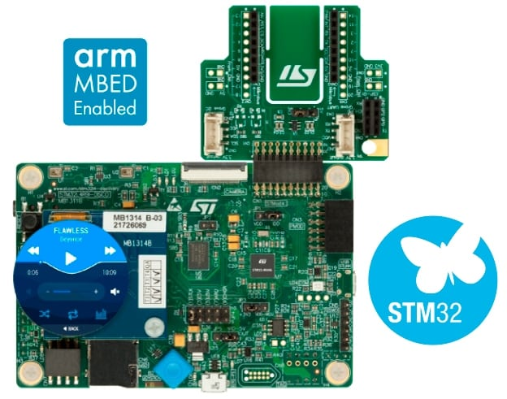

.. _stm32l4r9i_disco_board:

ST STM32L4R9I Discovery
#######################

Overview
********

The 32L4R9IDISCOVERY Discovery kit is a complete demonstration and development platform
for STMicroelectronics Arm® Cortex®-M4 core-based STM32L4R9AI microcontroller.

Leveraging the innovative ultra-low-power oriented features, 640 Kbytes of embedded RAM,
graphics performance (Chrom-ART Accelerator), and DSI controller offered by the STM32L4R9AI,
the 32L4R9IDISCOVERY Discovery kit enables users to easily prototype applications with
state-of-the-art energy efficiency, as well as stunning audio and graphics rendering with direct
support for AMOLED DSI round LCD display.

For even more user-friendliness, the on-board ST-LINK/V2-1 debugger provides out-of-the-box
programming and debugging capabilities.

More information about the board can be found at the `STM32L4R9I-DISCOVERY website`_.
More information about STM32L4R9 can be found here:

- `STM32L4R9/S9 on www.st.com`_
- `STM32L4+ Series reference manual`_
- `STM32L4R5xx/R7xx/R9xx datasheet`_

Supported Features
==================

The current Zephyr stm32l4r9i_disco board configuration supports the following hardware features:

+-----------+------------+-------------------------------------+
| Interface | Controller | Driver/Component                    |
+===========+============+=====================================+
| NVIC      | on-chip    | nested vector interrupt controller  |
+-----------+------------+-------------------------------------+
| UART      | on-chip    | serial port-polling                 |
+-----------+------------+-------------------------------------+
| PINMUX    | on-chip    | pinmux                              |
+-----------+------------+-------------------------------------+
| GPIO      | on-chip    | gpio                                |
+-----------+------------+-------------------------------------+
| FLASH     | on-chip    | on-chip flash memory;               |
|           |            | external OctoSPI memory             |
+-----------+------------+-------------------------------------+
| ADC       | on-chip    | ADC Controller                      |
+-----------+------------+-------------------------------------+
| RTC       | on-chip    | Real Time Clock                     |
+-----------+------------+-------------------------------------+
| I2C       | on-chip    | i2c                                 |
+-----------+------------+-------------------------------------+
| SPI       | on-chip    | spi                                 |
+-----------+------------+-------------------------------------+
| PWM       | on-chip    | pwm                                 |
+-----------+------------+-------------------------------------+
| SDMMC     | on-chip    | sd/mmc                              |
+-----------+------------+-------------------------------------+

Other hardware features are not yet supported on Zephyr porting.

The default configuration can be found in the defconfig file:

	:zephyr_file:`boards/st/stm32l4r9i_disco/stm32l4r9i_disco_defconfig`

Pin Mapping
===========

For more details, please refer to `STM32L4R9I-DISCOVERY website`_.

System Clock
============

The STM32L4R9AI System Clock can be driven by an internal or external oscillator,
as well as by the main PLL clock. By default, the System clock is driven by
the PLL clock at 120MHz. PLL clock is driven by a 4MHz medium speed internal clock.

Serial Port
===========

The STM32L4R9I Discovery board has up to 6 U(S)ARTs.
The Zephyr console output is assigned to UART2, which is connected to the onboard
ST-LINK Virtual COM port interface. Default communication settings are 115200 8N1.

Programming and Debugging
*************************

The STM32L4R9I Discovery board includes an ST-LINK/V2-1 debug tool.

Applications for the ``stm32l4r9i_disco`` board configuration can be
built and flashed in the usual way (see :ref:`build_an_application`
and :ref:`application_run` for more details).

Flashing
========

The board is configured to be flashed using west `STM32CubeProgrammer`_ runner,
so its :ref:`installation <stm32cubeprog-flash-host-tools>` is required.

Alternatively, OpenOCD or JLink can also be used to flash the board using
the ``--runner`` (or ``-r``) option:

.. code-block:: console

   $ west flash --runner openocd
   $ west flash --runner jlink

Flashing an application to STM32L4R9I Discovery
-----------------------------------------------

Connect the STM32L4R9I Discovery to your host computer using the ST-LINK
USB port, then run a serial host program to connect with the board. For example:

.. code-block:: console

   $ minicom -b 115200 -D /dev/ttyACM0

You can then build and flash applications in the usual way.
Here is an example for the :ref:`hello_world` application.

.. zephyr-app-commands::
   :zephyr-app: samples/hello_world
   :board: stm32l4r9i_disco
   :goals: build flash

You should see the following message in the serial host program:

.. code-block:: console

   $ Hello World! stm32l4r9i_disco

Debugging
=========

You can debug an application in the usual way.  Here is an example for the
:ref:`hello_world` application.

.. zephyr-app-commands::
    :zephyr-app: samples/hello_world
    :board: stm32l4r9i_disco
    :goals: debug

.. _STM32L4R9I-DISCOVERY website:
    https://www.st.com/en/evaluation-tools/32l4r9idiscovery.html

.. _STM32L4R9/S9 on www.st.com:
    https://www.st.com/en/microcontrollers-microprocessors/stm32l4r9-s9.html

.. _STM32L4+ Series reference manual:
    https://www.st.com/resource/en/reference_manual/rm0432-stm32l4-series-advanced-armbased-32bit-mcus-stmicroelectronics.pdf

.. _STM32L4R5xx/R7xx/R9xx datasheet:
    https://www.st.com/resource/en/datasheet/stm32l4r5vi.pdf

.. _STM32CubeProgrammer:
   https://www.st.com/en/development-tools/stm32cubeprog.html
