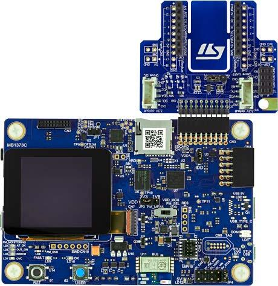

.. _stm32l562e_dk_board:

ST STM32L562E-DK Discovery
##########################

Overview
********

The STM32L562E-DK Discovery kit is designed as a complete demonstration and
development platform for STMicroelectronics Arm |reg| Cortex |reg|-M33 core-based
STM32L562QEI6QU microcontroller with TrustZone |reg|. Here are some highlights of
the STM32L562E-DK Discovery board:

- STM32L562QEI6QU microcontroller featuring 512 Kbytes of Flash memory and 256 Kbytes of SRAM in BGA132 package
- 1.54" 240 x 240 pixel-262K color TFT LCD module with parallel interface and touch-control panel
- USB Type-C |trade| Sink device FS
- On-board energy meter: 300 nA to 150 mA measurement range with a dedicated USB interface
- SAI Audio CODEC
- MEMS digital microphones
- 512-Mbit Octal-SPI Flash memory
- Bluetooth |reg| V4.1 Low Energy module
- iNEMO 3D accelerometer and 3D gyroscope
- Board connectors

  - STMod+ expansion connector with fan-out expansion board for Wi‑Fi |reg|, Grove and mikroBUS |trade| compatible connectors
  - Pmod |trade| expansion connector
  - Audio MEMS daughterboard expansion connector
  - ARDUINO |reg| Uno V3 expansion connector

- Flexible power-supply options

  - ST-LINK
  - USB VBUS
  - external sources

- On-board STLINK-V3E debugger/programmer with USB re-enumeration capability:

  - mass storage
  - Virtual COM port
  - debug port

- 2 user LEDs
- User and reset push-buttons

More information about the board can be found at the `STM32L562E-DK Discovery website`_.

Hardware
********

The STM32L562xx devices are an ultra-low-power microcontrollers family (STM32L5
Series) based on the high-performance Arm |reg| Cortex |reg|-M33 32-bit RISC core.
They operate at a frequency of up to 110 MHz.

- Ultra-low-power with FlexPowerControl (down to 108 nA Standby mode and 62 uA/MHz run mode)
- Core: ARM |reg| 32-bit Cortex |reg| -M33 CPU with TrustZone |reg| and FPU.
- Performance benchmark:

  - 1.5 DMPIS/MHz (Drystone 2.1)
  - 442 CoreMark |reg| (4.02 CoreMark |reg| /MHZ)

- Security

  - Arm |reg| TrustZone |reg| and securable I/Os memories and peripherals
  - Flexible life cycle scheme with RDP (readout protection)
  - Root of trust thanks to unique boot entry and hide protection area (HDP)
  - Secure Firmware Installation thanks to embedded Root Secure Services
  - Secure Firmware Update support with TF-M
  - AES coprocessor
  - Public key accelerator
  - On-the-fly decryption of Octo-SPI external memories
  - HASH hardware accelerator
  - Active tamper and protection temperature, voltage and frequency attacks
  - True Random Number Generator NIST SP800-90B compliant
  - 96-bit unique ID
  - 512-byte One-Time Programmable for user data

- Clock management:

  - 4 to 48 MHz crystal oscillator
  - 32 kHz crystal oscillator for RTC (LSE)
  - Internal 16 MHz factory-trimmed RC ( |plusminus| 1%)
  - Internal low-power 32 kHz RC ( |plusminus| 5%)
  - Internal multispeed 100 kHz to 48 MHz oscillator, auto-trimmed by
    LSE (better than  |plusminus| 0.25 % accuracy)
  - 3 PLLs for system clock, USB, audio, ADC

- Power management

  - Embedded regulator (LDO) with three configurable range output to supply the digital circuitry
  - Embedded SMPS step-down converter
  - External SMPS support

- RTC with HW calendar, alarms and calibration
- Up to 114 fast I/Os, most 5 V-tolerant, up to 14 I/Os with independent supply down to 1.08 V
- Up to 22 capacitive sensing channels: support touchkey, linear and rotary touch sensors
- Up to 16 timers and 2 watchdogs

  - 2x 16-bit advanced motor-control
  - 2x 32-bit and 5x 16-bit general purpose
  - 2x 16-bit basic
  - 3x low-power 16-bit timers (available in Stop mode)
  - 2x watchdogs
  - 2x SysTick timer

- Memories

  - Up to 512 MB Flash, 2 banks read-while-write
  - 512 KB of SRAM including 64 KB with hardware parity check
  - External memory interface for static memories supporting SRAM, PSRAM, NOR, NAND and FRAM memories
  - OCTOSPI memory interface

- Rich analog peripherals (independent supply)

  - 3x 12-bit ADC 5 MSPS, up to 16-bit with hardware oversampling, 200 uA/MSPS
  - 2x 12-bit DAC, low-power sample and hold
  - 2x operational amplifiers with built-in PGA
  - 2x ultra-low-power comparators
  - 4x digital filters for sigma delta modulator

- 19x communication interfaces

  - USB Type-C / USB power delivery controller
  - 2.0 full-speed crystal less solution, LPM and BCD
  - 2x SAIs (serial audio interface)
  - 4x I2C FM+(1 Mbit/s), SMBus/PMBus
  - 6x USARTs (ISO 7816, LIN, IrDA, modem)
  - 3x SPIs (7x SPIs with USART and OCTOSPI in SPI mode)
  - 1xFDCAN
  - 1xSDMMC interface
  - 2x 14 channel DMA controllers

- CRC calculation unit
- Development support: serial wire debug (SWD), JTAG, Embedded Trace Macrocell |trade|

More information about STM32L562QE can be found here:

- `STM32L562QE on www.st.com`_
- `STM32L562 reference manual`_

Supported Features
==================

The Zephyr stm32l562e_dk board configuration supports the following
hardware features:

+-----------+------------+-------------------------------------+
| Interface | Controller | Driver/Component                    |
+===========+============+=====================================+
| ADC       | on-chip    | ADC Controller                      |
+-----------+------------+-------------------------------------+
| AES       | on-chip    | crypto                              |
+-----------+------------+-------------------------------------+
| CLOCK     | on-chip    | reset and clock control             |
+-----------+------------+-------------------------------------+
| DAC       | on-chip    | DAC Controller                      |
+-----------+------------+-------------------------------------+
| DMA       | on-chip    | Direct Memory Access                |
+-----------+------------+-------------------------------------+
| GPIO      | on-chip    | gpio                                |
+-----------+------------+-------------------------------------+
| I2C       | on-chip    | i2c                                 |
+-----------+------------+-------------------------------------+
| NVIC      | on-chip    | nested vector interrupt controller  |
+-----------+------------+-------------------------------------+
| PINMUX    | on-chip    | pinmux                              |
+-----------+------------+-------------------------------------+
| PWM       | on-chip    | PWM                                 |
+-----------+------------+-------------------------------------+
| RNG       | on-chip    | entropy                             |
+-----------+------------+-------------------------------------+
| SDMMC     | on-chip    | sd/mmc                              |
+-----------+------------+-------------------------------------+
| SPI       | on-chip    | spi                                 |
+-----------+------------+-------------------------------------+
| TrustZone | on-chip    | Trusted Firmware-M                  |
+-----------+------------+-------------------------------------+
| UART      | on-chip    | serial port-polling;                |
|           |            | serial port-interrupt               |
+-----------+------------+-------------------------------------+
| WATCHDOG  | on-chip    | independent watchdog                |
+-----------+------------+-------------------------------------+
| USB       | on-chip    | usb                                 |
+-----------+------------+-------------------------------------+

Other hardware features are not yet supported on this Zephyr port.

The default configuration can be found in the defconfig and dts files:

- Common:

  - :zephyr_file:`boards/st/stm32l562e_dk/stm32l562e_dk_common.dtsi`

- Secure target:

  - :zephyr_file:`boards/st/stm32l562e_dk/stm32l562e_dk_defconfig`
  - :zephyr_file:`boards/st/stm32l562e_dk/stm32l562e_dk.dts`

- Non-Secure target:

  - :zephyr_file:`boards/st/stm32l562e_dk/stm32l562e_dk_stm32l562xx_ns_defconfig`
  - :zephyr_file:`boards/st/stm32l562e_dk/stm32l562e_dk_stm32l562xx_ns.dts`

Zephyr board options
====================

The STM32L562e is an SoC with Cortex-M33 architecture. Zephyr provides support
for building for both Secure and Non-Secure firmware.

The BOARD options are summarized below:

+------------------------------+-------------------------------------------+
| BOARD                        | Description                               |
+==============================+===========================================+
| stm32l562e_dk                | For building Trust Zone Disabled firmware |
+------------------------------+-------------------------------------------+
| stm32l562e_dk/stm32l562xx/ns | For building Non-Secure firmware          |
+------------------------------+-------------------------------------------+

Here are the instructions to build Zephyr with a non-secure configuration,
using :zephyr:code-sample:`tfm_ipc` sample:

   .. code-block:: bash

      $ west build -b stm32l562e_dk/stm32l562xx/ns samples/tfm_integration/tfm_ipc/

Once done, before flashing, you need to first run a generated script that
will set platform option bytes config and erase platform (among others,
option bit TZEN will be set).

   .. code-block:: bash

      $ ./build/tfm/api_ns/regression.sh
      $ west flash

Please note that, after having run a TFM sample on the board, you will need to
run ``./build/tfm/api_ns/regression.sh`` once more to clean up the board from secure
options and get back the platform back to a "normal" state and be able to run
usual, non-TFM, binaries.
Also note that, even then, TZEN will remain set, and you will need to use
STM32CubeProgrammer_ to disable it fully, if required.

Connections and IOs
===================

STM32L562E-DK Discovery Board has 8 GPIO controllers. These controllers are responsible for pin muxing,
input/output, pull-up, etc.

For more details please refer to `STM32L562E-DK Discovery board User Manual`_.

Default Zephyr Peripheral Mapping:
----------------------------------

- USART_1 TX/RX : PA9/PA10
- USART_3 TX/RX : PC10/PC11
- I2C_1 SCL/SDA : PB6/PB7
- SPI_1 SCK/MISO/MOSI : PG2/PG3/PG4 (BT SPI bus)
- SPI_3 NSS/SCK/MISO/MOSI : PE0/PG9/PB4/PB5 (Arduino SPI)
- USER_PB : PC13
- LD10 : PG12
- PWM_2_CH1 : PA0
- DAC1 : PA4
- ADC1 : PC4

System Clock
------------

STM32L562E-DK System Clock could be driven by internal or external oscillator,
as well as main PLL clock. By default System clock is driven by PLL clock at
110MHz, driven by 4MHz medium speed internal oscillator.

Serial Port
-----------

STM32L562E-DK Discovery board has 6 U(S)ARTs. The Zephyr console output is
assigned to USART1. Default settings are 115200 8N1.

Programming and Debugging
*************************

STM32L562E-DK Discovery board includes an ST-LINK/V3E embedded debug tool interface.

Applications for the ``stm32l562e_dk`` board configuration can be built and
flashed in the usual way (see :ref:`build_an_application` and
:ref:`application_run` for more details).

Flashing
========

The board is configured to be flashed using west `STM32CubeProgrammer`_ runner,
so its :ref:`installation <stm32cubeprog-flash-host-tools>` is required.

Alternatively, OpenOCD can also be used to flash the board using
the ``--runner`` (or ``-r``) option:

.. code-block:: console

   $ west flash --runner openocd

Support can also be enabled for pyOCD by adding "pack" support with the
following pyOCD commands:

.. code-block:: console

   $ pyocd pack --update
   $ pyocd pack --install stm32l562qe

Flashing an application to STM32L562E-DK Discovery
--------------------------------------------------

Connect the STM32L562E-DK Discovery to your host computer using the USB port.
Then build and flash an application. Here is an example for the
:zephyr:code-sample:`hello_world` application.

Run a serial host program to connect with your Nucleo board:

.. code-block:: console

   $ minicom -D /dev/ttyACM0

Then build and flash the application.

.. zephyr-app-commands::
   :zephyr-app: samples/hello_world
   :board: stm32l562e_dk
   :goals: build flash

You should see the following message on the console:

.. code-block:: console

   Hello World! stm32l562e_dk

Debugging
=========

You can debug an application in the usual way.  Here is an example for the
:zephyr:code-sample:`hello_world` application.

.. zephyr-app-commands::
   :zephyr-app: samples/hello_world
   :board: stm32l562e_dk
   :maybe-skip-config:
   :goals: debug

.. _STM32L562E-DK Discovery website:
   https://www.st.com/en/evaluation-tools/stm32l562e-dk.html

.. _STM32L562E-DK Discovery board User Manual:
   https://www.st.com/resource/en/user_manual/dm00635554.pdf

.. _STM32L562QE on www.st.com:
   https://www.st.com/en/microcontrollers/stm32l562qe.html

.. _STM32L562 reference manual:
   https://www.st.com/resource/en/reference_manual/DM00346336.pdf

.. _STM32CubeProgrammer:
   https://www.st.com/en/development-tools/stm32cubeprog.html
