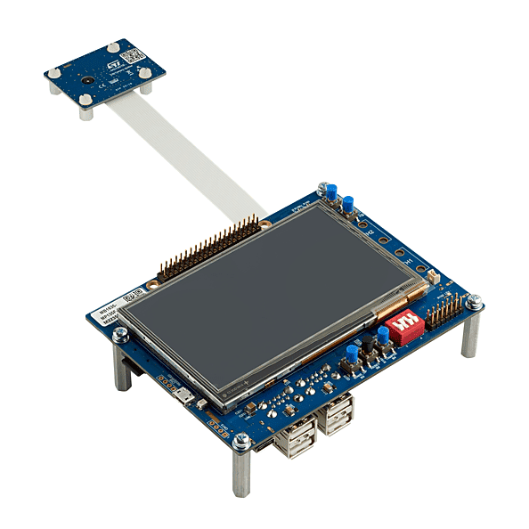

.. zephyr:board:: stm32mp135f_dk

ST STM32MP135F-DK Discovery
############################

Overview
********
The STM32MP135 Discovery kit (STM32MP135F-DK) leverages the capabilities of the
1 GHz STM32MP135 microprocessors to allow users to develop easily applications
using STM32 MPU OpenSTLinux Distribution software.

It includes an ST-LINK embedded debug tool, LEDs, push-buttons, two 10/100 Mbit/s Ethernet (RMII) connectors, one USB Type-C® connector, four USB Host Type-A connectors, and one microSD™ connector.

To expand the functionality of the STM32MP135 Discovery kit, one GPIO expansion connector is also available for third-party shields.

Additionally, the STM32MP135 Discovery kit features an LCD display with a touch panel, Wi‑Fi® and Bluetooth® Low Energy capability, and a 2-megapixel CMOS camera module.

It also provides secure boot and cryptography features.

The STM32MP135F_DK Discovery board leverages the capacities of the STM32MP135
multi-core processor,composed of a dual Cortex®-A7 and a single Cortex®-M4 core.
Zephyr OS is ported to run on the Cortex®-A7 core.

- features:

  - STM32MP135FAF7: Arm® Cortex®-A7 32-bit processor at 1 GHz, in a TFBGA320 package
  - ST PMIC STPMIC1
  - 4-Gbit DDR3L, 16 bits, 533 MHz
  - 4.3" 480x272 pixels LCD display module with capacitive touch panel and RGB interface
  - UXGA 2-megapixel CMOS camera module (included) with MIPI CSI-2® / SMIA CCP2 deserializer
  - Wi-Fi® 802.11b/g/n
  - Bluetooth® Low Energy 4.1
  - Dual 10/100 Mbit/s Ethernet (RMII) compliant with IEEE-802.3u, one with Wake on LAN (WoL) support
  - USB Host 4-port hub
  - USB Type-C® DRP based on an STM32G0 device
  - 4 user LEDs
  - 4 push-buttons (2× user, tamper, and reset)
  - 1 wake-up button
  - Board connectors:

    - Dual-lane MIPI CSI-2® camera module expansion
    - 2x Ethernet RJ45
    - 4x USB Type-A
    - USB Micro-B
    - USB Type-C®
    - microSD™ card holder
    - GPIO expansion
    - 5 V / 3 A USB Type-C® power supply input (charger not provided)
    - VBAT for power backup

  - On-board current measurement
  - On-board STLINK-V3E debugger/programmer with USB re-enumeration capability:

    - mass storage
    - Virtual COM port
    - debug port

More information about the board can be found at the
`STM32P135 Discovery website`_.

Hardware
********

The STM32MP135 SoC provides the following hardware capabilities:

- Core:

  - 32-bit Arm® Cortex®-A7

    - L1 32-Kbyte I / 32-Kbyte D
    - 128-Kbyte unified level 2 cache
    - Arm® NEON™ and Arm® TrustZone®

    - Up to 209 MHz (Up to 703 CoreMark®)

- Memories

  - External DDR memory up to 4 Gb
  - up to LPDDR2/LPDDR3-1066 16-bit
  - up to DDR3/DDR3L-1066 16-bit
  - 168 Kbytes of internal SRAM: 128 Kbytes of AXI SYSRAM + 32 Kbytes of AHB SRAM and 8 Kbytes of
     SRAM in Backup domain
  - Dual Quad-SPI memory interface
  - Flexible external memory controller with up to 16-bit data bus: parallel interface to connect
    external ICs and SLC NAND memories with up to 8-bit ECC

- Security/safety

  - Secure boot, TrustZone® peripherals, 12 x tamper pins including 5 x active tampers
  - Temperature, voltage, frequency and 32 kHz monitoring

- Reset and power management

  - 1.71 V to 3.6 V I/Os supply (5 V-tolerant I/Os)
  - POR, PDR, PVD and BOR
  - On-chip LDOs (USB 1.8 V, 1.1 V)
  - Backup regulator (~0.9 V)
  - Internal temperature sensors
  - Low-power modes: Sleep, Stop, LPLV-Stop, LPLV­Stop2 and Standby
  - DDR retention in Standby mode
  - Controls for PMIC companion chip

- Clock management

  - Internal oscillators: 64 MHz HSI oscillator, 4 MHz CSI oscillator, 32 kHz LSI oscillator
  - External oscillators: 8-48 MHz HSE oscillator, 32.768 kHz LSE oscillator
  - 4 × PLLs with fractional mode

- General-purpose input/outputs

  - Up to 135 secure I/O ports with interrupt capability
  - Up to 6 wakeup

- Interconnect matrix

  - 2 bus matrices
    - 64-bit Arm® AMBA® AXI interconnect, up to 266 MHz
    - 32-bit Arm® AMBA® AHB interconnect, up to 209 MHz

- 4 DMA controllers to unload the CPU

  - 56 physical channels in total
  - 1 x high-speed general-purpose master direct memory access controller (MDMA)
  - 3 × dual-port DMAs with FIFO and request router capabilities for optimal peripheral management

- Up to 30 communication peripherals

  - 5 x I2C FM+ (1 Mbit/s, SMBus/PMBus™)
  - 4 x UART + 4 x USART (12.5 Mbit/s, ISO7816 interface, LIN, IrDA, SPI)
  - 5 x SPI (50 Mbit/s, including 4 with full-duplex I2S audio class accuracy via internal audio PLL or external clock)(+2 QUADSPI + 4 with USART)
  - 2 x SAI (stereo audio: I2S, PDM, SPDIF Tx)
  - SPDIF Rx with 4 inputs
  - 2 x SDMMC up to 8 bits (SD/e•MMC™/SDIO)
  - 2 x CAN controllers supporting CAN FD protocol
  - 2 x USB 2.0 high-speed Host
    or 1 x USB 2.0 high-speed Host+ 1 × USB 2.0 high-speed OTG simultaneously
  - 2 x Ethernet MAC/GMAC
  - IEEE 1588v2 hardware, MII/RMII/RGMII
  - 8- to 16-bit camera interface, 3 Mpix @30 fps or 5Mpix @15 fps in color or monochrome with pixel clock @120 MHz (max freq)
  - 6 analog peripherals
  - 2 x ADCs with 12-bit max. resolution up to 5 Msps

    - 1 x temperature sensor
    - 1 x digital filter for sigma-delta modulator (DFSDM) with 4 channels and 2 filters
    - Internal or external ADC reference VREF+

  - Graphics

    - LCD-TFT controller, up to 24-bit // RGB888
    - up to WXGA (1366 × 768) @60 fps or up to Full HD (1920 x 1080) @ 30 fps
    - pixel clock up to 90 MHz
    - two layers (incl. 1 secured) with programmable color LUT

  - Up to 24 timers and 2 watchdogs
  - Hardware acceleration

    - AES 128, 192, 256 DES/TDES
    - AES 128, 256 with DPA protection
    - PKA ECC/RSA with DPA protection
    - AES 128 on-the-fly DRAM encryption and decryption
    - HASH (SHA-1, SHA-224, SHA-256, SHA-384, SHA-512, SHA-3), HMAC
    - 1 x true random number generator (6 triple oscillators)
    - 1 x CRC calculation unit

- Debug mode

  - Arm® CoreSight™ trace and debug: SWD and JTAG interfaces usable as GPIOs
  - 4-Kbyte embedded trace buffer

- 3072-bit fuses including 96-bit unique ID, up to 1280 bits available for user and 256-bit HUK to protect AES 256 keys
- All packages are ECOPACK2 compliant

More information about STM32P135F can be found here:

- `STM32MP135F on www.st.com`_
- `STM32MP135F reference manual`_

Supported Features
==================

.. zephyr:board-supported-hw::

Connections and IOs
===================

STM32MP135F-DK Discovery Board schematic is available here:
`STM32MP135F Discovery board schematics`_.

Default Zephyr Peripheral Mapping:
----------------------------------

- USART_4 TX/RX : PD6/PD8 (UART console)

- USER_BUTTON : PA14
- LED_3 : PA14
- LED_4 : PA13

System Clock
------------

The Cortex®-A7 core is configured to run at a clock speed of up to 1GHz.

Memory mapping
--------------

+------------+-----------------------+----------------+
| Region     |        Address        |     Size       |
+============+=======================+================+
| SYSRAM     | 0x2FFE0000-0x2FFFFFFF | 128KB          |
+------------+-----------------------+----------------+
| SRAM 1     | 0x30000000-0x30003FFF |  16KB          |
+------------+-----------------------+----------------+
| SRAM 2     | 0x30004000-0x30005FFF |   8KB          |
+------------+-----------------------+----------------+
| SRAM 3     | 0x30006000-0x30007FFF |   8KB          |
+------------+-----------------------+----------------+
| DDR        | 0xC0000000-0xDFFFFFFF | up to 4 Gb     |
+------------+-----------------------+----------------+

Programming and Debugging
*************************

Prerequisite
============

The STM32MP135 have a DDR that need to be initialized before Loading the zephyr example.

A method consists is to flash an SD card with the zephyr executable. To do so you first need to install STM32CubeProgrammer:

    `Installing cube programmer`_

Signature and flashing
======================

After building the Zephyr project, you need to sign your binary file using the Stm32ImageAddHeader.py with the following command:

.. code-block:: console

   python3 ${Path_to_STM32cube}/Utilities/ImageHeader/Python27/Stm32ImageAddHeader.py ${Path_to_build_dir}/zephyr/zephyr.bin ${Path_to_STM32cube}/Projects/STM32MP135C-DK/External_Loader/Prebuild_Binaries/SD_Ext_Loader/zephyr_Signed.bin -bt 10 -la C0000000 -ep C0000000

Here -bt specify the boot type, -la specify the load address and -ep the entry point for your executable (same as the load address in this case).

Then in the ${Path_to_STM32cube}/Projects/STM32MP135C-DK/External_Loader/Prebuild_Binaries/SD_Ext_Loader/ folder from Cube, create a Zephyr.tsv file containing:

+-----+-----+------------+----------+----------+----------+-----------------------------+
| #Opt| Id  | Name       | Type     | IP       | Offset   | Binary                      |
+-----+-----+------------+----------+----------+----------+-----------------------------+
| P   | 0x1 | fsbl-openbl| Binary   | none     | 0x0      | External_Mem_Loader_A7.stm32|
+-----+-----+------------+----------+----------+----------+-----------------------------+
| P   | 0x3 | fsbl-extfl | Binary   | none     | 0x0      | SD_Ext_Loader.bin           |
+-----+-----+------------+----------+----------+----------+-----------------------------+
| P   | 0x4 | fsbl-app   | Binary   | mmc0     | 0x0000080| FSBLA_Sdmmc1_A7_Signed.bin  |
+-----+-----+------------+----------+----------+----------+-----------------------------+
| P   | 0x5 | fsbl-app   | Binary   | mmc0     | 0x0000500| zephyr_Signed.bin           |
+-----+-----+------------+----------+----------+----------+-----------------------------+

Finally using the cube Programmer select the Zephyr.tsv and flash the SD card

.. note::
  You can refer to this example to flash an example to the SD card:
  `How to install STM32Cube software package on microSD card`_

Debugging
=========

You can debug an application using OpenOCD and GDB.

- Build the sample:

.. code-block:: console

  west build -b stm32mp135f_dk samples/hello_world

- Flash the SD card using:
  `How to install STM32Cube software package on microSD card`_

- Run the application from the SD card

- Attach to the target:

.. code-block:: console

    west attach

.. _STM32P135 Discovery website:
   https://www.st.com/en/evaluation-tools/stm32mp135f-dk.html

.. _STM32MP135F Discovery board User Manual:
   https://www.st.com/resource/en/user_manual/dm00862450.pdf

.. _STM32MP135F Discovery board schematics:
   https://www.st.com/resource/en/schematic_pack/mb1635-mp135f-e02-schematic.pdf

.. _STM32MP135F on www.st.com:
   https://www.st.com/content/st_com/en/products/microcontrollers-microprocessors/stm32-arm-cortex-mpus/stm32mp1-series/stm32mp135/stm32mp135f.html

.. _STM32MP135F reference manual:
   https://www.st.com/resource/en/reference_manual/DM00670465-.pdf

.. _STM32MP135 STM32Cube software package:
   https://www.st.com/en/embedded-software/stm32cubemp13.html#get-software

.. _How to install STM32Cube software package on microSD card:
   https://wiki.st.com/stm32mpu/wiki/How_to_load_and_start_STM32CubeMP13_applications_via_microSD_card

.. _STM32MP135F boot architecture:
   https://wiki.st.com/stm32mpu/wiki/STM32CubeMP13_package_-_boot_architecture

.. _STM32MP135F baremetal distribution:
   https://wiki.st.com/stm32mpu/wiki/Category:Bare_metal_-_RTOS_embedded_software

.. _Installing cube programmer:
   https://wiki.st.com/stm32mpu/wiki/STM32CubeProgrammer
