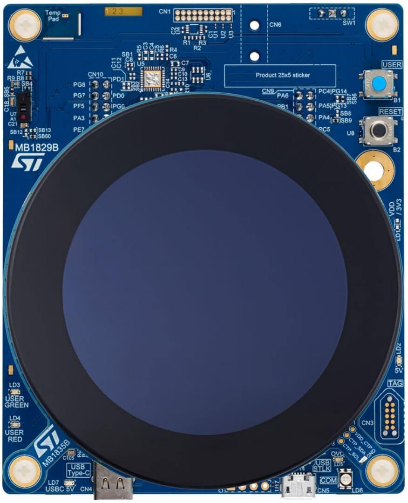
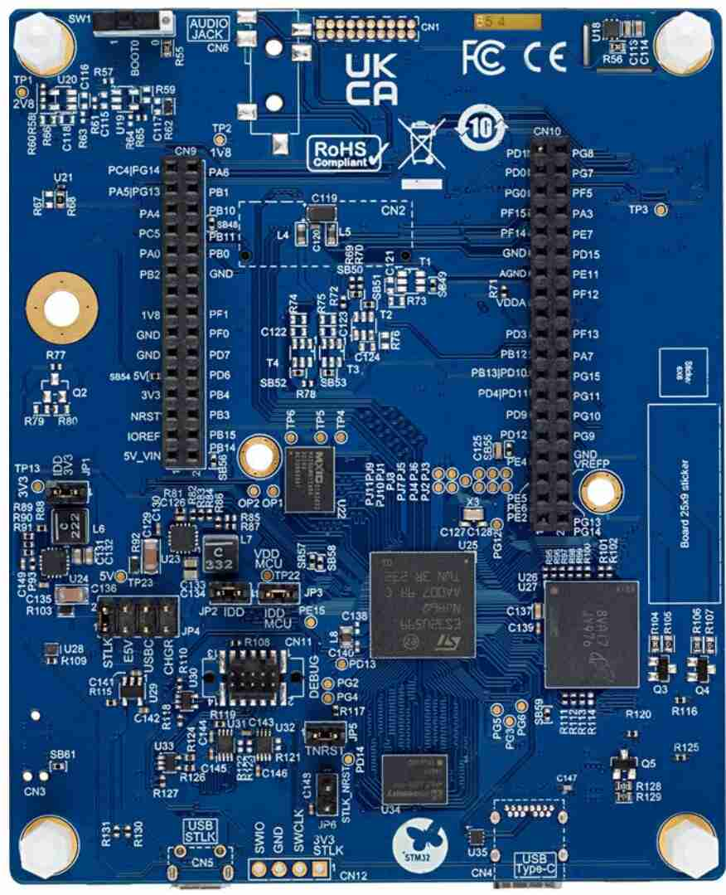

.. _stm32u5a9j_dk_board:

ST STM32U5A9J Discovery Kit
###########################

Overview
********

The STM32U5A9J-DK Discovery kit is a complete demonstration and development
platform for the STM32U5A9NJH6Q microcontroller, featuring an Arm® Cortex®-M33
core with Arm® TrustZone®.

Leveraging the innovative ultra-low-power oriented features, 2.5 Mbytes of
embedded SRAM, 4 Mbytes of embedded flash memory, and rich graphics features,
the STM32U5A9J-DK Discovery kit enables users to easily prototype applications
with state-of-the-art energy efficiency, as well as providing stunning and
optimized graphics rendering with the support of the 2.5D NeoChrom Accelerator,
Chrom-ART Accelerator, and Chrom-GRC™ MMU.

The full range of hardware features available on the board helps users to
enhance their application development by an evaluation of all the peripherals
such as a 2.47-inch RGB 480x480 pixels TFT round LCD module with MIPI DSI®
interface and capacitive touch panel, USB Type-C® HS, Octo-SPI flash memory
device, Hexadeca-SPI PSRAM memory device, eMMC flash memory device,
Time-of-Flight and gesture detection sensor, temperature sensor, and two 2.54 mm
pitch double-row flexible expansion connectors for easy prototyping with
daughterboards for specific applications (USART, LPUART, two SPIs, SAI, three
I2C, SDMMC, ADCs, timers, and GPIOs).

The STM32U5A9J-DK Discovery kit integrates an STLINK-V3E embedded in-circuit
debugger and programmer for the STM32 microcontroller with a USB Virtual COM
port bridge and comes with the STM32CubeU5 MCU Package, which provides an STM32
comprehensive software HAL library as well as various software examples.

More information about the board can be found at the `STM32U5A9J-DK website`_.
More information about STM32U5A9NJH6Q can be found here:

- `STM32U5A9NJ on www.st.com`_
- `STM32U5 Series reference manual`_
- `STM32U5Axxx datasheet`_

Supported Features
==================

The current Zephyr stm32u5a9j_dk board configuration supports the following
hardware features:

+-----------+------------+-------------------------------------+
| Interface | Controller | Driver/Component                    |
+===========+============+=====================================+
| NVIC      | on-chip    | nested vector interrupt controller  |
+-----------+------------+-------------------------------------+
| UART      | on-chip    | serial port-polling;                |
|           |            | serial port-interrupt               |
+-----------+------------+-------------------------------------+
| LPUART    | on-chip    | low power uart                      |
+-----------+------------+-------------------------------------+
| PINMUX    | on-chip    | pinmux                              |
+-----------+------------+-------------------------------------+
| GPIO      | on-chip    | gpio                                |
+-----------+------------+-------------------------------------+
| RNG       | on-chip    | True Random number generator        |
+-----------+------------+-------------------------------------+
| I2C       | on-chip    | i2c                                 |
+-----------+------------+-------------------------------------+
| SPI       | on-chip    | spi                                 |
+-----------+------------+-------------------------------------+
| FLASH     | on-chip    | flash memory                        |
+-----------+------------+-------------------------------------+
| ADC       | on-chip    | adc                                 |
+-----------+------------+-------------------------------------+
| SDMMC     | on-chip    | flash memory                        |
+-----------+------------+-------------------------------------+
| WATCHDOG  | on-chip    | independent watchdog                |
+-----------+------------+-------------------------------------+
| PWM       | on-chip    | pwm                                 |
+-----------+------------+-------------------------------------+
| TIMER     | on-chip    | counter                             |
+-----------+------------+-------------------------------------+

Other hardware features have not been enabled yet for this board.

The default configuration per core can be found in the defconfig file:
:zephyr_file:`boards/st/stm32u5a9j_dk/stm32u5a9j_dk_defconfig`

Pin Mapping
===========

For more details please refer to `STM32U5A9J-DK board User Manual`_.

Default Zephyr Peripheral Mapping:
----------------------------------

- USART_1 TX/RX : PA9/PA10 (ST-Link Virtual Port Com)
- LD3 : PE0
- LD4 : PE1
- User Button: PC13
- USART_3 TX/RX : PB10/PB11
- LPUART_1 TX/RX : PG7/PG8
- I2C1 SCL/SDA : PG14/PG13
- I2C2 SCL/SDA : PF1/PF0
- I2C6 SCL/SDA : PD1/PD0
- SPI2 SCK/MISO/MOSI/CS : PB13/PD3/PD4/PB12
- SPI3 SCK/MISO/MOSI/CS : PG9/PG10/PG11/PG15
- ADC1 : channel5 PA0, channel14 PC5
- ADC2 : channel9 PA4
- ADC4 : channel5 PF14

System Clock
============

The STM32U5A9J-DK Discovery kit relies on an HSE oscillator (16 MHz crystal)
and an LSE oscillator (32.768 kHz crystal) as clock references.
Using the HSE (instead of HSI) is mandatory to manage the DSI interface for
the LCD module and the USB high‑speed interface.

Serial Port
===========

The STM32U5A9J Discovery kit has up to 4 USARTs, 2 UARTs, and 1 LPUART.
The Zephyr console output is assigned to USART1 which connected to the onboard
ST-LINK/V3.0. Virtual COM port interface. Default communication settings are
115200 8N1.

Programming and Debugging
*************************

STM32U5A9J Discovery kit includes an ST-LINK/V3 embedded debug tool interface.
This probe allows to flash and debug the board using various tools.

Flashing
========

Board is configured to be flashed using west STM32CubeProgrammer runner.
Installation of `STM32CubeProgrammer`_ is then required to flash the board.,

Connect the STM32U5A9J Discovery board to your host computer using the USB
port, then run a serial host program to connect with your Discovery
board. For example:

.. code-block:: console

   $ minicom -D /dev/ttyACM0 -b 115200

Then, build and flash in the usual way. Here is an example for the
:ref:`hello_world` application.

.. zephyr-app-commands::
   :zephyr-app: samples/hello_world
   :board: stm32u5a9j_dk
   :goals: build flash

You should see the following message on the console:

.. code-block:: console

   Hello World! stm32u5a9j_dk

Debugging
=========

Default debugger for this board is openocd. It could be used in the usual way
with "west debug" command.
Here is an example for the :zephyr:code-sample:`blinky` application.

.. zephyr-app-commands::
   :zephyr-app: samples/basic/blinky
   :board: stm32u5a9j_dk
   :goals: debug

.. _STM32U5A9J-DK website:
   https://www.st.com/en/evaluation-tools/stm32u5a9j-dk.html

.. _STM32U5A9J-DK board User Manual:
   https://www.st.com/resource/en/user_manual/um2967-discovery-kit-with-stm32u5a9nj-mcu-stmicroelectronics.pdf

.. _STM32U5A9NJ on www.st.com:
   https://www.st.com/en/microcontrollers-microprocessors/stm32u5a9nj.html

.. _STM32U5 Series reference manual:
   https://www.st.com/resource/en/reference_manual/rm0456-stm32u5-series-armbased-32bit-mcus-stmicroelectronics.pdf

.. _STM32U5Axxx datasheet:
   https://www.st.com/resource/en/datasheet/stm32u5a9nj.pdf

.. _STM32CubeProgrammer:
   https://www.st.com/en/development-tools/stm32cubeprog.html

.. _STM32U5A9J_DK board schematics:
   https://www.st.com/resource/en/schematic_pack/mb1829-u5a9njq-b01-schematic.pdf
