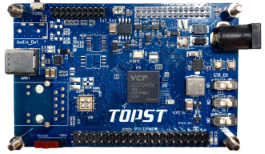

.. _topst_vcp45:

TOPST_VCP45
###################

Overview
********

The TOPST_VCP45 is a 32-Bit MCU Board for Real time Applications.

TOPST VCP can implement the following functions:

- Automotive Application
    Car Audio Video Navigation (AVN)System, Digital Cluster, Head Up Display (HUD), etc.
- IOT Application
    Smart Factory, etc.
- Training & Education
    Sensor, Actuator Application, CAN Application, etc.

TOPST: Total Open-Platform for System development and Training

VCP: Vehicle Control Processor

Hardware
********

- ARM Cortex-R5F Processor

- On-chip Memory

    Program Flash: 4 MB

    SRAM         : 512KB (Including Retention RAM 16KB)

    Data Flash   : 128KB

    DMA Channel  : 22-channel

- Peripheral

    CAN/CANFD                       : 3-channel

    Dedicated LIN/UART              : 3-channel (Maximum 6-channel)

    Dedicated I2C                   : 3-channel (Maximum 6-channel)

    Dedicated GPSB (SPI)            : 2-channel (Maximum 5-channel)

    MFIO (Allocated UART, I2C, GPSB): 3-channel

    ADC

        Resolution : 12-bit SAR type

        Channels   : 12-channel x 2groups

        Input Range: 3.3V

        Sample Rate: Over 1.0 MSPs

    I2S                   : 1-channel

    Serial Flash Interface: Quad SPI

Supported Features
==================

The following features are supported:

.. list-table::
   :header-rows: 2

   * - Peripheral
     - Kconfig option
     - Devicetree compatible
   * - TIC
     - :kconfig:option:`CONFIG_TIC`
     - :dtcompatible:`tcc,tic`
   * - GPIO
     - :kconfig:option:`CONFIG_GPIO` & 'GPIO_TCCVCP'
     - :dtcompatible:`tcc,tccvcp-gpio`
   * - UART
     - :kconfig:option:`CONFIG_SERIAL` & 'CONFIG_UART_TCCVCP'
     - :dtcompatible:`tcc,tccvcp-uart`
   * - Timer
     - :kconfig:option:`CONFIG_TCC_VCPTTC_TIMER`
     - :dtcompatible:`tcc,ttcvcp`
   * - Clock
     - :kconfig:option:`CONFIG_CLOCK_CONTROL_TCC_CCU`
     - :dtcompatible:`tcc,ccu`

Not all hardware features are supported yet. See `TCC70xx Full Specification` for the complete list of hardware features.

The default configuration can be found in

    :zephyr_file:`boards/tcc/topst_vcp_45/topst_vcp_45_defconfig`

Programming and Debugging
*************************

hello_world
===========

zephyr.bin
----------

Build an app, for example :zephyr:code-sample:`hello_world`

.. zephyr-app-commands::
   :zephyr-app: samples/hello_world
   :board: topst_vcp45
   :goals: topst_vcp45

Change all 'printf' in the samples/hello_world/src/main.c file to 'printk'.

west build --build-dir topst_vcp45 -b topst_vcp45 samples/hello_world

Creating a ROM Build Directory and Downloading Necessary Tools and Images
    To create a ROM build directory and download the necessary tools and images, follow these steps:
        Create the ROM Build Directory
            Open your terminal or command prompt and create a new directory for your ROM build.
            Use the following commands to create and navigate to the directory:

            $ mkdir rom-build

            $ cd rom-build/

    Download the Required Tools and Images
        Downloading the Tools
            Access the GitLab Repository: Navigate to the GitLab repository containing the necessary tools.
                https://gitlab.com/topst.ai/topst-vcp/-/tree/main/tools?ref_type=heads

            Download the Tools: Select the Code dropdown menu on the right side of the page and choose Download this directory.
            Then, select the tar.gz file.
            Move the Downloaded File: Move the downloaded topst-vcp-main-tools.tar.gz file to your rom-build directory.

        Downloading the Prebuilt Images
            Access the GitLab Repository: Navigate to the GitLab repository containing the prebuilt images.
                https://gitlab.com/topst.ai/topst-vcp/-/tree/main/build/tcc70xx/make_utility?ref_type=heads

            Download the Images: Select the Code dropdown menu on the right side of the page and choose Download this directory.
			Then, select the tar.gz file.
            Move the Downloaded File: Move the downloaded topst-vcp-main-build-tcc70xx-make_utility.tar.gz file to your rom-build directory.

        Extracting the Files
            Extract the Tool Files: Use the following command to extract the tool files:
                $ tar xvfz topst-vcp-main-tools.tar.gz

            Extract the Image Files: Use the following command to extract the image files:
                $ tar xvfz topst-vcp-main-build-tcc70xx-make_utility.tar.gz

    Writing and Modifying Script Files
        To create and modify the mkimg.sh script using vi or another text editor, follow these steps:

        Creating the mkimg.sh Script
            Open the Text Editor:

            Open vi or another text editor of your choice to create the mkimg.sh script.

            For example, using vi:

            $ vi mkimg.sh

        Write the Script:
            Add the following content to the mkimg.sh file:

                #!/bin/bash

                for ARGUMENT in "$@"

                do
                    KEY=$(echo $ARGUMENT | cut -f1 -d=)

                    VALUE=$(echo $ARGUMENT | cut -f2 -d=)

                    case "$KEY" in
                        TOOL_PATH)      TOOL_PATH=${VALUE} ;;

                        INPUT_PATH)     INPUT_PATH=${VALUE} ;;

                        OUTPUT_PATH)    OUTPUT_PATH=${VALUE} ;;

                        IMAGE_VERSION)  IMAGE_VERSION=${VALUE} ;;

                        TARGET_ADDRESS) TARGET_ADDRESS=${VALUE} ;;

                        *)
                    esac
                done

                MKTOOL_INPUT=$INPUT_PATH/boot.bin

                MKTOOL_OUTPUT=$OUTPUT_PATH/r5_fw.rom

                MKTOOL_NAME=R5-FW

                MKTOOL_SOC_NAME=70xx

                chmod 755 $TOOL_PATH/tcmktool

                $TOOL_PATH/tcmktool $MKTOOL_INPUT $MKTOOL_OUTPUT $MKTOOL_NAME $IMAGE_VERSION $TARGET_ADDRESS $MKTOOL_SOC_NAME

            Save and Exit:
                Save the changes by pressing Esc, then type :wq and press Enter to write and quit the file.

            Make the script executable
                $ chmod +x mkimg.sh

        Creating the mkrom.sh Script
            $ vi mkrom.sh

            Write the Script:
                Add the following content to the mkrom.sh file:

                #!/bin/bash

                # Parse command-line arguments

                for ARGUMENT in "$@"

                do

                    KEY=$(echo $ARGUMENT | cut -f1 -d=)

                    VALUE=$(echo $ARGUMENT | cut -f2 -d=)

                    case "$KEY" in

                            BOARD_NAME)    BOARD_NAME=${VALUE} ;;

                            OUTPUT_PATH)   OUTPUT_PATH=${VALUE} ;;

                            *)
                    esac
                done

                # Define constants

                SNOR_SIZE=4

                UTILITY_DIR=./topst-vcp-main-build-tcc70xx-make_utility/build/tcc70xx/make_utility/tcc70xx_pflash_mkimage

                OUTPUT_DIR=../../../../../output

                OUTPUT_FILE=tcc70xx_pflash_boot.rom

                # Change to utility directory

                pushd $UTILITY_DIR

                # Grant execute permissions to the VCP tool (temporary solution)

                chmod 755 ./tcc70xx-pflash-mkimage

                # Execute the VCP tool to create the boot ROM image

                ./tcc70xx-pflash-mkimage -i ./tcc70xx.cfg -o $OUTPUT_DIR/$OUTPUT_FILE

                # Return to the original directory

                popd

            Save and Exit:
                Save the changes by pressing Esc, then type :wq and press Enter to write and quit the file.

            Make the script executable
                $ chmod +x mkrom.sh

        Creating the create_rom_with_zephyr_image.sh Script
            $ vi create_rom_with_zephyr_image.sh

            Write the Script:
                Add the following content to the create_rom_with_zephyr_image.sh file:

                #!/bin/bash

                # Define output and input directories

                OUTPUT="./output"

                INPUT="./input"

                # Clean up existing directories

                rm -rf "$OUTPUT"

                rm -rf "$INPUT"

                # Create fresh directories

                mkdir -p "$OUTPUT"

                mkdir -p "$INPUT"

                echo "Directory structure created:"

                echo "Output directory: $OUTPUT"

                echo "Input directory: $INPUT"

                # Extract and copy Zephyr artifacts

                # Note: Ensure correct paths are specified for zephyr.bin, zephyr.elf, and zephyr.map

                ./binary_extractor zephyr.bin "$INPUT"/boot.bin

                cp zephyr.elf "$INPUT"/boot

                cp zephyr.map "$INPUT"/boot.map

                # Execute mkimg.sh script

                chmod 755 ./mkimg.sh

                ./mkimg.sh TOOL_PATH=./topst-vcp-main-tools/tools INPUT_PATH="$INPUT" OUTPUT_PATH="$OUTPUT" TARGET_ADDRESS=0x00000000 IMAGE_VERSION=0.0.0

                # Execute mkrom.sh script

                chmod 755 ./mkrom.sh

                ./mkrom.sh BOARD_NAME="$MCU_BSP_CONFIG_BOARD_NAME" OUTPUT_PATH="$OUTPUT"

            Save and Exit:
                Save the changes by pressing Esc, then type :wq and press Enter to write and quit the file.

            Make the script executable
                $ chmod +x create_rom_with_zephyr_image.sh

        Modifying tcc70xx.cfg file
            $ vi ./topst-vcp-main-build-tcc70xx-make_utility/build/tcc70xx/make_utility/tcc70xx_pflash_mkimage/tcc70xx.cfg

                Modify the 6th line as follows:

                Change:

                    MICOM_BIN=../../gcc/output/r5_fw.rom

                To:

                    MICOM_BIN=../../../../../output/r5_fw.rom

    Creating the ROM Code Extractor

    $ vi binary_extractor.c

        Write c code:
            Add the following content to the binary_extractor.c file:

            #include <stdio.h>

            #include <stdlib.h>

            #include <stdint.h>

            #define BUFFER_SIZE 4096

            #define OFFSET 0x01043000

            int main(int argc, char *argv[]) {

                FILE *input_file, *output_file;

                uint8_t buffer[BUFFER_SIZE];

                size_t bytes_read;

                if (argc != 3) {

                    fprintf(stderr, "Usage: %s <input file> <output file>\n", argv[0]);

                    return 1;

                }

                input_file = fopen(argv[1], "rb");

                if (input_file == NULL) {

                    perror("Cannot open input file");

                    return 1;

                }

                output_file = fopen(argv[2], "wb");

                if (output_file == NULL) {

                    perror("Cannot create output file");

                    fclose(input_file);

                    return 1;

                }

                if (fseek(input_file, OFFSET, SEEK_SET) != 0) {

                    perror("Cannot move to offset in file");

                    fclose(input_file);

                    fclose(output_file);

                    return 1;

                }

                while ((bytes_read = fread(buffer, 1, BUFFER_SIZE, input_file)) > 0) {

                    if (fwrite(buffer, 1, bytes_read, output_file) != bytes_read) {

                        perror("Error writing to output file");

                        fclose(input_file);

                        fclose(output_file);

                        return 1;

                    }
                }

                fclose(input_file);

                fclose(output_file);

                printf("The file has been processed successfully.\n");

                return 0;

            }

    Build the C file to create an executable.
        $ gcc -o binary_extractor binary_extractor.c

    Creating the ROM File
        The ROM file for fusing onto the TOPST VCP board is created using three components:
            Prebuilt hsm.bin file

            updater.rom file

            zephyr.bin file (Zephyr RTOS image)

        To create the ROM file, execute the following command:
            $ ./create_rom_with_zephyr_image.sh

        After running the script, verify that the ROM file has been generated by checking the output directory:
            $ ls -al ./output/

        Ensure that the file tcc70xx_pflash_boot_4M_ECC.rom is present in the output directory. This file is the final ROM image that can be fused onto the TOPST VCP board.

Flashing
========

    USB C Cable Connection
        Connect the TOPST-VCP board to your development host PC using a USB C cable.

    Verify the Connection
        On your Linux machine, run:
            $ sudo mesg | grep ttyU

    Set the Board to Download Mode
        Flip the FWDN switch to the FWDN position on the TOPST-VCP board.

        Press the PORN button to reset the board.

        The board is now in FWDN download mode.

    Execute the Download Command
        Use the FWDN tool to download the software for 4MB flash:
            sudo ./topst-vcp-main-tools/tools/fwdn_vcp/fwdn --fwdn ./topst-vcp-main-tools/tools/fwdn_vcp/vcp_fwdn.rom -w ./output/tcc70xx_pflash_boot_4M_ECC.rom

    Reset the Board
        Switch the FWDN switch back to the NORMAL position.

        Reset the board by either powering it on again or pressing the PORN button.

Debugging
=========

    Verifying the Software on the Board

    Install tio
        $ sudo apt install tio

    Open a Serial Connection
        Initiate a serial connection with:
            $ sudo tio -b 115200 /dev/ttyUSB0

    Verify the Software
        After resetting the board, you should see messages on the terminal.

References
**********
