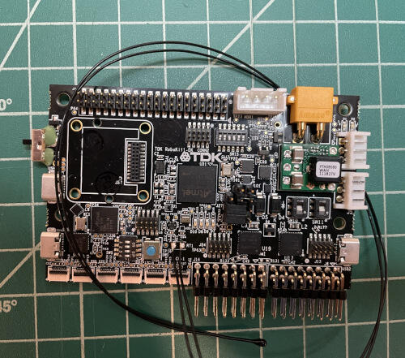

.. _robokit1:

TDK RoboKit 1
#############

Overview
********

The TDK RoboKit1 is a development board for use primarily with ROS2 and provides a large
number of small ground robotics useful sensors including chirp sensors for time of flight
(e.g. ultrasonic obstacle detection).

It pairs a 300MHz Cortex-M7 ATSAME70Q21 with an array of TDK sensors and pin headers useful for robotics.

Hardware
********

- ATSAME70Q21 ARM Cortex-M7 Processor
- 12 MHz crystal oscillator (Pres)
- 32.768 kHz crystal oscillator
- Micro-AB USB device
- Micro-AB USB debug (Microchip EDBG) interface supporting CMSIS-DAP, Virtual COM Port and Data
- JTAG interface connector
- One reset pushbutton
- One red user LED
- TDK ICM 42688-P 6-Axis 32KHz IMU
- TDK ICP-10111 Pressure Sensor
- TDK NTC Thermistor for Temperature
- AKM AK09918C Magnetometer
- 2 TDK HVCi-4223 Cortex-M3 Dedicated Motor Controller
- 3 TDK ICS-43434 Stereo Microphones
- Connector for Industrial Dual IMU (TDK IIM-46230)
- TDK CH101 Ultrasonic Range Sensor Array (9 Connectors, comes with 3)

Supported Features
==================

The TDK RoboKit1 board supports the following hardware
features:

.. list-table::
   : header-rows: 1

   * - Peripheral
     - Kconfig option
     - Devicetree compatible
   * - GPIO
     - :kconfig:option:`CONFIG_GPIO_SAM`
     - :dtcompatible:`atmel,sam-gpio`
   * - USART
     - :kconfig:option:`CONFIG_USART_SAM`
     - :dtcompatible:`atmel,sam-usart`
   * - UART
     - :kconfig:option:`CONFIG_UART_SAM`
     - :dtcompatible:`atmel,sam-uart`
   * - SPI
     - :kconfig:option:`CONFIG_SPI_SAM`
     - :dtcompatible:`atmel,sam-spi`
   * - I2C
     - :kconfig:option:`CONFIG_I2C_SAM_TWIHS`
     - :dtcompatible:`atmel,sam-i2c-twihs`
   * - I2S
     - :kconfig:option:`CONFIG_I2S_SAM_SSC`
     - :dtcompatible:`atmel,sam-ssc`
   * - ADC
     - :kconfig:option:`CONFIG_ADC_SAM_AFEC`
     - :dtcompatible:`atmel,sam-afec`
   * - DAC
     - :kconfig:option:`CONFIG_DAC_SAM`
     - :dtcompatible:`atmel,sam-dac`
   * - PWM
     - :kconfig:option:`CONFIG_PWM_SAM`
     - :dtcompatible:`atmel,sam-pwm`
   * - CAN
     - :kconfig:option:`CONFIG_CAN_SAM`
     - :dtcompatible:`atmel,sam-can`
   * - USB
     - :kconfig:option:`CONFIG_USB_DC_SAM_USBHS`
     - :dtcompatible:`atmel,sam-usbhs`
   * - WATCHDOG
     - :kconfig:option:`CONFIG_WDT_SAM`
     - :dtcompatible:`atmel,sam-watchdog`
   * - NVIC
     - N/A
     - :dtcompatible:`arm,v7m-nvic`
   * - SYSTICK
     - N/A
     - N/A
   * - COUNTER
     - :kconfig:option:`CONFIG_COUNTER_SAM_TC`
     - :dtcompatible:`atmel,sam-tc`
   * - DMA
     - :kconfig:option:`CONFIG_DMA_SAM_XDMAC`
     - :dtcompatible:`atmel,sam-xdmac`
   * - ENTROPY
     - :kconfig:option:`CONFIG_ENTROPY_SAM_RNG`
     - :dtcompatible:`atmel,sam-trng`
   * - HWINFO (reset cause)
     - :kconfig:option:`CONFIG_HWINFO_SAM_RSTC`
     - :dtcompatible:`atmel,sam-rstc`
   * - HWINFO (device id)
     - :kconfig:option:`CONFIG_HWINFO_SAM`
     - N/A

The default configuration can be found in the Kconfig
:zephyr_file:`boards/tdk/robokit1/robokit1_defconfig`.

Connections and IOs
===================

The TDK RoboKit Hardware Guide has detailed information about board connections.

System Clock
============

The SAM E70 MCU is configured to use the 12 MHz external oscillator on the board
with the on-chip PLL to generate a 300 MHz system clock.

Serial Port
===========

The ATSAME70Q21 MCU has five UARTs and three USARTs. One of the UARTs is
configured for the console and is available as a Virtual COM Port via the USB2 connector.

Programming and Debugging
*************************

Flashing the Zephyr project onto SAM E70 MCU requires the `OpenOCD tool`_.
Both west flash and west debug commands should correctly work with both USB0 and USB1
connected and the board powered.

Flashing
========

#. Run your favorite terminal program to listen for output. Under Linux the
   terminal should be :code:`/dev/ttyACM0`. For example:

   .. code-block:: console

      $ minicom -D /dev/ttyUSB0 -o

   The -o option tells minicom not to send the modem initialization
   string. Connection should be configured as follows:

   - Speed: 115200
   - Data: 8 bits
   - Parity: None
   - Stop bits: 1

#. Connect the TDK RoboKit1 board to your host computer using the
   USB debug port (USB1), USB2 for a serial console, and remaining micro USB for
   power. Then build and flash the :zephyr:code-sample:`hello_world` application.

   .. zephyr-app-commands::
      :zephyr-app: samples/hello_world
      :board: robokit1
      :goals: build flash

   You should see "Hello World! robokit1" in your terminal.

Debugging
=========

You can debug an application in the usual way.  Here is an example for the
:zephyr:code-sample:`hello_world` application.

.. zephyr-app-commands::
   :zephyr-app: samples/hello_world
   :board: robokit1
   :maybe-skip-config:
   :goals: debug

References
**********

TDK RoboKit1 Product Page:
    https://invensense.tdk.com/products/robokit1-dk/

.. _OpenOCD tool:
    http://openocd.org/
