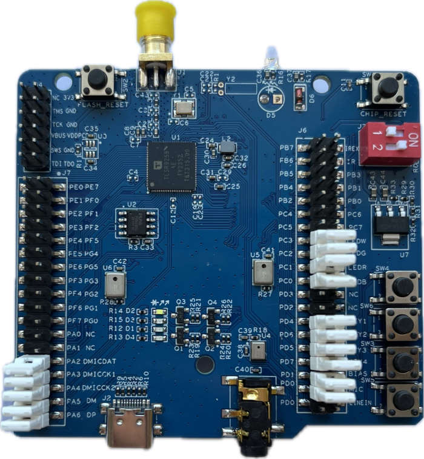
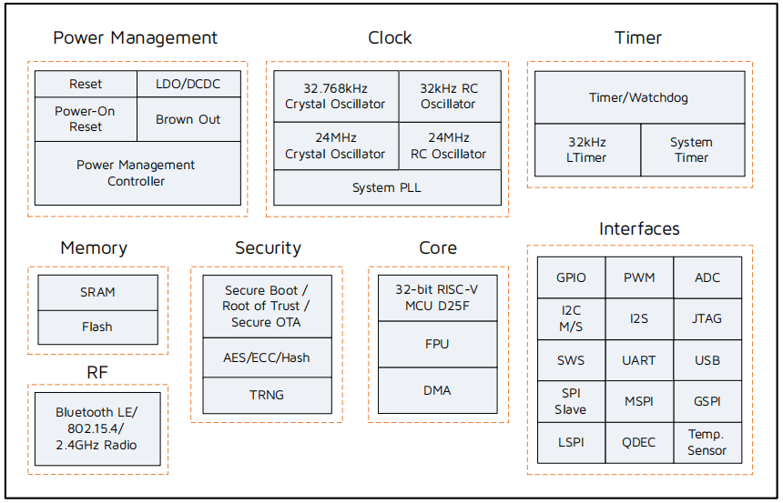

.. _tl7218:

Telink TL7218
#####################

Overview
********

The TL7218 Generic Starter Kit is a hardware platform which
can be used to verify the `Telink TLX series chipset`_ and develop applications
for several 2.4 GHz air interface standards including Bluetooth low energy,
Zigbee 3.0, Homekit, 6LoWPAN, Thread and 2.4 Ghz proprietary.

More information about the board can be found at the `Telink TL7218 Generic Starter Kit Hardware Guide`_ website.

Hardware
********

TL7218 is a single chip SoC for Bluetooth low energy and 802.15.4. The embedded 2.4GHz transceiver
supports Bluetooth low energy, 802.15.4 as well as 2.4GHz proprietary operation.
The TL7218 integrates a powerful 32-bit RISC-V MCU, 512 or 256 KB SRAM including up to 256 KB retention SRAM,
2 MB or 1 MB embedded flash, 12-bit ADC, PWM, flexible IO interfaces, and other peripheral blocks for IoT
applications.

The TL7218 default board configuration provides the following hardware components:

- RF conducted antenna
- 2 MB External SPI Flash memory with reset button. (Possible to mount 1/2/4 MB)
- Chip reset button
- USB type-C interface
- 4-wire JTAG
- Key matrix up to 4 keys
- 4 LEDs
- 1 infra-red LED
- 1 analogue microphone with line-in function (switching by a jumper in microphone path)
- Dual Digital microphone

Supported Features
==================

The Zephyr TL7218 board configuration supports the following hardware features:

+----------------+------------+------------------------------+
| Interface      | Controller | Driver/Component             |
+================+============+==============================+
| PLIC           | on-chip    | interrupt_controller         |
+----------------+------------+------------------------------+
| RISC-V Machine | on-chip    | timer                        |
| Timer (32 KHz) |            |                              |
+----------------+------------+------------------------------+
| PINCTRL        | on-chip    | pinctrl                      |
+----------------+------------+------------------------------+
| GPIO           | on-chip    | gpio                         |
+----------------+------------+------------------------------+
| UART           | on-chip    | serial                       |
+----------------+------------+------------------------------+
| PWM            | on-chip    | pwm                          |
+----------------+------------+------------------------------+
| TRNG           | on-chip    | entropy                      |
+----------------+------------+------------------------------+
| FLASH (MSPI)   | on-chip    | flash                        |
+----------------+------------+------------------------------+
| RADIO          | on-chip    | Bluetooth,                   |
|                |            | ieee802154, OpenThread       |
+----------------+------------+------------------------------+
| SPI (Master)   | on-chip    | spi                          |
+----------------+------------+------------------------------+
| I2C (Master)   | on-chip    | i2c                          |
+----------------+------------+------------------------------+
| ADC            | on-chip    | adc                          |
+----------------+------------+------------------------------+
| USB (device)   | on-chip    | usb_dc                       |
+----------------+------------+------------------------------+
| PKE            | on-chip    | mbedtls                      |
+----------------+------------+------------------------------+

Board includes power management module: Embedded LDO and DCDC, Battery monitor for low battery voltage detection,
Brownout detection/shutdown and Power-On-Reset, Deep sleep with external wakeup (without SRAM retention),
Deep sleep with RTC and SRAM retention (32 KB SRAM retention).

Limitations
-----------

- Maximum 3 GPIO ports could be configured to generate external interrupts simultaneously. All ports should use different IRQ numbers.
- DMA mode is not supported by I2C, SPI and Serial Port.
- SPI Slave mode is not implemented.
- I2C Slave mode is not implemented.
- Bluetooth is not compatible with deep-sleep mode. Only suspend is allowed when Bluetooth is active.
- USB working only in active mode (No power down supported).
- During deep-sleep all GPIO's are in Hi-Z mode.
- Shell is not compatible with sleep modes.

Default configuration and IOs
=============================

System Clock
------------

The TL7218 board is configured to use the 24 MHz external crystal oscillator
with the on-chip PLL/DIV generating the 60 MHz system clock.
The following values also could be assigned to the system clock in the board DTS file
(``boards/telink/tl7218/tl7218-common.dtsi``):

- 40000000
- 48000000
- 60000000
- 80000000
- 120000000

.. code-block::

   &cpu0 {
       clock-frequency = <60000000>;
   };

PINs Configuration
------------------

The TL7218 SoC has five GPIO controllers (PORT_A to PORT_F), and the next are
currently enabled:

- LED0 (blue): PC0, LED1 (green): PC2, LED2 (white): PC3, LED3 (red): PC1
- Key Matrix SW3: PD4_PD5, SW4: PD4_PD7, SW5: PD6_PD5, SW6: PD6_PD7

Peripheral's pins on the SoC are mapped to the following GPIO pins in the
``boards/telink/tl7218/tl7218-common.dtsi`` file:

- UART0 TX: PB2, RX: PB3
- PWM Channel 0: PB7
- LSPI CLK: PE1, MISO: PE3, MOSI: PE2
- GSPI CLK: PF4, MISO: PF6, MOSI: PF7
- I2C SCL: PE6, SDA: PE7

Serial Port
-----------

The Zephyr console output is assigned to UART0.
The default settings are 115200 8N1.

USB COM Port (ACM) as Serial Port Configuration
-----------------------------------------------

To use the USB COM port (ACM) instead of UART, follow these steps:

1. Add the following configuration to your project:

.. code-block:: none
    CONFIG_LOG=y
    CONFIG_USB_DEVICE_STACK=y
    CONFIG_USB_DEVICE_INITIALIZE_AT_BOOT=n
    CONFIG_USB_CDC_ACM_LOG_LEVEL_OFF=y
2. Include the following overlay configuration:

.. code-block:: dts
    / {
        chosen {
            zephyr,console = &cdc_acm_uart0;
            zephyr,shell-uart = &cdc_acm_uart0;
        };
    };
    &zephyr_udc0 {
        cdc_acm_uart0: cdc_acm_uart0 {
            compatible = "zephyr,cdc-acm-uart";
        };
    };
3. Connect the USB cable to your device. A new ACM serial device should appear in your system (e.g., ``/dev/ttyACM0`` on Linux or a COM port on Windows).
4. Use your preferred terminal application (like ``minicom``, ``screen``, or ``PuTTY``) to connect to the newly detected ACM serial device.

5. In your source code, ensure the following header is included and the USB device stack is initialized:

.. code-block:: c

    #ifdef CONFIG_USB_DEVICE_STACK
    #include <zephyr/usb/usb_device.h>
    #endif
    #ifdef CONFIG_USB_DEVICE_STACK
    usb_enable(NULL);
    #endif

Programming and debugging
*************************

Building
========

.. important::

   These instructions assume you've set up a development environment as
   described in the `Zephyr Getting Started Guide`_.

To build applications using the default RISC-V toolchain from Zephyr SDK, just run the west build command.
Here is an example for the "hello_world" application.

.. code-block:: console

   # From the root of the zephyr repository
   west build -b tl7218 samples/hello_world

Open a serial terminal with the following settings:

- Speed: 115200
- Data: 8 bits
- Parity: None
- Stop bits: 1

Flash the board, reset and observe the following messages on the selected
serial port:

.. code-block:: console

   *** Booting Zephyr OS build zephyr-v3.3.0-xxxx-xxxxxxxxxxxxx  ***
   Hello World! tl7218

Flashing
========

To flash the TL7218 board see the sources below:

- `Burning and Debugging Tools for all Series`_

It is also possible to use the west flash command. Download BDT tool for Linux `Burning and Debugging Tool for Linux`_ or
`Burning and Debugging Tool for Windows`_ and extract archive into some directory you wish TELINK_BDT_BASE_DIR

- Now you should be able to run the west flash command with the BDT path specified (TELINK_BDT_BASE_DIR).

.. code-block:: console

   west flash --bdt-path=$TELINK_BDT_BASE_DIR --erase

- You can also run the west flash command without BDT path specification if TELINK_BDT_BASE_DIR is in your environment (.bashrc).

.. code-block:: console

   export TELINK_BDT_BASE_DIR="/opt/telink_bdt/"

References
**********

.. target-notes::

.. _Burning and Debugging Tools for all Series: https://wiki.telink-semi.cn/wiki/IDE-and-Tools/Burning-and-Debugging-Tools-for-all-Series/
.. _Burning and Debugging Tool for Linux: https://wiki.telink-semi.cn/tools_and_sdk/Tools/BDT/Telink_libusb_BDT-Linux-X64-V1.6.0.zip
.. _Burning and Debugging Tool for Windows: https://wiki.telink-semi.cn/tools_and_sdk/Tools/BDT/BDT.zip
.. _Zephyr Getting Started Guide: https://docs.zephyrproject.org/latest/getting_started/index.html
