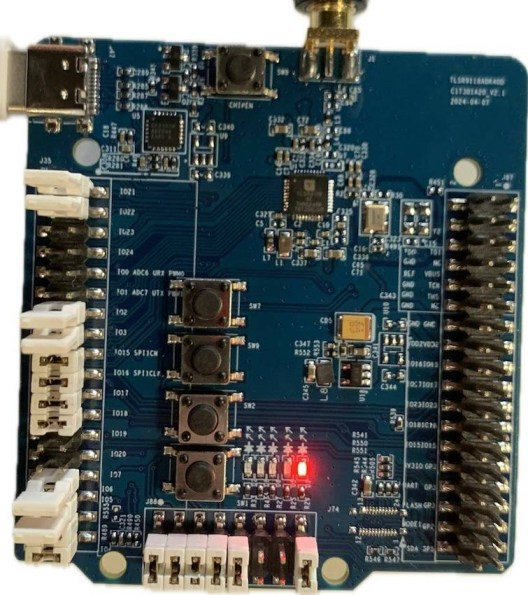
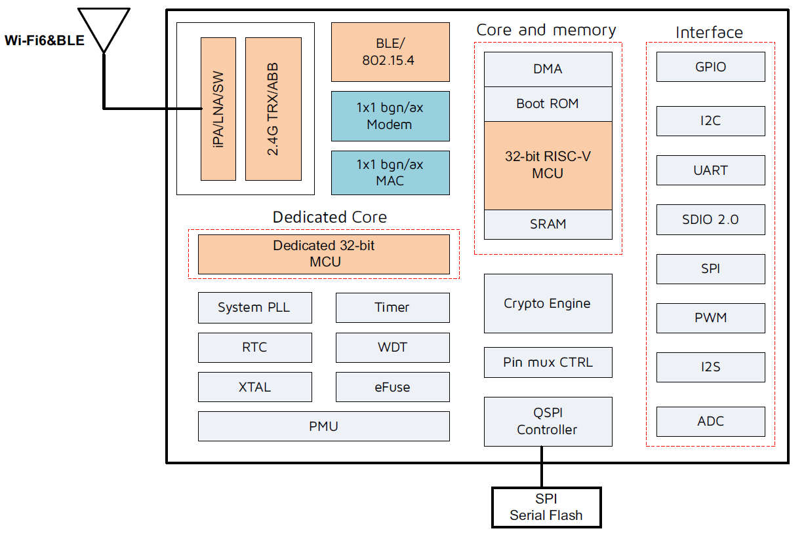

.. _tlsr9118bdk40d:

Telink TLSR9118BDK40D
#####################

Overview
********

The TLSR9118BDK40D Generic Starter Kit is a hardware platform which
can be used to verify the `Telink TLSR9 series chipset`_ and develop applications
for several 2.4 GHz air interface standards including Wi-Fi, Bluetooth 5.2 (Basic data
rate, Enhanced data rate, LE, Indoor positioning and BLE Mesh),
Zigbee 3.0, Homekit, 6LoWPAN, Thread and 2.4 Ghz proprietary.

More information about the board can be found at the `Telink W91 Generic Starter Kit Hardware Guide`_ website.

Hardware
********

The TLSR9118BDK40D SoC integrates a powerful 32-bit RISC-V dual-core MCU.
Dedicated 32-bit MCU N22 for peripheral controlling include radio which contains 352 KB SRAM, 336 KB ROM,
4 MB Flash.
Application 32-bit MCU D25 for user application which contains 352 KB SRAM, 48 KB ROM, 4 MB Flash.
IPC unit is implemented to share date between MCUs.

The TLSR9118BDK40D default board configuration provides the following hardware components:

- RF conducted antenna
- Chip reset button
- USB type-C to UART interface
- 4-wire JTAG
- 4 keys
- 4 red LEDs

Supported Features
==================

The Zephyr TLSR9118BDK40D board configuration supports the following hardware features:

+----------------+------------+------------------------------+
| Interface      | Controller | Driver/Component             |
+================+============+==============================+
| PLIC           | on-chip    | interrupt_controller         |
+----------------+------------+------------------------------+
| RISC-V Machine | on-chip    | timer                        |
| Timer (32 KHz) |            |                              |
+----------------+------------+------------------------------+
| PINCTRL        | on-chip    | pinctrl                      |
+----------------+------------+------------------------------+
| GPIO           | on-chip    | gpio                         |
+----------------+------------+------------------------------+
| UART           | on-chip    | serial                       |
+----------------+------------+------------------------------+
| PWM            | on-chip    | pwm                          |
+----------------+------------+------------------------------+
| TRNG           | on-chip    | entropy                      |
+----------------+------------+------------------------------+
| FLASH (MSPI)   | on-chip    | flash                        |
+----------------+------------+------------------------------+
| RADIO          | on-chip    | Bluetooth,                   |
|                |            | wifi                         |
+----------------+------------+------------------------------+
| I2C            | on-chip    | i2c                          |
+----------------+------------+------------------------------+
| AES            | on-chip    | mbedtls                      |
+----------------+------------+------------------------------+
| PKE            | on-chip    | mbedtls                      |
+----------------+------------+------------------------------+

Default configuration and IOs
=============================

System Clock
------------

The TLSR9118BDK40D board is configured to use the 40 MHz external crystal oscillator
with the on-chip PLL/DIV generating the 160 MHz system clock.
The following values also could be assigned to the system clock in the board DTS file
(``boards/riscv/tlsr9118bdk40d/tlsr9118bdk40d-common.dtsi``):

- 160000000

.. code-block::

   &cpu0 {
       clock-frequency = <160000000>;
   };

PINs Configuration
------------------

- LED1 (RED): GPIO15
- LED2 (RED): GPIO16
- LED3 (RED): GPIO17
- LED4 (RED): GPIO18

Keys
- SW7 : GPIO4
- SW9 : GPIO5
- SW2 : GPIO6
- SW1 : GPIO7

Peripheral's pins on the SoC are mapped to the following GPIO pins in the
``boards/riscv/tlsr9118bdk40d/tlsr9118bdk40d-common.dtsi`` and ``boards/riscv/tlsr9118bdk40d/tlsr9118bdk40d.dts`` files:

- 3 PWM Channel: GPIO18, GPIO17, GPIO16
- I2C SCL: GPIO15, SDA: GPIO16

Serial Port
-----------

The TLSR9118BDK40D SoC has 3 UARTs.
The Zephyr console output is assigned to UART0 (J47 USB-C connector). The default settings are 115200 8N1.
The slave core N22 console is assigned to UART1 (UART_RX GPIO 0, UART_TX GPIO 1). You will need USB-to-UART converter.
The default settings are 115200 8N1.

Although UART0 and UART1 are set by default as console outputs for each core,
UART2 can be configured to usage on GPIO15, GPIO16 (check ``boards/riscv/tlsr9118bdk40d/tlsr9118bdk40d-pinctrl.dtsi`` ).

Programming and debugging
*************************

Building
========

.. important::

   These instructions assume you've set up a development environment as
   described in the `Zephyr Getting Started Guide`_.

To build applications using the default RISC-V toolchain from Zephyr SDK, just run the west build command.
Here is an example for the "blinky" application.

.. code-block:: console

   # From the root of the zephyr repository
   west build -b tlsr9118bdk40d samples/basic/blinky

Flashing
========

Then use the west flash command. Download Senscomm tool `Senscomm Flash Tool`_
and extract archive into some directory you wish TELINK_SCTOOL_BASE_DIR. This archive includes both versions for Linux
and Windows.

- Now you should be able to run the west flash command with the sctool path specified (TELINK_SCTOOL_BASE_DIR).

.. code-block:: console

   west flash --sctool-path TELINK_SCTOOL_BASE_DIR --usb-port /dev/ttyUSB0

- You can also run the west flash command without sctool path specification if TELINK_SCTOOL_BASE_DIR is in your environment (.bashrc).

.. code-block:: console

   export TELINK_SCTOOL_BASE_DIR="/opt/telink_sctool/"

Open a serial terminal with the following settings:

- Speed: 115200
- Data: 8 bits
- Parity: None
- Stop bits: 1

Flash the board, reset and observe the following messages on the selected
serial port:

.. code-block:: console

   *** Booting Zephyr OS build v3.1.0-rc1-14499-g717301fd9915 **

References
**********

.. target-notes::

.. _Telink TLSR9 series chipset: [UNDER_DEVELOPMENT]
.. _Telink W91 Generic Starter Kit Hardware Guide: [UNDER_DEVELOPMENT]
.. _Senscomm Flash Tool: https://wiki.telink-semi.cn/tools_and_sdk/Tools/SCM_Flash_Tool_v2.0.2.zip
.. _Zephyr Getting Started Guide: https://docs.zephyrproject.org/latest/getting_started/index.html
