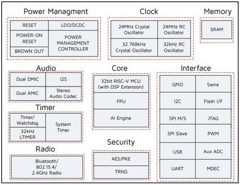

.. zephyr:board:: tlsr9518adk80d

Overview
********

The TLSR9518A Generic Starter Kit is a hardware platform which
can be used to verify the `Telink TLSR951x series chipset`_ and develop applications
for several 2.4 GHz air interface standards including Bluetooth 5.2 (Basic data
rate, Enhanced data rate, LE, Indoor positioning and BLE Mesh),
Zigbee 3.0, Homekit, 6LoWPAN, Thread and 2.4 Ghz proprietary.

More information about the board can be found at the `Telink B91 Generic Starter Kit Hardware Guide`_ website.

Hardware
********

The TLSR9518A SoC integrates a powerful 32-bit RISC-V MCU, DSP, AI Engine, 2.4 GHz ISM Radio, 256
KB SRAM (128 KB of Data Local Memory and 128 KB of Instruction Local Memory), external Flash memory,
stereo audio codec, 14 bit AUX ADC, analog and digital Microphone input, PWM, flexible IO interfaces,
and other peripheral blocks required for advanced IoT, hearable, and wearable devices.

The TLSR9518ADK80D default board configuration provides the following hardware components:

- RF conducted antenna
- 1 MB External Flash memory with reset button
- Chip reset button
- Mini USB interface
- 4-wire JTAG
- 4 LEDs, Key matrix up to 4 keys
- 2 line-in function (Dual Analog microphone supported when switching jumper from microphone path)
- Dual Digital microphone
- Stereo line-out

Supported Features
==================

.. zephyr:board-supported-hw::

.. note::
   To support "button" example project PC3-KEY3 (J20-19, J20-20) jumper needs to be removed and KEY3 (J20-19) should be connected to VDD3_DCDC (J51-13) externally.

   For the rest example projects use the default jumpers configuration.

Limitations
-----------

- Maximum 3 GPIO pins could be configured to generate interrupts simultaneously. All pins must be related to different ports and use different IRQ numbers.
- DMA mode is not supported by I2C, SPI and Serial Port.
- UART hardware flow control is not implemented.
- SPI Slave mode is not implemented.
- I2C Slave mode is not implemented.

Default configuration and IOs
=============================

System Clock
------------

The TLSR9518ADK80D board is configured to use the 24 MHz external crystal oscillator
with the on-chip PLL/DIV generating the 48 MHz system clock.
The following values also could be assigned to the system clock in the board DTS file
:zephyr_file:`boards/telink/tlsr9518adk80d/tlsr9518adk80d.dts`:

- 16000000
- 24000000
- 32000000
- 48000000
- 64000000
- 96000000

.. code-block::

   &cpu0 {
       clock-frequency = <48000000>;
   };

PINs Configuration
------------------

The TLSR9518A SoC has five GPIO controllers (PORT_A to PORT_E), but only two are
currently enabled (PORT_B for LEDs control and PORT_C for buttons) in the board DTS file:

- LED0 (blue): PB4, LED1 (green): PB5, LED2 (white): PB6, LED3 (red): PB7
- Key Matrix SW0: PC2_PC3, SW1: PC2_PC1, SW2: PC0_PC3, SW3: PC0_PC1

Peripheral's pins on the SoC are mapped to the following GPIO pins in the
:zephyr_file:`boards/telink/tlsr9518adk80d/tlsr9518adk80d.dts` file:

- UART0 TX: PB2, RX: PB3
- UART1 TX: PC6, RX: PC7
- PWM Channel 0: PB4
- PSPI CS0: PC4, CLK: PC5, MISO: PC6, MOSI: PC7
- HSPI CS0: PA1, CLK: PA2, MISO: PA3, MOSI: PA4
- I2C SCL: PE1, SDA: PE3

Serial Port
-----------

The TLSR9518A SoC has 2 UARTs. The Zephyr console output is assigned to UART0.
The default settings are 115200 8N1.

Programming and debugging
*************************

Building
========

.. important::

   These instructions assume you've set up a development environment as
   described in the :ref:`getting_started`.

To build applications using the default RISC-V toolchain from Zephyr SDK, just run the west build command.
Here is an example for the "hello_world" application.

.. code-block:: console

   # From the root of the zephyr repository
   west build -b tlsr9518adk80d samples/hello_world

To use `Telink RISC-V Linux Toolchain`_, ``ZEPHYR_TOOLCHAIN_VARIANT`` and ``CROSS_COMPILE`` variables need to be set.
In addition ``CONFIG_FPU=y`` must be selected in :zephyr_file:`boards/telink/tlsr9518adk80d/tlsr9518adk80d_defconfig` file since this
toolchain is compatible only with the float point unit usage.

.. code-block:: console

   # Set Zephyr toolchain variant to cross-compile
   export ZEPHYR_TOOLCHAIN_VARIANT=cross-compile
   # Specify the Telink RISC-V Toolchain location
   export CROSS_COMPILE=~/toolchains/nds32le-elf-mculib-v5f/bin/riscv32-elf-
   # From the root of the zephyr repository
   west build -b tlsr9518adk80d samples/hello_world

`Telink RISC-V Linux Toolchain`_ is available on the `Burning and Debugging Tools for TLSR9 Series in Linux`_ page.

Open a serial terminal with the following settings:

- Speed: 115200
- Data: 8 bits
- Parity: None
- Stop bits: 1

Flash the board, reset and observe the following messages on the selected
serial port:

.. code-block:: console

   *** Booting Zephyr OS version 2.5.0  ***
   Hello World! tlsr9518adk80d

Flashing
========

To flash the TLSR9518ADK80D board see the sources below:

- `Burning and Debugging Tools for all Series`_
- `Burning and Debugging Tools for TLSR9 Series`_
- `Burning and Debugging Tools for TLSR9 Series in Linux`_

It is also possible to use the west flash command, but additional steps are required to set it up:

- Download `Telink RISC-V Linux Toolchain`_. The toolchain contains tools for the board flashing as well.
- Since the ICEman tool is created for the 32-bit OS version it is necessary to install additional packages in case of the 64-bit OS version.

.. code-block:: console

   sudo dpkg --add-architecture i386
   sudo apt-get update
   sudo apt-get install -y libc6:i386 libncurses5:i386 libstdc++6:i386

-  Run the "ICEman.sh" script.

.. code-block:: console

   # From the root of the {path to the Telink RISC-V Linux Toolchain}/ice repository
   sudo ./ICEman.sh

- Now you should be able to run the west flash command with the toolchain path specified (TELINK_TOOLCHAIN_PATH).

.. code-block:: console

   west flash --telink-tools-path=$TELINK_TOOLCHAIN_PATH

- You can also run the west flash command without toolchain path specification if add SPI_burn and ICEman to PATH.

.. code-block:: console

    export PATH=$TELINK_TOOLCHAIN_PATH/flash/bin:"$PATH"
    export PATH=$TELINK_TOOLCHAIN_PATH/ice:"$PATH"

Debugging
=========

This port supports UART debug and OpenOCD+GDB. The ``west debug`` command also supported. You may run
it in a simple way, like:

.. code-block:: console

   west debug

Or with additional arguments, like:

.. code-block:: console

   west debug --gdb-port=<port_number> --gdb-ex=<additional_ex_arguments>

Example:

.. code-block:: console

   west debug --gdb-port=1111 --gdb-ex="-ex monitor reset halt -ex b main -ex continue"

References
**********

.. target-notes::

.. _Telink TLSR951x series chipset: https://wiki.telink-semi.cn/wiki/chip-series/TLSR951x-Series/
.. _Telink B91 Generic Starter Kit Hardware Guide: https://wiki.telink-semi.cn/wiki/Hardware/B91_Generic_Starter_Kit_Hardware_Guide/
.. _Telink RISC-V Linux Toolchain: https://wiki.telink-semi.cn/tools_and_sdk/Tools/IDE/telink_riscv_linux_toolchain.zip
.. _Burning and Debugging Tools for all Series: https://wiki.telink-semi.cn/wiki/IDE-and-Tools/Burning-and-Debugging-Tools-for-all-Series/
.. _Burning and Debugging Tools for TLSR9 Series: https://wiki.telink-semi.cn/wiki/IDE-and-Tools/Burning-and-Debugging-Tools-for-TLSR9-Series/
.. _Burning and Debugging Tools for TLSR9 Series in Linux: https://wiki.telink-semi.cn/wiki/IDE-and-Tools/BDT_for_TLSR9_Series_in_Linux/
