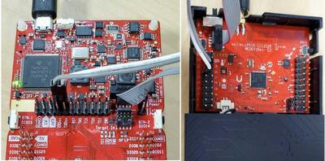

.. zephyr:board:: cc1352r_sensortag

Overview
********

The Texas Instruments CC1352R SensorTag |trade| (LPSTK-CC1352R) is a
development kit for the SimpleLink |trade| multi-Standard CC1352R wireless MCU.

See the `TI CC1352R SensorTag Product Page`_ for details.

Hardware
********

The CC1352R SensorTag |trade| development kit features the CC1352R wireless MCU.
The board is equipped with three LEDs, two push buttons and BoosterPack connectors
for expansion.

The CC13522 wireless MCU has a 48 MHz Arm |reg| Cortex |reg|-M4F SoC and an
integrated Sub-1 and 2.4 GHz transceiver supporting multiple protocols including
Bluetooth |reg| Low Energy and IEEE |reg| 802.15.4.

See the `TI CC1352R Product Page`_ for additional details.

Supported Features
==================

.. zephyr:board-supported-hw::

Connections and IOs
===================

All I/O signals are accessible from the BoosterPack connectors. Pin function
aligns with the SensorTag standard.

+-------+-----------+---------------------+
| Pin   | Function  | Usage               |
+=======+===========+=====================+
| DIO3  | GPIO      | GPIO / PWM1         |
+-------+-----------+---------------------+
| DIO4  | I2C_MSSCL | I2C SCL             |
+-------+-----------+---------------------+
| DIO5  | I2C_MSSDA | I2C SDA             |
+-------+-----------+---------------------+
| DIO6  | GPIO      | Red LED             |
+-------+-----------+---------------------+
| DIO7  | GPIO      | Green LED           |
+-------+-----------+---------------------+
| DIO8  | SSI0_RX   | SPI MISO            |
+-------+-----------+---------------------+
| DIO9  | SSI0_TX   | SPI MOSI            |
+-------+-----------+---------------------+
| DIO10 | SSI0_CLK  | SPI CLK             |
+-------+-----------+---------------------+
| DIO11 | SSIO_CS   | SPI CS              |
+-------+-----------+---------------------+
| DIO12 | UART0_RX  | UART RXD            |
+-------+-----------+---------------------+
| DIO13 | UART0_TX  | UART TXD            |
+-------+-----------+---------------------+
| DIO14 | GPIO      | Button 2            |
+-------+-----------+---------------------+
| DIO15 | GPIO      | Button 1            |
+-------+-----------+---------------------+
| DIO16 |           | JTAG TDO            |
+-------+-----------+---------------------+
| DIO17 |           | JTAG TDI            |
+-------+-----------+---------------------+
| DIO18 | UART0_RTS | UART RTS / JTAG SWO |
+-------+-----------+---------------------+
| DIO19 | UART0_CTS | UART CTS            |
+-------+-----------+---------------------+
| DIO20 | GPIO      | Flash CS            |
+-------+-----------+---------------------+
| DIO21 | GPIO      | Blue LED            |
+-------+-----------+---------------------+
| DIO22 | GPIO      |                     |
+-------+-----------+---------------------+
| DIO23 | AUX_IO    | A0 (DRV5032)        |
+-------+-----------+---------------------+
| DIO24 | AUX_IO    | A1                  |
+-------+-----------+---------------------+
| DIO25 | GPIO      | HDC2080 INT         |
+-------+-----------+---------------------+
| DIO26 | AUX_IO    | A3                  |
+-------+-----------+---------------------+
| DIO27 | GPIO      | OPT3001 INT         |
+-------+-----------+---------------------+
| DIO28 | AUX_IO    | A5                  |
+-------+-----------+---------------------+
| DIO29 | AUX_IO    | A6                  |
+-------+-----------+---------------------+
| DIO30 | AUX_IO    | ADXL362 INT         |
+-------+-----------+---------------------+

Programming and Debugging
*************************

.. zephyr:board-supported-runners::

TI's supported method of programming and debugging the ``CC1352R SensorTag`` is
to use it in tandem with a ``CC1352R LaunchPad``, making use of the integrated
(XDS110) debugger and serial console over USB.

#. Disconnect the debug isolation jumpers on your LaunchPad
#. Connect the ARM 10-pin JTAG cable to XDS110 OUT header on your LaunchPad
#. Connect the other end of the ARM10-pin cable to the JTAG header on your LaunchPad SensorTag
#. Connect the 2-pin jumper cable to the top pins of RXD and TXD (grey wire to RXD, white wire to TXD)
#. Connect the other end of the 2-pin jumper to pins 12/RX and 13/TX on the LaunchPad SensorTag (Grey to 12/RX, white to 13/TX)
#. Connect your XDS110 LaunchPad to your PC!

See `Debugging the LaunchPad SensorTag`_ for additional details.

Prerequisites:
==============

#. Ensure the XDS-110 emulation firmware on the board is updated.

   Download and install the latest `XDS-110 emulation package`_.

   Follow these `xds110 firmware update directions
   <http://software-dl.ti.com/ccs/esd/documents/xdsdebugprobes/emu_xds110.html#updating-the-xds110-firmware>`_

   Note that the emulation package install may place the xdsdfu utility
   in ``<install_dir>/ccs_base/common/uscif/xds110/``.

#. Install OpenOCD

   You can obtain OpenOCD by following these
   :ref:`installing the latest Zephyr SDK instructions <toolchain_zephyr_sdk>`.

   After the installation, add the directory containing the OpenOCD executable
   to your environment's PATH variable. For example, use this command in Linux:

   .. code-block:: console

      export PATH=$ZEPHYR_SDK_INSTALL_DIR/sysroots/x86_64-pokysdk-linux/usr/bin/openocd:$PATH

Flashing
========

Applications for the ``CC1352R SensorTag`` board configuration can be built and
flashed in the usual way (see :ref:`build_an_application` and
:ref:`application_run` for more details).

Here is an example for the :zephyr:code-sample:`hello_world` application.

First, run your favorite terminal program to listen for output.

.. code-block:: console

   $ minicom -D <tty_device> -b 115200

Replace :code:`<tty_device>` with the port where the XDS110 application
serial device can be found. For example, :code:`/dev/ttyACM0`. Once in
minicom Pres :code:`Ctrl+A, U` to add a carriage return, and
:code:`Ctrl+A, W` to wrap long lines.

Then build and flash the application in the usual way.

For the :code:`Hello, world!` application, follow the instructions below.

.. zephyr-app-commands::
   :zephyr-app: samples/hello_world
   :board: cc1352r_sensortag
   :goals: build flash

Debugging
=========

You can debug an application in the usual way.  Here is an example for the
:zephyr:code-sample:`hello_world` application.

.. zephyr-app-commands::
   :zephyr-app: samples/hello_world
   :board: cc1352r_sensortag
   :maybe-skip-config:
   :goals: debug

Bootloader
==========

The ROM bootloader on CC13x2 and CC26x2 devices is enabled by default. The
bootloader will start if there is no valid application image in flash or the
so-called backdoor is enabled (via option
:kconfig:option:`CONFIG_CC13X2_CC26X2_BOOTLOADER_BACKDOOR_ENABLE`) and BTN-1 is held
down during reset. See the bootloader documentation in chapter 10 of the `TI
CC13x2 / CC26x2 Technical Reference Manual`_ for additional information.

Power Management and UART
=========================

System and device power management are supported on this platform, and
can be enabled via the standard Kconfig options in Zephyr, such as
:kconfig:option:`CONFIG_PM`, :kconfig:option:`CONFIG_PM_DEVICE`.

When system power management is turned on (CONFIG_PM=y),
sleep state 2 (standby mode) is allowed, and polling is used to retrieve input
by calling uart_poll_in(), it is possible for characters to be missed if the
system enters standby mode between calls to uart_poll_in(). This is because
the UART is inactive while the system is in standby mode. The workaround is to
disable sleep state 2 while polling:

.. code-block:: c

    pm_policy_state_lock_get(PM_STATE_STANDBY, PM_ALL_SUBSTATES);
    <code that calls uart_poll_in() and expects input at any point in time>
    pm_policy_state_lock_put(PM_STATE_STANDBY, PM_ALL_SUBSTATES);

References
**********

CC1352R1 SensorTag Quick Start Guide:
  https://www.ti.com/lit/pdf/swau127

.. _TI CC1352R SensorTag Product Page:
   http://www.ti.com/tool/lpstk-cc1352r

.. _TI CC1352R Product Page:
   http://www.ti.com/product/cc1352r

.. _TI CC13x2 / CC26x2 Technical Reference Manual:
   http://www.ti.com/lit/pdf/swcu185

.. _Debugging the LaunchPad SensorTag:
   https://dev.ti.com/tirex/explore/content/simplelink_academy_cc13x2_26x2sdk_4_20_03_00/modules/lpstk/lpstk_oobe/lpstk_oobe.html#-debugging-the-launchpad-sensortag-

..  _XDS-110 emulation package:
   http://processors.wiki.ti.com/index.php/XDS_Emulation_Software_Package#XDS_Emulation_Software_.28emupack.29_Download
