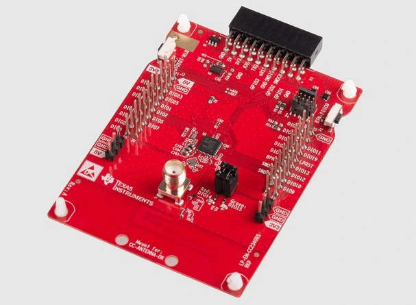

.. _lp_em_cc2340r5:

TI CC2340R5 Launchpad
#####################

Overview
********

The Texas Instruments CC2340R5 LaunchPad |trade| (LP_EM_CC2340R5) is a
development kit for the SimpleLink |trade| multi-Standard CC2340R5 wireless MCU.

See the `TI CC2340R5 LaunchPad Product Page`_ for details.

   Texas Instruments CC2340R5 LaunchPad |trade|

Hardware
********

The CC2340R5 LaunchPad |trade| development kit features the CC2340R5 wireless MCU.
The board is equipped with two LEDs, two push buttons and BoosterPack connectors
for expansion.

The CC2340R5 wireless MCU has a 48 MHz Arm |reg| Cortex |reg|-M0+ SoC and an
integrated 2.4 GHz transceiver supporting multiple protocols including Bluetooth
|reg| Low Energy and IEEE |reg| 802.15.4.

See the `TI CC2340R5 Product Page`_ for additional details.

Supported Features
==================

The ``lp_em_cc2340r5`` board supports the following hardware features:

+-----------+------------+----------------------+
| Interface | Controller | Driver/Component     |
+===========+============+======================+
| NVIC      | on-chip    | arch/arm             |
+-----------+------------+----------------------+
| GPIO      | on-chip    | gpio                 |
+-----------+------------+----------------------+
| PINMUX    | on-chip    | pinmux               |
+-----------+------------+----------------------+
| UART      | on-chip    | serial port          |
+-----------+------------+----------------------+
| SYSTIM    | on-chip    | system timer         |
+-----------+------------+----------------------+
| FLASH     | on-chip    | flash memory         |
+-----------+------------+----------------------+

Other hardware features have not been enabled yet for this board.

Connections and IOs
===================

All I/O signals are accessible from the BoosterPack connectors. Pin function
aligns with the LaunchPad standard.

+-------+-----------+---------------------+
| Pin   | Function  | Usage               |
+=======+===========+=====================+
| DIO0  | GPIO      |                     |
+-------+-----------+---------------------+
| DIO1  | ANALOG_IO | A4                  |
+-------+-----------+---------------------+
| DIO2  | ANALOG_IO | A3                  |
+-------+-----------+---------------------+
| DIO5  | ANALOG_IO | A5                  |
+-------+-----------+---------------------+
| DIO6  | SPI_CSN   | SPI CS              |
+-------+-----------+---------------------+
| DIO7  | ANALOG_IO | A0                  |
+-------+-----------+---------------------+
| DIO8  | GPIO      |                     |
+-------+-----------+---------------------+
| DIO9  | GPIO      | Button 2            |
+-------+-----------+---------------------+
| DIO10 | GPIO      | Button 1            |
+-------+-----------+---------------------+
| DIO11 | SPI_CSN   | SPI CS              |
+-------+-----------+---------------------+
| DIO12 | SPI_POCI  | SPI POCI            |
+-------+-----------+---------------------+
| DIO13 | SPI_PICO  | SPI_PICO            |
+-------+-----------+---------------------+
| DIO14 | GPIO      | Red LED             |
+-------+-----------+---------------------+
| DIO15 | GPIO      | Green LED           |
+-------+-----------+---------------------+
| DIO18 | SPI_CLK   | SPI CLK             |
+-------+-----------+---------------------+
| DIO19 | GPIO      |                     |
+-------+-----------+---------------------+
| DIO20 | UART0_TX  | UART TX             |
+-------+-----------+---------------------+
| DIO21 | GPIO      |                     |
+-------+-----------+---------------------+
| DIO22 | UART0_RX  | UART RX             |
+-------+-----------+---------------------+
| DIO23 | ANALOG_IO | A8                  |
+-------+-----------+---------------------+
| DIO24 | ANALOG_IO | A7                  |
+-------+-----------+---------------------+

Programming and Debugging
*************************

The LP_EM_CC2340R5 requires an external debug probe such as the LP-XDS110 or
LP-XDS110ET.

Currently there is no debug support in Zephyr for the LP_EM_CC2340R5, and the
built binaries for this target must be flashed/debugged using either Uniflash
or Code Composer Studio.

References
**********

CC2340R5 LaunchPad Quick Start Guide:
  https://www.ti.com/lit/pdf/swru588

.. _TI CC2340R5 LaunchPad Product Page:
   https://www.ti.com/tool/LP-EM-CC2340R5

.. _TI CC2340R5 Product Page:
   https://www.ti.com/product/CC2340R5
