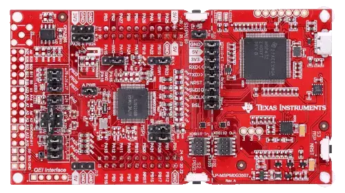

.. zephyr:board:: lp_mspm0g3507

Overview
********

MSPM0G350x microcontrollers (MCUs) are part of the MSP highly integrated, ultra-low-power 32-bit MCU
family based on the enhanced Arm® Cortex®-M0+ 32-bit core platform operating at up to 80-MHz frequency.
These cost-optimized MCUs offer high-performance analog peripheral integration, support extended temperature
ranges from -40°C to 125°C, and operate with supply voltages ranging from 1.62 V to 3.6 V.

The MSPM0G350x devices provide up to 128KB embedded flash program memory with built-in error correction
code (ECC) and up to 32KB SRAM with a hardware parity option. These MCUs also incorporate a
memory protection unit, 7-channel DMA, math accelerator, and a variety of peripherals including

* Analog.

  * Two 12-bit 4-Msps ADCs.

  * Configurable internal shared voltage reference.

  * One 12-bit 1-Msps DAC.

  * Three high speed comparators with built-in reference DACs.

  * Two zero-drift zero-crossover op-amps with programmable gain.

* Digital.

  * Two 16-bit advanced control timers.

  * Five general-purpose timers.

    * One 16-bit general-purpose timer for QEI interface.

    * One 32-bit high resolution general-purpose timer.

    * Two 16-bit timers with deadband support and up to 12 PWM Channels.

  * Two windowed-watchdog timers.

  * One RTC with alarm and calendar modes.

* Data Integrity and Encryption.

  * One AES HW accelerator capable of CTR, CBC, and ECB modes.

  * One Cyclic Redundancy Check (CRC) accelerator.

  * One True Random Number Generator (TRNG).

* Communication.

  * Four UARTs, one with support for advanced modes such as LIN and Manchester.

  * Two I2C supporting SMBUS/PMBUS and speeds up to FM+ (1Mbits/s).

  * Two SPI, one with max speed 32Mbits/s.

  * One CAN interface supporting CAN 2.0 A or B and CAN-FD.

Zephyr uses the ``lp_mspm0g3507`` board for building LP_MSPM0G3507

Features:
*********

- Onboard XDS110 debug probe
- EnergyTrace technology available for ultra-low-power debugging
- 2 buttons, 1 LED and 1 RGB LED for user interaction
- Temperature sensor circuit
- Light sensor circuit
- External OPA2365 (default buffer mode) for ADC (up to 4 Msps) evaluation
- Onboard 32.768-kHz and 40-MHz crystals
- RC filter for ADC input (unpopulated by default)

Details on the MSPM0G3507 LaunchPad can be found on the `TI LP_MSPM0G3507 Product Page`_.

Supported Features
==================

.. zephyr:board-supported-hw::

Building and Flashing
*********************

Building
========

Follow the :ref:`getting_started` instructions for Zephyr application development.

For example, to build the blinky application for the MSPM0G3507 LaunchPad:

.. zephyr-app-commands::
   :zephyr-app: samples/hello_world
   :board: lp_mspm0g3507
   :goals: build

The resulting ``zephyr.bin`` binary in the build directory can be flashed onto
MSPM0G3507 LaunchPad using the steps mentioned below.

Flashing
========

Open OCD is used to program the flash memory on the devices. It may be necessary in
earlier versions to use a branch of open OCD onto the device.

Before OpenOCD is public, one can clone `This Repo <https://github.com/openocd-org/openocd.git>`_,
and then this can be built with

.. code-block:: console

   $ cd <cloned_OPENOCD_dir>
   $ ./bootstrap (when building from the git repository)
   $ ./configure
   $ make
   $ sudo make install

Then after the build, it is possible to flash the device by passing additional arguments to the flash command

.. code-block:: console

   $ west flash --openocd <path to cloned dir>/src/openocd --openocd-search <path to cloned dir>/tcl

Flashing using JLINK

.. code-block:: console

   $ west flash --runner jlink

Debugging
=========

You can debug an application in the usual way. Here is an example for the
:zephyr:code-sample:`hello_world` application.

.. zephyr-app-commands::
   :zephyr-app: samples/hello_world
   :board: lp_mspm0g3507
   :goals: debug

References
**********

TI MSPM0 MCU Page:
   https://www.ti.com/microcontrollers-mcus-processors/arm-based-microcontrollers/arm-cortex-m0-mcus/overview.html

TI MSPM0G3507 Product Page:
   https://www.ti.com/product/MSPM0G3507

TI MSPM0 SDK:
   https://www.ti.com/tool/MSPM0-SDK

.. _MSPM0G3507 TRM:
   https://www.ti.com/lit/slau846

.. _TI LP_MSPM0G3507 Product Page:
   https://www.ti.com/tool/LP-MSPM0G3507
