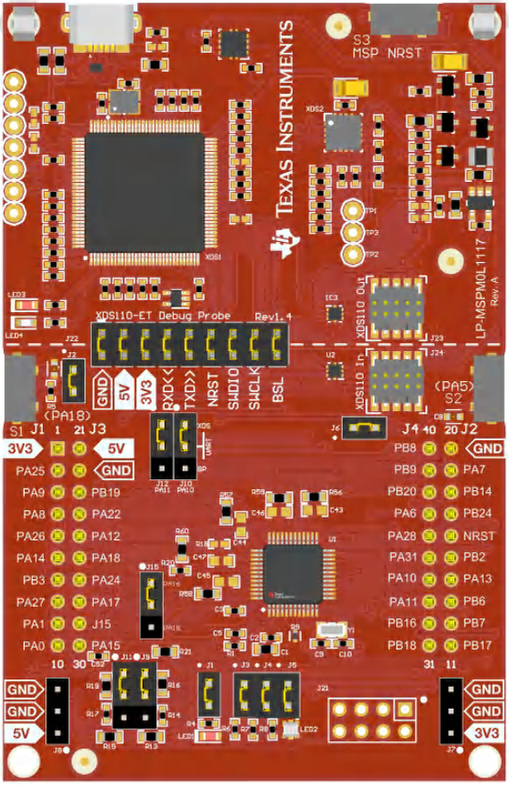

.. zephyr:board:: lp_mspm0l1117

Overview
********

MSPM0L111x microcontrollers (MCUs) are part of the MSP highly-integrated, ultra-low-power 32-bit MCU
family based on the enhanced Arm® Cortex®-M0+ core platform operating at up to 32MHz frequency. These
cost-optimized MCUs offer high-performance analog peripheral integration and excellent low-power current
consumption. The MCUs also support extended temperature ranges from -40°C to 125°C and operate with
supply voltages ranging from 1.62V to 3.6V.

The device has up to 128KB of embedded flash memory with built-in error correction code (ECC) and up
to 16KB SRAM. The flash memory is organized into two main banks to support field firmware updates, with
address swap support provided between the two main banks.

Hardware
********

Launchpad MSPM0L1117 provides the following hardware components:

- MSPM0L1117SPTR SoC
- Arm® 32-bit Cortex®-M0+ CPU with memory protection unit, frequency up to 32MHz
- VDD from 1.62 V to 3.6 V
- 128 KB Flash
- 16 KB SRAM with ECC or parity
- GPIO with external interrupt capability
- 1 12-bit ADC with 13 channels
- RTC
- Four timers supporting up to 14 PWM outputs
- Watchdog Timers (2)
- UART (2)
- I2C (1)
- SPI (1)
- DMA Controller

Zephyr uses the ``lp_mspm0l1117`` board for building LP_MSPM0L1117

Features:
*********

- Onboard XDS110 debug probe
- EnergyTrace technology available for ultra-low-power debugging
- 2 buttons, 1 LED and 1 RGB LED for user interaction

Details on the MSPM0L1117 LaunchPad can be found on the `TI LP_MSPM0L1117 Product Page`_.

Supported Features
==================

.. zephyr:board-supported-hw::

Building and Flashing
*********************

Building
========

Follow the :ref:`getting_started` instructions for Zephyr application development.

For example, to build the blinky application for the MSPM0L1117 LaunchPad:

.. zephyr-app-commands::
   :zephyr-app: samples/hello_world
   :board: lp_mspm0l1117
   :goals: build

The resulting ``zephyr.bin`` binary in the build directory can be flashed onto
MSPM0L1117 LaunchPad using the steps mentioned below.

Flashing
========

Open OCD is used to program the flash memory on the devices. It may be necessary in
earlier versions to use a branch of open OCD onto the device.

Before OpenOCD is public, one can clone `This Repo <https://github.com/openocd-org/openocd.git>`_,
and then this can be built with

.. code-block:: console

   $ cd <cloned_OPENOCD_dir>
   $ ./bootstrap (when building from the git repository)
   $ ./configure
   $ make
   $ sudo make install

Then after the build, it is possible to flash the device by passing additional arguments to the flash command

.. code-block:: console

   $ west flash --openocd <path to cloned dir>/src/openocd --openocd-search <path to cloned dir>/tcl

Flashing using JLINK

.. code-block:: console

   $ west flash --runner jlink

Debugging
=========

You can debug an application in the usual way. Here is an example for the
:zephyr:code-sample:`hello_world` application.

.. zephyr-app-commands::
   :zephyr-app: samples/hello_world
   :board: lp_mspm0l1117
   :goals: debug

References
**********

TI MSPM0 MCU Page:
   https://www.ti.com/microcontrollers-mcus-processors/arm-based-microcontrollers/arm-cortex-m0-mcus/overview.html

TI MSPM0L1117 Product Page:
   https://www.ti.com/product/MSPM0L1117

TI MSPM0 SDK:
   https://www.ti.com/tool/MSPM0-SDK

.. _MSPM0L1117 TRM:
   https://www.ti.com/lit/slau847

.. _TI LP_MSPM0L1117 Product Page:
   https://www.ti.com/tool/LP-MSPM0L1117
