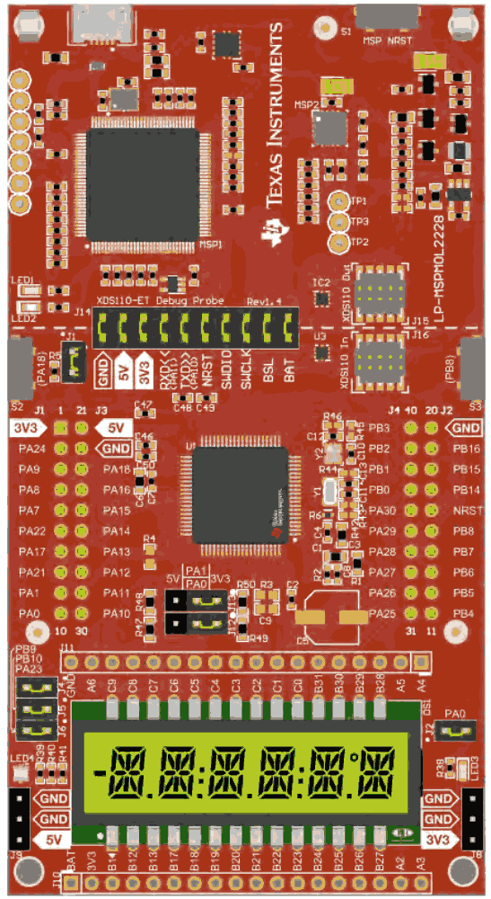

.. zephyr:board:: lp_mspm0l2228

Overview
********

MSPM0Lx22x microcontrollers (MCUs) are part of the highly integrated, ultra-low-power 32-bit MSPM0 MCU
family based on the Arm® Cortex®-M0+ 32-bit core platform, operating at up to 32MHz frequency. These
MCUs offer a blend of cost optimization and design flexibility for applications requiring 128KB to 256KB of
flash memory in small packages (down to 4mm x 4mm) or high pin count packages (up to 80 pins). These
devices include a VBAT backup island, an optional segmented LCD controller (on MSPM0L222x), cybersecurity
enablers, and high-performance integrated analog, and provide excellent low-power performance across the
operating temperature range.

Up to 256KB of embedded flash program memory with built-in error correction code (ECC) and up to 32KB
SRAM with ECC and parity protection is provided. The flash memory is organized into two main banks to support
field firmware updates, with address swap support provided between the two main banks. An additional 32-byte
backup memory is provided in the VBAT island, supplied by the VBAT pin and retained even when the main
supply (VDD) is lost.

Hardware
********

Launchpad MSPM0L2228 provides the following hardware components:

- MSPM0L2228TPN SoC
- ARM |reg| 32-bit Cortex |reg|-M0+ CPU
- 32 MHz max CPU frequency
- VDD from 1.62 V to 3.6 V
- 256 KB Flash
- 32 KB SRAM with ECC or parity
- GPIO with external interrupt capability
- 12-bit ADC with 26 channels
- RTC
- Six timers supporting up to 18 PWM outputs
- Watchdog Timers (2)
- UART (5)
- I2C (2)
- SPI (2)
- DMA Controller

Zephyr uses the ``lp_mspm0l2228`` board for building LP_MSPM0L2228

Features:
*********

- Onboard XDS110 debug probe
- EnergyTrace technology available for ultra-low-power debugging
- 2 buttons, 1 LED and 1 RGB LED for user interaction
- Temperature sensor circuit
- Light sensor circuit
- External OPA2365 (default buffer mode) for ADC (up to 4 Msps) evaluation
- Onboard 32.768-kHz and 40-MHz crystals
- RC filter for ADC input (unpopulated by default)

Details on the MSPM0L2228 LaunchPad can be found on the `TI LP_MSPM0L2228 Product Page`_.

Supported Features
==================

.. zephyr:board-supported-hw::

Building and Flashing
*********************

Building
========

Follow the :ref:`getting_started` instructions for Zephyr application development.

For example, to build the blinky application for the MSPM0L2228 LaunchPad:

.. zephyr-app-commands::
   :zephyr-app: samples/hello_world
   :board: lp_mspm0l2228
   :goals: build

The resulting ``zephyr.bin`` binary in the build directory can be flashed onto
MSPM0L2228 LaunchPad using the steps mentioned below.

Flashing
========

Open OCD is used to program the flash memory on the devices. It may be necessary in
earlier versions to use a branch of open OCD onto the device.

Before OpenOCD is public, one can clone `This Repo <https://github.com/openocd-org/openocd.git>`_,
and then this can be built with

.. code-block:: console

   $ cd <cloned_OPENOCD_dir>
   $ ./bootstrap (when building from the git repository)
   $ ./configure
   $ make
   $ sudo make install

Then after the build, it is possible to flash the device by passing additional arguments to the flash command

.. code-block:: console

   $ west flash --openocd <path to cloned dir>/src/openocd --openocd-search <path to cloned dir>/tcl

Flashing using JLINK

.. code-block:: console

   $ west flash --runner jlink

Debugging
=========

You can debug an application in the usual way. Here is an example for the
:zephyr:code-sample:`hello_world` application.

.. zephyr-app-commands::
   :zephyr-app: samples/hello_world
   :board: lp_mspm0l2228
   :goals: debug

References
**********

TI MSPM0 MCU Page:
   https://www.ti.com/microcontrollers-mcus-processors/arm-based-microcontrollers/arm-cortex-m0-mcus/overview.html

TI MSPM0L2228 Product Page:
   https://www.ti.com/product/MSPM0L2228

TI MSPM0 SDK:
   https://www.ti.com/tool/MSPM0-SDK

.. _MSPM0L2228 TRM:
   https://www.ti.com/lit/slau847

.. _TI LP_MSPM0L2228 Product Page:
   https://www.ti.com/tool/LP-MSPM0L2228
