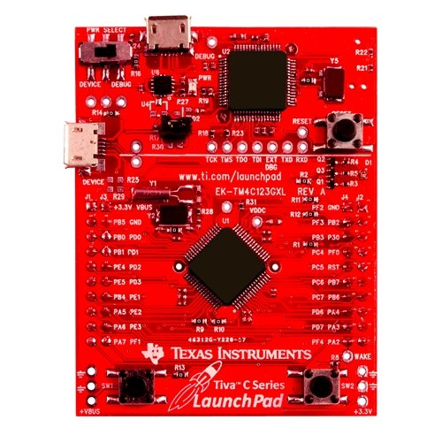

.. zephyr:board:: tm4c123gxl

Overview
********

The TM4C123GXL LaunchPad Evaluation Kit is a low-cost development platform for
TI Tiva C Series TM4C123GH6PM microcontrollers. It features a high-performance
ARM Cortex-M4F core running at 80 MHz with 256 KB flash and 32 KB SRAM.

The TM4C123GH6PM microcontroller includes:

* Core.

  * ARM Cortex-M4F with FPU, 80 MHz.

  * Nested Vectored Interrupt Controller (NVIC).

  * Memory Protection Unit (MPU).

* Memory.

  * 256 KB single-cycle flash (up to 40 MHz).

  * 32 KB single-cycle SRAM.

  * 2 KB EEPROM.

* Communication.

  * Eight UARTs.

  * Four SSI/SPI modules.

  * Four I2C modules.

  * Two CAN 2.0 A/B controllers.

  * USB 2.0 OTG/Host/Device (Full-Speed).

* Timers.

  * Six 64-bit general-purpose timers (twelve 32-bit).

  * Six wide timers.

  * Two watchdog timers.

* Other.

  * 16 PWM outputs.

  * System control and clocks with PLL.

Zephyr uses the ``tm4c123gxl`` board configuration for building for the
TM4C123GXL LaunchPad.

Hardware
********

The TM4C123GXL LaunchPad features:

- On-board In-Circuit Debug Interface (ICDI) for programming and debugging
- USB Micro-B connector for debug and power
- Two user switches (SW1 on PF4, SW2 on PF0)
- RGB LED (Red on PF1, Blue on PF2, Green on PF3)
- Reset switch
- Boosterpack-compatible headers exposing most MCU pins

Details on the TM4C123GXL LaunchPad can be found on the
`TI TM4C123GXL Product Page`_.

.. _TI TM4C123GXL Product Page:
   https://www.ti.com/tool/EK-TM4C123GXL

Supported Features
==================

.. zephyr:board-supported-hw::

Connections and IOs
===================

UART
----

The TM4C123GXL has 8 UART modules. UART0 is connected to the on-board ICDI
virtual COM port via PA0 (RX) and PA1 (TX).

+-------+----------+----------+
| UART  | RX Pin   | TX Pin   |
+=======+==========+==========+
| UART0 | PA0      | PA1      |
+-------+----------+----------+
| UART1 | PB0      | PB1      |
+-------+----------+----------+

Building and Flashing
*********************

Building
========

Follow the :ref:`getting_started` instructions for Zephyr application development.

For example, to build the Hello World application for the TM4C123GXL LaunchPad:

.. zephyr-app-commands::
   :zephyr-app: samples/hello_world
   :board: tm4c123gxl
   :goals: build

Flashing
========

The TM4C123GXL uses the on-board TI ICDI interface for flashing via OpenOCD.

.. zephyr-app-commands::
   :zephyr-app: samples/hello_world
   :board: tm4c123gxl
   :goals: flash

Debugging
=========

.. zephyr-app-commands::
   :zephyr-app: samples/hello_world
   :board: tm4c123gxl
   :goals: debug

Console
=======

The UART0 console is available through the on-board ICDI virtual COM port.
Connect to the serial port at **115200 8N1**.

On Linux:

.. code-block:: console

   $ screen /dev/ttyACM0 115200

References
**********

- `TM4C123GH6PM Datasheet <https://www.ti.com/lit/ds/symlink/tm4c123gh6pm.pdf>`_
- `TM4C123GXL LaunchPad User Guide <https://www.ti.com/lit/ug/spmu296/spmu296.pdf>`_
- `TivaWare Peripheral Driver Library <https://www.ti.com/tool/SW-TM4C>`_
