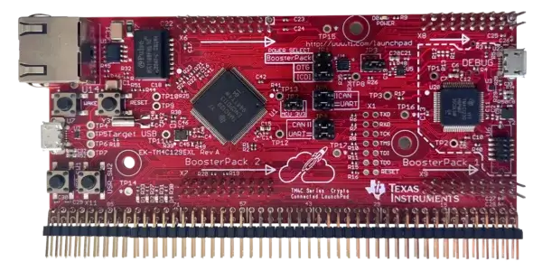

.. zephyr:board:: tm4c129exl

Overview
********

The EK-TM4C129EXL Crypto Connected LaunchPad is an evaluation board for the TI
TM4C129ENCPDT microcontroller. It has an ARM Cortex-M4F core running at up to
120 MHz, 1 MB of flash, and 256 KB of SRAM.

The TM4C129ENCPDT microcontroller includes:

* Core.

  * ARM Cortex-M4F with FPU, up to 120 MHz.

  * Nested Vectored Interrupt Controller (NVIC).

  * Memory Protection Unit (MPU).

* Memory.

  * 1 MB flash.

  * 256 KB SRAM.

  * 6 KB EEPROM.

* Communication.

  * Eight UARTs.

  * Four QSSI/QSPI modules.

  * Ten I2C modules.

  * Two CAN 2.0 A/B controllers.

  * USB 2.0 OTG/Host/Device. High-speed operation requires an
    external USB PHY.

  * Integrated 10/100 Ethernet MAC and PHY.

* Timers.

  * Eight 16/32-bit general-purpose timer blocks.

  * Two watchdog timers.

  * Eight PWM outputs.

  * One quadrature encoder interface (QEI) module.

* Analog.

  * Two 12-bit ADC modules.

* Other.

  * Hardware cryptography accelerators.

  * A 32-channel uDMA controller.

  * A hibernation module.

Hardware
********

The EK-TM4C129EXL features:

- On-board In-Circuit Debug Interface (ICDI) for programming and debugging
- Two user switches: SW1 on PJ0, SW2 on PJ1.
- Four user LEDs: D1 on PN1, D2 on PN0, D3 on PF4, and D4 on PF0.
  D3 and D4 are shared with the Ethernet peripheral.
- Reset and wake switches.
- 10/100 Ethernet connector.
- A debug USB Micro-B connector for the ICDI and board power.
- A target USB Micro-A/B connector for the microcontroller's USB interface.
  It can also supply board power.
- A JP1 jumper to select the board's power source.
- Two BoosterPack XL expansion sites.

See the `TI EK-TM4C129EXL product page
<https://www.ti.com/tool/EK-TM4C129EXL>`_ for board documentation.

Supported Features
==================

The following Zephyr features are currently supported on the EK-TM4C129EXL:

.. zephyr:board-supported-hw::

The TM4C129ENCPDT contains additional peripherals which are not yet
enabled by the current Zephyr board support.

Connections and IOs
===================

UART
----

The microcontroller has eight UART modules. With JP4 and JP5 in their
default horizontal positions, UART0 is connected to the on-board ICDI
virtual serial port. UART1 is available on the X11 breadboard expansion
pads.

Moving JP4 and JP5 to the CAN-enabled vertical positions changes the ICDI
virtual serial port connection from UART0 to UART2.

+-------+--------+--------+--------------+--------------+
| UART  | RX pin | TX pin | X11 RX pad   | X11 TX pad   |
+=======+========+========+==============+==============+
| UART0 | PA0    | PA1    | 74           | 76           |
+-------+--------+--------+--------------+--------------+
| UART1 | PB0    | PB1    | 58           | 60           |
+-------+--------+--------+--------------+--------------+
| UART2 | PD4    | PD5    | 40           | 38           |
+-------+--------+--------+--------------+--------------+

Building and Flashing
*********************

Building
========

Follow the :ref:`getting_started` instructions for Zephyr application development.

For example, to build the Hello World application for the EK-TM4C129EXL:

.. zephyr-app-commands::
   :zephyr-app: samples/hello_world
   :board: tm4c129exl/ti_tm4c129encpdt
   :goals: build

Flashing
========

The EK-TM4C129EXL uses the on-board TI ICDI interface for flashing via OpenOCD.

.. zephyr-app-commands::
   :zephyr-app: samples/hello_world
   :board: tm4c129exl/ti_tm4c129encpdt
   :goals: flash

Debugging
=========

The on-board ICDI provides a JTAG debug connection to the TM4C129ENCPDT.
OpenOCD is used by the Zephyr board configuration for flashing and debugging.

Flashing through the ICDI using OpenOCD is supported. Debugging through
``west debug`` has not yet been validated for this board configuration.

An external JTAG debug probe can also be connected through the
board's ARM 10-pin connector.

Console
=======

With JP4 and JP5 in their default horizontal position, the UART0 console is
available through the on-board ICDI virtual COM port. Connect to the serial
port at **115200 8N1**.

On Linux:

.. code-block:: console

   $ screen /dev/ttyACM0 115200

References
**********

- `TM4C129ENCPDT Datasheet <https://www.ti.com/lit/ds/symlink/tm4c129encpdt.pdf>`_
- `EK-TM4C129EXL User Guide <https://www.ti.com/lit/ug/spmu372a/spmu372a.pdf>`_
- `TivaWare Peripheral Driver Library <https://www.ti.com/tool/SW-TM4C>`_
