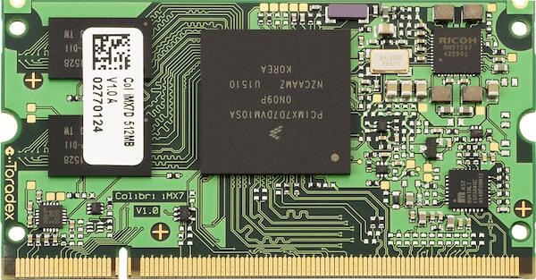

.. _colibri_imx7d:

NXP i.MX 7 Computer on Module - Colibri iMX7
############################################

Overview
********

The i.MX7 SoC is a Hybrid multi-core processor composed by Single/Dual Cortex A7
core and Single Cortex M4 core.
Zephyr was ported to run on the M4 core. In a later release, it will also
communicate with the A7 core (running Linux) via RPmsg.

Hardware
********

- i.MX7 Single/Dual Cortex A7 (800MHz/1.0GHz) core and Single Cortex M4 (200MHz) core

- Memory

  - RAM -> A7: 256MB, 512MB and 1GB
  - RAM -> M4: 3x32KB (TCML, TCMU, OCRAM_S), 1x128KB (OCRAM) and 1x256MB (DDR)
  - Flash -> A7: 4Gb eMMC and 512Mb NAND

- Display

  - RGB 1920x1080x24bpp
  - 4-wire Resistive touch

- Multimedia

  - 1x Camera Parallel Interface
  - 1x Analog Audio Line in (Stereo)
  - 1x Analog Audio Mic in (Mono)
  - 1x Analog Audio Headphone out (Stereo)

- Connectivity

  - USB 2.0 OTG (High Speed)
  - USB 2.0 host (High Speed)
  - 10/100 Mbit/s Ethernet PHY
  - 4x I2C
  - 4x SPI
  - 7x UART
  - 1x IrDA
  - 20x PWM
  - Up to 125 GPIO
  - 4x Analog Input (12 Bit)
  - 2x SDIO/SD/MMC (8 Bit)
  - 2x CAN

For more information about the i.MX	7 SoC, Colibri iMX7 Computer on Module
and Colibri Evaluation Board, see these references:

- `i.MX 7 Series Website`_
- `i.MX 7 Dual Datasheet`_
- `i.MX 7 Dual Reference Manual`_
- `Colibri iMX7 Website`_
- `Colibri iMX7 User Guide`_
- `Colibri iMX7 Datasheet`_
- `Colibri Evaluation Board Website`_
- `Colibri Evaluation Board Datasheet`_

Supported Features
==================

The Colibri iMX7D Computer on Module with Colibri Evaluation Board configuration
supports the following hardware features on the Cortex M4 Core:

+-----------+------------+-------------------------------------+
| Interface | Controller | Driver/Component                    |
+===========+============+=====================================+
| NVIC      | on-chip    | nested vector interrupt controller  |
+-----------+------------+-------------------------------------+
| SYSTICK   | on-chip    | systick                             |
+-----------+------------+-------------------------------------+
| GPIO      | on-chip    | gpio                                |
+-----------+------------+-------------------------------------+
| I2C       | on-chip    | i2c                                 |
+-----------+------------+-------------------------------------+
| PWM       | on-chip    | pwm                                 |
+-----------+------------+-------------------------------------+
| UART      | on-chip    | serial port-polling;                |
|           |            | serial port-interrupt               |
+-----------+------------+-------------------------------------+

The default configuration can be found in the defconfig file:

	:zephyr_file:`boards/toradex/colibri_imx7d/colibri_imx7d_mcimx7d_m4_defconfig`

Other hardware features are not currently supported by the port.

Connections and IOs
===================

The Colibri iMX7D Computer on Module with Colibri Evaluation Board
was tested with the following pinmux controller configuration.

+---------------+-----------------+---------------------------+
| Board Name    | SoC Name        | Usage                     |
+===============+=================+===========================+
| UART_B RXD    | UART2_TXD       | UART Console              |
+---------------+-----------------+---------------------------+
| UART_B TXD    | UART2_RXD       | UART Console              |
+---------------+-----------------+---------------------------+
| SODIMM_135    | GPIO1_IO02      | LED0                      |
+---------------+-----------------+---------------------------+
| SODIMM_133    | GPIO2_IO26      | SW0                       |
+---------------+-----------------+---------------------------+
| SODIMM_194    | I2C4_SDA        | I2C_SDA                   |
+---------------+-----------------+---------------------------+
| SODIMM_196    | I2C4_SCL        | I2C_SCL                   |
+---------------+-----------------+---------------------------+
| SODIMM_59     | PWM1/GPIO1_IO08 | PWM                       |
+---------------+-----------------+---------------------------+

System Clock
============

The M4 Core is configured to run at a 200 MHz clock speed.

Serial Port
===========

The iMX7D SoC has seven UARTs. The number 2 is configured for the console and
the remaining are not used/tested.

Programming and Debugging
*************************

The Colibri iMX7D doesn't have QSPI flash for the M4 and it needs to be started by
the A7 core. The A7 core is responsible to load the M4 binary application into the
RAM, put the M4 in reset, set the M4 Program Counter and Stack Pointer, and get
the M4 out of reset.
The A7 can perform these steps at bootloader level or after the Linux system has
booted.

The M4 can use up to 5 different RAMs. These are the memory mapping for A7 and M4:

+------------+-----------------------+------------------------+-----------------------+----------------------+
| Region     | Cortex-A7             | Cortex-M4 (System Bus) | Cortex-M4 (Code Bus)  | Size                 |
+============+=======================+========================+=======================+======================+
| DDR        | 0x80000000-0xFFFFFFFF | 0x80000000-0xDFFFFFFF  | 0x10000000-0x1FFEFFFF | 2048MB (less for M4) |
+------------+-----------------------+------------------------+-----------------------+----------------------+
| OCRAM      | 0x00900000-0x0091FFFF | 0x20200000-0x2021FFFF  | 0x00900000-0x0091FFFF | 128KB                |
+------------+-----------------------+------------------------+-----------------------+----------------------+
| TCMU       | 0x00800000-0x00807FFF | 0x20000000-0x20007FFF  |                       | 32KB                 |
+------------+-----------------------+------------------------+-----------------------+----------------------+
| TCML       | 0x007F8000-0x007FFFFF |                        | 0x1FFF8000-0x1FFFFFFF | 32KB                 |
+------------+-----------------------+------------------------+-----------------------+----------------------+
| OCRAM_S    | 0x00180000-0x00187FFF | 0x20180000-0x20187FFF  | 0x00000000-0x00007FFF | 32KB                 |
+------------+-----------------------+------------------------+-----------------------+----------------------+
| QSPI Flash |                       |                        | 0x08000000-0x0BFFFFFF | 64MB                 |
+------------+-----------------------+------------------------+-----------------------+----------------------+

References
==========

- `i.MX 7 Dual Reference Manual`_ from page 190 (section 2.1.2 and 2.1.3)
- `Toradex Wiki`_

At compilation time you have to choose which RAM will be used. This configuration is
done in the file :zephyr_file:`boards/toradex/colibri_imx7d/colibri_imx7d_mcimx7d_m4.dts`
with "zephyr,flash" (when CONFIG_XIP=y) and "zephyr,sram"
properties. The available configurations are:

.. code-block:: none

   "zephyr,flash"
   - &ddr_code
   - &tcml_code
   - &ocram_code
   - &ocram_s_code
   - &ocram_pxp_code
   - &ocram_epdc_code

   "zephyr,sram"
   - &ddr_sys
   - &tcmu_sys
   - &ocram_sys
   - &ocram_s_sys
   - &ocram_pxp_sys
   - &ocram_epdc_sys

Below you will find the instructions to load and run Zephyr on M4 from A7 using u-boot.

Copy the compiled zephyr.bin to the first EXT partition of the SD card and plug into the
board. Power it up and stop the u-boot execution.
Set the u-boot environment variables and run the zephyr.bin from the appropriated memory
configured in the Zephyr compilation:

.. code-block:: console

   setenv bootm4 'ext4load mmc 0:1 $m4addr $m4fw && dcache flush && bootaux $m4addr'
   # TCML
   setenv m4tcml 'setenv m4fw zephyr.bin; setenv m4addr 0x007F8000'
   setenv bootm4tcml 'run m4tcml && run bootm4'
   run bootm4tcml
   # TCMU
   setenv m4tcmu 'setenv m4fw zephyr.bin; setenv m4addr 0x00800000'
   setenv bootm4tcmu 'run m4tcmu && run bootm4'
   run bootm4tcmu
   # OCRAM
   setenv m4ocram 'setenv m4fw zephyr.bin; setenv m4addr 0x00900000'
   setenv bootm4ocram 'run m4ocram && run bootm4'
   run bootm4ocram
   # OCRAM_S
   setenv m4ocrams 'setenv m4fw zephyr.bin; setenv m4addr 0x00180000'
   setenv bootm4ocrams 'run m4ocrams && run bootm4'
   run bootm4ocrams
   # DDR
   setenv m4ddr 'setenv m4fw zephyr.bin; setenv m4addr 0x80000000'
   setenv bootm4ddr 'run m4ddr && run bootm4'
   run bootm4ddr

Debugging
=========

Download and install `J-Link Tools`_ and `NXP iMX7D Connect CortexM4.JLinkScript`_.

To run Zephyr Binary using J-Link create the following script in order to
get the Program Counter and Stack Pointer from zephyr.bin.

get-pc-sp.sh:

.. code-block:: console

   #!/bin/sh

   firmware=$1

   pc=$(od -An -N 8 -t x4 $firmware | awk '{print $2;}')
   sp=$(od -An -N 8 -t x4 $firmware | awk '{print $1;}')

   echo pc=$pc
   echo sp=$sp

Get the SP and PC from firmware binary: ``./get-pc-sp.sh zephyr.bin``

.. code-block:: console

   pc=00900f01
   sp=00905020

Plug in the J-Link into the board and PC and run the J-Link command line tool:

.. code-block:: console

   /usr/bin/JLinkExe -device Cortex-M4 -if JTAG -speed 4000 -autoconnect 1 -jtagconf -1,-1 -jlinkscriptfile iMX7D_Connect_CortexM4.JLinkScript

The following steps are necessary to run the zephyr.bin:
1. Put the M4 core in reset
2. Load the binary in the appropriate addr (TMCL, TCMU, OCRAM, OCRAM_S or DDR)
3. Set PC (Program Counter)
4. Set SP (Stack Pointer)
5. Get the M4 core out of reset

Issue the following commands inside J-Link commander:

.. code-block:: console

   w4 0x3039000C 0xAC
   loadfile zephyr.bin,0x00900000
   w4 0x00180000 00900f01
   w4 0x00180004 00905020
   w4 0x3039000C 0xAA

With these mechanisms, applications for the ``colibri_imx7d/imx7d/m4`` board
configuration can be built and debugged in the usual way (see
:ref:`build_an_application` and :ref:`application_run` for more details).

References
==========

- `Loading Code on Cortex-M4 from Linux for the i.MX 6SoloX and i.MX 7Dual/7Solo Application Processors`_
- `J-Link iMX7D Instructions`_

.. _Colibri Evaluation Board Website:
   https://www.toradex.com/products/carrier-board/colibri-evaluation-carrier-board

.. _Colibri Evaluation Board Datasheet:
   https://docs.toradex.com/102284-colibri-evaluation-board-datasheet.pdf

.. _Colibri iMX7 Website:
   https://www.toradex.com/computer-on-modules/colibri-arm-family/nxp-freescale-imx7

.. _Colibri iMX7 User Guide:
   https://developer.toradex.com/products/colibri-imx7

.. _Colibri iMX7 Datasheet:
   https://docs.toradex.com/103125-colibri-arm-som-imx7-datasheet.pdf

.. _i.MX 7 Series Website:
   https://www.nxp.com/products/processors-and-microcontrollers/applications-processors/i.mx-applications-processors/i.mx-7-processors:IMX7-SERIES?fsrch=1&sr=1&pageNum=1

.. _i.MX 7 Dual Datasheet:
   https://www.nxp.com/docs/en/data-sheet/IMX7DCEC.pdf

.. _i.MX 7 Dual Reference Manual:
   https://www.nxp.com/webapp/Download?colCode=IMX7DRM

.. _J-Link Tools:
   https://www.segger.com/downloads/jlink/#J-LinkSoftwareAndDocumentationPack

.. _NXP iMX7D Connect CortexM4.JLinkScript:
   https://wiki.segger.com/images/8/86/NXP_iMX7D_Connect_CortexM4.JLinkScript

.. _Loading Code on Cortex-M4 from Linux for the i.MX 6SoloX and i.MX 7Dual/7Solo Application Processors:
   https://www.nxp.com/docs/en/application-note/AN5317.pdf

.. _J-Link iMX7D Instructions:
   https://wiki.segger.com/IMX7D

.. _Toradex Wiki:
   https://developer.toradex.com/knowledge-base/freertos-on-the-cortex-m4-of-a-colibri-imx7#Memory_areas
