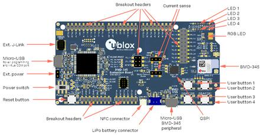
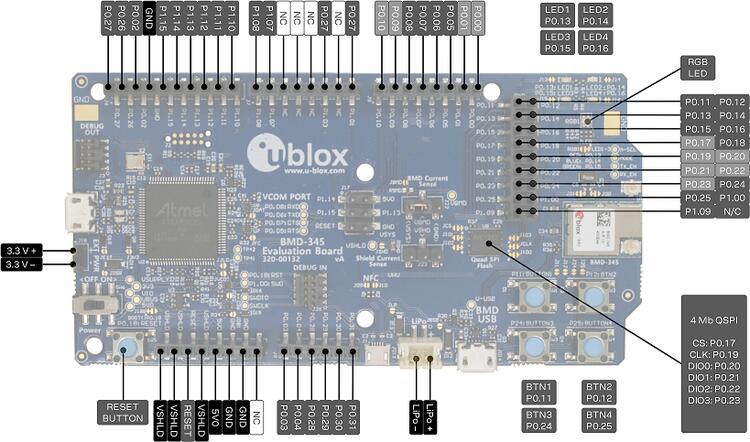

.. _ubx_bmd345eval_nrf52840:

u-blox EVK-BMD-34/38: BMD-345-EVAL
##################################

Overview
********

The BMD-345-EVALhardware provides support for the u-blox BMD-345
Bluetooth 5.0 modules, based on the Nordic Semiconductor nRF52840
ARM Cortex-M4F CPU and Skyworks RFX2411 Front End Module (FEM),
also known as a Power Amplifier / Low Noise Amplifier (PA/LNA).
Both support the following devices:

* :abbr:`ADC (Analog to Digital Converter)`
* CLOCK
* FLASH
* :abbr:`GPIO (General Purpose Input Output)`
* :abbr:`I2C (Inter-Integrated Circuit)`
* :abbr:`MPU (Memory Protection Unit)`
* :abbr:`NVIC (Nested Vectored Interrupt Controller)`
* :abbr:`PWM (Pulse Width Modulation)`
* RADIO (Bluetooth Low Energy and 802.15.4)
* :abbr:`RTC (nRF RTC System Clock)`
* Segger RTT (RTT Console)
* :abbr:`SPI (Serial Peripheral Interface)`
* :abbr:`UART (Universal asynchronous receiver-transmitter)`
* :abbr:`USB (Universal Serial Bus)`
* :abbr:`WDT (Watchdog Timer)`

     BMD-345-EVAL (Credit: ublox AG)

More information about the BMD-345-EVAL and BMD-345 module can be
found at the `u-blox website`_.

Hardware
********

The BMD-345 on the BMD-345-EVAL contains an internal high-frequency
oscillator at 32MHz. There is also a low frequency (slow)
oscillator of 32.768kHz. The BMD-345 does not include the slow
crystal; however, the BMD-345-EVAL does.

.. note::

	When targeting a custom design without a slow crystal, be sure
	to modify code to utilize the internal RC oscillator for the
	slow clock.

Front End Module
================

BMD-345 utilizes the Skyworks RFX2411 front end module (FEM).
The FEM provides higher output power and better sensitivity.

FEM pin assignments
-------------------

+-------------+--------------+----------+--------+----------+---------+
| GPIO Number | Signal Name  | Shutdown | Bypass | Transmit | Receive |
+=============+==============+==========+========+==========+=========+
| P1.05       | TX_EN        | Low      | Low    | High     | Low     |
+-------------+--------------+----------+--------+----------+---------+
| P1.06       | RX_EN        | Low      | Low    | Low      | High    |
+-------------+--------------+----------+--------+----------+---------+
| P1.04       | MODE         | Low      | High   | Low      | Low     |
+-------------+--------------+----------+--------+----------+---------+
| P1.02       | A_SEL        | Low      | Low    | Low      | Low     |
+-------------+--------------+----------+--------+----------+---------+

Supported Features
==================

The BMD-345-EVAL board configuration supports the following
hardware features:

+-----------+------------+----------------------+
| Interface | Controller | Driver/Component     |
+===========+============+======================+
| ADC       | on-chip    | adc                  |
+-----------+------------+----------------------+
| CLOCK     | on-chip    | clock_control        |
+-----------+------------+----------------------+
| FLASH     | on-chip    | flash                |
+-----------+------------+----------------------+
| GPIO      | on-chip    | gpio                 |
+-----------+------------+----------------------+
| I2C(M)    | on-chip    | i2c                  |
+-----------+------------+----------------------+
| MPU       | on-chip    | arch/arm             |
+-----------+------------+----------------------+
| NVIC      | on-chip    | arch/arm             |
+-----------+------------+----------------------+
| PWM       | on-chip    | pwm                  |
+-----------+------------+----------------------+
| RADIO     | on-chip    | Bluetooth,           |
|           |            | IEEE 802.15.4        |
+-----------+------------+----------------------+
| RTC       | on-chip    | system clock         |
+-----------+------------+----------------------+
| RTT       | Segger     | console              |
+-----------+------------+----------------------+
| SPI(M/S)  | on-chip    | spi                  |
+-----------+------------+----------------------+
| UART      | on-chip    | serial               |
+-----------+------------+----------------------+
| USB       | on-chip    | usb                  |
+-----------+------------+----------------------+
| WDT       | on-chip    | watchdog             |
+-----------+------------+----------------------+

Other hardware features have not been enabled yet for this board.
See the `u-blox website`_ for a complete list of BMD-345-EVAL
hardware features.

Connections and IOs
===================

LED
---

* LED1 (red) = P0.13
* LED2 (red) = P0.14
* LED3 (green) = P0.15
* LED4 (green) = P0.16
* D5 (red) = OB LED 1
* D6 (green) = OB LED 2

Push buttons
------------

* BUTTON1 = SW1 = P0.11
* BUTTON2 = SW2 = P0.12
* BUTTON3 = SW3 = P0.24
* BUTTON4 = SW4 = P0.25
* BOOT = SW5 = boot/reset

External Connectors
-------------------

.. note::
	The pin numbers noted below are referenced to
	the pin 1 markings on the BMD-340-EVAL or
	BMD-341-EVAL for each header

J-Link Prog Connector (J2)

+-------+--------------+
| PIN # | Signal Name  |
+=======+==============+
| 1     | VDD          |
+-------+--------------+
| 2     | IMCU_TMSS    |
+-------+--------------+
| 3     | GND          |
+-------+--------------+
| 4     | IMCU_TCKS    |
+-------+--------------+
| 5     | V5V          |
+-------+--------------+
| 6     | IMCU_TDOS    |
+-------+--------------+
| 7     | Cut off      |
+-------+--------------+
| 8     | IMCU_TDIS    |
+-------+--------------+
| 9     | Cut off      |
+-------+--------------+
| 10    | IMCU_RESET   |
+-------+--------------+

Debug OUT (J3)

+-------+----------------+
| PIN # | Signal Name    |
+=======+================+
| 1     | EXT_VTG        |
+-------+----------------+
| 2     | EXT_SWDIO      |
+-------+----------------+
| 3     | GND            |
+-------+----------------+
| 4     | EXT_SWDCLK     |
+-------+----------------+
| 5     | GND            |
+-------+----------------+
| 6     | EXT_SWO        |
+-------+----------------+
| 7     | N/C            |
+-------+----------------+
| 8     | N/C            |
+-------+----------------+
| 9     | EXT_GND_DETECT |
+-------+----------------+
| 10    | EXT_RESET      |
+-------+----------------+

Debug IN (J26)

+-------+----------------+
| PIN # | Signal Name    |
+=======+================+
| 1     | BMD-340_VCC    |
+-------+----------------+
| 2     | BMD-340_SWDIO  |
+-------+----------------+
| 3     | GND            |
+-------+----------------+
| 4     | BMD-340_SWDCLK |
+-------+----------------+
| 5     | GND            |
+-------+----------------+
| 6     | BMD-340_SWO    |
+-------+----------------+
| 7     | N/C            |
+-------+----------------+
| 8     | N/C            |
+-------+----------------+
| 9     | GND            |
+-------+----------------+
| 10    | BMD-340_RESET  |
+-------+----------------+

Auxiliary (J9)

+-------+----------------+
| PIN # | Signal Name    |
+=======+================+
| 1     | P0.10 / NFC2   |
+-------+----------------+
| 2     | P0.09 / NFC1   |
+-------+----------------+
| 3     | P0.08          |
+-------+----------------+
| 4     | P0.07          |
+-------+----------------+
| 5     | P0.06          |
+-------+----------------+
| 6     | P0.05 / AIN3   |
+-------+----------------+
| 7     | P0.01 / XL2    |
+-------+----------------+
| 8     | P0.00 / XL1    |
+-------+----------------+

Auxiliary (J10)

+-------+-------------------+
| PIN # | Signal Name       |
+=======+===================+
| 1     | P0.11 / TRACED[2] |
+-------+-------------------+
| 2     | P0.12 / TRACED[1] |
+-------+-------------------+
| 3     | P0.13             |
+-------+-------------------+
| 4     | P0.14             |
+-------+-------------------+
| 5     | P0.15             |
+-------+-------------------+
| 6     | P0.16             |
+-------+-------------------+
| 7     | P0.17 / QSPI_CS   |
+-------+-------------------+
| 8     | P0.18 / RESET     |
+-------+-------------------+
| 9     | P0.19 / QSPI_CLK  |
+-------+-------------------+
| 10    | P0.20 / QSPI_D0   |
+-------+-------------------+
| 11    | P0.21 / QSPI_D1   |
+-------+-------------------+
| 12    | P0.22 / QSPI_D2   |
+-------+-------------------+
| 13    | P0.23 / QSPI_D3   |
+-------+-------------------+
| 14    | P0.24             |
+-------+-------------------+
| 15    | P0.25             |
+-------+-------------------+
| 16    | P1.00 / TRACED[0] |
+-------+-------------------+
| 17    | P1.09 / TRACED[3] |
+-------+-------------------+
| 18    | No connection     |
+-------+-------------------+

Arduino Headers
---------------

Power (J5)

+-------+--------------+-------------------------+
| PIN # | Signal Name  | BMD-345 Functions       |
+=======+==============+=========================+
| 1     | VSHLD        | N/A                     |
+-------+--------------+-------------------------+
| 2     | VSHLD        | N/A                     |
+-------+--------------+-------------------------+
| 3     | RESET        | P0.18 / RESET           |
+-------+--------------+-------------------------+
| 4     | VSHLD        | N/A                     |
+-------+--------------+-------------------------+
| 5     | V5V          | N/A                     |
+-------+--------------+-------------------------+
| 6     | GND          | N/A                     |
+-------+--------------+-------------------------+
| 7     | GND          | N/A                     |
+-------+--------------+-------------------------+
| 8     | N/C          | N/A                     |
+-------+--------------+-------------------------+

Analog in (J8)

+-------+--------------+-------------------------+
| PIN # | Signal Name  | BMD-345 Functions       |
+=======+==============+=========================+
| 1     | A0           | P0.03 / AIN1            |
+-------+--------------+-------------------------+
| 2     | A1           | P0.04 / AIN2            |
+-------+--------------+-------------------------+
| 3     | A2           | P0.28 / AIN4            |
+-------+--------------+-------------------------+
| 4     | A3           | P0.29 / AIN5            |
+-------+--------------+-------------------------+
| 5     | A4           | P0.30 / AIN6            |
+-------+--------------+-------------------------+
| 6     | A5           | P0.31 / AIN7            |
+-------+--------------+-------------------------+

Digital I/O (J7)

+-------+--------------+-------------------------+
| PIN # | Signal Name  | BMD-345 Functions       |
+=======+==============+=========================+
| 1     | D7           | P1.08                   |
+-------+--------------+-------------------------+
| 2     | D6           | P1.07                   |
+-------+--------------+-------------------------+
| 3     | N/C          | N/A                     |
+-------+--------------+-------------------------+
| 4     | N/C          | N/A                     |
+-------+--------------+-------------------------+
| 5     | N/C          | N/A                     |
+-------+--------------+-------------------------+
| 6     | D2           | P1.03                   |
+-------+--------------+-------------------------+
| 7     | N/C          | N/A                     |
+-------+--------------+-------------------------+
| 8     | D0 (RX)      | P1.01                   |
+-------+--------------+-------------------------+

Digital I/O (J6)

+-------+--------------+-------------------------+
| PIN # | Signal Name  | BMD-345 Functions       |
+=======+==============+=========================+
| 1     | SCL          | P0.27                   |
+-------+--------------+-------------------------+
| 2     | SDA          | P0.26                   |
+-------+--------------+-------------------------+
| 3     | AREF         | P0.02 / AIN0            |
+-------+--------------+-------------------------+
| 4     | GND          | N/A                     |
+-------+--------------+-------------------------+
| 5     | D13 (SCK)    | P1.15                   |
+-------+--------------+-------------------------+
| 6     | D12 (MISO)   | P1.14                   |
+-------+--------------+-------------------------+
| 7     | D11 (MOSI)   | P1.13                   |
+-------+--------------+-------------------------+
| 8     | D10 (SS)     | P1.12                   |
+-------+--------------+-------------------------+
| 9     | D9           | P1.11                   |
+-------+--------------+-------------------------+
| 10    | D8           | P1.10                   |
+-------+--------------+-------------------------+

J11

+-------+--------------+-------------------------+
| PIN # | Signal Name  | BMD-345 Functions       |
+=======+==============+=========================+
| 1     | D12 (MISO)   | P0.14                   |
+-------+--------------+-------------------------+
| 2     | V5V          | N/A                     |
+-------+--------------+-------------------------+
| 3     | D13 (SCK)    | P0.15                   |
+-------+--------------+-------------------------+
| 4     | D11 (MOSI)   | P0.13                   |
+-------+--------------+-------------------------+
| 5     | RESET        | N/A                     |
+-------+--------------+-------------------------+
| 6     | N/A          | N/A                     |
+-------+--------------+-------------------------+

Programming and Debugging
*************************

Applications for the BMD-345-EVAL board
configurations can be built and flashed in the usual way
(see :ref:`build_an_application` and :ref:`application_run`
for more details); however, the standard debugging targets
are not currently available.

Flashing
========

Follow the instructions in the :ref:`nordic_segger` page to install
and configure all the necessary software. Further information can be
found in :ref:`nordic_segger_flashing`. Then build and flash
applications as usual (see :ref:`build_an_application` and
:ref:`application_run` for more details).

Here is an example for the :ref:`hello_world` application.

First, run your favorite terminal program to listen for output.

.. code-block:: console

   $ minicom -D <tty_device> -b 115200

Replace :code:`<tty_device>` with the port where the BMD-345-EVAL
can be found. For example, under Linux, :code:`/dev/ttyACM0`.

Then build and flash the application in the usual way.

.. zephyr-app-commands::
   :zephyr-app: samples/hello_world
   :board: ubx_bmd345eval/nrf52840
   :goals: build flash

Debugging
=========

Refer to the :ref:`nordic_segger` page to learn about debugging
u-blox boards with a Segger J-LINK-OB IC.

Testing the LEDs and buttons in the BMD-345-EVAL
*****************************************************************

There are 2 samples that allow you to test that the buttons
(switches) and LEDs on the board are working properly with Zephyr:

.. code-block:: console

   samples/basic/blinky
   samples/basic/button

You can build and flash the examples to make sure Zephyr is running
correctly on your board. The button and LED definitions can be found
in
:zephyr_file:`boards/u-blox/ubx_bmd345eval/ubx_bmd345eval_nrf52840.dts`.

Using UART1
***********

The following approach can be used when an application needs to use
more than one UART for connecting peripheral devices:

1. Add device tree overlay file to the main directory of your
   application:

   .. code-block:: devicetree

      &pinctrl {
         uart1_default: uart1_default {
            group1 {
               psels = <NRF_PSEL(UART_TX, 0, 14)>,
                       <NRF_PSEL(UART_RX, 0, 16)>;
            };
         };
         /* required if CONFIG_PM_DEVICE=y */
         uart1_sleep: uart1_sleep {
            group1 {
               psels = <NRF_PSEL(UART_TX, 0, 14)>,
                       <NRF_PSEL(UART_RX, 0, 16)>;
               low-power-enable;
            };
         };
      };

      &uart1 {
        compatible = "nordic,nrf-uarte";
        current-speed = <115200>;
        status = "okay";
        pinctrl-0 = <&uart1_default>;
        pinctrl-1 = <&uart1_sleep>;
        pinctrl-names = "default", "sleep";
      };

   In the overlay file above, pin P0.16 is used for RX and P0.14 is
   used for TX

2. Use the UART1 as ``DEVICE_DT_GET(DT_NODELABEL(uart1))``

Overlay file naming
===================

The file has to be named ``<board>.overlay`` and placed in the app
main directory to be picked up automatically by the device tree
compiler.

Selecting the pins
==================

Pins can be configured in the board pinctrl file. To see the available mappings,
open the data sheet for the BMD-345 at the `u-blox website`_, Section 2
'Pin definition'. In the table 3 select the pins marked 'GPIO'.
Note that pins marked as 'Standard drive, low frequency I/O only
(<10 kH' can only be used in under-10KHz applications.
They are not suitable for 115200 speed of UART.

.. note:
  Pins are defined according to the "nRF52" pin number, not the module
  pad number.

References
**********

.. target-notes::

.. _u-blox website: https://www.u-blox.com/en/product/bmd-34-series-open-cpu
