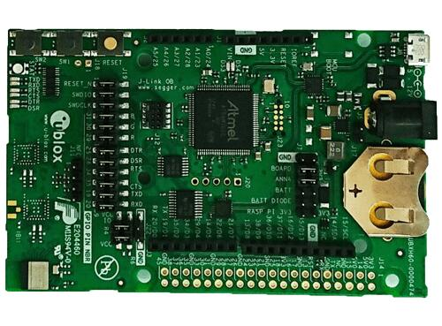

.. _ubx_evkannab1_nrf52832:

u-blox EVK-ANNA-B11x
####################

Overview
********

The u-blox ANNA-B1 Evaluation Kit hardware is a Bluetooth low energy
module based on the Nordic Semiconductor nRF52832 ARM Cortex-M4F CPU
and has support for the following features:

* :abbr:`ADC (Analog to Digital Converter)`
* CLOCK
* FLASH
* :abbr:`GPIO (General Purpose Input Output)`
* :abbr:`I2C (Inter-Integrated Circuit)`
* :abbr:`MPU (Memory Protection Unit)`
* :abbr:`NVIC (Nested Vectored Interrupt Controller)`
* :abbr:`PWM (Pulse Width Modulation)`
* RADIO (Bluetooth Low Energy)
* :abbr:`RTC (nRF RTC System Clock)`
* Segger RTT (RTT Console)
* :abbr:`SPI (Serial Peripheral Interface)`
* :abbr:`UART (Universal asynchronous receiver-transmitter)`
* :abbr:`WDT (Watchdog Timer)`

	EVK ANNA-B1

More information about the ANNA-B1 module and the EVK-ANNA-B1
can be found at `ANNA-B1 product page`_ and
`EVK-ANNA-B1 product page`_.

Supported Features
==================

The ubx_evkannab1_nrf52832 board configuration supports the
following hardware features:

+-----------+------------+----------------------+
| Interface | Controller | Driver/Component     |
+===========+============+======================+
| ADC       | on-chip    | adc                  |
+-----------+------------+----------------------+
| CLOCK     | on-chip    | clock_control        |
+-----------+------------+----------------------+
| FLASH     | on-chip    | flash                |
+-----------+------------+----------------------+
| GPIO      | on-chip    | gpio                 |
+-----------+------------+----------------------+
| I2C(M)    | on-chip    | i2c                  |
+-----------+------------+----------------------+
| MPU       | on-chip    | arch/arm             |
+-----------+------------+----------------------+
| NVIC      | on-chip    | arch/arm             |
+-----------+------------+----------------------+
| PWM       | on-chip    | pwm                  |
+-----------+------------+----------------------+
| RADIO     | on-chip    | Bluetooth Low Energy |
+-----------+------------+----------------------+
| RTC       | on-chip    | system clock         |
+-----------+------------+----------------------+
| RTT       | Segger     | console              |
+-----------+------------+----------------------+
| SPI(M/S)  | on-chip    | spi                  |
+-----------+------------+----------------------+
| UART      | on-chip    | serial               |
+-----------+------------+----------------------+
| WDT       | on-chip    | watchdog             |
+-----------+------------+----------------------+

Other hardware features have not been enabled yet for this board.
See `EVK-ANNA-B1 product page`_ and `ANNA-B1 Data Sheet`_
for a complete list of EVK ANNA-B1 hardware features.

Connections and IOs
===================

LED
---

* LED0 (red) = P0.27
* LED1 (green) = P0.25
* LED2 (blue) = P0.26

Push buttons
------------

* BUTTON1 = SW1 = P0.25
* BUTTON2 = SW2 = P0.24

General information on module pin numbering
-------------------------------------------

The numbering of the pins on the module and EVK do not follow the GPIO
numbering on the nRF52832 SoC. Please see the `ANNA-B1 Data Sheet`_ for
information on how to map ANNA-B1 pins to the pin numbering on the
nRF52832 SoC.

The reason for this is the u-blox module family concept where different
modules share the same pinout and can be interchanged.

Programming and Debugging
*************************

Applications for the ``ubx_evkannab1/nrf52832`` board configuration can be
built and flashed in the usual way (see :ref:`build_an_application`
and :ref:`application_run` for more details); however, the standard
debugging targets are not currently available.

Flashing
========

Build and flash applications as usual (see
:ref:`build_an_application` and :ref:`application_run` for more details).

Here is an example for the :ref:`hello_world` application.

Open a terminal program to the USB Serial Port installed when connecting
the board and listen for output.

Settings: 115200, 8N1, no flow control.

Then build and flash the application in the usual way.

.. zephyr-app-commands::
   :zephyr-app: samples/hello_world
   :board: ubx_evkannab1/nrf52832
   :goals: build flash

Debugging
=========

Refer to the :ref:`nordic_segger` page to learn about debugging boards
containing a Nordic Semiconductor chip with a Segger IC.

Testing the LEDs and buttons in the EVK NINA-B11x
*************************************************

There are 2 samples that allow you to test that the buttons (switches)
and LEDs on the board are working properly with Zephyr:

.. code-block:: console

   samples/basic/blinky
   samples/basic/button

You can build and flash the examples to make sure Zephyr is running
correctly on your board. The button and LED definitions can be found in
:zephyr_file:`boards/u-blox/ubx_evkannab1/ubx_evkannab1_nrf52832.dts`.

Note that the buttons on the EVK-ANNA-B1 are marked SW1 and SW2, which
are named sw0 and sw1 in the dts file.
Also note that the SW1 button and the green LED are connected on HW level.

References
**********

.. target-notes::

.. _ANNA-B1 product page: https://www.u-blox.com/en/product/anna-b112-open-cpu
.. _EVK-ANNA-B1 product page: https://www.u-blox.com/en/product/evk-anna-b112
.. _Nordic Semiconductor Infocenter: https://infocenter.nordicsemi.com
.. _J-Link Software and documentation pack: https://www.segger.com/jlink-software.html
.. _ANNA-B1 Data Sheet: https://www.u-blox.com/en/docs/UBX-18011707
