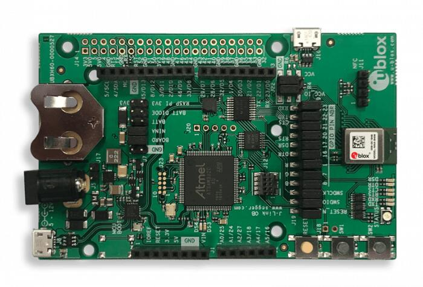

.. _ubx_ninab4_nrf52833:

u-blox EVK NINA-B40x
####################

Overview
********

The u-blox NINA-B4 Evaluation Kit hardware is a Bluetooth low energy
module based on the Nordic Semiconductor nRF52833 ARM Cortex-M4F CPU
and has support for the following features:

* :abbr:`ADC (Analog to Digital Converter)`
* CLOCK
* FLASH
* :abbr:`GPIO (General Purpose Input Output)`
* :abbr:`I2C (Inter-Integrated Circuit)`
* :abbr:`MPU (Memory Protection Unit)`
* :abbr:`NVIC (Nested Vectored Interrupt Controller)`
* :abbr:`PWM (Pulse Width Modulation)`
* RADIO (Bluetooth Low Energy)
* :abbr:`RTC (nRF RTC System Clock)`
* Segger RTT (RTT Console)
* :abbr:`SPI (Serial Peripheral Interface)`
* :abbr:`UART (Universal asynchronous receiver-transmitter)`
* :abbr:`USB (Universal Serial Bus)`
* :abbr:`WDT (Watchdog Timer)`

    EVK NINA-B4

More information about the NINA-B4 module and the EVK-NINA-B4 can be
found at `NINA-B40 product page`_ and `EVK-NINA-B4 product page`_.

Supported Features
==================

The ubx_evkninab4/nrf52833 board configuration supports the following
hardware features:

+-----------+------------+----------------------+
| Interface | Controller | Driver/Component     |
+===========+============+======================+
| ADC       | on-chip    | adc                  |
+-----------+------------+----------------------+
| CLOCK     | on-chip    | clock_control        |
+-----------+------------+----------------------+
| FLASH     | on-chip    | flash                |
+-----------+------------+----------------------+
| GPIO      | on-chip    | gpio                 |
+-----------+------------+----------------------+
| I2C(M)    | on-chip    | i2c                  |
+-----------+------------+----------------------+
| MPU       | on-chip    | arch/arm             |
+-----------+------------+----------------------+
| NVIC      | on-chip    | arch/arm             |
+-----------+------------+----------------------+
| PWM       | on-chip    | pwm                  |
+-----------+------------+----------------------+
| RADIO     | on-chip    | Bluetooth low energy |
+-----------+------------+----------------------+
| RTC       | on-chip    | system clock         |
+-----------+------------+----------------------+
| RTT       | Segger     | console              |
+-----------+------------+----------------------+
| SPI(M/S)  | on-chip    | spi                  |
+-----------+------------+----------------------+
| UART      | on-chip    | serial               |
+-----------+------------+----------------------+
| USB       | on-chip    | usb                  |
+-----------+------------+----------------------+
| WDT       | on-chip    | watchdog             |
+-----------+------------+----------------------+

Other hardware features have not been enabled yet for this board.
See `EVK-NINA-B4 product page`_ and `NINA-B40 Data Sheet`_
for a complete list of EVK NINA-B4 hardware features.

Connections and IOs
===================

LED
---

* LED0 (red) = P0.13
* LED1 (green) = P1.01
* LED2 (blue) = P1.00

Push buttons
------------

* BUTTON1 = SW1 = P1.01 (Shared with green LED)
* BUTTON2 = SW2 = P0.02

General information on module pin numbering
-------------------------------------------

The numbering of the pins on the module and EVK do not follow the GPIO
numbering on the nRF52833 SoC. Please see the `NINA-B40 Data Sheet`_ for
information on how to map NINA-B40 pins to the pin numbering on the
nRF52833 SoC.

The reason for this is the u-blox module family concept where different
modules share the same pinout and can be interchanged, see
`NINA module family Nested design`_.

Programming and Debugging
*************************

Applications for the ``ubx_evkninab4/nrf52833`` board configuration can be
built and flashed in the usual way (see :ref:`build_an_application`
and :ref:`application_run` for more details); however, the standard
debugging targets are not currently available.

Flashing
========

Build and flash applications as usual (see
:ref:`build_an_application` and :ref:`application_run` for more details)

Here is an example for the :ref:`hello_world` application.

Open a terminal program to the USB Serial Port installed when connecting
the board and listen for output.

Settings: 115200, 8N1, no flow control.

Then build and flash the application in the usual way.

.. zephyr-app-commands::
   :zephyr-app: samples/hello_world
   :board: ubx_evkninab4/nrf52833
   :goals: build flash

Debugging
=========

Refer to the :ref:`nordic_segger` page to learn about debugging  boards
containing a Nordic Semiconductor chip with a Segger IC.

Testing the LEDs and buttons in the EVK NINA-B40x
*************************************************

There are 2 samples that allow you to test that the buttons (switches)
and LEDs on the board are working properly with Zephyr:

.. code-block:: console

   samples/basic/blinky
   samples/basic/button

You can build and flash the examples to make sure Zephyr is running
correctly on your board. The button and LED definitions can be found in
:zephyr_file:`boards/ublox/ubx_evkninab4/ubx_evkninab4_nrf52833.dts`.

Note that the buttons on the EVK-NINA-B4 are marked SW1 and SW2, which
are named sw0 and sw1 in the dts file.
Also note that the SW1 button and the green LED are connected on HW level.

Using UART1
***********

The following approach can be used when an application needs to use
more than one UART for connecting peripheral devices:

1. Add device tree overlay file to the main directory of your application:

   .. code-block:: devicetree

      &pinctrl {
         uart1_default: uart1_default {
            group1 {
               psels = <NRF_PSEL(UART_TX, 0, 14)>,
                       <NRF_PSEL(UART_RX, 0, 16)>;
            };
         };
         /* required if CONFIG_PM_DEVICE=y */
         uart1_sleep: uart1_sleep {
            group1 {
               psels = <NRF_PSEL(UART_TX, 0, 14)>,
                       <NRF_PSEL(UART_RX, 0, 16)>;
               low-power-enable;
            };
         };
      };

      &uart1 {
        compatible = "nordic,nrf-uarte";
        current-speed = <115200>;
        status = "okay";
        pinctrl-0 = <&uart1_default>;
        pinctrl-1 = <&uart1_sleep>;
        pinctrl-names = "default", "sleep";
      };

   In the overlay file above, pin P0.16 is used for RX and P0.14 is used for TX

2. Use the UART1 as ``DEVICE_DT_GET(DT_NODELABEL(uart1))``

Overlay file naming
===================

The file has to be named ``<board>.overlay`` and placed in the app main directory to be
picked up automatically by the device tree compiler.

Selecting the pins
==================

Pins can be configured in the board pinctrl file. To see the available mappings,
open the data sheet for the NINA-B4 at `NINA-B40 Data Sheet`_, Section 3 'Pin definition'.
In the table 7 select the pins marked 'GPIO_xx'.  Note that pins marked as 'Radio sensitive pin'
can only be used in under-10KHz applications. They are not suitable for 115200 speed of UART.

.. note:
  Pins are defined according to the "nRF52" pin number, not the module pad number.

References
**********

.. target-notes::

.. _NINA-B40 product page: https://www.u-blox.com/en/product/nina-b40-series-open-cpu
.. _EVK-NINA-B4 product page: https://www.u-blox.com/en/product/evk-nina-b4
.. _Nordic Semiconductor Infocenter: https://infocenter.nordicsemi.com
.. _J-Link Software and documentation pack: https://www.segger.com/jlink-software.html
.. _NINA-B40 Data Sheet: https://www.u-blox.com/en/docs/UBX-19049405
.. _NINA module family Nested design: https://www.u-blox.com/en/docs/UBX-17065600
