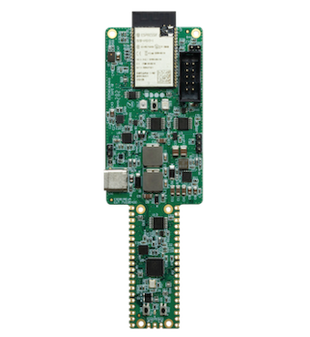

.. zephyr:board:: udoo_key

Overview
********

The UDOO KEY is an ESP32-based development board from UDOO based on the
Espressif ESP32 dual-core Xtensa LX6 SoC. It provides integrated Wi-Fi,
Bluetooth Classic, Bluetooth Low Energy (BLE), 16 MB SPI Flash, 8 MB
PSRAM, onboard user LEDs, and a BOOT push button.

   UDOO KEY development board.

Hardware
********

The UDOO KEY carries the following onboard peripherals:

* Blue user LED (GPIO32)
* Yellow user LED (GPIO33)
* BOOT button (GPIO0)
* USB-to-UART interface
* UEXT expansion connector

.. include:: ../../../espressif/common/soc-esp32-features.rst
   :start-after: espressif-soc-esp32-features

Supported Features
==================

.. zephyr:board-supported-hw::

System Requirements
*******************

.. include:: ../../../espressif/common/system-requirements.rst
   :start-after: espressif-system-requirements

Programming and Debugging
*************************

.. zephyr:board-supported-runners::

.. include:: ../../../espressif/common/building-flashing.rst
   :start-after: espressif-building-flashing

.. include:: ../../../espressif/common/board-variants.rst
   :start-after: espressif-board-variants

Debugging
=========

.. include:: ../../../espressif/common/openocd-debugging.rst
   :start-after: espressif-openocd-debugging

References
**********

.. target-notes::
