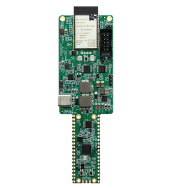

.. zephyr:board:: udoo_key

########
UDOO KEY
########

Overview
********

The UDOO KEY is a dual-microcontroller development board that combines an
Espressif ESP32 and a Raspberry Pi RP2040 on a single PCB. The two
microcontrollers are independently programmable and can be used separately or
together for heterogeneous embedded applications.

The board provides:

* Espressif ESP32 wireless MCU
* Raspberry Pi RP2040 dual-core Arm Cortex-M0+
* 8 MB external QSPI Flash for the RP2040
* USB connectivity
* UART
* SPI
* I2C
* PWM
* ADC
* DMA
* Watchdog Timer

   UDOO KEY development board.

Supported SoCs
**************

Zephyr currently supports the following processing targets on the UDOO KEY:

+----------------------+--------------------------------+
| Target               | Build identifier               |
+======================+================================+
| ESP32 PRO CPU        | ``udoo_key/esp32/procpu``      |
+----------------------+--------------------------------+
| ESP32 APP CPU        | ``udoo_key/esp32/appcpu``      |
+----------------------+--------------------------------+
| RP2040               | ``udoo_key/rp2040``            |
+----------------------+--------------------------------+

Hardware
********

The UDOO KEY ESP32 carries the following onboard peripherals:

* Blue user LED (GPIO32)
* Yellow user LED (GPIO33)
* BOOT button (GPIO0)
* USB-to-UART interface
* UEXT expansion connector

.. include:: ../../../espressif/common/soc-esp32-features.rst
   :start-after: espressif-soc-esp32-features

The RP2040 target currently supports:

* User LED connected to GPIO25
* USB device interface
* RP2040 watchdog
* RP2040 ADC
* RP2040 PWM
* RP2040 timers

Supported Features
==================

.. zephyr:board-supported-hw::

The supported peripherals depend on the selected target.

RP2040 target
=============

+-------------------+------------+
| Feature           | Supported  |
+===================+============+
| GPIO              | Yes        |
+-------------------+------------+
| UART              | Yes        |
+-------------------+------------+
| SPI               | Yes        |
+-------------------+------------+
| I2C               | Yes        |
+-------------------+------------+
| PWM               | Yes        |
+-------------------+------------+
| ADC               | Yes        |
+-------------------+------------+
| USB Device        | Yes        |
+-------------------+------------+
| Watchdog          | Yes        |
+-------------------+------------+
| DMA               | Yes        |
+-------------------+------------+
| Counter           | Yes        |
+-------------------+------------+
| Hardware Info     | Yes        |
+-------------------+------------+

System Requirements
*******************

.. include:: ../../../espressif/common/system-requirements.rst
   :start-after: espressif-system-requirements

Building
********

Build for the RP2040 target:

.. code-block:: bash

   west build -b udoo_key/rp2040 samples/hello_world

Build for the ESP32 PRO CPU target:

.. code-block:: bash

   west build -b udoo_key/esp32/procpu samples/hello_world

Build for the ESP32 APP CPU target:

.. code-block:: bash

   west build -b udoo_key/esp32/appcpu samples/hello_world

Flashing
********

RP2040
=======

1. Hold the **BOOTSEL** button.
2. Press the **RESET** button.
3. Release **RESET**.
4. Release **BOOTSEL**.
5. Copy ``zephyr.uf2`` to the **RPI-RP2** USB drive.

Example:

.. code-block:: bash

   cp build/zephyr/zephyr.uf2 /Volumes/RPI-RP2/

For ESP32 flashing, refer to the standard Espressif flashing procedure.

Programming and Debugging
*************************

.. zephyr:board-supported-runners::

.. include:: ../../../espressif/common/building-flashing.rst
   :start-after: espressif-building-flashing

.. include:: ../../../espressif/common/board-variants.rst
   :start-after: espressif-board-variants

Debugging
=========

.. include:: ../../../espressif/common/openocd-debugging.rst
   :start-after: espressif-openocd-debugging

RP2040 supports:

* OpenOCD
* CMSIS-DAP
* J-Link
* pyOCD
* probe-rs
* Black Magic Probe

ESP32 supports the standard Espressif OpenOCD runner.

References
**********

.. target-notes::

* UDOO KEY documentation
* RP2040 Datasheet
* ESP32 Technical Reference Manual
* Zephyr Project Documentation
