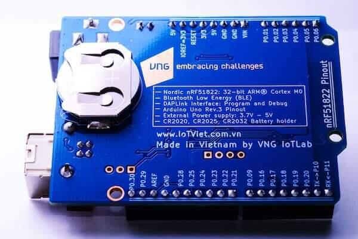
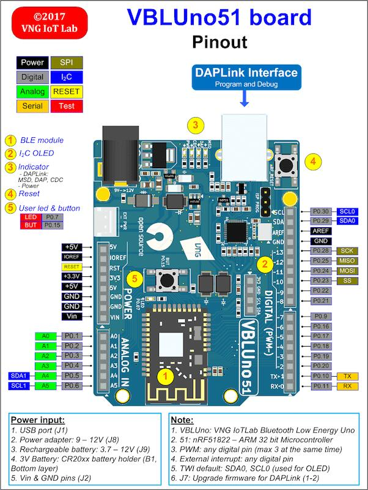
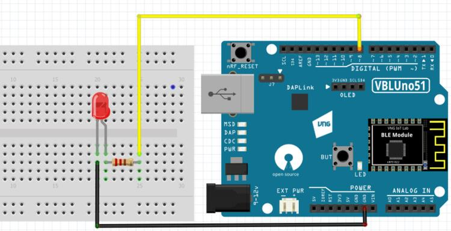

.. zephyr:board:: nrf51_vbluno51

Overview
********

Zephyr uses the nrf51_vbluno51 board configuration to run on the VBLUno51 board,
a VNG Bluetooth Low Energy UNO using an nRF51822 ARM processor.

     nrf51_vbluno51 Bottom

More information about the board can be found at the
`VBLUno51 wiki page`_.

Hardware
********

VBLUno51 board has two external oscillators. The frequency of
the slow clock is 32.768 kHz. The frequency of the main clock
is 16 MHz.

Supported Features
==================

- CPU:
	+ Nordic nRF51822: ARM |reg| Cortex |trade| M0 32bit.
	+ *Bluetooth Low Energy interface.*
	+ 256KB Flash, 32KB RAM.
	+ UART(1), I2C(2), SPI(1), PWM(3), SWD, Timer 16bit(3).
	+ 21 digital channels, 6 ADC 10bit channels.
	+ 1 Led and 1 Button onboard.
	+ GPIO Voltage: 0 - 3.3V.
- DAPLink (CMSIS-DAP) interface for program and debug:
	+ USB MSD: Drag and Drop programming flash memory.
	+ USB HID (DAP): CMSIS-DAP compliant debug channel.
	+ USB CDC: Virtual COM port for log, trace and terminal emulation.

- Supports hardware flow control features (RTS/CTS).
- *Energy monitoring for BLE module by current measurement (Only VBLUno51_EM)*
- FOTA (Firmware over the air): Upgrade firmware over BLE interface.
- Build good applications with:
	+ Compiler and IDE: GCC, Keil MDK, IAR, Eclipse, Qt Creator.
	+ Frameworks: Arduino, ARM mbed-OS, Zephyr-OS, Nordic SDK, RIOT-OS, MyNewt-OS, ChibiOS, NuttX RTOS
	+ A lot of tutorials for Arduino, mbed-os and more.
- Pinout: Arduino Uno Rev3 compliant.
- Power:
	+ USB port.
	+ Power adapter: +9 -> +12V.
	+ 3V Battery: CR20xx holder
	+ Rechargeable battery jump: +3.7 -> +12V
- Open source: Hardware design, firmware, packages, tutorial and example codes

See `VBLUno51 wiki page`_ for full documents and tutorials about the VBLUno51 board.

Connections and IOs
===================

LED
---

* LED = LED0 (green) = P0.7

Push buttons
------------

* BUTTON = BUT = SW0 = P0.15

More details
------------

     nrf51_vbluno51 Pinout

     nrf51_vbluno51 Fritzing part

Programming and Debugging
*************************

.. zephyr:board-supported-runners::

Applications for the ``nrf51_vbluno51`` board configuration can be
built and flashed in the usual way (see :ref:`build_an_application`
and :ref:`application_run` for more details).

Flashing
========

The VBLUno51 board has on-board DAPLink (CMSIS-DAP) interface for flashing and debugging.
You do not need any other programming device.
You only need to install pyOCD tool (https://pypi.python.org/pypi/pyOCD)

This tutorial uses the blinky application :zephyr:code-sample:`blinky`.

See the :ref:`getting_started` for general information on setting up
your development environment. Then build and flash the application in
the usual way.

.. zephyr-app-commands::
   :zephyr-app: samples/basic/blinky
   :board: nrf51_vbluno51
   :goals: build flash

Debugging
=========

You can debug an application in the usual way.  Here is an example for the
:zephyr:code-sample:`blinky` application.

.. zephyr-app-commands::
   :zephyr-app: samples/basic/blinky
   :board: nrf51_vbluno51
   :maybe-skip-config:
   :goals: debug

Testing the VBLUno51 with Zephyr: buttons, LEDs, UART, BLE
**********************************************************

 Here are some sample applications that you can use to test different
 components on the VBLUno51 board:

 * :zephyr:code-sample:`hello_world`
 * :zephyr:code-sample:`blinky`
 * :zephyr:code-sample:`button`
 * :zephyr:code-sample:`bluetooth_beacon`
 * :zephyr:code-sample:`ble_peripheral_hr`

References
**********

.. target-notes::

.. _VBLUno51 website: http://iotviet.com.vn/store/detail?id=2
.. _VBLUno51 wiki page: https://vngiotlab.github.io/vbluno/
