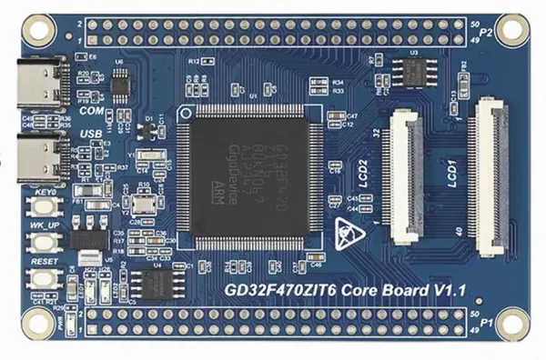

.. zephyr:board:: gd32f470z_start

Overview
********

The GD32F470Z-START board is a minimal system board based on the
GigaDevice GD32F470ZIT6 Cortex-M4F MCU. It is produced by Waiken-Smart
(慧勤智远) as the "GD32F470ZIT6 Core Board V1.1".

The GD32F470ZIT6 features a single-core ARM Cortex-M4F MCU which can run
up to 240 MHz with flash accesses at zero wait states, 2048 KiB of Flash
and 768 KiB of SRAM.

Hardware
********

- GD32F470ZIT6 MCU (LQFP144, 240 MHz)
- 2 x user LEDs (LED1 red on PA1, LED2 green on PA2, active-low)
- 2 x user push buttons (KEY0 on PC1, WK_UP on PA0, active-high)
- 1 x reset button
- USB-C to UART (CH340X) on USART0 (TX PA9 / RX PA10)
- AT24C02 EEPROM (256 B) on I2C0 (SCL PB6 / SDA PB7)
- W25Q128 SPI NOR Flash (16 MB) on SPI4 (CS PF6, SCK PF7, MISO PF8, MOSI PF9)
- 32 MB SDRAM (W9825G6KH-6I)
- TF card slot (SDIO)
- RGB / 8080 / SPI LCD interfaces
- SWD debug interface

   GD32F470Z-START board

Supported Features
==================

.. zephyr:board-supported-hw::

Programming and Debugging
*************************

.. zephyr:board-supported-runners::

The board can be programmed and debugged through its SWD interface
(SWDIO on PA13, SWCLK on PA14). It does not include an onboard debug
probe, so an external probe (e.g. SEGGER J-Link or CMSIS-DAP) is required.

References
**********

- `GigaDevice GD32F470 series product page`_
- `GD32F470xx Datasheet`_
- `GD32F4xx User Manual`_
- `GD32F470ZIT6 Core Board V1.1 (vendor store)`_

.. _GigaDevice GD32F470 series product page:
   https://www.gigadevice.com/product/mcu/high-performance-mcus/gd32f4xx-series/gd32f470

.. _GD32F470xx Datasheet:
   https://gd32mcu.com/data/documents/datasheet/GD32F470xx_Datasheet_Rev1.3.pdf

.. _GD32F4xx User Manual:
   https://gd32mcu.com/data/documents/userManual/GD32F4xx_User_Manual_Rev2.7.pdf

.. _GD32F470ZIT6 Core Board V1.1 (vendor store):
   https://e.tb.cn/h.89TFpCnFP1XKlE2?tk=dVyITWM5Ejs
