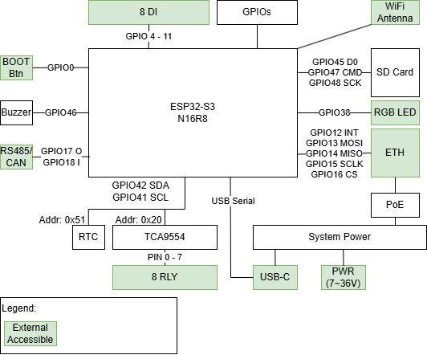

.. zephyr:board:: esp32s3_eth_8di_8ro

Overview
********

The Waveshare ESP32-S3(-POE)-ETH-8DI-8RO(-C) is a PLC form-factor controller for industrial and building automation applications.
It features multiple connectivity options (Wi-Fi, Ethernet, RS485/CAN - in the **-C** variant) and flexible power input (7~36V DC, USB-C, or PoE - in the **-POE** variant).

Hint:
There is no POE variant in Zephyr as it only concerns the power supply.

Hardware
********

.. include:: ../../../espressif/common/soc-esp32s3-features.rst
   :start-after: espressif-soc-esp32s3-features

The board features the ``N16R8`` variant of ESP32S3 including 16MB of QSPI flash and 8MB of PSRAM.

Board Features
==============

The board includes the following peripherals:

- Wiznet W5500 10/100 Ethernet Controller
- 8 Relays via TI TCA9554 I2C Expansion
- 8 Digital Inputs via Optocouplers
- Buzzer
- 1x WS8212 RGB LED
- Battery buffered RTC
- Either digital isolated RS485 or CAN
- MicroSD card
- Boot Button
- USB-C

Supported Features
==================

.. zephyr:board-supported-hw::

System Requirements
*******************

.. include:: ../../../espressif/common/system-requirements.rst
   :start-after: espressif-system-requirements

Programming and Debugging
*************************

.. zephyr:board-supported-runners::

.. include:: ../../../espressif/common/building-flashing.rst
   :start-after: espressif-building-flashing

Debugging
=========

.. include:: ../../../espressif/common/openocd-debugging.rst
   :start-after: espressif-openocd-debugging

References
**********

.. target-notes::

.. _ESP32-S3-ETH-8DI-8RO Waveshare Product Page: https://www.waveshare.com/esp32-s3-eth-8di-8ro.htm
.. _ESP32-S3-ETH-8DI-8RO Waveshare Wiki: https://www.waveshare.com/wiki/ESP32-S3-ETH-8DI-8RO
