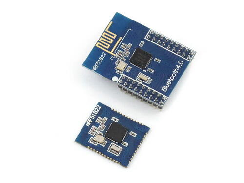
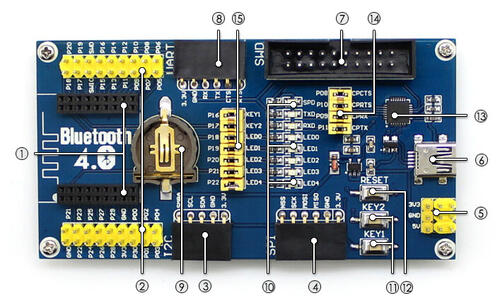
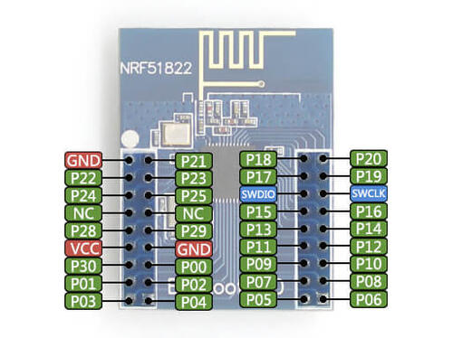
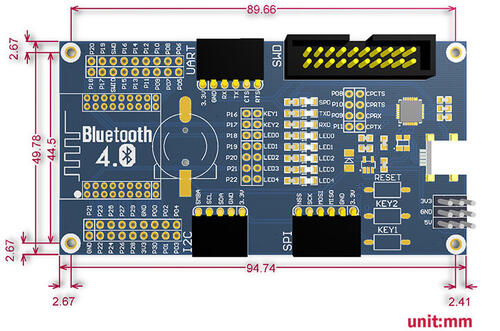

.. _nrf51_ble400:

Waveshare BLE400
#################

Overview
********

BLE400 is a motherboard designed for BLE Bluetooth 2.4G Wireless Module. Used together with core board -- Core51822.

Supported Features
==================

Motherboard
------------

- Onboard battery holder, multi power supplies are available
- All the IOs are accessible for easy expansion
- Integrates CP2102 for debugging
- LEDs and user keys, compatible with other official boards, easy to use

Core board
----------

- Onboard chip: nRF51822
- Communication distance (open outdoor 1M data rate): 30m
- Frequency range: 2.4GHz
- Operating voltage: 2.0V ~ 3.6V
- Operating temperature: -40℃ ~ 85℃
- Expansion pinheader: all the I/Os except P0.26 and P0.27
- Pinheader pitch: 2.00mm
- Antenna: onboard antenna

Features
========

- 2.4 GHz multiprotocol RF transceiver
- ARM® Cortex™-M0 32 bit processor
- 128 bit AES HW encryption
- 256kB flash & 32kB RAM
- Programmable Peripheral Interconnect (PPI)
- Digital interfaces: SPI, I2C, UART
- 10 bit ADC
- Programmable output power: -20 to +4 dBm
- Independent application development and protocol stack
- Fully compatible with NRF24L series
- Pinout compatible with NRF51xxx series
- Global separate power management
- Operating voltage: 1.8 V ~ 3.6 V

Revision History
================

Core board
----------

In June of 2015, Core51822 and its variant, Core51822 (B), upgraded the onboard chip to Rev3 (nRF51822_QFAC) that features 32kB RAM.

Top: Core51822
Bottom: Core51822 (B)

Connections and IOs
====================

Motherboard
------------

1. Wireless module connector: for easily connecting modules like Core51822
2. MCU pins expansion connector
3. I2C interface
4. SPI interface
5. 5V/3.3V power input/output: usually used as power output, also common-grounding with other user board
6. USB connector: USB TO UART via onboard converter CP2102
7. Debugging interface
8. UART interface
9. Battery holder
10. User LEDs
11. User keys
12. Reset button
13. CP2102
14. USB TO UART jumper
15. LEDs & Keys jumper

Core board
----------

BLE400 dimensions
=================

Connections and IOs
===================

LED
---

* LED0 (red) = P0.18
* LED1 (red) = P0.19
* LED2 (red) = P0.20
* LED3 (red) = P0.21
* LED4 (red) = P0.22
* SUSPEND = SUSPEND
* RXD1 = P0.9
* TXD1 = P0.11

Push buttons
------------

* KEY1 = P0.16
* KEY2 = P0.17
* RESET = SWDIO

I2C
---

* SMBA = P0.02
* SCL = P0.01
* SDA = P0.00

SPI
---

* NSS = P0.30
* SCK = P0.25
* MOSI = P0.24
* MISO = P0.23

USART1
------

* RX = P0.05
* TX = P0.06
* CTS = P0.07
* RTS = P0.12

UART (USB)
----------

* RX = P0.9
* TX = P0.11
* CTS = P0.8
* RTS = P0.10

Programming and Debugging
*************************

Flashing
========

Follow the instructions in the :ref:`nordic_segger` page to install
and configure all the necessary software. Further information can be
found in :ref:`nordic_segger_flashing`. Then build and flash
applications as usual (see :ref:`build_an_application` and
:ref:`application_run` for more details).

Here is an example for the :zephyr:code-sample:`hello_world` application.

First, run your favorite terminal program to listen for output.

.. code-block:: console

   $ minicom -D <tty_device> -b 115200

Replace :code:`<tty_device>` with the port where the board nRF51 DK
can be found. For example, under Linux, :code:`/dev/ttyACM0`.

Then build and flash the application in the usual way.

.. zephyr-app-commands::
   :zephyr-app: samples/hello_world
   :board: nrf51_ble400
   :goals: build flash

Debugging
=========

Refer to the :ref:`nordic_segger` page to learn about debugging Nordic boards with a
Segger IC.

Testing the LEDs and buttons in the nRF51 DK
********************************************

There are samples below that allow you to test that the buttons (switches) and LEDs on
the board are working properly with Zephyr:

- :zephyr:code-sample:`blinky`
- :zephyr:code-sample:`button`
- :zephyr:code-sample:`fade-led`
- :zephyr:code-sample:`multi-thread-blinky`

You can build and flash the examples to make sure Zephyr is running correctly on
your board. The button and LED definitions can be found in
:zephyr_file:`boards/waveshare/nrf51_ble400/nrf51_ble400.dts`.

References
**********

.. target-notes::

.. _nRF51 DK website: https://www.nordicsemi.com/Software-and-Tools/Development-Kits/nRF51-DK
.. _Nordic Semiconductor Infocenter: https://infocenter.nordicsemi.com
.. _Waveshare Wiki BLE400: https://www.waveshare.com/wiki/BLE400
.. _Waveshare WiKi Core51822: https://www.waveshare.com/wiki/Core51822
.. _User manual: https://www.waveshare.com/w/upload/b/b7/NRF51822-Eval-Kit-UserManual-EN.pdf
.. _Schematic: https://www.waveshare.com/w/upload/1/1b/BLE400-Schematic.pdf
.. _Code samples: https://www.waveshare.com/w/upload/5/53/NRF51822-Code.7z
.. _Core board schematics: https://www.waveshare.com/w/upload/5/57/Core51822-Schematic.pdf
