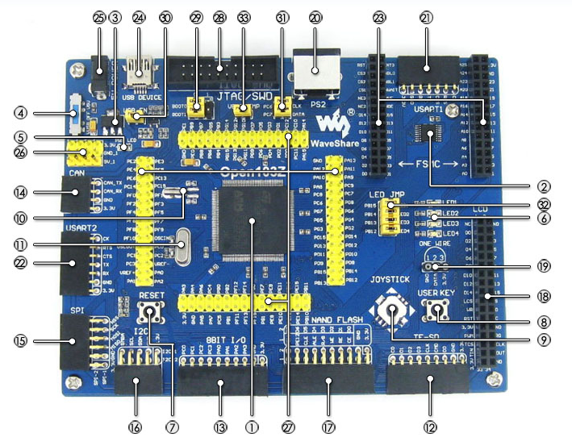
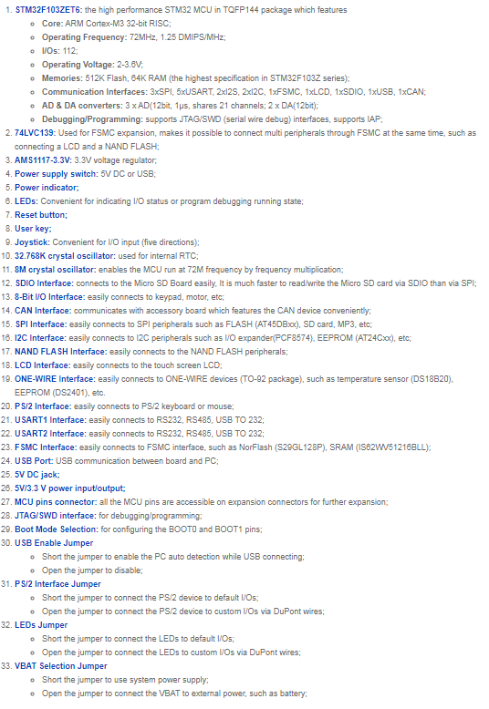

.. zephyr:board:: waveshare_open103z

Overview
********

The Waveshare Open103Z-64 is a development board equipped with STM32F103ZE MCU.

Hardware
********

The Waveshare Open103Z provides the following hardware components:

Supported Features
==================

.. zephyr:board-supported-hw::

Programming and Debugging
*************************

Applications for the ``waveshare_open103z`` board configuration can be built and
flashed in the usual way.

Flashing
========

Build and flash applications as usual. Here is an example for the
:zephyr:code-sample:`hello_world` application.

.. zephyr-app-commands::
   :zephyr-app: samples/hello_world
   :board: waveshare_open103z
   :goals: build flash

Debugging
=========

Debug applications as usual. Here is an example for the
:zephyr:code-sample:`hello_world` application.

.. zephyr-app-commands::
   :zephyr-app: samples/hello_world
   :board: waveshare_open103z
   :maybe-skip-config:
   :goals: debug

References
**********

.. target-notes::

.. _Waveshare: https://www.waveshare.com/open103z-standard.htm
