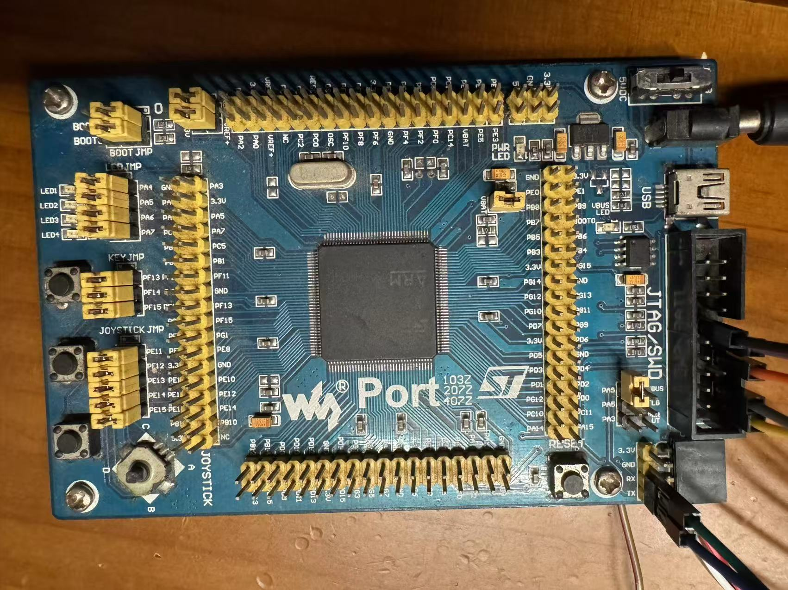

.. zephyr:board:: waveshare_port407z
   :board_group: waveshare
Overview
********

The Waveshare Port407Z is a development board equipped with STM32F407ZG MCU.

Hardware
********

The Waveshare Port407Z provides the following hardware components:

   
Supported Features
==================

.. zephyr:board-supported-hw::

Programming and Debugging
*************************

.. zephyr:board-supported-runners::

Applications for the ``waveshare_port407z`` board configuration can be built and
flashed in the usual way.

Flashing
========

Build and flash applications as usual. Here is an example for the
:zephyr:code-sample:`hello_world` application.

.. zephyr-app-commands::
   :zephyr-app: samples/hello_world
   :board: waveshare_port407z
   :goals: build flash

Debugging
=========

Debug applications as usual. Here is an example for the
:zephyr:code-sample:`hello_world` application.

.. zephyr-app-commands::
   :zephyr-app: samples/hello_world
   :board: waveshare_port407z
   :maybe-skip-config:
   :goals: debug

