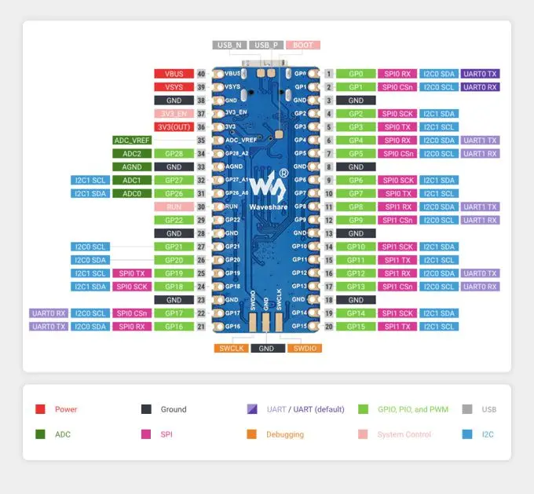

.. zephyr:board:: rp2040_plus

Overview
********

RP2040-Plus, a low-cost, high-performance Pico-like MCU board based on Raspberry Pi microcontroller RP2040
including a battery charger.

Hardware
********
- Dual core Arm Cortex-M0+ processor running up to 133MHz
- 264KB on-chip SRAM
- 4MB/16MB on-board QSPI flash with XIP capabilities
- 26 GPIO pins
- 3 Analog inputs
- 2 UART peripherals
- 2 SPI controllers
- 2 I2C controllers
- 16 PWM channels
- USB 1.1 controller (host/device)
- 8 Programmable I/O (PIO) for custom peripherals
- On-board LED
- 1 Watchdog timer peripheral
- on-board battery charger

Supported Features
==================

.. zephyr:board-supported-hw::

Pin Mapping
===========

The peripherals of the RP2040 SoC can be routed to various pins on the board.
The configuration of these routes can be modified through DTS. Please refer to
the datasheet to see the possible routings for each peripheral.

Default Zephyr Peripheral Mapping:
----------------------------------

.. rst-class:: rst-columns

- UART0_TX : P0
- UART0_RX : P1
- I2C0_SDA : P4
- I2C0_SCL : P5
- I2C1_SDA : P6
- I2C1_SCL : P7
- SPI0_RX : P16
- SPI0_CSN : P17
- SPI0_SCK : P18
- SPI0_TX : P19
- ADC_CH0 : P26
- ADC_CH1 : P27
- ADC_CH2 : P28

Programming and Debugging
*************************

.. zephyr:board-supported-runners::

Flashing
========

Using UF2
---------

Here is an example of building the sample for driving the built-in led.

.. zephyr-app-commands::
   :zephyr-app: samples/basic/blinky
   :board: rp2040_plus
   :goals: build
   :compact:

You must flash the RP2040-Plus with an UF2 file. One option is to use West (Zephyr’s meta-tool). To enter the UF2 flashing mode just keep the ``BOOT`` button pressed while you connect the USB port, it will appear on the host as a mass storage device. In alternative with the board already connected via USB you can keep the ``RESET`` button pressed, press and release ``BOOT``, release ``RESET``. At this point you can flash the image file by running:

.. code-block:: bash

  west flash

Alternatively, you can locate the generated :file:`build/zephyr/zephyr.uf2` file and simply drag-and-drop to the device after entering the UF2 flashing mode.

References
**********

- `Official Documentation`_

.. _Official Documentation: https://www.waveshare.com/wiki/RP2040-Plus
