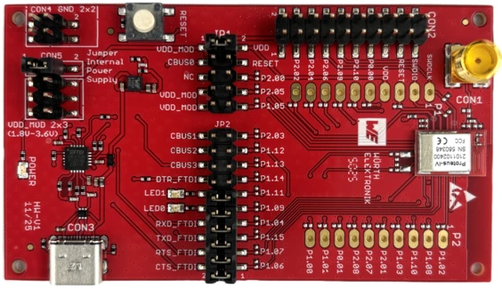

.. zephyr:board:: ophelia4ev

Overview
********

.. note::
   You can find more information about the nRF54L15 SoC on the `nRF54L15 website`_.
   For the nRF54L15 technical documentation and other resources (such as
   SoC Datasheet), see the `nRF54L15 documentation`_ page.

The OPHELIA-IV EV board is an evaluation board of the Ophelia-IV radio module.
It provides support for the Nordic Semiconductor nRF54L15 ARM Cortex-M33 CPU and
the following devices:

* :abbr:`SAADC (Successive Approximation Analog to Digital Converter)`
* CLOCK
* RRAM
* :abbr:`GPIO (General Purpose Input Output)`
* :abbr:`TWIM (I2C-compatible two-wire interface master with EasyDMA)`
* MEMCONF
* :abbr:`MPU (Memory Protection Unit)`
* :abbr:`NVIC (Nested Vectored Interrupt Controller)`
* :abbr:`PWM (Pulse Width Modulation)`
* :abbr:`GRTC (Global real-time counter)`
* Segger RTT (RTT Console)
* :abbr:`SPI (Serial Peripheral Interface)`
* :abbr:`UARTE (Universal asynchronous receiver-transmitter)`
* :abbr:`WDT (Watchdog Timer)`

     OPHELIA-IV EV

Hardware
********

The Ophelia-IV uses the internal low frequency RC oscillator
and provides the so called smart antenna connection, that allows
to choose between the module's integrated PCB antenna and an external
antenna that can be connected to the available SMA connector.

Supported Features
==================

.. zephyr:board-supported-hw::

Programming and Debugging
*************************

Applications for the ``ophelia4ev/nrf54l15/cpuapp`` board target can be
built, flashed, and debugged in the usual way. See
:ref:`build_an_application` and :ref:`application_run` for more details on
building and running.

Applications for the ``ophelia4ev/nrf54l15/cpuflpr`` board target need
to be built using sysbuild to include the ``vpr_launcher`` image for the application core.

Enter the following command to compile ``hello_world`` for the FLPR core:

.. code-block:: console

   west build -p -b ophelia4ev/nrf54l15/cpuflpr --sysbuild

Flashing
========

As an example, this section shows how to build and flash the :zephyr:code-sample:`hello_world`
application.

.. warning::

   When programming the device, you might get an error similar to the following message::

    ERROR: The operation attempted is unavailable due to readback protection in
    ERROR: your device. Please use --recover to unlock the device.

   This error occurs when readback protection is enabled.
   To disable the readback protection, you must *recover* your device.

   Enter the following command to recover the core::

    west flash --recover

   The ``--recover`` command erases the flash memory and then writes a small binary into
   the recovered flash memory.
   This binary prevents the readback protection from enabling itself again after a pin
   reset or power cycle.

Follow the instructions in the :ref:`nordic_segger` page to install
and configure all the necessary software. Further information can be
found in :ref:`nordic_segger_flashing`.

To build and program the sample to the OPHELIA-IV EV, complete the following steps:

First, connect the OPHELIA-IV EV to you computer using the USB port on the board.
Then connect a segger flasher to the SWD connector available on the board.
Next, build the sample by running the following command:

.. zephyr-app-commands::
   :zephyr-app: samples/hello_world
   :board: ophelia4ev/nrf54l15/cpuapp
   :goals: build flash

Testing the LEDs and buttons in the OPHELIA-IV EV
*************************************************

Test the OPHELIA-IV EV with a :zephyr:code-sample:`blinky` sample.

.. _nRF54L15 website: https://www.nordicsemi.com/Products/nRF54L15
.. _nRF54L15 documentation: https://docs.nordicsemi.com/bundle/ncs-latest/page/nrf/app_dev/device_guides/nrf54l/index.html
