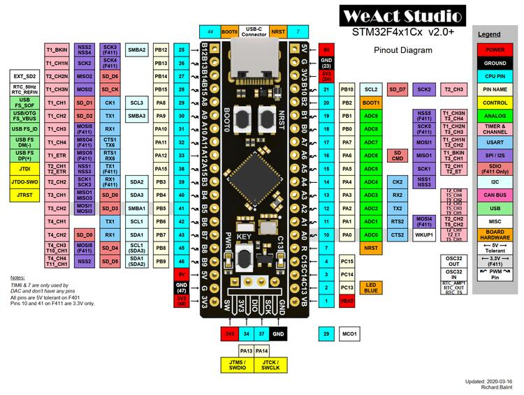

.. zephyr:board:: blackpill_f401ce

Overview
********

The WeAct Black Pill V3.0 Board is an extremely low cost and bare-bones
development board featuring the STM32F401CE, see `STM32F401CE website`_.
This is the 48-pin variant of the STM32F401x series,
see `STM32F401x reference manual`_. More info about the board available
`here <stm32-base-board-page_>`_ and on `WeAct Github`_.

Hardware
********

The STM32F401CE based Black Pill V3.0+ Board provides the following
hardware components:

- STM32F401CEU6 in UFQFPN48 package
- ARM |reg| 32-bit Cortex |reg| -M4 CPU with FPU
- 84 MHz max CPU frequency
- VDD from 1.7 V to 3.6 V
- 512 KB Flash
- 96 KB SRAM
- GPIO with external interrupt capability
- 1x12-bit, 2.4 MSPS ADC with 16 channels
- DMA Controller
- Up to 11 Timers (six 16-bit, two 32-bit, two watchdog timers and a SysTick timer)
- USART/UART (3)
- I2C (3)
- SPI/I2S (5)
- SDIO
- USB 2.0 full-speed device/host/OTG controller with on-chip PHY
- CRC calculation unit
- 96-bit unique ID
- RTC

Supported Features
==================

The Zephyr blackpill_f401ce board configuration supports the following
hardware features:

+------------+------------+-------------------------------------+
| Interface  | Controller | Driver/Component                    |
+============+============+=====================================+
| NVIC       | on-chip    | nested vector interrupt controller  |
+------------+------------+-------------------------------------+
| SYSTICK    | on-chip    | system clock                        |
+------------+------------+-------------------------------------+
| UART       | on-chip    | serial port                         |
+------------+------------+-------------------------------------+
| GPIO       | on-chip    | gpio                                |
+------------+------------+-------------------------------------+
| PINMUX     | on-chip    | pinmux                              |
+------------+------------+-------------------------------------+
| FLASH      | on-chip    | flash                               |
+------------+------------+-------------------------------------+
| SPI        | on-chip    | spi                                 |
+------------+------------+-------------------------------------+
| I2C        | on-chip    | i2c                                 |
+------------+------------+-------------------------------------+
| ADC        | on-chip    | ADC Controller                      |
+------------+------------+-------------------------------------+
| USB OTG FS | on-chip    | USB device                          |
+------------+------------+-------------------------------------+

The default configuration can be found in
:zephyr_file:`boards/weact/blackpill_f401ce/blackpill_f401ce_defconfig`

Pin Mapping
===========

Available pins:
---------------

Default Zephyr Peripheral Mapping:
----------------------------------

- UART_1 TX/RX : PA9/PA10
- I2C1 SCL/SDA : PB8/PB9
- SPI1 CS/SCK/MISO/MOSI : PA4/PA5/PA6/PA7 (Routed to footprint for external flash)
- PWM_4_CH1 : PB6
- PWM_4_CH2 : PB7
- ADC_1 : PA1
- USER_PB : PA0
- USER_LED : PC13

Note on SPI pin mapping: According to the `board release notes`_, there was a brief
change for V2.0 specifically where MISO was routed to PB4 for the flash footprint.
This was reverted for V2.1+ so that the flash DO pin was routed back to PA6. If using
V2.0 and en external flash, the pinmux will need to be modified accordingly.

Clock Sources
-------------

The board has two external oscillators. The frequency of the slow clock (LSE) is
32.768 kHz. The frequency of the main clock (HSE) is 25 MHz.

The default configuration sources the system clock from the PLL, which is
derived from HSE, and is set at 84MHz, which is the maximum possible frequency
to achieve a stable USB clock (42MHz).

Programming and Debugging
*************************

There are 2 main entry points for flashing STM32F4X SoCs, one using the ROM
bootloader, and another by using the SWD debug port (which requires additional
hardware). Flashing using the ROM bootloader requires a special activation
pattern, which can be triggered by using the BOOT0 pin.

Flashing
========

Installing dfu-util
-------------------

It is recommended to use at least v0.8 of `dfu-util`_. The package available in
debian/ubuntu can be quite old, so you might have to build dfu-util from source.

There is also a Windows version which works, but you may have to install the
right USB drivers with a tool like `Zadig`_.

Flashing an Application
-----------------------

Connect a USB-C cable and the board should power ON. Force the board into DFU mode
by keeping the BOOT0 switch pressed while pressing and releasing the NRST switch.

The dfu-util runner is supported on this board and so a sample can be built and
tested easily.

.. zephyr-app-commands::
   :zephyr-app: samples/basic/blinky
   :board: blackpill_f401ce
   :goals: build flash

Debugging
=========

The board can be debugged by installing the included 100 mil (0.1 inch) header,
and attaching an SWD debugger to the 3V3 (3.3V), GND, SCK, and DIO
pins on that header.

References
**********

.. target-notes::

.. _board release notes:
   https://github.com/WeActStudio/WeActStudio.MiniSTM32F4x1/blob/master/HDK/README.md

.. _Zadig:
   https://zadig.akeo.ie/

.. _WeAct Github:
   https://github.com/WeActStudio/WeActStudio.MiniSTM32F4x1

.. _stm32-base-board-page:
   https://stm32-base.org/boards/STM32F401CEU6-WeAct-Black-Pill-V3.0.html

.. _dfu-util:
   http://dfu-util.sourceforge.net/build.html

.. _STM32F401CE website:
   https://www.st.com/en/microcontrollers/stm32f401ce.html

.. _STM32F401x reference manual:
   https://www.st.com/resource/en/reference_manual/dm00096844.pdf
