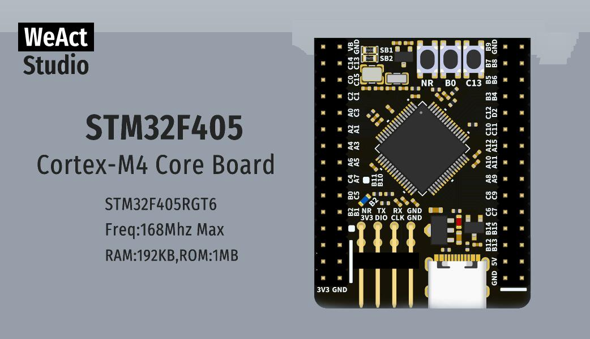

.. _weact_stm32f405_core:

WeAct Studio STM32F405 Core Board V1.0
######################################

Overview
********

The WeAct STM32F405 Core Board is an extremely low cost and bare-bones
development board featuring the STM32F405RG, see `STM32F405RG website`_.
This is the 64-pin variant of the STM32F405x series,
see `STM32F405x reference manual`_. More info about the board available
on `WeAct Github`_.

Hardware
********

The STM32F405RG based Core V1.0 Board provides the following
hardware components:

- STM32F405RG in QFPN64 package
- ARM |reg| 32-bit Cortex |reg| -M4 CPU with FPU, Adaptive real-time
  accelerator (ART Accelerator) allowing 0-wait state execution from Flash memory
- 168 MHz max CPU frequency
- VDD from 1.7 V to 3.6 V
- 1 MB Flash
- 192+4 Kbytes of SRAM including 64-Kbyte of CCM (core coupled memory)
- GPIO with external interrupt capability
- 3x12-bit, 2.4 MSPS ADC up to 24 channels and 7.2 MSPS in triple interleaved mode
- 2x12-bit D/A converters
- 16-stream DMA controller
- Up to 17 Timers (twelve 16-bit, two 32-bit, two watchdog timers and a SysTick timer)
- USART/UART (4)
- I2C (3)
- SPI/I2S (3)
- CAN (2)
- SDIO
- USB 2.0 full-speed device/host/OTG controller with on-chip PHY
- USB 2.0 high-speed/full-speed device/host/OTG controller with on-chip full-speed PHY and ULPI
- 10/100 Ethernet MAC
- CRC calculation unit
- 96-bit unique ID
- RTC with hardware calendar
- 8- to 14-bit parallel camera interface
- LCD parallel interface, 8080/6800 modes

Supported Features
==================

The Zephyr weact_stm32f405_core board configuration supports the following
hardware features:

+------------+------------+-------------------------------------+
| Interface  | Controller | Driver/Component                    |
+============+============+=====================================+
| NVIC       | on-chip    | nested vector interrupt controller  |
+------------+------------+-------------------------------------+
| SYSTICK    | on-chip    | system clock                        |
+------------+------------+-------------------------------------+
| UART       | on-chip    | serial port                         |
+------------+------------+-------------------------------------+
| GPIO       | on-chip    | gpio                                |
+------------+------------+-------------------------------------+
| PINMUX     | on-chip    | pinmux                              |
+------------+------------+-------------------------------------+
| FLASH      | on-chip    | flash                               |
+------------+------------+-------------------------------------+
| SPI        | on-chip    | spi                                 |
+------------+------------+-------------------------------------+
| I2C        | on-chip    | i2c                                 |
+------------+------------+-------------------------------------+
| ADC        | on-chip    | ADC Controller                      |
+------------+------------+-------------------------------------+
| USB OTG FS | on-chip    | USB device                          |
+------------+------------+-------------------------------------+

The default configuration can be found in
:zephyr_file:`boards/weact/stm32f405_core/weact_stm32f405_core_defconfig`

Pin Mapping
===========

Default Zephyr Peripheral Mapping:
----------------------------------

- UART_1 TX/RX : PA9/PA10
- UART_2 TX/RX : PA2/PA3
- I2C1 SCL/SDA : PB6/PB7
- SPI1 SCK/MISO/MOSI : PA5/PA6/PA7
- CAN1 TX/RX : Pb9/PB8
- SDMMC1 D0..D4/CLK/CMD : PC8/PC9/PC10/PC11/PC12/PD2
- USER_PB : PC13
- USER_LED : PB2

Clock Sources
-------------

The board has two external oscillators. The frequency of the slow clock (LSE) is
32.768 kHz. The frequency of the main clock (HSE) is 8 MHz.

The default configuration sources the system clock from the PLL, which is
derived from HSE, and is set at 168MHz, which is the maximum possible frequency
to achieve a stable USB clock (48MHz).

Programming and Debugging
*************************

There are 2 main entry points for flashing STM32F4X SoCs, one using the ROM
bootloader, and another by using the SWD debug port (which requires additional
hardware). Flashing using the ROM bootloader requires a special activation
pattern, which can be triggered by using the BOOT0 pin.

Flashing
========

Installing dfu-util
-------------------

It is recommended to use at least v0.8 of `dfu-util`_. The package available in
debian/ubuntu can be quite old, so you might have to build dfu-util from source.

There is also a Windows version which works, but you may have to install the
right USB drivers with a tool like `Zadig`_.

Flashing an Application
-----------------------

Connect a USB-C cable and the board should power ON. Force the board into DFU mode
by keeping the BOOT0 switch pressed while pressing and releasing the NRST switch.

The dfu-util runner is supported on this board and so a sample can be built and
tested easily.

.. zephyr-app-commands::
   :zephyr-app: samples/basic/blinky
   :board: weact_stm32f405_core
   :goals: build flash

.. zephyr-app-commands::
   :zephyr-app: samples/basic/button
   :board: weact_stm32f405_core
   :goals: build flash

.. zephyr-app-commands::
   :zephyr-app: samples/subsys/fs/fs_sample
   :board: weact_stm32f405_core
   :goals: build flash

Debugging
=========

The board can be debugged by installing the included 100 mil (0.1 inch) header,
and attaching an SWD debugger to the 3V3 (3.3V), GND, SCK, and DIO
pins on that header.

References
**********

.. target-notes::

.. _board release notes:
   https://github.com/WeActStudio/WeActStudio.STM32F4_64Pin_CoreBoard/blob/master/README.md

.. _Zadig:
   https://zadig.akeo.ie/

.. _WeAct Github:
   https://github.com/WeActStudio/WeActStudio.STM32F4_64Pin_CoreBoard

.. _dfu-util:
   http://dfu-util.sourceforge.net/build.html

.. _STM32F405RG website:
   https://www.st.com/en/microcontrollers-microprocessors/stm32f405rg.html

.. _STM32F405x reference manual:
   https://www.st.com/resource/en/reference_manual/rm0090-stm32f405415-stm32f407417-stm32f427437-and-stm32f429439-advanced-armbased-32bit-mcus-stmicroelectronics.pdf
