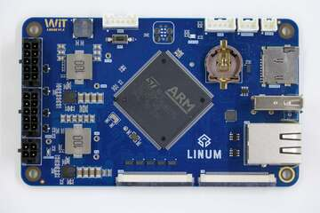

.. _linum:

Witte Technology Linum Board
############################

Overview
********
Linum is a development board released by Witte Tenology in 2023, and it was developed around the
STM32H753BI microcontroller. The board has 2 expansion connectors used by the LCD display with
touchscreen and another for access to other peripherals of microcontroller. Also it brings plenty
of communications interfaces like UART with RS232 and RS485 capabillities, CAN bus compatible to
FD standard, and networking over Ethernet.

Hardware
********

The board features:
  - 8 to 52V power supply
  - SWD Pins for use as STLink (Pin header) and TC2030-IDC 6-Pin Tag-Connect Plug-of-Nails™ Connector
  - Crystal for HS 25MHz
  - Crystal for RTC 32.768KHz
  - 1 UART serial for debug
  - 1 Led RGB
  - 1 Buzzer without internal oscillator
  - 1 Mono audio up to 3W
  - 1 Ethernet 10/100
  - 1 MicroSD connector supporting 1 or 4-bit bus
  - 1 USB 2.0 Host/Device
  - 1 EEPROM memory with 512K bits
  - 1 External SRAM memory with 8MB
  - 1 NOR memory with 16MB
  - 2 On-board RS232 Transceiver with RTS/CTS
  - 2 On-board RS485 Transceiver
  - 2 On-board CAN-FD Transceiver

Expansion connector 1 features:
  - 1 Display RBG 888
  - 1 Capacitive Touchscreen sensor

Expansion connector 2 features.
  - 1 SPI
  - 1 I2C
  - 1 One Wire
  - 2 DACs
  - 6 PWM Channels
  - 10 ADCs

More information about the board, can be found at the `Witte Linum website`_.

Supported Features
==================

The Zephyr Linum board configuration supports the following hardware
features:

+-----------+------------+-------------------------------------+
| Interface | Controller | Driver/Component                    |
+===========+============+=====================================+
| NVIC      | on-chip    | nested vector interrupt controller  |
+-----------+------------+-------------------------------------+
| UART      | on-chip    | serial port                         |
+-----------+------------+-------------------------------------+
| PINMUX    | on-chip    | pinmux                              |
+-----------+------------+-------------------------------------+
| GPIO      | on-chip    | gpio                                |
+-----------+------------+-------------------------------------+
| RTC       | on-chip    | counter                             |
+-----------+------------+-------------------------------------+
| I2C       | on-chip    | i2c                                 |
+-----------+------------+-------------------------------------+
| PWM       | on-chip    | pwm                                 |
+-----------+------------+-------------------------------------+
| ADC       | on-chip    | adc                                 |
+-----------+------------+-------------------------------------+
| RNG       | on-chip    | True Random number generator        |
+-----------+------------+-------------------------------------+
| ETHERNET  | on-chip    | ethernet                            |
+-----------+------------+-------------------------------------+
| SPI       | on-chip    | spi                                 |
+-----------+------------+-------------------------------------+
| USB       | on-chip    | usb_device                          |
+-----------+------------+-------------------------------------+
| CAN/CANFD | on-chip    | canbus                              |
+-----------+------------+-------------------------------------+
| LTDC      | on-chip    | LCD Interface                       |
+-----------+------------+-------------------------------------+
| FMC       | on-chip    | memc (SDRAM)                        |
+-----------+------------+-------------------------------------+
| SDMMC     | on-chip    | disk access                         |
+-----------+------------+-------------------------------------+

Other hardware features are not yet supported on this Zephyr port.

The default configuration can be found in the defconfig file:
:zephyr_file:`boards/witte/linum/linum_defconfig`

Default Zephyr Peripheral Mapping:
----------------------------------

BOARD-LEDs
----------

The LINUM-STM32H753BI has 3 software controllable LEDs.

  ======= =====
  LED RGB PINS
  ======= =====
  LED_R   PG2
  LED_G   PG3
  LED_B   PB2
  ======= =====

UART/USART
----------

The LINUM-STM32H753BI used the USART1 for serial console.

USART1
------

  ====== =====
  USART1 PINS
  ====== =====
  TX     PB14
  RX     PB15
  ====== =====

The LINUM-STM32H753BI board has two on-board RS-232 transceiver connected to USART2 and USART3.

  ====== =====
  USART2 PINS
  ====== =====
  TXD    PD5
  RXD    PD6
  CTS    PD3
  RTS    PD4
  ====== =====

  ====== =====
  USART3 PINS
  ====== =====
  TXD    PB10
  RXD    PB11
  CTS    PD11
  RTS    PD12
  ====== =====

The LINUM-STM32H753BI board has two on-board RS-485 transceiver connected to USART4 and USART6.

  ====== =====
  UART4  PINS
  ====== =====
  TXD    PB9
  RXD    PB8
  DE     PA15
  ====== =====

  ====== =====
  USART6 PINS
  ====== =====
  TXD    PC6
  RXD    PC7
  DE     PG12
  ====== =====

SDMMC
-----

The LINUM-STM32H753BI has one SDCard slot connected as below:

  ========== =====
  SDMMC1     PINS
  ========== =====
  SDMMC_D0   PC8
  SDMMC_D1   PC9
  SDMMC_D2   PC10
  SDMMC_D3   PC11
  SDMMC_DK   PC12
  ========== =====

  =============== =====
  GPIO            PINS
  =============== =====
  SDCARD_DETECTED PG7
  SDCARD_PWR_EN   PD7
  =============== =====

ETHERNET
--------

The LINUM-STM32H753BI has a ethernet connection using the transceiver KSZ8081RNACA.

  ============ =====
  ETH          PINS
  ============ =====
  ETH_REF_CLK  PA1
  ETH_MDIO     PA2
  ETH_CRS_DV   PA7
  ETH_MDC      PC1
  ETH_RXD0     PC4
  ETH_RXD1     PC5
  ETH_TX_EN    PG11
  ETH_TXD0     PG13
  ETH_TXD1     PG14
  ETH_CLK      PA8
  ETH_RESET    PI4
  ============ =====

CAN-FD
------

The LINUM-STM32H753BI board has two on-board CAN-FD transceiver connected to FDCAN1 and FDCAN2.

  ====== =====
  FDCAN1 PINS
  ====== =====
  TXD    PH13
  RXD    PH14
  STD    PI2
  ====== =====

  ====== =====
  FDCAN2 PINS
  ====== =====
  TXD    PB13
  RXD    PB12
  STD    PE3
  ====== =====

USB
---

The LINUM-STM32H753BI has one usb port.

  ========= =====
  USB       PINS
  ========= =====
  USB_VBUS  PA9
  USB_N     PA11
  USB_P     PA12
  USB_EN    PI12
  USB_FLT   PI13
  ========= =====

I2C3
----
The LINUM-STM32H753BI connects the EEPROM memory and the touchscreen sensor to I2C3.

  ====== =====
  I2C3   PINS
  ====== =====
  SCL    PH7
  SDA    PH8
  ====== =====

External SDRAM
--------------
The LINUM-STM32H753BI has a external SDRAM with 8Mbytes connected to FMC peripheral.

  =========== =====
  FMC         PINS
  =========== =====
  FMC_A0      PF0
  FMC_A1      PF1
  FMC_A2      PF2
  FMC_A3      PF3
  FMC_A4      PF4
  FMC_A5      PF5
  FMC_A6      PF12
  FMC_A7      PF13
  FMC_A8      PF14
  FMC_A9      PF15
  FMC_A10     PG0
  FMC_A11     PG1
  FMC_BA0     PG4
  FMC_BA1     PG5
  FMC_D0      PD14
  FMC_D1      PD15
  FMC_D2      PD0
  FMC_D3      PD1
  FMC_D4      PE7
  FMC_D5      PE8
  FMC_D6      PE9
  FMC_D7      PE10
  FMC_D8      PE11
  FMC_D9      PE12
  FMC_D10     PE13
  FMC_D11     PE14
  FMC_D12     PE15
  FMC_D13     PD8
  FMC_D14     PD9
  FMC_D15     PD10
  FMC_NBL0    PE0
  FMC_NBL1    PE1
  FMC_SDCKE0  PC3
  FMC_SDCLK   PG8
  FMC_SDNCAS  PG15
  FMC_SDNEO   PC2
  FMC_SDNRAS  PF11
  FMC_SDNWE   PC0
  =========== =====

LCD
---
The LINUM-STM32H753BI use the LTDC to support one LCD with RGB connection.

  ============= =====
  LTDC          PINS
  ============= =====
  LTDC_B0       PJ12
  LTDC_B1       PJ13
  LTDC_B2       PJ14
  LTDC_B3       PJ15
  LTDC_B4       PK3
  LTDC_B5       PK4
  LTDC_B6       PK5
  LTDC_B7       PK6
  LTDC_CLK      PI14
  LTDC_DE       PK7
  LTDC_G0       PJ7
  LTDC_G1       PJ8
  LTDC_G2       PJ9
  LTDC_G3       PJ10
  LTDC_G4       PJ11
  LTDC_G5       PK0
  LTDC_G6       PK1
  LTDC_G7       PK2
  LTDC_HSYNC    PI10
  LTDC_R0       PI15
  LTDC_R1       PJ0
  LTDC_R2       PJ1
  LTDC_R3       PJ2
  LTDC_R4       PJ3
  LTDC_R5       PJ4
  LTDC_R6       PJ5
  LTDC_R7       PJ6
  LTDC_VSYNC    PI9
  PWM_BACKLIGHT PH6
  ============= =====

System Clock
------------

Linum H753ZI System Clock could be driven by an internal or external
oscillator, as well as the main PLL clock. By default, the System clock is
driven by the PLL clock at 480MHz, driven by an 25MHz high-speed external clock.

Programming and Debugging
*************************

Applications for the ``linum`` board configuration can be built and
flashed in the usual way (see :ref:`build_an_application` and
:ref:`application_run` for more details).

.. note::

  For debugging or programming Linum you will need to use an external debug
  debug or flash tool and connect it to the SWD Connnector. JLink or ST-Link
  probes are examples of out of the box compatible tools.

Flashing
========

Flashing an application to the Linum board
-------------------------------------------

Here is an example for the :zephyr:code-sample:`hello_world` application.

Run a serial host program to connect with your Nucleo board.

.. code-block:: console

   $ minicom -b 115200 -D /dev/ttyACM0

Build and flash the application:

.. zephyr-app-commands::
   :zephyr-app: samples/hello_world
   :board: linum
   :goals: build flash

You should see the following message on the console:

.. code-block:: console

   $ Hello World! linum

Debugging
=========

You can debug an application in the usual way.  Here is an example for the
:zephyr:code-sample:`hello_world` application.

.. zephyr-app-commands::
   :zephyr-app: samples/hello_world
   :board: linum
   :maybe-skip-config:
   :goals: debug

.. _Witte Linum website:
   https://wittetech.com/
