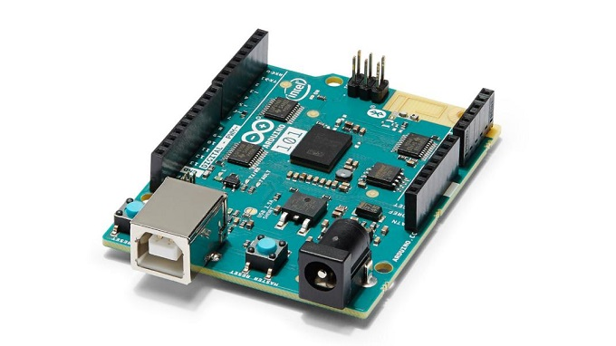

.. _arduino_101:

Arduino/Genuino 101
###################

Overview
********

The Arduino/Genuino 101 is a learning and development board which contains an
Intel |reg| Curie |trade| Module. This board is designed to integrate the core's low
power-consumption and high performance with the Arduino's ease-of-use. The
Arduino 101 adds Bluetooth Low Energy capabilities and has an on-board 6-axis
accelerometer/gyroscope, providing exciting opportunities for building creative
projects in the connected world.

   Arduino/Genuino 101 (Credit: Intel)

The Intel Quark* SE SoC in the Curie module contains a single core 32 MHz x86
(Intel Quark* processor) and the 32 MHz Argonaut RISC Core (ARC)* EM processor.
The two processors operate simultaneously and share memory. The ARC processor is
also referenced as the digital signal processor (DSP) sensor hub or a sensor
subsystem depending on what document you're looking at. In theory, the DSP can
run using a minimal amount of power, gathering and processing sensor data while
the x86 processor waits in a low power mode, which would be ideal for always-on
applications.

Zephyr can be flashed to an Arduino 101 for experimentation and testing
purposes; keep in mind that running the Zephyr OS on the Arduino 101 is not
supported by Arduino LLC.

Hardware
********

Board Layout
============

General information for the board can be found at the
`Arduino 101 website <https://www.arduino.cc/en/Main/ArduinoBoard101>`_,
which also includes schematics and BRD files
for the board.

Arduino 101 Pinout
==================

When using the Zephyr kernel, the pinout mapping for the Arduino 101 becomes a
little more complicated. The table below details which pins in Zephyr map to
those on the Arduino 101 board for control. Full details of the pinmux
implementation, what valid options can be configured, and where things map can
be found in the :file:`boards/x86/arduino_101/pinmux.c` file.

+-------------+----------+------------+
| Arduino Pin | Function | Zephyr Pin |
+=============+==========+============+
| IO-0        | UART1-RX | 17         |
+-------------+----------+------------+
| IO-1        | UART1-TX | 16         |
+-------------+----------+------------+
| IO-2        | GPIO     | 52         |
+-------------+----------+------------+
| IO-3        | GPIO     | 51         |
|             |          | 63         |
+-------------+----------+------------+
| IO-4        | GPIO     | 53         |
+-------------+----------+------------+
| IO-5        | GPIO     | 49         |
|             |          | 64         |
+-------------+----------+------------+
| IO-6        | PWM2     | 65         |
+-------------+----------+------------+
| IO-7        | GPIO     | 54         |
+-------------+----------+------------+
| IO-8        | GPIO     | 50         |
+-------------+----------+------------+
| IO-9        | PWM3     | 66         |
+-------------+----------+------------+
| IO-10       | AIN0     | 0          |
+-------------+----------+------------+
| IO-11       | AIN3     | 3          |
+-------------+----------+------------+
| IO-12       | AIN1     | 1          |
+-------------+----------+------------+
| IO-13       | AIN2     | 2          |
+-------------+----------+------------+
| ADC0        | GPIO SS  | 10         |
+-------------+----------+------------+
| ADC1        | GPIO SS  | 11         |
+-------------+----------+------------+
| ADC2        | GPIO SS  | 12         |
+-------------+----------+------------+
| ADC3        | GPIO SS  | 13         |
+-------------+----------+------------+
| ADC4        | AIN14    | 14         |
+-------------+----------+------------+
| ADC5        | AIN9     | 9          |
+-------------+----------+------------+

.. note::

   IO-3 and IO-5 require both pins to be set for functionality changes.

Supported Features
==================

The Zephyr kernel supports multiple hardware features on the Arduino 101 through
the use of drivers. Some drivers are functional on the x86 side only, some on
the ARC side only, and a few are functional on both sides. The table below shows
which drivers and functionality can be found on which architectures:

+-----------+------------+-----+-----+-----------------------+
| Interface | Controller | ARC | x86 | Driver/Component      |
+===========+============+=====+=====+=======================+
| APIC      | on-chip    | N   | Y   | interrupt_controller  |
+-----------+------------+-----+-----+-----------------------+
| UART      | on-chip    | N   | Y   | serial port-polling;  |
|           |            |     |     | serial port-interrupt |
+-----------+------------+-----+-----+-----------------------+
| SPI       | on-chip    | Y   | Y   | spi                   |
+-----------+------------+-----+-----+-----------------------+
| ADC       | on-chip    | Y   | N   | adc                   |
+-----------+------------+-----+-----+-----------------------+
| I2C       | on-chip    | Y   | Y   | i2c                   |
+-----------+------------+-----+-----+-----------------------+
| GPIO      | on-chip    | Y   | Y   | gpio                  |
+-----------+------------+-----+-----+-----------------------+
| PWM       | on-chip    | Y   | Y   | pwm                   |
+-----------+------------+-----+-----+-----------------------+
| mailbox   | on-chip    | Y   | Y   | ipm                   |
+-----------+------------+-----+-----+-----------------------+

Required Hardware and Software
==============================

Before flashing the Zephyr kernel onto an Arduino 101, a few additional pieces
of hardware are required.

* The USB port for power will work; however, we recommend the 7V-12V barrel
  connector be used when working with the JTAG connector.
* If you wish to grab any data off the serial port, you will need a TTL-to-USB
  adapter. The following adapters require male-to-male jumper cables in order to
  connect to the Arduino 101 board.

  * USB to 3.3V TTL Serial Cable
  * FTDI USB to TTL Serial Part #TTL-232R-3V3 http://www.ftdichip.com/Products/Cables/USBTTLSerial.htm

We recommend using the ``dfu-util`` tool to flash the Arduino 101 board.
For Linux environments, verify that ``udev`` has the proper rules for granting
you access to the Arduino 101 board in DFU mode. You can easily add the required
rules, using the ``create_dfu_udev_rule`` script provided with the
`Intel Curie Boards package`_ for the Arduino Desktop IDE. You can get and run
this script standalone with the following commands:

.. code-block:: console

   $ wget https://github.com/01org/intel-arduino-tools/raw/linux64/scripts/create_dfu_udev_rule
   $ chmod +x create_dfu_udev_rule
   $ sudo ./create_dfu_udev_rule
   $ rm create_dfu_udev_rule

If you'd like to flash using JTAG, the following additional hardware is needed:

* Flyswatter2 JTAG debugger
* ARM Micro JTAG Connector, Model: ARM-JTAG-20-10

Connecting Serial Output
========================

The default configuration defined in the Zephyr kernel supports serial output
via the UART1 on the board. To read the output, you will need a USB to 3.3V TTL
serial cable. To enable serial output:

* Connect the Serial Cable RX pin to the Arduino 101's TX->1 pin.
* Connect the Serial Cable TX pin to the Arduino 101's RX<-0 pin.
* Connect the Serial Cable GND pin to the Arduino 101's GND pin.

Once connected, on your development environment, you will need to:

* Open a serial port emulator (i.e. on Linux minicom, screen, etc)
* Attach to the USB to TTL Serial cable, for example, on Linux this may be
  /dev/ttyUSB0
* Set the communication details to:

  * Speed: 115200
  * Data: 8 bits
  * Parity: None
  * Stopbits: 1

Programming and Debugging
*************************

The Arduino 101 is powered by a Quark CPU and a sensor subsystem powered by an
ARC processor. When building applications, depending on the usage, two Zephyr
images need to be built and flashed.

The Arduino 101 has a bootloader that supports flashing over USB using the DFU
protocol. Additionally, the factory installed bootloader supports flashing of
the firmware for the Bluetooth device of the Curie module.

Use the ``arduino_101`` board definition to build a kernel for the Quark core. Use
the ``arduino_101_sss`` board definition when targeting the sensor subsystem.

When your application is targeting the Quark processor only, it is important to
disable the sensor subsystem processor using the ``CONFIG_ARC_INIT=n`` option,
otherwise the board will appear to hang waiting for the sensor subsystem
processor to boot.

Bootloader (Boot ROM)
=====================

Support for the `QMSI Bootloader`_ has been removed starting from Zephyr 1.4.0.
Thus, the factory boot ROM can be kept supporting the flashing of the board over
DFU and flashing the Bluetooth firmware.

If you have previously installed a different boot ROM it is recommended to
restore the factory boot ROM image using the `Flashpack Utility`_. Consult
the README available in the `Flashpack Utility`_ package and follow the
instructions for your environment.

Flashing
========

The ``dfu-util`` flashing application will only recognize the Arduino 101 as a
DFU-capable device within five seconds after the Master Reset button is pressed
on the board. You can run this application with the help of the Zephyr build
system by defining the environment variable ``ZEPHYR_FLASH_OVER_DFU=y`` before
flashing Zephyr applications (as described in :ref:`application_run`).

If you regularly use this method, you can add the following line into your
``~/.zephyrrc`` file:

.. code-block:: console

   export ZEPHYR_FLASH_OVER_DFU=y

Flashing the Sensor Subsystem Core
----------------------------------
When building for the ARC processor, the board type is listed as
``arduino_101_sss``.

The sample application :ref:`hello_world` is used for this tutorial.  To build
and flash this application using ``dfu-util``, first set
``ZEPHYR_FLASH_OVER_DFU=y`` in the environment as described above, then run:

.. zephyr-app-commands::
   :zephyr-app: samples/hello_world
   :board: arduino_101_sss
   :build-dir: arduino_101_sss
   :goals: build flash

Flashing the x86 Application Core
---------------------------------

When building for the x86 processor, the board type is listed as
``arduino_101``.  To build and flash the :ref:`hello_world` application to this
board using ``dfu-util``, first set ``ZEPHYR_FLASH_OVER_DFU=y`` in the
environment as described above, then run:

.. zephyr-app-commands::
   :zephyr-app: samples/hello_world
   :board: arduino_101
   :build-dir: arduino_101
   :goals: build flash

.. _bluetooth_firmware_arduino_101:

Flashing the Bluetooth Core
---------------------------

To be interoperable with the Zephyr Bluetooth stack the Bluetooth controller of
the Arduino 101 (Nordic Semiconductor nRF51) needs to be flashed with a
compatible firmware.

The Arduino 101 factory-installed firmware on this controller is not supported
by the Zephyr project, so you need to flash a new one onto it.

Luckily, starting with Zephyr 1.6, Zephyr itself is able to act as the firmware
for the controller. The application you need is ``samples/bluetooth/hci_uart`` and
the target board is called ``curie_ble``.

To build the Bluetooth controller image and flash it using ``dfu-util``, first
set ``ZEPHYR_FLASH_OVER_DFU=y`` in the environment as described above, then
run:

.. zephyr-app-commands::
   :zephyr-app: samples/bluetooth/hci_uart
   :board: curie_ble
   :goals: build flash

After successfully completing these steps your Arduino 101 should now have a HCI
compatible BLE firmware.

Flashing using JTAG Adapter
---------------------------

We recommend using the ``dfu-util`` tool to flash the Arduino 101 board for typical
development work. JTAG is intended for advanced development and debugging.

* Connect the ARM Micro JTAG Connector to the Flyswatter2.

* Locate the micro JTAG header on the Arduino 101 board. It is adjacent to the
  SCL and SDA pins in the Arduino headers, highlighted as the red square in the
  figure below.

  .. figure:: img/arduino_101_flat.jpg
     :width: 442px
     :align: center
     :alt: Arduino/Genuino 101 JTAG

* Beside the micro JTAG header is a small white dot indicating the location of
  pin 1 on the header. The green arrow on the figure points to the dot.

* Connect the ARM Micro JTAG Connector to the Arduino 101 micro JTAG header.

Ensure that both the cable and header pin 1 locations line up. The cable from
the ARM Micro JTAG Connector uses a red wire on the cable to denote which end on
the cable has the pin 1.

For Linux environments, to control the Flyswatter2 your Linux account needs to be
granted HAL layer interaction permissions. This is done through the group
'plugdev'. Verifying the group exists and adding your username can be
accomplished with the usermod command:

.. code-block:: console

   $ sudo usermod -a -G plugdev $LOGNAME

If the group does not exist, you can add it by running the following command:

.. code-block:: console

   $ sudo groupadd -r plugdev

For Linux environments, verify that ``udev`` has the proper rules for giving your
user control of the Flyswatter2 device. Adding the following rule to udev will
give members of the plugdev group control of the Flyswatter2.

.. code-block:: console

   $ sudo su
   $ cat <<EOF > /etc/udev/rules.d/99-openocd.rules
   # TinCanTools Flyswatter2
   ATTRS{idVendor}=="0403", ATTRS{idProduct}=="6010", MODE="664", GROUP="plugdev"
   EOF
   $ exit

Once your udev rules are setup, you will need to reload the rules:

.. code-block:: console

   $ sudo udevadm control --reload-rules

Plug the USB Type B cable into the Flyswatter2 and your computer. On Linux, you
should see something similar to the following in your dmesg:

.. code-block:: console

   usb 1-2.1.1: new high-speed USB device number 13 using xhci_hcd
   usb 1-2.1.1: New USB device found, idVendor=0403, idProduct=6010
   usb 1-2.1.1: New USB device strings: Mfr=1, Product=2, SerialNumber=3
   usb 1-2.1.1: Product: Flyswatter2
   usb 1-2.1.1: Manufacturer: TinCanTools
   usb 1-2.1.1: SerialNumber: FS20000
   ftdi_sio 1-2.1.1:1.0: FTDI USB Serial Device converter detected
   usb 1-2.1.1: Detected FT2232H
   usb 1-2.1.1: FTDI USB Serial Device converter now attached to ttyUSB0
   ftdi_sio 1-2.1.1:1.1: FTDI USB Serial Device converter detected
   usb 1-2.1.1: Detected FT2232H
   usb 1-2.1.1: FTDI USB Serial Device converter now attached to ttyUSB1

Debugging
=========

The instructions below will help you debug the Arduino 101 on the x86 core or
the ARC core, respectively.

Application Core (x86)
----------------------

Build and flash an x86 application, then launch a debugging server with the
following commands:

.. zephyr-app-commands::
   :app: <my x86 app>
   :board: arduino_101
   :goals: build flash debugserver

Connect to the debug server at the x86 core from a second console:

.. code-block:: console

   $ cd <my x86 app>
   $ $ZEPHYR_SDK_INSTALL_DIR/sysroots/x86_64-pokysdk-linux/usr/bin/i586-zephyr-elfiamcu/i586-zephyr-elfiamcu-gdb build/zephyr/zephyr.elf
   (gdb) target remote localhost:3333
   (gdb) b main
   (gdb) c

Sensor Subsystem Core (ARC)
---------------------------

The sensor subsystem can be enabled from the x86 core (application processor).
This can be done by flashing an application to the x86 core that sets the
``CONFIG_ARC_INIT=y`` option.

Then build the ARC application, flash it, and launch a debug server with the
following commands:

.. zephyr-app-commands::
   :app: <my arc app>
   :board: arduino_101_sss
   :goals: flash debugserver

Connect to the debug server at the ARC core from a second console:

.. code-block:: console

   $ cd <my arc app>
   $ $ZEPHYR_SDK_INSTALL_DIR/sysroots/x86_64-pokysdk-linux/usr/bin/arc-zephyr-elf/arc-zephyr-elf-gdb build/zephyr/zephyr.elf
   (gdb) target remote localhost:3334
   (gdb) b main
   (gdb) c

Bluetooth Firmware
------------------

You will only see normal log messages on the console, by default, without any
way of accessing the HCI traffic between Zephyr and the nRF51 controller.
However, there is a special Bluetooth logging mode that converts the console to
use a binary protocol that interleaves both normal log messages as well as the
HCI traffic. Set the following Kconfig options to enable this protocol before
building your application:

.. code-block:: console

   CONFIG_BT_DEBUG_MONITOR=y
   CONFIG_UART_CONSOLE=n
   CONFIG_UART_QMSI_1_BAUDRATE=1000000

The first item replaces the BT_DEBUG_LOG option, the second one
disables the default printk/printf hooks, and the third one matches the console
baudrate with what's used to communicate with the nRF51, in order not to create
a bottleneck.

To decode the binary protocol that will now be sent to the console UART you need
to use the btmon tool from BlueZ 5.40 or later:

.. code-block:: console

   $ btmon --tty <console TTY> --tty-speed 1000000

Release Notes
*************
When debugging on ARC, it is important that the x86 core be started and running
BEFORE attempting to debug on ARC. This is because the IPM console calls will
hang waiting for the x86 core to clear the communication.

References
**********

.. _QMSI Bootloader: https://github.com/quark-mcu/qm-bootloader

.. _Flashpack Utility: https://downloadcenter.intel.com/downloads/eula/25470/Arduino-101-software-package?httpDown=https%3A%2F%2Fdownloadmirror.intel.com%2F25470%2Feng%2Farduino101-factory_recovery-flashpack.tar.bz2

.. _Intel Curie Boards package: https://www.arduino.cc/en/Guide/Arduino101#toc2
