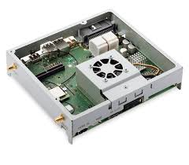

.. _gpmrb:

Gordon Peak MRB
###############

Overview
********

The Intel Gordon Peak Module Reference Board (GP MRB) is used in
the automotive industry for the development of in-vehicle applications
such as heads-up displays and entertainment systems.

   Gordon Peak MRB

Hardware
********

.. include:: ../../../../soc/x86/apollo_lake/doc/supported_features.rst

Building and Running Zephyr
***************************

Use the following procedure to boot a Zephyr application on the Gordon Peak
MRB.

Build Zephyr Application
========================

Build a Zephyr application; for instance, to build the ``hello_world``
application for the GP MRB:

.. zephyr-app-commands::
   :zephyr-app: samples/hello_world
   :board: gpmrb
   :goals: build

This will create a standard ELF binary application file named
:file:`zephyr.elf`, and the same binary with debugging information
removed named :file:`zephyr.strip`. Because of the limited firmware
flash area on board, we'll use the smaller, stripped version.

Move the stripped application to your home directory for use
in the next steps:

.. code-block:: console

   $ cp zephyr/zephyr.strip ~

Get the Leaf Hill Firmware Files
================================

The Slim Bootloader (see the next step) requires binary firmware images
specific to the GP MRB: in this instance, the "Leaf Hill" firmware.
This can be downloaded from Intel:

.. code-block:: console

   $ cd
   $ wget https://firmware.intel.com/sites/default/files/leafhill-0.70-firmwareimages.zip
   $ unzip leafhill-0.70-firmwareimages.zip

There will now be two files named :file:`LEAFHILD.X64.0070.D01.1805070344.bin`
and :file:`LEAFHILD.X64.0070.R01.1805070352.bin` or similar in your home
directory, which are the debug (``D``) and release (``R``) versions of the
binary packages, respectively. Make note of the release (:file:`*R01*`)
file name for the next step.

Build Slim Bootloader
=====================

Zephyr runs as a direct payload of the Slim Bootloader (SBL). For more
complete information on SBL, including comprehensive build instructions,
see the `Slim Bootloader <https://slimbootloader.github.io/>`_ site.

.. code-block:: console

   $ cd
   $ git clone https://github.com/slimbootloader/slimbootloader.git
   $ cd slimbootloader
   $ python BuildLoader.py clean
   $ python BuildLoader.py build apl -p ~/zephyr.strip

Now that the SBL has been built with the Zephyr application as the direct
payload, we need to "stitch" together SBL with the board firmware package.
Be sure to replace the release filename with the one noted in the previous
step:

.. code-block:: console

   $ python Platform/ApollolakeBoardPkg/Script/StitchLoader.py \
         -i ~/LEAFHILD.X64.0070.R01.1805070352.bin \
         -s Outputs/apl/Stitch_Components.zip \
         -o ~/sbl.bin

Now the file :file:`sbl.bin` in your home directory contains a firmware
image with SBL and the Zephyr application, ready to flash to the GP MRB.

Flash the Image
===============

Connect the IOC to the GP MRB and connect the USB cable to your development
machine. Then, using the Intel Platform Flash tools supplied with your
board, flash the firmware:

.. code-block:: console

   $ sudo /opt/intel/platformflashtool/bin/ias-spi-programmer --write ~/sbl.bin

.. note::

   Refer to the instructions with the IOC and/or GP MRB for further
   information on flashing the firmware.

Launch Zephyr
=============

Connect to UART 2 on the GP MRB and press the "ignition" button. After
initialization messages, you will see the Zephyr banner:

.. code-block:: console

   ***** Booting Zephyr OS v1.14.0-rc3-1254-g2a086e4c13ef *****
   Hello World! gpmrb

You are running a Zephyr application on your Gordon Peak MRB.
