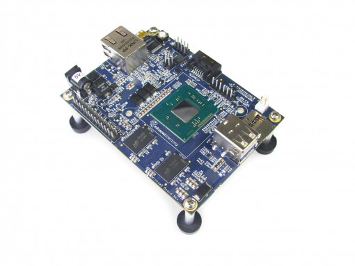

.. _minnowboard_board:

MinnowBoard Max
###############

Overview
********

The MinnowBoard is an Intel |reg| Atom |trade| processor based board which introduces
Intel |reg| Architecture to the small and low cost embedded market for the developer
and maker community. It has exceptional performance, flexibility, openness and
standards

   Minnowboard (Credit: Intel)

The `MinnowBoard`_ board configuration supports the following:

* HPET

* Advanced Programmed Interrupt Controller (APIC)

* NS16550 UART

Hardware
********
Supported Features
==================

This board configuration supports the following hardware features:

+--------------+------------+-----------------------+
| Interface    | Controller | Driver/Component      |
+==============+============+=======================+
| HPET         | on-chip    | system clock          |
+--------------+------------+-----------------------+
| APIC         | on-chip    | interrupt controller  |
+--------------+------------+-----------------------+
| NS16550      | on-chip    | serial port           |
| UART         |            |                       |
+--------------+------------+-----------------------+

The kernel currently does not support other hardware features on this platform.

HPET System Clock Support
--------------------------

This board uses a system clock frequency of 25 MHz.

.. note::
   The LOAPIC timer may be used instead of the HPET. To do so,
   set SYS_CLOCK_HW_CYCLES_PER_SEC to a custom value that is tied to the host system speed.

Serial Port
-----------

This board uses a single serial communication channel
with a NS16550 serial driver that operates in polling mode.
For an interrupt-driven driver, enable the
:option:`CONFIG_UART_INTERRUPT_DRIVEN` kernel configuration option.

PCI
----

PCI drivers assume that IO regions and IRQs for devices are preconfigured
identically by the firmware on all supported devices.  This configuration is
specified in the Kconfig file for the Intel Atom SoC.  The PCI library supports
dynamically enumerating PCI devices, but that support is disabled by default.

.. note::
   The PCI library does not support 64-bit devices.
   Memory address and size storage only require 32-bit integers.

Known Problems or Limitations
-----------------------------

The following platform features are unsupported:

* Isolated Memory Regions
* Serial port in Direct Memory Access (DMA) mode
* Serial Peripheral Interface (SPI) flash
* General-Purpose Input/Output (GPIO)
* Inter-Integrated Circuit (I2C)
* Ethernet
* Supervisor Mode Execution Protection (SMEP)

Creating a GRUB2 Boot Loader Image from a Linux Host
====================================================

If you are having problems running an application using the preinstalled
copy of GRUB, follow these steps to test on supported boards using a custom GRUB.

#. Install the requirements to build GRUB on your host machine.

   On Ubuntu, type:

   .. code-block:: console

      $ sudo apt-get install bison autoconf libopts25-dev flex automake \
      pkg-config gettext autopoint

   On Fedora, type:

   .. code-block:: console

     $ sudo dnf install gnu-efi bison m4 autoconf help2man flex \
        automake texinfo gettext-devel

#. Clone and build the GRUB repository using the script in Zephyr tree, type:

   .. code-block:: console

     $ cd $ZEPHYR_BASE
     $ ./boards/x86/common/scripts/build_grub.sh i386

#. Find the binary at
   :file:`$ZEPHYR_BASE/boards/x86/common/scripts/grub/bin/grub_i386.efi`.

Preparing the Boot Device
=========================

Prepare either an SD-micro card or USB flash drive to boot the Zephyr
application image on the board. The following instructions apply to both
devices.

#. Build a Zephyr application; for instance, to build the ``hello_world``
   application on the minnowboard:

   .. zephyr-app-commands::
      :zephyr-app: samples/hello_world
      :board: minnowboard
      :goals: build

   .. note::

      A stripped project image file named :file:`zephyr.strip` is automatically
      created in the build directory after the application is built. This image
      has removed debug information from the :file:`zephyr.elf` file.

#. Use one of these cables for serial output:

   `<http://www.ftdichip.com/Products/Cables/USBTTLSerial.htm>`_

#. Format a microSD as FAT

#. Create the following directories

   :file:`efi`

   :file:`efi/boot`

   :file:`kernel`

#. Copy the kernel file :file:`build/zephyr/zephyr.strip` to the :file:`$SDCARD/kernel` folder.

#. Copy your built version of GRUB to :file:`$SDCARD/efi/boot/bootia32.efi`

#. Create :file:`$SDCARD/efi/boot/grub.cfg` containing the following:

   .. code-block:: console

      set default=0
      set timeout=10

      menuentry "Zephyr Kernel" {
         multiboot /kernel/zephyr.strip
      }

Booting Zephyr on the MinnowBoard
=================================

The MinnowBoard by default will be running a 64bit firmware. To boot Zephyr, you
will need to replace the 64bit firmware with the 32bit variant. Please follow
the instructions for updating the firmware documented at the
`MinnowBoard firmware`_ website. Look for the Firmware Download section and find
Firmware Flash Images release. The ZIP file will contain the binary images,
update utilities, and instructions. Extract the files and prepare a bootable USB.
Follow the release instructions on Flash Update. You can also check out the
`MinnowBoard firmware development`_ website for more information.

.. _MinnowBoard: https://github.com/MinnowBoard-org
.. _MinnowBoard firmware: https://software.intel.com/en-us/articles/minnowboard-maxturbot-uefi-firmware
.. _Minnowboard firmware development: https://github.com/tianocore/edk2-platforms/blob/master/Platform/Intel/Vlv2TbltDevicePkg/Readme.md
