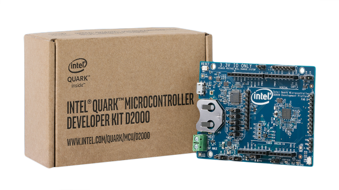

.. _quark_d2000_devboard:

Quark D2000 Development Board
#############################

Overview
********

The Intel |reg| Quark |trade| microcontroller D2000 package is shipped as a 40-pin QFN
component.

Intel |reg| Quark |trade| microcontroller D2000 contains the following items:

- On-board components:

  - Accelerometer/Magnetometer sensor
  - UART/JTAG to USB convert for USB debug port

- Expansion options:

  - "Arduino Uno" compatible SIL sockets ( 3.3V IO Only )

- Other connectors:

  - 1x USB 2.0 Device Port - micro Type B
  - On-board coin cell battery holder
  - 5V input a screw terminal/header (external power or Li-ion)
  - EEMBC power input header

Hardware
********

General information for the board can be found at the `Intel Website`_,
which includes both `schematics`_ and BRD files.

The Intel |reg| Quark |trade| Microcontroller D2000 Development Platform supports the
familiar open standard Arduino Uno Rev 3.0 physical interface and is
mechanically compatible with Uno Rev 3.0. It does not support the 6 pin ICSP
Header.

Supported Features
===================

+-----------+------------+-----------------------+
| Interface | Controller | Driver/Component      |
+===========+============+=======================+
| MVIC      | on-chip    | interrupt_controller  |
+-----------+------------+-----------------------+
| UART      | on-chip    | serial port-polling;  |
|           |            | serial port-interrupt |
+-----------+------------+-----------------------+
| SPI       | on-chip    | spi                   |
+-----------+------------+-----------------------+
| I2C       | on-chip    | i2c                   |
+-----------+------------+-----------------------+
| GPIO      | on-chip    | gpio                  |
+-----------+------------+-----------------------+
| PWM       | on-chip    | pwm                   |
+-----------+------------+-----------------------+

Programming and Debugging
*************************

The D2000 board configuration details are found in the project's tree at
:file:`boards/x86/quark_d2000_crb`.

Applications for the ``quark_d2000_crb`` board configuration can be built and
flashed in the usual way (see :ref:`build_an_application` and
:ref:`application_run` for more details).

Flashing
========

#. Since the board has a built-in JTAG; it is possible to flash the device
   through the USB only.  Set the following jumpers to enable the built-in JTAG:

   +--------+------+--------+------+------+
   | Jumper | UART | Common | JTAG | Name |
   +========+======+========+======+======+
   | J9     | Open |   X    |  X   | TDO  |
   +--------+------+--------+------+------+
   | J10    | Open |   X    |  X   | TDI  |
   +--------+------+--------+------+------+
   | J11    | Open |   X    |  X   | TRST |
   +--------+------+--------+------+------+
   | J12    |  X   |  N/A   |  X   | TMS  |
   +--------+------+--------+------+------+
   | J17    |  X   |  N/A   |  X   | TCK  |
   +--------+------+--------+------+------+

#. Connect the D2000 via USB to the host computer.

#. Build and flash a Zephyr application. Here is an example for the
   :ref:`hello_world` application.

   .. zephyr-app-commands::
      :zephyr-app: samples/hello_world
      :board: quark_d2000_crb
      :goals: build flash

Debugging
=========

You can debug an application in the usual way.  Here is an example for the
:ref:`hello_world` application.

.. zephyr-app-commands::
   :zephyr-app: samples/hello_world
   :board: quark_d200_crb
   :maybe-skip-config:
   :goals: debug

.. _Intel Website:
   http://www.intel.com/content/www/us/en/embedded/products/quark/mcu/d2000/quark-d2000-crb-user-guide.html

.. _schematics:
   http://www.intel.com/content/www/us/en/embedded/products/quark/mcu/d2000/quark-d2000-crb-schematics.html

