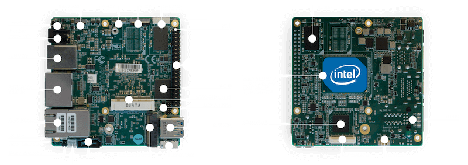

.. _up_squared:

UP Squared
##########

Overview
********

UP |sup2| (UP Squared) is an ultra compact single board computer with high
performance and low power consumption. It features the latest Intel |reg| Apollo
Lake Celeron |trade| and Pentium |trade| Processors with only 4W of Scenario Design Power and
a powerful and flexible Intel |reg| FPGA Altera MAX 10 onboard.

   Up Squared (Credit: https://up-board.org)

This board configuration enables kernel support for the `UP Squared`_ board.

.. note::
   This board configuration works on all three variants of `UP Squared`_
   boards containing Intel |reg| Pentium |trade| SoC,
   Intel |reg| Celeron |trade| SoC, or Intel |reg| Atom |trade| SoC.

Hardware
********

General information about the board can be found at the `UP Squared`_ website.

.. include:: ../../../../soc/x86/apollo_lake/doc/supported_features.rst

GPIO
----

GPIOs are exposed through the HAT header, and can be referred using
predefined macros such as ``UP2_HAT_PIN3``. The physical pins are
connected to the on-board FPGA acting as level shifter. Therefore,
to actually utilize these GPIO pins, the function of the pins and
directions (input/output) must be set in the BIOS. This can be
accomplished in BIOS, under menu ``Advanced``, and option
``HAT Configurations``. When a corresponding pin is set to act as
GPIO, there is an option to set the direction of the pin. This needs
to be set accordingly for the GPIO to function properly.

Connections and IOs
===================

Refer to the `UP Squared`_ website and `UP Squared Pinout`_ website
for connection diagrams.

Programming and Debugging
*************************

Use the following procedures for booting an image on a UP Squared board.

.. contents::
   :depth: 1
   :local:
   :backlinks: top

Creating a GRUB2 Boot Loader Image from a Linux Host
====================================================

If you are having problems running an application using the preinstalled
copy of GRUB, follow these steps to test on supported boards using a custom GRUB.

#. Install the requirements to build GRUB on your host machine.

   On Ubuntu, type:

   .. code-block:: console

      $ sudo apt-get install bison autoconf libopts25-dev flex automake \
      pkg-config gettext autopoint

   On Fedora, type:

   .. code-block:: console

      $ sudo dnf install gnu-efi bison m4 autoconf help2man flex \
      automake texinfo gettext-devel

#. Clone and build the GRUB repository using the script in Zephyr tree, type:

   .. code-block:: console

      $ cd $ZEPHYR_BASE
      $ ./boards/x86/common/scripts/build_grub.sh x86_64

#. Find the binary at
   :file:`$ZEPHYR_BASE/boards/x86/common/scripts/grub/bin/grub_x86_64.efi`.

Build Zephyr application
========================

#. Build a Zephyr application; for instance, to build the ``hello_world``
   application on UP Squared:

   .. zephyr-app-commands::
      :zephyr-app: samples/hello_world
      :board: up_squared
      :goals: build

   .. note::

      A stripped project image file named :file:`zephyr.strip` is automatically
      created in the build directory after the application is built. This image
      has removed debug information from the :file:`zephyr.elf` file.

Preparing the Boot Device
=========================

Prepare a USB flash drive to boot the Zephyr application image on
a UP Squared board.

#. Refer to the `UP Squared Serial Console Wiki page
   <https://wiki.up-community.org/Serial_console>`_ for instructions on how to
   connect for serial console.

#. Format the USB flash drive as FAT32.

   On Windows, open ``File Explorer``, and right-click on the USB flash drive.
   Select ``Format...``. Make sure in ``File System``, ``FAT32`` is selected.
   Click on the ``Format`` button and wait for it to finish.

   On Linux, graphical utilities such as ``gparted`` can be used to format
   the USB flash drive as FAT32. Alternatively, under terminal, find out
   the corresponding device node for the USB flash drive (for example,
   ``/dev/sdd``). Execute the following command:

   .. code-block:: console

      $ mkfs.vfat -F 32 <device-node>

   .. important::
      Make sure the device node is the actual device node for
      the USB flash drive. Or else you may erase other storage devices
      on your system, and will render the system unusable afterwards.

#. Create the following directories

   :file:`efi`

   :file:`efi/boot`

   :file:`kernel`

#. Copy the kernel file :file:`zephyr/zephyr.strip` to the :file:`$USB/kernel` folder.

#. Copy your built version of GRUB to :file:`$USB/efi/boot/bootx64.efi`

#. Create :file:`$USB/efi/boot/grub.cfg` containing the following:

   .. code-block:: console

      set default=0
      set timeout=10

      menuentry "Zephyr Kernel" {
         multiboot /kernel/zephyr.strip
      }

Booting the UP Squared Board
============================

Boot the UP Squared board from the boot device using GRUB2 via USB flash drive.

#. Insert the prepared boot device (USB flash drive) into the UP Squared board.

#. Connect the board to the host system using the serial cable and
   configure your host system to watch for serial data.  See
   https://wiki.up-community.org/Serial_console.

   .. note::
      On Windows, PuTTY has an option to set up configuration for
      serial data.  Use a baud rate of 115200.

#. Power on the UP Squared board.

#. When the following output appears, press :kbd:`F7`:

   .. code-block:: console

      Press <DEL> or <ESC> to enter setup.

#. From the menu that appears, select the menu entry that describes
   that particular type of USB flash drive.

   GRUB2 starts and a menu shows entries for the items you added
   to the file :file:`grub.cfg`.

#. Select the image you want to boot and press :guilabel:`Enter`.

   When the boot process completes, you have finished booting the
   Zephyr application image.

   .. note::
      You can safely ignore this message if it appears:

      .. code-block:: console

         WARNING: no console will be available to OS

Booting the UP Squared Board over network
=========================================

Build Zephyr image
------------------

#. Follow `Build Zephyr application`_ steps to build Zephyr image.

Prepare Linux host
------------------

#. Follow `Creating a GRUB2 Boot Loader Image from a Linux Host`_ steps
   to create grub binary.

#. Install DHCP, TFTP servers. For example ``dnsmasq``

   .. code-block:: console

      $ sudo apt-get install dnsmasq

#. Configure DHCP server. Configuration for ``dnsmasq`` is below:

   .. code-block:: console

      # Only listen to this interface
      interface=eno2
      dhcp-range=10.1.1.20,10.1.1.30,12h

#. Configure TFTP server.

   .. code-block:: console

      # tftp
      enable-tftp
      tftp-root=/srv/tftp
      dhcp-boot=grub_x86_64.efi

   ``grub_x86_64.efi`` is a grub binary created above.

#. Create the following directories inside TFTP root :file:`/srv/tftp`

    .. code-block:: console

       $ sudo mkdir -p /srv/tftp/EFI/BOOT
       $ sudo mkdir -p /srv/tftp/kernel

#. Copy the Zephyr image :file:`zephyr/zephyr.strip` to the
   :file:`/srv/tftp/kernel` folder.

    .. code-block:: console

       $ sudo cp zephyr/zephyr.strip /srv/tftp/kernel

#. Copy your built version of GRUB to :file:`/srv/tftp/grub_x86_64.efi`

#. Create :file:`/srv/tftp/EFI/BOOT/grub.cfg` containing the following:

   .. code-block:: console

      set default=0
      set timeout=10

      menuentry "Zephyr Kernel" {
         multiboot /kernel/zephyr.strip
      }

#. TFTP root should be looking like:

   .. code-block:: console

      $ tree /srv/tftp
      /srv/tftp
      ├── EFI
      │   └── BOOT
      │       └── grub.cfg
      ├── grub_x86_64.efi
      └── kernel
          └── zephyr.strip

#. Restart ``dnsmasq`` service:

   .. code-block:: console

      $ sudo systemctl restart dnsmasq.service

Prepare UP Squared board for network boot
-----------------------------------------

#. Enable PXE network from BIOS settings.

   .. code-block:: console

      Advanced -> Network Stack Configuration -> Enable Network Stack -> Enable Ipv4 PXE Support

#. Make network boot as the first boot option.

   .. code-block:: console

      Boot -> Boot Option #1 : [Network]

Booting UP Squared
------------------

#. Connect the board to the host system using the serial cable and
   configure your host system to watch for serial data.  See
   https://wiki.up-community.org/Serial_console.

#. Power on the UP Squared board.

#. Verify that the board got an IP address:

   .. code-block:: console

      $ journalctl -f -u dnsmasq
      dnsmasq-dhcp[5386]: DHCPDISCOVER(eno2) 00:07:32:52:25:88
      dnsmasq-dhcp[5386]: DHCPOFFER(eno2) 10.1.1.28 00:07:32:52:25:88
      dnsmasq-dhcp[5386]: DHCPREQUEST(eno2) 10.1.1.28 00:07:32:52:25:88
      dnsmasq-dhcp[5386]: DHCPACK(eno2) 10.1.1.28 00:07:32:52:25:88

#. Verify that network booting is started:

   .. code-block:: console

      $ journalctl -f -u dnsmasq
      dnsmasq-tftp[5386]: sent /srv/tftp/grub_x86_64.efi to 10.1.1.28
      dnsmasq-tftp[5386]: sent /srv/tftp/EFI/BOOT/grub.cfg to 10.1.1.28
      dnsmasq-tftp[5386]: sent /srv/tftp/kernel/zephyr.strip to 10.1.1.28

#. When the boot process completes, you have finished booting the
   Zephyr application image.

.. _UP Squared: https://www.up-board.org/upsquared/specifications

.. _UP Squared Pinout: https://wiki.up-community.org/Pinout
