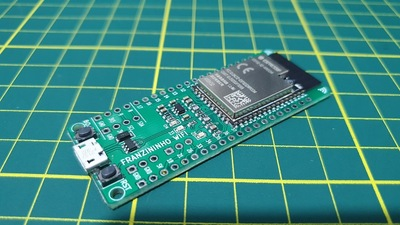

.. _esp32s2_franzininho:

ESP32-S2 Franzininho
####################

Overview
********

Franzininho is an educational development board based on ESP32-S2 which is a highly integrated, low-power, single-core Wi-Fi Microcontroller SoC,
designed to be secure and cost-effective, with a high performance and a rich set of IO capabilities. [1]_

The features include the following:

- RSA-3072-based secure boot
- AES-XTS-256-based flash encryption
- Protected private key and device secrets from software access
- Cryptographic accelerators for enhanced performance
- Protection against physical fault injection attacks
- Various peripherals:

  - 43x programmable GPIOs
  - 14x configurable capacitive touch GPIOs
  - USB OTG
  - LCD interface
  - camera interface
  - SPI
  - I2S
  - UART
  - ADC
  - DAC
  - LED PWM with up to 8 channels

System requirements
*******************

Prerequisites
-------------

Espressif HAL requires WiFi and Bluetooth binary blobs in order work. Run the command
below to retrieve those files.

.. code-block:: console

   west blobs fetch hal_espressif

.. note::

   It is recommended running the command above after :file:`west update`.

Building & Flashing
-------------------

Build and flash applications as usual (see :ref:`build_an_application` and
:ref:`application_run` for more details).

.. zephyr-app-commands::
   :zephyr-app: samples/hello_world
   :board: esp32s2_franzininho
   :goals: build

The usual ``flash`` target will work with the ``esp32s2_franzininho`` board
configuration. Here is an example for the :ref:`hello_world`
application.

.. zephyr-app-commands::
   :zephyr-app: samples/hello_world
   :board: esp32s2_franzininho
   :goals: flash

Open the serial monitor using the following command:

.. code-block:: shell

   west espressif monitor

After the board has automatically reset and booted, you should see the following
message in the monitor:

.. code-block:: console

   ***** Booting Zephyr OS vx.x.x-xxx-gxxxxxxxxxxxx *****
   Hello World! esp32s2_franzininho

References
**********

.. [1] https://www.espressif.com/en/products/socs/esp32-s2
.. _`ESP32S2 Technical Reference Manual`: https://espressif.com/sites/default/files/documentation/esp32-s2_technical_reference_manual_en.pdf
.. _`ESP32S2 Datasheet`: https://www.espressif.com/sites/default/files/documentation/esp32-s2_datasheet_en.pdf
