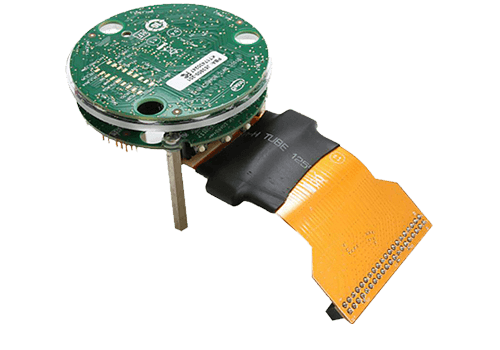

.. _Intel_S1000:

Intel S1000 CRB
###############

Overview
********

The Intel S1000 ASIC is designed for complex far-field signal processing
algorithms that use high dimensional microphone arrays to do beamforming,
cancel echoes, and reduce noise. It connects to a host processor chip via
simple SPI and I2S interfaces, to the microphone array via I2S or PDM
interfaces, and to speakers via I2S. In addition, it has an I2C interface
for controlling platform components such as ADCs, DACs, CODECs and PMICs.

The Intel S1000 contains the following:

- Dual DSP

  - Dual 400 MHz Tensilica HiFi3 cores
  - Single precision scalar floating-point
  - 16KB 4-way I$; 48KB 4-way D$

- Inference Engine

  - On-chip Neural Network Accelerator

- Internal Memory

  - 4MB shared embedded SRAM
  - 64KB embedded SRAM for streaming samples in low power mode

- External Memory Interfaces

  - Up to 8MB external 16-bit PSRAM
  - Up to 128MB external SPI flash

- I/O Interfaces

  - Host I/O: SPI or USB 2.0 High-speed device
  - Microphone: I2S/TDM 9.6 MHz max. bit clock
  - Digital Microphone: 4 stereo PDM ports up to 4.8 MHz clock
  - Speaker: I2S/TDM 9.6 MHz max. bit clock
  - Instrumentation: I2C master @ 100/400 KHz
  - Debug: UART up to 2.4 Mbaud/s
  - GPIO: 8 GPIOs with PWM output capability

For more information refer to the `Intel Speech Enabling Developer Kit`_ page.

System requirements
*******************

Prerequisites
=============

The Xtensa 'toolchain' i.e. XCC is required to build this port. This needs a
license and is available for Linux and Windows from Cadence.

In order to download the installer and the core configuration, users need to
have a registered account at https://tensilicatools.com.

The toolchain installer and the core configuration can be downloaded by following
the links at `Tensilica Tools for Sue Creek`_

Select version RF-2016.4 and download the archive. The archive contains two files:

- Installer: :file:`Xplorer-6.0.4-linux-installer.bin` and
- Core configuration
  :file:`2018-05-15_5afafc055d3f4_X6H3SUE_2016_4_linux_redist.tgz`

For JTAG based debugging, download the XOCD package as well.

A node locked license key can also be generated from the `SDK portal`_.

Set up build environment
========================

Run the installer using these commands:

.. code-block:: console

   cd ~/Downloads
   chmod +x Xplorer-6.0.4-linux-installer.bin
   ./Xplorer-6.0.4-linux-installer.bin

Please note a dialogue box should pop-up after running this command. In case the
graphical installation tool does not start, the tool will revert to console
based installation. The graphical tool is the preferred installation method.

If the graphical tool does not start, it means your system is missing some
packages which is preventing successful installation, most probably
``gtk2-i686``.  You can install any missing packages with::

   sudo apt-get install gtk2-i686

On Fedora 29 you might need to install the following packages::

   sudo dnf install libXtst.i686 libnsl.i686 gtk2.i686

.. note::

   The SDK is a 32 bit binary, so you will need to install 32bit compatibility
   packages for this work.

Follow the instructions and install the toolchain and related tools in your
preferred path.

After a successful installation of the tool, run the Xtensa Xplorer (it will run
automatically after installation is done) and follow the steps to install the
software keys you have downloaded from `Tensilica Tools for Sue Creek`_

.. note::

   The license key you have requested is tied to the Ethernet MAC address on the
   host system. The license manager expects a network device named ``eth0`` or
   ``eth1``. On many modern Linux distribution the naming scheme is different
   and determined automatically. You will need to either force the naming to
   follow what the license manager expects or create a dedicated ethernet device
   for this to work.

   On Ubuntu 18.04 LTS, you can install the license key manually with

   .. code-block:: console

      cp sue-creek-SDK-license.dat <path to  SDK>/XtDevTools/install/tools/RF-2016.4-linux/XtensaTools/Tools/lic/license.dat"

After the tool chain is successfully installed, the core build needs to be
installed as follows

.. code-block:: console

   tar -xvzf 2018-05-15_5afafc055d3f4_X6H3SUE_2016_4_linux_redist.tgz --directory <path to SDK>/XtDevTools/install/builds
   cd <path to  SDK>/XtDevTools/install/builds/RF-2016.4-linux/X6H3SUE_2016_4
   ./install

The :file:`install` script is the Xtensa Processor Configuration Installation
Tool which is required to update the installation path. When it prompts to
enter the path to the Xtensa Tools directory, enter
:file:`<path to SDK>/XtDevTools/install/tools/RF-2016.4-linux/XtensaTools`.
You should use the default registry
:file:`<path to SDK>/XtDevTools/install/tools/RF-2016.4-linux/XtensaTools/config`.

With the XCC toolchain installed, the Zephyr build system must be instructed
to use this particular variant by setting the ``ZEPHYR_TOOLCHAIN_VARIANT``
shell variable. Some more environment variables are also required (see below):

.. code-block:: console

   export XTENSA_TOOLCHAIN_PATH=<path to SDK>
   export ZEPHYR_TOOLCHAIN_VARIANT=xcc
   export TOOLCHAIN_VER=RF-2016.4-linux
   export XTENSA_CORE=X6H3SUE_2016_4
   export XTENSA_SYSTEM=${XTENSA_TOOLCHAIN_PATH}/XtDevTools/install/tools/RF-2016.4-linux/XtensaTools/config/
   export XTENSA_BUILD_PATHS=${XTENSA_TOOLCHAIN_PATH}/XtDevTools/install/builds/
   export XTENSA_OCD_PATH=<path to XOCD>/xocd-12.0.4

Programming and Debugging
*************************

Flashing
========

The usual ``flash`` target will work with the ``intel_s1000_crb`` board
configuration using JTAG. Here is an example for the :ref:`hello_world`
application.

.. zephyr-app-commands::
   :zephyr-app: samples/hello_world
   :board: intel_s1000_crb
   :goals: flash

Refer to :ref:`build_an_application` and :ref:`application_run` for
more details.

Downloading binary image
========================

A Linux host connected to the SPI interface of the ``intel_s1000_crb`` board
can download a zephyr binary to RAM and execute the image.

.. code-block:: console

   cd <app-dir>/build
   sudo -E python3 \
      $ZEPHYR_BASE/boards/xtensa/intel_s1000_crb/support/download.py \
      zephyr/zephyr.bin

The script depends on a few python modules. These dependencies can be installed
on the Linux host using the command below.

.. code-block:: console

   pip3 install --user pyyaml python-periphery hashlib bitstruct

Setting up UART
===============

We recommend using a "FT232RL FTDI USB To TTL Serial Converter Adapter Module"
to tap the UART data. The J8 Header on S1000 CRB is dedicated for UART.
Connect the J8 header and UART chip as shown below:

+------------+-----------+
| UART chip  | J8 Header |
+============+===========+
| DTR        |           |
+------------+-----------+
| RX         | 2         |
+------------+-----------+
| TX         | 4         |
+------------+-----------+
| VCC        |           |
+------------+-----------+
| CTS        |           |
+------------+-----------+
| GND        | 10        |
+------------+-----------+

Attach one end of the USB cable to the UART chip and the other end to the
Linux system. Use ``minicom`` or another terminal emulator to monitor the
UART data by following these steps:

.. code-block:: console

   dmesg | grep USB
   minicom -D /dev/ttyUSB0

Here, the first command will indicate the tty to which the USB is connected.
The second command assumes it was USB0 and opens up minicom. You can suitably
modify the second command based on the output of the first command. The serial
settings configured in zephyr is "115200 8N1". This is also the default
settings in minicom and can be verified by pressing Ctrl-A Z P.

Using JTAG
==========

For debugging and flashing, you can use a flyswatter2 to connect to the Intel
S1000 CRB.
The pinouts for flyswatter2 and the corresponding pinouts for CRB are
shown below. Note that pin 6 on CRB is left unconnected.

The corresponding pin mapping is

+-----------+-------------+-------------+-----------+
|   S1000   | Flyswatter2 | Flyswatter2 |   S1000   |
+===========+=============+=============+===========+
|     7     |     1       |     11      |    NC     |
+-----------+-------------+-------------+-----------+
|    NC     |     2       |     12      |    NC     |
+-----------+-------------+-------------+-----------+
|     4     |     3       |     13      |     5     |
+-----------+-------------+-------------+-----------+
|    NC     |     4       |     14      |    NC     |
+-----------+-------------+-------------+-----------+
|     3     |     5       |     15      |    NC     |
+-----------+-------------+-------------+-----------+
|     8     |     6       |     16      |    NC     |
+-----------+-------------+-------------+-----------+
|     2     |     7       |     17      |    NC     |
+-----------+-------------+-------------+-----------+
|    NC     |     8       |     18      |    NC     |
+-----------+-------------+-------------+-----------+
|     1     |     9       |     19      |    NC     |
+-----------+-------------+-------------+-----------+
|    NC     |     10      |     20      |    NC     |
+-----------+-------------+-------------+-----------+

Ideally, these connections should have been enough to get the debug working.
However, we need to short 2 pins on Host Connector J3 via a 3.3k resistor
(simple shorting without the resistor will also do) for debugging to work.
Those 2 pins are Pin5 HOST_RST_N_LT_R) and Pin21 (+V_HOST_3P3_1P8).

.. target-notes::

.. _`FT232 UART`: https://www.amazon.com/FT232RL-Serial-Converter-Adapter-Arduino/dp/B06XDH2VK9

.. _Tensilica Tools for Sue Creek: https://tensilicatools.com/platform/intel-sue-creek

.. _SDK portal: https://tensilicatools.com

.. _Intel Speech Enabling Developer Kit: https://software.intel.com/en-us/iot/speech-enabling-dev-kit
