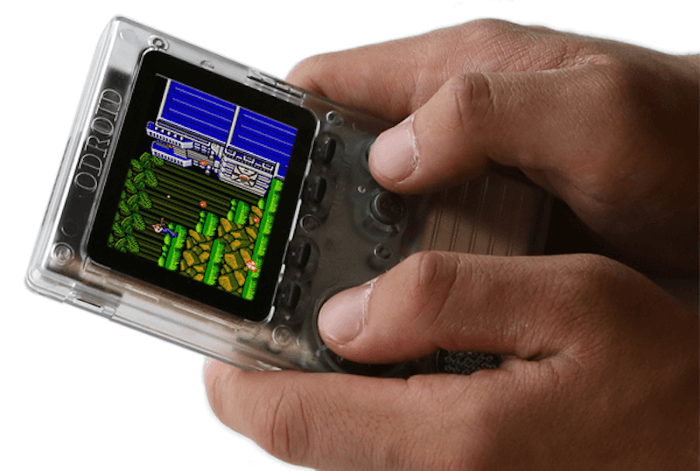

.. _odroid_go:

ODROID-GO
#########

Overview
********

ODROID-GO Game Kit is a "Do it yourself" ("DIY") portable game console by
HardKernel. It features a custom ESP32-WROVER with 16 MB flash and it operates
from 80 MHz - 240 MHz [1]_.

The features include the following:

- Dual core Xtensa microprocessor (LX6), running at 80 -  240MHz
- 4 MB of PSRAM
- 802.11b/g/n/e/i
- Bluetooth v4.2 BR/EDR and BLE
- 2.4 inch 320x240 TFT LCD
- Speaker
- Micro SD card slot
- Micro USB port (battery charging and USB_UART data communication
- Input Buttons (Menu, Volume, Select, Start, A, B, Direction Pad)
- Expansion port (I2C, GPIO, SPI)
- Cryptographic hardware acceleration (RNG, ECC, RSA, SHA-2, AES)

        ODROID-Go Game Kit

External Connector
------------------

+-------+------------------+-------------------------+
| PIN # | Signal Name      | ESP32-WROVER Functions  |
+=======+==================+=========================+
| 1     | GND              | GND                     |
+-------+------------------+-------------------------+
| 2     | VSPI.SCK (IO18)  | GPIO18, VSPICLK         |
+-------+------------------+-------------------------+
| 3     | IO12             | GPIO12                  |
+-------+------------------+-------------------------+
| 4     | IO15             | GPIO15, ADC2_CH3        |
+-------+------------------+-------------------------+
| 5     | IO4              | GPIO4, ADC2_CH0         |
+-------+------------------+-------------------------+
| 6     | P3V3             | 3.3 V                   |
+-------+------------------+-------------------------+
| 7     | VSPI.MISO (IO19) | GPIO19, VSPIQ           |
+-------+------------------+-------------------------+
| 8     | VSPI.MOSI (IO23) | GPIO23, VSPID           |
+-------+------------------+-------------------------+
| 9     | N.C              | N/A                     |
+-------+------------------+-------------------------+
| 10    | VBUS             | USB VBUS (5V)           |
+-------+------------------+-------------------------+

Supported Features
******************

The Zephyr odroid_go board configuration supports the following hardware
features:

+------------+------------+-------------------------------------+
| Interface  | Controller | Driver/Component                    |
+============+============+=====================================+
| UART       | on-chip    | serial port                         |
+------------+------------+-------------------------------------+
| GPIO       | on-chip    | gpio                                |
+------------+------------+-------------------------------------+
| PINMUX     | on-chip    | pinmux                              |
+------------+------------+-------------------------------------+
| I2C        | on-chip    | i2c                                 |
+------------+------------+-------------------------------------+

Programming
***********

Two components are required in order to build applications for this board: the
`toolchain`_ and the `SDK`_.  Both are provided by the SoC manufacturer.

The SDK contains headers and a hardware abstraction layer library (provided only
as object files) that are required for the port to function.

The toolchain is available for Linux, Windows, and macOS hosts and instructions
to obtain and set them up are available in the `ESP-IDF repository
<https://github.com/espressif/esp-idf>`_, as explained in the
`ESP-IDF Programming Guide <SDK>`_.

Set up build environment
------------------------

With both the toolchain and SDK installed, the Zephyr build system must be
instructed to use this particular variant by setting the following shell
variables:

.. code-block:: console

   export ZEPHYR_TOOLCHAIN_VARIANT="espressif"
   export ESPRESSIF_TOOLCHAIN_PATH="/path/to/xtensa-esp32-elf/"

Flashing
--------

The usual ``flash`` target will work with the ``odroid_go`` board configuration.
Here is an example for the :ref:`hello_world` application.

.. zephyr-app-commands::
   :zephyr-app: samples/hello_world
   :host-os: unix
   :board: odroid_go
   :goals: build
   :gen-args: -DESP_IDF_PATH=/path/to/esp-idf/

Refer to :ref:`build_an_application` and :ref:`application_run` for more
details.

All flashing options are handled by the :ref:`west` tool, including flashing
with custom options such as a different serial port.  The ``west`` tool supports
specific options for the ESP32 board, as listed here:

  --esp-idf-path ESP_IDF_PATH
                        path to ESP-IDF
  --esp-device ESP_DEVICE
                        serial port to flash, default /dev/ttyUSB0
  --esp-baud-rate ESP_BAUD_RATE
                        serial baud rate, default 921600
  --esp-flash-size ESP_FLASH_SIZE
                        flash size, default "detect"
  --esp-flash-freq ESP_FLASH_FREQ
                        flash frequency, default "40m"
  --esp-flash-mode ESP_FLASH_MODE
                        flash mode, default "dio"
  --esp-tool ESP_TOOL   complete path to espidf, default is to search for it in
                        [ESP_IDF_PATH]/components/esptool_py/esptool/esptool.py
  --esp-flash-bootloader ESP_FLASH_BOOTLOADER
                        Bootloader image to flash
  --esp-flash-partition_table ESP_FLASH_PARTITION_TABLE
                        Partition table to flash

For example, to flash to ``/dev/ttyUSB0``, use the following command after
having build the application in the ``build`` directory:

.. code-block:: console

   west flash -d build/ --skip-rebuild --esp-tool=/path/to/esp-idf/components/esptool_py/esptool/esptool.py --esp-device /dev/ttyUSB0

Connect ODROID-GO to your PC via the mini USB port and run your favorite
terminal program to listen for output.

.. code-block:: console

   minicom -D /dev/ttyUSB0 -b 115200

Power off and then power on ODROID-GO. You should see the following message in
your terminal:

.. code-block:: console

   Hello World! odroid_go

References
**********

.. [1] https://wiki.odroid.com/odroid_go/odroid_go
.. _`toolchain`: https://docs.espressif.com/projects/esp-idf/en/latest/get-started/index.html#get-started-setup-toolchain
.. _`SDK`: https://docs.espressif.com/projects/esp-idf/en/latest/get-started/index.html#get-started-get-esp-idf

.. target-notes::

