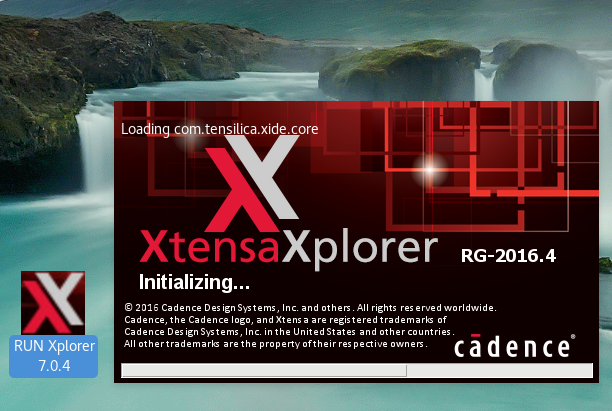

.. _xt-sim:

Xtensa simulator
################

Overview
********

The Xtensa processor architecture is a configurable, extensible, and
synthesizable 32-bit RISC processor core. Processor and SOC vendors can select
from various processor options and even create customized instructions in
addition to a base ISA to tailor the processor for a particular application.

For more information, see https://ip.cadence.com/ipportfolio/tensilica-ip/xtensa-customizable

Zephyr applications use the xt-sim configuration to run on the Xtensa simulator
emulating Xtensa hardware.

     Xtensa Xplorer

Hardware
********

The following Xtensa cores are officially supported:

- hifi3_bd5
- XRC_FUSION_AON_ALL_LM
- D_108mini
- D_212GP
- D_233L
- hifi_mini_4swIrq (call0 ABI, added 4 SW IRQ for tests and 1 timer level 1)
- hifi2_std
- XRC_D2PM_5swIrq (added 4 SW IRQ for tests and 1 timer level 1)
- hifi4_bd7 (Big Endian)
- hifi3_bd5_call0 (call0 ABI, added 3 SW IRQs for tests)

System Clock
============

Xtensa cores can be configured to use either internal or external timers.
The frequency of the clock under simulation is set to 25MHz.

System requirements
*******************

Prerequisites
=============
A Linux host system is required for Xtensa development work.
We recommend using a __``Debian 9.x (Stretch)``__ or recent __``Ubuntu``__
releases (with multilib support).

Only Xtensa tools version ``RF-2016.4-linux`` or later are officially
supported. Other versions may work but are not supported by Cadence Systems Inc.

In order to set up the Zephyr OS build system, a Linux 32-bit GCC compiler must
be installed on the building linux box. Install GCC if needed either by
downloading ``Zephyr SDK`` or by using your distribution package manager.

On Debian/Ubuntu systems, you can install ``gcc-multilib`` package as follows:

.. code-block:: console

    #aptitude install gcc-multilib # Or what ever package manager (apt, apt-get, ...)

Set up build environment
========================

We recommend you create a ``~/.zephyrrc`` file, a shell script that shall be
sourced each time before you start working on Zephyr.
You can use the following code to create that file:

.. code-block:: console

    $ cat > ~/.zephyrrc
    if test "${CROSS}" = xcc
    then
    	export ARCH=xtensa
    	export BOARD=xt-sim
        export ZEPHYR_TOOLCHAIN_VARIANT=xcc
    	export XTENSA_TOOLS_PATH=/opt/xtensa/XtDevTools/install/tools/RG-2016.4-linux/XtensaTools
    	export XTENSA_BUILDS_PATH=/opt/xtensa/XtDevTools/install/builds/RG-2016.4-linux
    	#export XTENSA_BUILD_DIR= #Keep empty to use default directory
    	export EMU_PLATFORM=xt-run
    elif test "${CROSS}" = zephyr-xtensa
    then
    	export ARCH=xtensa
    	export BOARD=qemu
    	export ZEPHYR_TOOLCHAIN_VARIANT=zephyr
    	export ZEPHYR_SDK_INSTALL_DIR=/opt/xtensa/zephyr-sdk-64-INTERNAL-11-22-2016
    elif test "${CROSS}" = zephyr-x86
    then
    	export ARCH=x86
    	export BOARD=qemu_x86
    	export ZEPHYR_TOOLCHAIN_VARIANT=zephyr
    	export ZEPHYR_SDK_INSTALL_DIR=/opt/xtensa/zephyr-sdk-64-INTERNAL-11-22-2016
    else
    	echo "Unsupported compiler '${CROSS}' defined by environment variable CROSS"
    fi

Once the ``~/.zephyrrc`` file is created, you can start working. However, each
time you start a new shell you will need to execute the following commands
before you can compile anything:

.. code-block:: console

    $ cd path/to/zephyr # replace path/to by a real path
    $ CROSS=xcc source zephyr-env.sh # Select xcc as compiler

Adding a user-defined Xtensa core
=================================
Add your own core to the list of supported cores as follows:

.. code-block:: console

    $ XTENSA_CORE=myCore
    $ $(which echo) -e "config ${XTENSA_CORE}\n\tbool \"${XTENSA_CORE} core\"\n" >> "soc/xtensa/Kconfig.cores"

Create a folder for that core:

.. code-block:: console

    $ mkdir soc/xtensa/${XTENSA_CORE}

Create and copy to that folder a custom linker script (more on linker script in next section):

.. code-block:: console

    $ cp  linker.ld  soc/xtensa/${XTENSA_CORE}/linker.ld

Add a Makefile:

.. code-block:: console

    $ echo "obj-y = soc.o" > soc/xtensa/${XTENSA_CORE}/Makefile

Add Zephyr specific sections to the linker script.
The file "soc/xtensa/linker_more.ld" contains Zephyr-specific linker
sections that should be added to the default linker script linker.ld (inside
SECTIONS region). If you are not using a linker script, you must create one
and add these sections. The memory segment and PHDR should be replaced by
appropriate values. See :file:`soc/xtensa/hifi3_bd5/linker.ld` for an example.

The linker script should be named ``linker.ld`` and placed in the directory
``soc/xtensa/${XTENSA_CORE}``.

Configuring build
=================

.. zephyr-app-commands::
   :zephyr-app: tests/kernel/test_build
   :goals: menuconfig

Below is an example of usage for typical configuration:

1. Select ``Architecture``
    a. Select ``Xtensa architecture``
2. Select ``XTENSA core Selection``
    a. Select appropriate core (example ``hifi3_bd5 core``)
3. Select ``XTENSA Options``
    a. Set ``Hardware clock cycles per second`` to appropriate value
    b. Set ``The path to Xtensa tool`` to appropriate value
    c. Set ``The version of Xtensa tool`` to appropriate version
    d. Set ``Xtensa build directory`` to appropriate  value
4. Select ``Board Selection``
    a. Select ``Xtensa Development ISS``
5. Select ``Device Drivers``
    a. Uncheck ``Serial Drivers``
6. Select ``Compile and Link Features``
	a. Set compiler configuration and build options correctly to project requirements
7. Hit ``Exit`` and confirm saving the changes.

You may need to change other options in menuconfig depending on his project
specific needs.

Compiling and running
=====================
The Xtensa executable can be run in the simulator either with a standalone core,
or with a core connected to simulated peripherals.

Build and run as follows:

.. zephyr-app-commands::
   :goals: run

References
**********

.. _Xtensa tools: https://ip.cadence.com/support/sdk-evaluation-request

