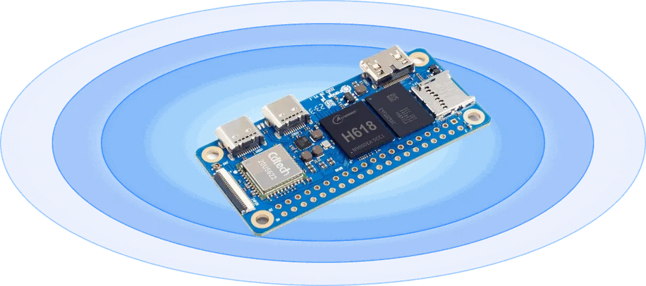

.. SPDX-License-Identifier: Apache-2.0

.. zephyr:board:: opi_zero2w

Orange Pi Zero 2W
#################

Overview
********

`Orange Pi Zero 2W`_ is an open-source single-board computer. It uses the Allwinner H618 SoC and comes with 1GB, 1.5GB, or 2GB of LPDDR4 SDRAM.
The Allwinner H618 SoC is based on a quad-core ARM Cortex-A53 processor.

Hardware
********

Supported Features
==================

.. zephyr:board-supported-hw::

Programming and Debugging
*************************

.. zephyr:board-supported-runners::

The Allwinner H618 SoC needs to be initialized prior to running a Zephyr application. This can be
achieved in a number of ways (e.g. Das U-Boot Secondary Program Loader (SPL), ...).

The instructions here use the U-Boot SPL. For further details and instructions for using Das U-Boot
with Allwinner SoCs, see the following documentation:

- `Das U-Boot Website`_
- `Using U-Boot With Allwinner SoCs`_

Building Das U-Boot
===================

Clone and build Das U-Boot for the Orange Pi Zero 2W:

.. code-block:: console

   git clone -b v2024.01 https://source.denx.de/u-boot/u-boot.git
   cd u-boot
   make distclean
   make orangepi_zero2w_defconfig
   export CROSS_COMPILE=aarch64-none-linux-gnu-
   make
   sudo dd if=u-boot-sunxi-with-spl.bin of=/dev/mmcblkX bs=1024 seek=8

Building and Flashing
=====================

.. zephyr-app-commands::
   :zephyr-app: samples/hello_world
   :host-os: unix
   :board: opi_zero2w
   :goals: build

Copy the compiled ``zephyr.bin`` to the boot directory of the SD card and plug it into the board.

.. code-block:: console

   => fatload mmc 0:1 0x40080000 zephyr.bin
   => go 0x40080000

You should see the following output on the serial console:

.. code-block:: text

   *** Booting Zephyr OS vx.x.x ***
   Hello World! opi_zero2w/sun50i_h618

.. _Orange Pi Zero 2W:
   http://www.orangepi.org/html/hardWare/computerAndMicrocontrollers/details/Orange-Pi-Zero-2W.html

.. _Das U-Boot Website:
   https://docs.u-boot.org/en/latest/

.. _Using U-Boot With Allwinner SoCs:
   https://docs.u-boot.org/en/stable/board/allwinner/sunxi.html
