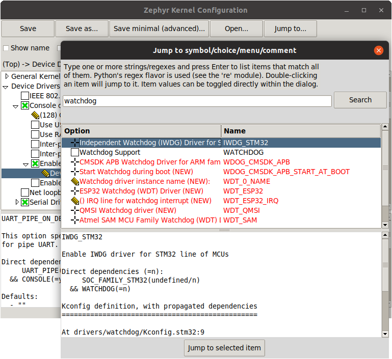

.. _application:

Application Development
#######################

.. note::

   In this document, we'll assume your **application directory** is
   :file:`<home>/app`, and that its **build directory** is
   :file:`<home>/app/build`.
   (These terms are defined in the following Overview.)
   On Linux/macOS, <home> is equivalent to ``~``, whereas on Windows it's
   ``%userprofile%``.

Overview
********

Zephyr's build system is based on `CMake`_.

The build system is application-centric, and requires Zephyr-based applications
to initiate building the kernel source tree. The application build controls
the configuration and build process of both the application and Zephyr itself,
compiling them into a single binary.

Zephyr's base directory hosts Zephyr's own source code, its kernel
configuration options, and its build definitions.

The files in the **application directory** link Zephyr with the
application. This directory contains all application-specific files, such as
configuration options and source code.

An application in its simplest form has the following contents:

.. code-block:: none

   <home>/app
   ├── CMakeLists.txt
   ├── prj.conf
   └── src
       └── main.c

These contents are:

* **CMakeLists.txt**: This file tells the build system where to find the other
  application files, and links the application directory with Zephyr's CMake
  build system. This link provides features supported by Zephyr's build system,
  such as board-specific kernel configuration files, the ability to run and
  debug compiled binaries on real or emulated hardware, and more.

* **Kernel configuration files**: An application typically provides a
  configuration file (usually called :file:`prj.conf`) that specifies
  application-specific values for one or more kernel configuration options.
  These application settings are merged with board-specific settings to produce
  a kernel configuration.

  The :ref:`application_kconfig` section below goes over application
  configuration in detail.

* **Application source code files**: An application typically provides one
  or more application-specific files, written in C or assembly language. These
  files are usually located in a sub-directory called :file:`src`.

Once an application has been defined, you can use CMake to create project files
for building it from a directory where you want to host these files. This is
known as the **build directory**. Application build artifacts are always
generated in a build directory; Zephyr does not support "in-tree" builds.

The following sections describe how to create, build, and run Zephyr
applications, followed by more detailed reference material.

.. _source_tree_v2:

Source Tree Structure
*********************

Understanding the Zephyr source tree can be helpful in locating the code
associated with a particular Zephyr feature.

At the top of the tree there are several files that are of importance:

:file:`CMakeLists.txt`
    The top-level file for the CMake build system, containing a lot of the
    logic required to build Zephyr.

:file:`Kconfig`
    The top-level Kconfig file, which refers to the file :file:`Kconfig.zephyr`
    also found at the top-level directory.

:file:`west.yml`
    The :ref:`west` manifest, listing the external repositories managed by
    the west command-line tool.

The Zephyr source tree also contains the following top-level
directories, each of which may have one or more additional levels of
subdirectories which are not described here.

:file:`arch`
    Architecture-specific kernel and system-on-chip (SoC) code.
    Each supported architecture (for example, x86 and ARM)
    has its own subdirectory,
    which contains additional subdirectories for the following areas:

    * architecture-specific kernel source files
    * architecture-specific kernel include files for private APIs

:file:`soc`
    SoC related code and configuration files.

:file:`boards`
    Board related code and configuration files.

:file:`doc`
    Zephyr technical documentation source files and tools used to
    generate the https://docs.zephyrproject.org web content.

:file:`drivers`
    Device driver code.

:file:`dts`
    :ref:`device-tree` source files used to describe non-discoverable
    board-specific hardware details.

:file:`ext`
    Externally created code that has been integrated into Zephyr
    from other sources and that must live inside the zephyr repository unlike
    `external projects <modules>`_

:file:`include`
    Include files for all public APIs, except those defined under :file:`lib`.

:file:`kernel`
    Architecture-independent kernel code.

:file:`lib`
    Library code, including the minimal standard C library.

:file:`misc`
    Miscellaneous code that doesn't belong to any of the other top-level
    directories.

:file:`samples`
    Sample applications that demonstrate the use of Zephyr features.

:file:`scripts`
    Various programs and other files used to build and test Zephyr
    applications.

:file:`cmake`
    Additional build scripts needed to build Zephyr.

:file:`subsys`
    Subsystems of Zephyr, including:

    * USB device stack code.
    * Networking code, including the Bluetooth stack and networking stacks.
    * File system code.
    * Bluetooth host and controller

:file:`tests`
    Test code and benchmarks for Zephyr features.

Creating an Application
***********************

Follow these steps to create a new application directory. (Refer to
:ref:`samples-and-demos` for existing applications provided as part of Zephyr.)

#. Create an application directory on your workstation computer, outside of the
   Zephyr base directory.  Usually you'll want to create it somewhere under
   your user's home directory.

   For example, in a Unix shell or Windows ``cmd.exe`` prompt, navigate to
   where you want to create your application, then enter:

   .. code-block:: console

      mkdir app

   .. warning::

      Building Zephyr or creating an application in a directory with spaces
      anywhere on the path is not supported. So the Windows path
      :file:`C:\\Users\\YourName\\app` will work, but :file:`C:\\Users\\Your
      Name\\app` will not.

#. It's recommended to place all application source code in a subdirectory
   named :file:`src`.  This makes it easier to distinguish between project
   files and sources.

   Continuing the previous example, enter:

   .. code-block:: console

      cd app
      mkdir src

#. Place your application source code in the :file:`src` sub-directory. For
   this example, we'll assume you created a file named :file:`src/main.c`.

#. Create a file named :file:`CMakeLists.txt` in the ``app`` directory with the
   following contents:

   .. code-block:: cmake

      # Boilerplate code, which pulls in the Zephyr build system.
      cmake_minimum_required(VERSION 3.13.1)
      include($ENV{ZEPHYR_BASE}/cmake/app/boilerplate.cmake NO_POLICY_SCOPE)
      project(my_zephyr_app)

      # Add your source file to the "app" target. This must come after
      # the boilerplate code, which defines the target.
      target_sources(app PRIVATE src/main.c)

   The boilerplate code sets the minimum CMake version and pulls in the Zephyr
   build system, which creates a CMake target named ``app``. Adding sources
   to this target is how you include them in the build.

   .. note:: ``cmake_minimum_required()`` is also invoked from
             :file:`boilerplate.cmake`. The most recent of the two
             versions will be enforced by CMake.

#. Set any Kconfig values needed by your application. Zephyr uses the same
   Kconfig system as the Linux kernel, but with its own database of
   configuration options.

   For example, create a file named :file:`prj.conf` in the :file:`app`
   directory, and enable or disable Kconfig features as needed. You can use
   existing :ref:`samples-and-demos` to get started with Kconfig variables you
   are interested in.  See :ref:`application_kconfig` for more details, and
   :ref:`configuration_options` for a complete list of available options.

#. Optionally, you can also configure any devicetree overlays needed by your
   application. See :ref:`application_dt` below for details.

.. _important-build-vars:

Important Build System Variables
********************************

You can control the Zephyr build system using many variables. This
section describes the most important ones that every Zephyr developer
should know about.

.. note::

   The variables :makevar:`BOARD`, :makevar:`CONF_FILE`, and
   :makevar:`DTC_OVERLAY_FILE` can be supplied to the build system in
   3 ways (in order of precedence):

   * As a parameter to the ``west build`` or ``cmake`` invocation via the
     ``-D`` command-line switch
   * As :ref:`env_vars`.
   * As a ``set(<VARIABLE> <VALUE>)`` statement in your :file:`CMakeLists.txt`

* :makevar:`ZEPHYR_BASE`: Sets the path to the directory containing Zephyr,
  which is needed by the build system's boilerplate file.  This is an
  environment variable set by the :file:`zephyr-env.sh` script on Linux/macOS
  or :file:`zephyr-env.cmd` on Windows, as you learned when getting started
  with Zephyr in :ref:`getting_started_run_sample`. You can also set
  :makevar:`ZEPHYR_BASE` explicitly, but then you won't get the other features
  provided by those scripts.

* :makevar:`BOARD`: Selects the board that the application's build
  will use for the default configuration.  See :ref:`boards` for
  built-in boards, and :ref:`board_porting_guide` for information on
  adding board support.

* :makevar:`CONF_FILE`: Indicates the name of one or more configuration
  fragment files. Multiple filenames can be separated with either spaces or
  semicolons. Each file includes Kconfig configuration values that override
  the default configuration values.

* :makevar:`DTC_OVERLAY_FILE`: Indicates the name of one or more devicetree
  overlay files. Multiple filenames can be separated with either spaces or
  semicolons. Each file includes devicetree values that override the default
  DT values. See :ref:`application_dt` below for details on devicetree
  overlays, and :ref:`device-tree` for an overview on devicetree and Zephyr.

* :makevar:`ZEPHYR_MODULES`: A CMake list containing absolute paths of
  additional directories with source code, Kconfig, etc. that should be used in
  the application build. See :ref:`modules` for details.

.. _build_an_application:

Building an Application
***********************

The Zephyr build system compiles and links all components of an application
into a single application image that can be run on simulated hardware or real
hardware.

Like any other CMake-based system, the build process takes place :ref:`in
two stages <cmake-details>`. First, build files (also known as a buildsystem)
are generated using the ``cmake`` command-line tool while specifying a
generator. This generator determines the native build tool the buildsystem
will use in the second stage.
The second stage runs the native build tool to actually build the
source files and generate an image. To learn more about these concepts refer to
the `CMake introduction`_ in the official CMake documentation.

Although the default build tool in Zephyr is :std:ref:`west <west>`, Zephyr's
meta-tool, which invokes ``cmake`` and the underlying build tool (``ninja`` or
``make``) behind the scenes, you can also choose to invoke ``cmake`` directly if
you prefer.  On Linux and macOS you can choose between the ``make`` and
``ninja``
generators (i.e. build tools), whereas on Windows you need to use ``ninja``,
since ``make`` is not supported on this platform.
For simplicity we will use ``ninja`` throughout this guide, and if you
choose to use ``west build`` to build your application know that it will
default to ``ninja`` under the hood.

As an example, let's build the Hello World sample for the ``reel_board``:

.. zephyr-app-commands::
   :tool: all
   :app: samples/hello_world
   :board: reel_board
   :goals: build

On Linux and macOS, you can also build with ``make`` instead of ``ninja``:

Using west:

- to use ``make`` just once, add ``-- -G"Unix Makefiles"`` to the west build
  command line; see the :ref:`west build <west-building-generator>`
  documentation for an example.
- to use ``make`` by default from now on, run ``west config build.generator
  "Unix Makefiles"``.

Using CMake directly:

.. zephyr-app-commands::
   :tool: cmake
   :app: samples/hello_world
   :generator: make
   :host-os: unix
   :board: reel_board
   :goals: build

Basics
======

#. Navigate to the application directory :file:`<home>/app`.
#. Enter the following commands to build the application's :file:`zephyr.elf`
   image for the board specified in the command-line parameters:

   .. zephyr-app-commands::
      :tool: all
      :cd-into:
      :board: <board>
      :goals: build

   If desired, you can build the application using the configuration settings
   specified in an alternate :file:`.conf` file using the :code:`CONF_FILE`
   parameter. These settings will override the settings in the application's
   :file:`.config` file or its default :file:`.conf` file. For example:

   .. zephyr-app-commands::
      :tool: all
      :cd-into:
      :board: <board>
      :gen-args: -DCONF_FILE=prj.alternate.conf
      :goals: build
      :compact:

   As described in the previous section, you can instead choose to permanently
   set the board and configuration settings by either exporting :makevar:`BOARD`
   and :makevar:`CONF_FILE` environment variables or by setting their values
   in your :file:`CMakeLists.txt` using ``set()`` statements.
   Additionally, ``west`` allows you to :ref:`set a default board
   <west-building-config>`.

Build Directory Contents
========================

When using the Ninja generator a build directory looks like this:

.. code-block:: none

   <home>/app/build
   ├── build.ninja
   ├── CMakeCache.txt
   ├── CMakeFiles
   ├── cmake_install.cmake
   ├── rules.ninja
   └── zephyr

The most notable files in the build directory are:

* :file:`build.ninja`, which can be invoked to build the application.

* A :file:`zephyr` directory, which is the working directory of the
  generated build system, and where most generated files are created and
  stored.

After running ``ninja``, the following build output files will be written to
the :file:`zephyr` sub-directory of the build directory. (This is **not the
Zephyr base directory**, which contains the Zephyr source code etc. and is
described above.)

* :file:`.config`, which contains the configuration settings
  used to build the application.

  .. note::

     The previous version of :file:`.config` is saved to :file:`.config.old`
     whenever the configuration is updated. This is for convenience, as
     comparing the old and new versions can be handy.

* Various object files (:file:`.o` files and :file:`.a` files) containing
  compiled kernel and application code.

* :file:`zephyr.elf`, which contains the final combined application and
  kernel binary. Other binary output formats, such as :file:`.hex` and
  :file:`.bin`, are also supported.

Rebuilding an Application
=========================

Application development is usually fastest when changes are continually tested.
Frequently rebuilding your application makes debugging less painful
as the application becomes more complex. It's usually a good idea to
rebuild and test after any major changes to the application's source files,
CMakeLists.txt files, or configuration settings.

.. important::

    The Zephyr build system rebuilds only the parts of the application image
    potentially affected by the changes. Consequently, rebuilding an application
    is often significantly faster than building it the first time.

Sometimes the build system doesn't rebuild the application correctly
because it fails to recompile one or more necessary files. You can force
the build system to rebuild the entire application from scratch with the
following procedure:

#. Open a terminal console on your host computer, and navigate to the
   build directory :file:`<home>/app/build`.

#. Enter one of the following commands, depending on whether you want to use
   ``west`` or ``cmake`` directly to delete the application's generated
   files, except for the :file:`.config` file that contains the
   application's current configuration information.

   .. code-block:: console

       west build -t clean

   or

   .. code-block:: console

       ninja clean

   Alternatively, enter one of the following commands to delete *all*
   generated files, including the :file:`.config` files that contain
   the application's current configuration information for those board
   types.

   .. code-block:: console

       west build -t pristine

   or

   .. code-block:: console

       ninja pristine

   If you use west, you can take advantage of its capability to automatically
   :ref:`make the build folder pristine <west-building-config>` whenever it is
   required.

#. Rebuild the application normally following the steps specified
   in :ref:`build_an_application` above.

.. _application_run:

Run an Application
******************

An application image can be run on a real board or emulated hardware.

.. _application_run_board:

Running on a Board
==================

Most boards supported by Zephyr let you flash a compiled binary using
the ``flash`` target to copy the binary to the board and run it.
Follow these instructions to flash and run an application on real
hardware:

#. Build your application, as described in :ref:`build_an_application`.

#. Make sure your board is attached to your host computer. Usually, you'll do
   this via USB.

#. Run one of these console commands from the build directory,
   :file:`<home>/app/build`, to flash the compiled Zephyr image and run it on
   your board:

   .. code-block:: console

      west flash

   or

   .. code-block:: console

      ninja flash

The Zephyr build system integrates with the board support files to
use hardware-specific tools to flash the Zephyr binary to your
hardware, then run it.

Each time you run the flash command, your application is rebuilt and flashed
again.

In cases where board support is incomplete, flashing via the Zephyr build
system may not be supported. If you receive an error message about flash
support being unavailable, consult :ref:`your board's documentation <boards>`
for additional information on how to flash your board.

.. note:: When developing on Linux, it's common to need to install
          board-specific udev rules to enable USB device access to
          your board as a non-root user. If flashing fails,
          consult your board's documentation to see if this is
          necessary.

.. _application_run_qemu:

Running in an Emulator
======================

The kernel has built-in emulator support for QEMU (on Linux/macOS only, this
is not yet supported on Windows). It allows you to run and test an application
virtually, before (or in lieu of) loading and running it on actual target
hardware. Follow these instructions to run an application via QEMU:

#. Build your application for one of the QEMU boards, as described in
   :ref:`build_an_application`.

   For example, you could set ``BOARD`` to:

   - ``qemu_x86`` to emulate running on an x86-based board
   - ``qemu_cortex_m3`` to emulate running on an ARM Cortex M3-based board

#. Run one of these console commands from the build directory,
   :file:`<home>/app/build`, to run the Zephyr binary in QEMU:

   .. code-block:: console

      west build -t run

   or

   .. code-block:: console

      ninja run

#. Press :kbd:`Ctrl A, X` to stop the application from running
   in QEMU.

   The application stops running and the terminal console prompt
   redisplays.

Each time you execute the run command, your application is rebuilt and run
again.

.. note::

   If the (Linux only) :ref:`Zephyr SDK <zephyr_sdk>` is installed, the ``run``
   target will use the SDK's QEMU binary by default. To use another version of
   QEMU, :ref:`set the environment variable <env_vars>` :envvar:`QEMU_BIN_PATH`
   to the path of the QEMU binary you want to use instead.

.. _application_debugging:
.. _custom_board_definition:

Custom Board, DeviceTree and SOC Definitions
********************************************

In cases where the board or platform you are developing for is not yet
supported by Zephyr, you can add board, DeviceTree and SOC definitions
to your application without having to add them to the Zephyr tree.

The structure needed to support out-of-tree board and SOC development
is similar to how boards and SOCs are maintained in the Zephyr tree. By using
this structure, it will be much easier to upstream your platform related work into
the Zephyr tree after your initial development is done.

Add the custom board to your application or a dedicated repository using the
following structure:

.. code-block:: console

   boards/
   soc/
   CMakeLists.txt
   prj.conf
   README.rst
   src/

where the ``boards`` directory hosts the board you are building for:

.. code-block:: console

   .
   ├── boards
   │   └── x86
   │       └── my_custom_board
   │           ├── doc
   │           │   └── img
   │           └── support
   └── src

and the ``soc`` directory hosts any SOC code. You can also have boards that are
supported by a SOC that is available in the Zephyr tree.

Boards
======

Use the proper architecture folder name (e.g., ``x86``, ``arm``, etc.)
under ``boards`` for ``my_custom_board``.  (See  :ref:`boards` for a
list of board architectures.)

Documentation (under ``doc/``) and support files (under ``support/``) are optional, but
will be needed when submitting to Zephyr.

The contents of ``my_custom_board`` should follow the same guidelines for any
Zephyr board, and provide the following files::

    my_custom_board_defconfig
    my_custom_board.dts
    my_custom_board.yaml
    board.cmake
    board.h
    CMakeLists.txt
    doc/
    dts_fixup.h
    Kconfig.board
    Kconfig.defconfig
    pinmux.c
    support/

Once the board structure is in place, you can build your application
targeting this board by specifying the location of your custom board
information with the ``-DBOARD_ROOT`` parameter to the CMake
build system:

.. zephyr-app-commands::
   :tool: all
   :board: <board name>
   :gen-args: -DBOARD_ROOT=<path to boards>
   :goals: build
   :compact:

This will use your custom board configuration and will generate the
Zephyr binary into your application directory.

You can also define the ``BOARD_ROOT`` variable in the application
:file:`CMakeLists.txt` file.

SOC Definitions
===============

Similar to board support, the structure is similar to how SOCs are maintained in
the Zephyr tree, for example:

.. code-block:: console

        soc
        └── arm
            └── st_stm32
                    ├── common
                    └── stm32l0

The paths to any Kconfig files inside the structure needs to prefixed with
$(SOC_DIR) to make Kconfig aware of the location of the Kconfig files related to
the custom SOC.

In the ``soc`` directory you will need a top-level Kconfig file pointing to the
custom SOC definitions:

.. code-block:: console

	choice
		prompt "SoC/CPU/Configuration Selection"

	source "$(SOC_DIR)/$(ARCH)/\*/Kconfig.soc"

	endchoice

	menu "Hardware Configuration"
	osource "$(SOC_DIR)/$(ARCH)/\*/Kconfig"

	endmenu

Once the SOC structure is in place, you can build your application
targeting this platform by specifying the location of your custom platform
information with the ``-DSOC_ROOT`` parameter to the CMake
build system:

.. zephyr-app-commands::
   :tool: all
   :board: <board name>
   :gen-args: -DSOC_ROOT=<path to soc> -DBOARD_ROOT=<path to boards>
   :goals: build
   :compact:

This will use your custom platform configurations and will generate the
Zephyr binary into your application directory.

You can also define the ``SOC_ROOT`` variable in the application
:file:`CMakeLists.txt` file.

DeviceTree Definitions
======================

DeviceTree directory trees are found in ``APPLICATION_SOURCE_DIR``,
``BOARD_DIR``, and ``ZEPHYR_BASE``, but additional trees, or DTS_ROOTs,
can be added by creating this directory tree::

    include/
    dts/common/
    dts/arm/
    dts/
    dts/bindings/

Where 'arm' is changed to the appropriate architecture. Each directory
is optional. The binding directory contains bindings and the other
directories contain files that can be included from DT sources.

Once the directory structure is in place, you can use it by specifying
its location through the ``DTS_ROOT`` CMake Cache variable:

.. zephyr-app-commands::
   :tool: all
   :board: <board name>
   :gen-args: -DDTS_ROOT=<path to dts root>
   :goals: build
   :compact:

You can also define the variable in the application
:file:`CMakeLists.txt` file.

Application Debugging
*********************

This section is a quick hands-on reference to start debugging your
application with QEMU. Most content in this section is already covered in
`QEMU`_ and `GNU_Debugger`_ reference manuals.

.. _QEMU: http://wiki.qemu.org/Main_Page

.. _GNU_Debugger: http://www.gnu.org/software/gdb

In this quick reference, you'll find shortcuts, specific environmental
variables, and parameters that can help you to quickly set up your debugging
environment.

The simplest way to debug an application running in QEMU is using the GNU
Debugger and setting a local GDB server in your development system through QEMU.

You will need an Executable and Linkable Format (ELF) binary image for
debugging purposes.  The build system generates the image in the build
directory.  By default, the kernel binary name is
:file:`zephyr.elf`. The name can be changed using a Kconfig option.

We will use the standard 1234 TCP port to open a :abbr:`GDB (GNU Debugger)`
server instance. This port number can be changed for a port that best suits the
development environment.

You can run QEMU to listen for a "gdb connection" before it starts executing any
code to debug it.

.. code-block:: bash

   qemu -s -S <image>

will setup Qemu to listen on port 1234 and wait for a GDB connection to it.

The options used above have the following meaning:

* ``-S`` Do not start CPU at startup; rather, you must type 'c' in the
  monitor.
* ``-s`` Shorthand for :literal:`-gdb tcp::1234`: open a GDB server on
  TCP port 1234.

To debug with QEMU and to start a GDB server and wait for a remote connect, run
either of the following inside the build directory of an application:

.. code-block:: bash

   ninja debugserver

The build system will start a QEMU instance with the CPU halted at startup
and with a GDB server instance listening at the TCP port 1234.

Using a local GDB configuration :file:`.gdbinit` can help initialize your GDB
instance on every run.
In this example, the initialization file points to the GDB server instance.
It configures a connection to a remote target at the local host on the TCP
port 1234. The initialization sets the kernel's root directory as a
reference.

The :file:`.gdbinit` file contains the following lines:

.. code-block:: bash

   target remote localhost:1234
   dir ZEPHYR_BASE

.. note::

   Substitute the correct :ref:`ZEPHYR_BASE <env_vars_important>` for your
   system.

Execute the application to debug from the same directory that you chose for
the :file:`gdbinit` file. The command can include the ``--tui`` option
to enable the use of a terminal user interface. The following commands
connects to the GDB server using :file:`gdb`. The command loads the symbol
table from the elf binary file. In this example, the elf binary file name
corresponds to :file:`zephyr.elf` file:

.. code-block:: bash

   ..../path/to/gdb --tui zephyr.elf

.. note::

   The GDB version on the development system might not support the --tui
   option. Please make sure you use the GDB binary from the SDK which
   corresponds to the toolchain that has been used to build the binary.

If you are not using a .gdbinit file, issue the following command inside GDB to
connect to the remote GDB server on port 1234:

.. code-block:: bash

   (gdb) target remote localhost:1234

Finally, the command below connects to the GDB server using the Data
Displayer Debugger (:file:`ddd`). The command loads the symbol table from the
elf binary file, in this instance, the :file:`zephyr.elf` file.

The :abbr:`DDD (Data Displayer Debugger)` may not be installed in your
development system by default. Follow your system instructions to install
it. For example, use ``sudo apt-get install ddd`` on an Ubuntu system.

.. code-block:: bash

   ddd --gdb --debugger "gdb zephyr.elf"

Both commands execute the :abbr:`gdb (GNU Debugger)`. The command name might
change depending on the toolchain you are using and your cross-development
tools.

Eclipse Debugging
*****************

Overview
========

CMake supports generating a project description file that can be imported into
the Eclipse Integrated Development Environment (IDE) and used for graphical
debugging.

The `GNU MCU Eclipse plug-ins`_ provide a mechanism to debug ARM projects in
Eclipse with pyOCD, Segger J-Link, and OpenOCD debugging tools.

The following tutorial demonstrates how to debug a Zephyr application in
Eclipse with pyOCD in Windows. It assumes you have already installed the GCC
ARM Embedded toolchain and pyOCD.

Set Up the Eclipse Development Environment
==========================================

#. Download and install `Eclipse IDE for C/C++ Developers`_.

#. In Eclipse, install the GNU MCU Eclipse plug-ins by opening the menu
   ``Window->Eclipse Marketplace...``, searching for ``GNU MCU Eclipse``, and
   clicking ``Install`` on the matching result.

#. Configure the path to the pyOCD GDB server by opening the menu
   ``Window->Preferences``, navigating to ``MCU``, and setting the ``Global
   pyOCD Path``.

Generate and Import an Eclipse Project
======================================

#. Set up a GNU Arm Embedded toolchain as described in
   :ref:`third_party_x_compilers`.

#. Navigate to a folder outside of the Zephyr tree to build your application.

   .. code-block:: console

      # On Windows
      cd %userprofile%

   .. note::
      If the build directory is a subdirectory of the source directory, as is
      usually done in Zephyr, CMake will warn:

      "The build directory is a subdirectory of the source directory.

      This is not supported well by Eclipse.  It is strongly recommended to use
      a build directory which is a sibling of the source directory."

#. Configure your application with CMake and build it with ninja. Note the
   different CMake generator specified by the ``-G"Eclipse CDT4 - Ninja"``
   argument. This will generate an Eclipse project description file,
   :file:`.project`, in addition to the usual ninja build files.

   .. zephyr-app-commands::
      :tool: all
      :app: %ZEPHYR_BASE%\samples\synchronization
      :host-os: win
      :board: frdm_k64f
      :gen-args: -G"Eclipse CDT4 - Ninja"
      :goals: build
      :compact:

#. In Eclipse, import your generated project by opening the menu
   ``File->Import...`` and selecting the option ``Existing Projects into
   Workspace``. Browse to your application build directory in the choice,
   ``Select root directory:``. Check the box for your project in the list of
   projects found and click the ``Finish`` button.

Create a Debugger Configuration
===============================

#. Open the menu ``Run->Debug Configurations...``.

#. Select ``GDB PyOCD Debugging``, click the ``New`` button, and configure the
   following options:

   - In the Main tab:

     - Project: my_zephyr_app@build
     - C/C++ Application: :file:`zephyr/zephyr.elf`

   - In the Debugger tab:

     - pyOCD Setup

       - Executable path: :file:`${pyocd_path}\\${pyocd_executable}`
       - Uncheck "Allocate console for semihosting"

     - Board Setup

       - Bus speed: 8000000 Hz
       - Uncheck "Enable semihosting"

     - GDB Client Setup

       - Executable path example (use your :envvar:`GNUARMEMB_TOOLCHAIN_PATH`):
         :file:`C:\\gcc-arm-none-eabi-6_2017-q2-update\\bin\\arm-none-eabi-gdb.exe`

   - In the SVD Path tab:

     - File path: :file:`<zephyr
       base>\\ext\\hal\\nxp\\mcux\\devices\\MK64F12\\MK64F12.xml`

     .. note::
	This is optional. It provides the SoC's memory-mapped register
	addresses and bitfields to the debugger.

#. Click the ``Debug`` button to start debugging.

RTOS Awareness
==============

Support for Zephyr RTOS awareness is implemented in `pyOCD v0.11.0`_ and later.
It is compatible with GDB PyOCD Debugging in Eclipse, but you must enable
CONFIG_OPENOCD_SUPPORT=y in your application.

.. _cmake-details:

CMake Details
*************

Overview
========

CMake is used to build your application together with the Zephyr kernel. A
CMake build is done in two stages. The first stage is called
**configuration**. During configuration, the CMakeLists.txt build scripts are
executed. After configuration is finished, CMake has an internal model of the
Zephyr build, and can generate build scripts that are native to the host
platform.

CMake supports generating scripts for several build systems, but only Ninja and
Make are tested and supported by Zephyr. After configuration, you begin the
**build** stage by executing the generated build scripts. These build scripts
can recompile the application without involving CMake following
most code changes. However, after certain changes, the configuration step must
be executed again before building. The build scripts can detect some of these
situations and reconfigure automatically, but there are cases when this must be
done manually.

Zephyr uses CMake's concept of a 'target' to organize the build. A
target can be an executable, a library, or a generated file. For
application developers, the library target is the most important to
understand. All source code that goes into a Zephyr build does so by
being included in a library target, even application code.

Library targets have source code, that is added through CMakeLists.txt
build scripts like this:

.. code-block:: cmake

   target_sources(app PRIVATE src/main.c)

In the above :file:`CMakeLists.txt`, an existing library target named ``app``
is configured to include the source file :file:`src/main.c`. The ``PRIVATE``
keyword indicates that we are modifying the internals of how the library is
being built. Using the keyword ``PUBLIC`` would modify how other
libraries that link with app are built. In this case, using ``PUBLIC``
would cause libraries that link with ``app`` to also include the
source file :file:`src/main.c`, behavior that we surely do not want. The
``PUBLIC`` keyword could however be useful when modifying the include
paths of a target library.

Application CMakeLists.txt
==========================

Every application must have a :file:`CMakeLists.txt` file. This file is the
entry point, or top level, of the build system. The final :file:`zephyr.elf`
image contains both the application and the kernel libraries.

This section describes some of what you can do in your :file:`CMakeLists.txt`.
Make sure to follow these steps in order.

#. If you only want to build for one board, add the name of the board
   configuration for your application on a new line. For example:

   .. code-block:: cmake

      set(BOARD qemu_x86)

   Refer to :ref:`boards` for more information on available boards.

   The Zephyr build system determines a value for :makevar:`BOARD` by checking
   the following, in order (when a BOARD value is found, CMake stops looking
   further down the list):

   - Any previously used value as determined by the CMake cache takes highest
     precedence. This ensures you don't try to run a build with a different
     :makevar:`BOARD` value than you set during the build configuration step.

   - Any value given on the CMake command line (directly or indirectly via
     ``west build``) using ``-DBOARD=YOUR_BOARD`` will be checked for and
     used next.

   - If an :ref:`environment variable <env_vars>` ``BOARD`` is set, its value
     will then be used.

   - Finally, if you set ``BOARD`` in your application :file:`CMakeLists.txt`
     as described in this step, this value will be used.

#. If your application uses a configuration file or files other than
   the usual :file:`prj.conf` (or :file:`prj_YOUR_BOARD.conf`, where
   ``YOUR_BOARD`` is a board name), add lines setting the
   :makevar:`CONF_FILE` variable to these files appropriately.
   If multiple filenames are given, separate them by a single space or
   semicolon.  CMake lists can be used to build up configuration fragment
   files in a modular way when you want to avoid setting :makevar:`CONF_FILE`
   in a single place. For example:

   .. code-block:: cmake

     set(CONF_FILE "fragment_file1.conf")
     list(APPEND CONF_FILE "fragment_file2.conf")

   More details are available below in :ref:`application_kconfig`.

#. If your application uses a devicetree overlay file or files other than
   the usual :file:`<board>.overlay`, add lines setting the
   :makevar:`DTC_OVERLAY_FILE` variable to these files appropriately.

   More details are available below in :ref:`application_dt`.

#. If your application has its own kernel configuration options,
   create a :file:`Kconfig` file in the same directory as your
   application's :file:`CMakeLists.txt`.

   An (unlikely) advanced use case would be if your application has its own
   unique configuration **options** that are set differently depending on the
   build configuration.

   If you just want to set application specific **values** for existing Zephyr
   configuration options, refer to the :makevar:`CONF_FILE` description above.

   Structure your :file:`Kconfig` file like this:

   .. literalinclude:: application-kconfig.include

   .. note::

       Environment variables in ``source`` statements are expanded directly,
       so you do not need to define an ``option env="ZEPHYR_BASE"`` Kconfig
       "bounce" symbol. If you use such a symbol, it must have the same name as
       the environment variable.

       See the :ref:`kconfig_extensions` section in the
       :ref:`board_porting_guide` for more information.

   The :file:`Kconfig` file is automatically detected when placed in
   the application directory, but it is also possible for it to be
   found elsewhere if the CMake variable :makevar:`KCONFIG_ROOT` is
   set with an absolute path.

#. Now include the mandatory boilerplate that integrates the
   application with the Zephyr build system on a new line, **after any
   lines added from the steps above**:

   .. code-block:: cmake

      include($ENV{ZEPHYR_BASE}/cmake/app/boilerplate.cmake NO_POLICY_SCOPE)
      project(my_zephyr_app)

#. Now add any application source files to the 'app' target
   library, each on their own line, like so:

   .. code-block:: cmake

      target_sources(app PRIVATE src/main.c)

Below is a simple example :file:`CMakeList.txt`:

.. code-block:: cmake

   set(BOARD qemu_x86)

   include($ENV{ZEPHYR_BASE}/cmake/app/boilerplate.cmake NO_POLICY_SCOPE)
   project(my_zephyr_app)

   target_sources(app PRIVATE src/main.c)

The Cmake property ``HEX_FILES_TO_MERGE``
leverages the application configuration provided by
Kconfig and CMake to let you merge externally built hex files
with the hex file generated when building the Zephyr application.
For example:

.. code-block:: cmake

  set_property(GLOBAL APPEND PROPERTY HEX_FILES_TO_MERGE
      ${app_bootloader_hex}
      ${PROJECT_BINARY_DIR}/${KERNEL_HEX_NAME}
      ${app_provision_hex})

CMakeCache.txt
==============

CMake uses a CMakeCache.txt file as persistent key/value string
storage used to cache values between runs, including compile and build
options and paths to library dependencies. This cache file is created
when CMake is run in an empty build folder.

For more details about the CMakeCache.txt file see the official CMake
documentation `runningcmake`_ .

.. _runningcmake: http://cmake.org/runningcmake/

.. _application_configuration:

Application Configuration
*************************

.. _application_kconfig:

Kconfig Configuration
=====================

The initial configuration for an application is produced by merging
configuration settings from three sources:

1. A :makevar:`BOARD`-specific configuration file, stored in
   :file:`boards/ARCHITECTURE/BOARD/BOARD_defconfig` in the Zephyr base
   directory.

2. Any CMakeCache entries that are prefixed with :makevar:`CONFIG_`.

3. One or more application-specific configuration files.

The application-specific configuration file(s) can be specified in any of the
following ways. The simplest option is to just have a single :file:`prj.conf`
file.

1. If :makevar:`CONF_FILE` is set in :file:`CMakeLists.txt` (**before including
   the boilerplate.cmake file**), or is present in the CMake variable cache,
   or is specified via the ``-DCONF_FILE=<conf file(s)>`` when invoking CMake
   (either directly or via ``west``) the configuration files specified in it
   are merged and used as the application-specific settings.

2. Otherwise (if (1.) does not apply), if a file :file:`prj_BOARD.conf` exists
   in the application directory, where :makevar:`BOARD` is the BOARD value set
   earlier, the settings in it are used.

3. Otherwise (if (2.) does not apply), if a file :file:`boards/BOARD.conf` exists
   in the application directory, where :makevar:`BOARD` is the BOARD value set
   earlier, the settings in it are merged with :file:`prj.conf` and used.

4. Otherwise, if a file :file:`prj.conf` exists in the application directory,
   the settings in it are used.

Configuration settings that have not been specified fall back on their
default value, as given in the :file:`Kconfig` files.

The merged configuration is saved in :file:`zephyr/.config` in the build
directory.

As long as :file:`zephyr/.config` exists and is up-to-date (is newer than the
:makevar:`BOARD` and application configuration files), it will be used in
preference to producing a new merged configuration. This can be used during
development, as described below in :ref:`override_kernel_conf`.

For more information on Zephyr's Kconfig configuration scheme, see the
:ref:`setting_configuration_values` section in the :ref:`board_porting_guide`.
For some tips and general recommendations when writing Kconfig files, see the
:ref:`kconfig_tips_and_tricks` page.

For information on available kernel configuration options, including
inter-dependencies between options, see the :ref:`configuration_options`.

.. note::

    Dependencies between options can also be viewed in the interactive
    configuration interface, which is described in the
    :ref:`override_kernel_conf` section. It will have the most up-to-date
    dependencies, and also shows which dependencies are currently unsatisfied.

    To view the dependencies of an option in the configuration interface, jump
    to it with :kbd:`/` and press :kbd:`?`. For each unsatisfied dependency,
    jump to it in turn to check its dependencies.

.. _application_set_conf:

Setting Application Configuration Values
----------------------------------------

This section describes how to edit Zephyr configuration
(:file:`.conf`) files.

- Add each configuration entry on a new line.

- Enable or disable a boolean option by setting its value to ``y`` or ``n``:

  .. code-block:: none

     CONFIG_SOME_BOOL=y
     CONFIG_SOME_OTHER_BOOL=n

  .. note::

     Another way to set a boolean symbol to ``n`` is with a comment with the
     following format:

     .. code-block:: none

        # CONFIG_SOME_OTHER_BOOL is not set

     This style is accepted for a technical reason: Kconfig configuration files
     can be parsed as makefiles (though Zephyr doesn't use this). Having
     ``n``-valued symbols correspond to unset variables simplifies tests in
     Make.

- You can set integer and string options as well, like this:

  .. code-block:: none

     CONFIG_SOME_INT=42
     CONFIG_SOME_STRING="the best value ever"

- Ensure that each entry setting an option contains no spaces
  (including on either side of the = sign).

- Use a # followed by a space to comment a line:

  .. code-block:: none

     # This is a comment.

The example below shows a comment line and an override setting
:option:`CONFIG_PRINTK` to ``y``:

.. code-block:: c

    # Enable printk for debugging
    CONFIG_PRINTK=y

.. _override_kernel_conf:

Overriding the Default Configuration
------------------------------------

Making temporary changes to the configuration can be handy during development.
There are two interactive configuration interfaces available for changing the
configuration: ``menuconfig``, which runs in the terminal, and ``guiconfig``, a
graphical configuration interface.

.. note::

   The configuration can also be changed by editing :file:`zephyr/.config` in
   the application build directory by hand. Using one of the configuration
   interfaces is usually safer, as they correctly handle dependencies between
   configuration symbols.

To make a setting permanent, you should set it in a :file:`*.conf` file, as
described above in :ref:`application_set_conf`.

Follow these steps to run the configuration interfaces.

#. Build your application as usual using either ``west`` or ``cmake``:

   .. zephyr-app-commands::
      :tool: all
      :cd-into:
      :board: <board>
      :goals: build
      :compact:

#. Use either of these commands to run the terminal-based ``menuconfig``
   interface:

   .. code-block:: bash

       west build -t menuconfig

   .. code-block:: bash

       ninja menuconfig

   Use either of these command to run the graphical ``guiconfig`` interface:

   .. code-block:: bash

       west build -t guiconfig

   .. code-block:: bash

       ninja guiconfig

   .. note::

       If you get an import error for ``tkinter`` when trying to run
       ``guiconfig``, you are missing required packages. See
       :ref:`installation_linux`. The package is usually called something like
       ``python3-tk``/``python3-tkinter``.

       ``tkinter`` is not included by default in many Python installations,
       despite being part of the standard library.

   The two interfaces are shown below:

   .. figure:: figures/menuconfig.png
        :alt: menuconfig interface

   .. figure:: figures/guiconfig.png
        :alt: guiconfig interface

   ``guiconfig`` always shows the help text and other information related to
   the currently selected item in the bottom window pane. In the terminal
   interface, press :kbd:`?` to view the same information.

   .. note::

      If you prefer to work in the ``guiconfig`` interface, then it's a good
      idea to check any changes to Kconfig files you make in *single-menu
      mode*, which is toggled via a checkbox at the top. Unlike full-tree
      mode, single-menu mode will distinguish between symbols defined with
      ``config`` and symbols defined with ``menuconfig``, showing you what
      things would look like in the ``menuconfig`` interface.

#. Change configuration values in the ``menuconfig`` interface as follows:

   * Navigate the menu with the arrow keys.

     .. note::

        Common `Vim <https://www.vim.org>`_ key bindings are supported as well.

   * Press :kbd:`Enter` to enter menus and choices, which appear with ``--->``
     next to them. Press :kbd:`ESC` to return to the parent menu.

   * Press :kbd:`Space` to change symbol values. Boolean configuration symbols
     are shown with :guilabel:`[ ]` brackets, while numeric and string-valued
     configuration symbols are shown with :guilabel:`( )` brackets. Symbol
     values that can't be changed are indicated with :guilabel:`- -` and
     :guilabel:`-*-`.

     .. note::

        You can also press :kbd:`Y` or :kbd:`N` to set a boolean configuration
        symbol to the corresponding value.

   * Press :kbd:`?` to display information about the currently selected symbol.
     Press :kbd:`ESC` or :kbd:`Q` to return from the information display to the
     menu.

   In the ``guiconfig`` interface, either click on the image next to the symbol
   to change its value, or double-click on the row with the symbol.
   Double-clicking only works for changing the value if the symbol has no
   children. Double-clicking a symbol with children will show/hide its children
   instead.

   ``guiconfig`` also supports keyboard controls: :kbd:`Space` toggles values,
   and :kbd:`Enter` opens/closes menus.

#. Pressing :kbd:`Q` in the ``menuconfig`` interface will bring up the
   save-and-quit dialog (if there are changes to save):

   .. figure:: figures/menuconfig-quit.png
      :alt: Save and Quit Dialog

   Press :kbd:`Y` to save the kernel configuration options to the default
   filename (:file:`zephyr/.config`). You will typically save to the default
   filename unless you are experimenting with different configurations.

   The ``guiconfig`` interface will also prompt for saving the configuration on
   exit if it has been modified.

   .. note::

      The configuration file used during the build is always
      :file:`zephyr/.config`. If you have another saved configuration that you
      want to build with, copy it to :file:`zephyr/.config`. Make sure to back
      up your original configuration file.

      Also note that filenames starting with ``.`` are not listed by ``ls`` by
      default on Linux and macOS. Use the ``-a`` flag to see them.

Finding a symbol in the menu tree and navigating to it can be tedious. To jump
directly to a symbol, press the :kbd:`/` key (this also works in
``guiconfig``). This brings up the following dialog, where you can search for
symbols by name and jump to them. In ``guiconfig``, you can also change symbol
values directly within the dialog.

.. figure:: figures/menuconfig-jump-to.png
    :alt: menuconfig jump-to dialog

If you jump to a symbol that isn't currently visible (e.g., due to having
unsatisfied dependencies), then *show-all mode* will be enabled. In show-all
mode, all symbols are displayed, including currently invisible symbols. To turn
off show-all mode, press :kbd:`A` in ``menuconfig`` or :kbd:`Ctrl-A` in
``guiconfig``.

.. note::

    Show-all mode can't be turned off if there are no visible items in the
    current menu.

To figure out why a symbol you jumped to isn't visible, inspect its
dependencies, either by pressing :kbd:`?` in ``menuconfig`` or in the
information pane at the bottom in ``guiconfig``. If you discover that the
symbol depends on another symbol that isn't enabled, you can jump to that
symbol in turn to see if it can be enabled.

.. note::

   In ``menuconfig``, you can press :kbd:`Ctrl-F` to view the help of the
   currently selected item in the jump-to dialog without leaving the dialog.

For more information on ``menuconfig`` and ``guiconfig``, see the Python
docstrings at the top of ``scripts/kconfig/menuconfig.py`` and
``scripts/kconfig/guiconfig.py``.

.. _application_dt:

Devicetree Overlays
===================

As described in :ref:`device-tree`, Zephyr uses devicetree to describe the
hardware it runs on. This section describes how you can modify an application
build's devicetree using overlay files. For additional information regarding
the relationship between devicetree and Kconfig see :ref:`dt_vs_kconfig`. For
an example of how to use custom overlays with ``west build``, see
:ref:`west-building-cmake-args`.

In some cases the information contained in devicetree files is closely
connected to the software and might need to be modified using the overlay file
concept. This can be relevant for many of the different devicetree nodes, but
is particularly useful for :ref:`certain types of nodes <dt-alias-chosen>`.

Overlay files, which customarily have the :file:`.overlay` extension,
contain devicetree fragments which add to or modify the devicetree
used while building a Zephyr application. To add an overlay file or
files to the build, set the CMake variable :makevar:`DTC_OVERLAY_FILE`
to a whitespace-separated list of your overlay files.

The Zephyr build system begins creation of a devicetree by running
the C preprocessor on a file which includes the following:

#. The board's devicetree source file, which by default is the Zephyr
   file :file:`boards/<ARCHITECTURE>/<BOARD>/<BOARD>.dts`. (This location
   can be overridden by setting the :makevar:`DTS_SOURCE` CMake
   variable.)

#. Any file or files given by the :makevar:`DTC_OVERLAY_FILE` CMake
   variable.

The Zephyr build system determines the ``DTC_OVERLAY_FILE`` value by
looking at these potential definition locations, in order, until a value
is determined, and then stops looking:

1. the cmake command line (``-DDTC_OVERLAY_FILE=filename``)
#. the cmake variable cache (from a previous cmake run)
#. a ``CMakeLists.txt`` file in your application folder
#. a ``DTC_OVERLAY_FILE`` environment variable (deprecated)
#. a ``boards/<BOARD>.overlay`` file in your application folder,
   for your specified ``<BOARD>``
#. a ``<BOARD>.overlay`` file in your application folder, for
   your specified ``<BOARD>``

If :makevar:`DTC_OVERLAY_FILE` specifies multiple files, they are
included in order by the C preprocessor.

After running the preprocessor, the final devicetree used in the
build is created by running the devicetree compiler, ``dtc``, on the
preprocessor output.

Application-Specific Code
*************************

Application-specific source code files are normally added to the
application's :file:`src` directory. If the application adds a large
number of files the developer can group them into sub-directories
under :file:`src`, to whatever depth is needed.

Application-specific source code should not use symbol name prefixes that have
been reserved by the kernel for its own use. For more information, see `Naming
Conventions
<https://github.com/zephyrproject-rtos/zephyr/wiki/Naming-Conventions>`_.

Support for building third-party library code
=============================================

It is possible to build library code outside the application's :file:`src`
directory but it is important that both application and library code targets
the same Application Binary Interface (ABI). On most architectures there are
compiler flags that control the ABI targeted, making it important that both
libraries and applications have certain compiler flags in common. It may also
be useful for glue code to have access to Zephyr kernel header files.

To make it easier to integrate third-party components, the Zephyr
build system has defined CMake functions that give application build
scripts access to the zephyr compiler options. The functions are
documented and defined in :zephyr_file:`cmake/extensions.cmake`
and follow the naming convention ``zephyr_get_<type>_<format>``.

The following variables will often need to be exported to the
third-party build system.

* ``CMAKE_C_COMPILER``, ``CMAKE_AR``.

* ``ARCH`` and ``BOARD``, together with several variables that identify the
  Zephyr kernel version.

:zephyr_file:`samples/application_development/external_lib` is a sample
project that demonstrates some of these features.

.. _CMake: https://www.cmake.org
.. _CMake introduction: https://cmake.org/cmake/help/latest/manual/cmake.1.html#description
.. _Eclipse IDE for C/C++ Developers: https://www.eclipse.org/downloads/packages/eclipse-ide-cc-developers/oxygen2
.. _GNU MCU Eclipse plug-ins: https://gnu-mcu-eclipse.github.io/plugins/install/
.. _pyOCD v0.11.0: https://github.com/mbedmicro/pyOCD/releases/tag/v0.11.0
.. _CMake list: https://cmake.org/cmake/help/latest/manual/cmake-language.7.html#lists
.. _add_subdirectory(): https://cmake.org/cmake/help/latest/command/add_subdirectory.html
