# System Architecture Diagram — Zephyr RTOS

```mermaid
graph TD

    %% Hardware
    subgraph Hardware
        CPU["⚙️ MCU/SoC
        Input: Power-on reset
        Output: Executes firmware"]

        Peripherals["🔌 Peripherals
        GPIO, I2C, SPI, UART, Timers, ADC, PWM"]
    end

    %% Software
    subgraph Software
        Kernel["🧩 Zephyr Kernel
        Input: Threads, ISRs
        Task: Scheduling, synchronization, timers
        Output: Deterministic task execution"]

        DeviceModel["📦 Device Model & Drivers
        Input: Device Tree bindings
        Task: Init & manage hardware peripherals
        Output: APIs for subsystems"]

        Subsystems["🔗 Subsystems / Middleware
        Networking, Bluetooth, USB, FS, Logging"]

        Application["💻 Application Code
        Input: Developer logic
        Task: Use kernel & subsystems
        Output: Product functionality"]

        Logger["📝 Logger
        Input: Events & performance data
        Task: Record errors, metrics
        Output: Logs / traces"]
    end

    %% Build & Config
    subgraph Build_Config["🛠️ Build & Configuration"]
        Kconfig["⚙️ Kconfig
        Task: Compile-time feature selection"]

        Devicetree["🌳 Device Tree
        Task: Describe board & peripherals"]

        CMakeWest["📐 CMake + West
        Task: Build system, module fetch, flash"]
    end

    %% Connections
    CPU --> Kernel
    Kernel --> DeviceModel
    DeviceModel --> Peripherals
    Kernel --> Subsystems
    Subsystems --> Application
    Application --> Logger
    Logger -->|Store| Logs["📄 Log Output"]

    Kconfig --> Kernel
    Devicetree --> DeviceModel
    CMakeWest -->|Generates| Firmware["📦 Firmware Image"]
    Firmware -->|Flash| CPU
```

# Zephyr RTOS — Technical Architecture (Markdown)

> **Deliverable:** technical architecture doc covering core components, component interactions/data- & control-flow, and high-level deployment/usage.  
> Sources: Zephyr documentation and project pages.

---

## Overview
Zephyr is an open-source, small-footprint real-time operating system (RTOS) targeted at resource-constrained embedded devices (microcontrollers, SoCs) and IoT endpoints. It provides a configurable kernel, a device/driver model driven by Device Tree, a modular middleware stack (networking, Bluetooth, USB, filesystems), and an application-centric CMake build system supported by the `west` meta-tool.

---

## 1 — Core components

### 1.1 Kernel
- **Role / responsibilities:** preemptive, priority-based real-time kernel offering thread creation, scheduling, synchronization primitives (mutexes, semaphores, condition variables), timers, workqueues, interrupts, and SMP support on multi-core platforms. The scheduler selects the highest priority ready thread; FIFO tie-breaking is used when priorities match.  
- **Key APIs / objects:** `k_thread` (thread objects), thread creation APIs, ISR hooks, workqueue and system thread primitives. Kernel services also include CPU idling and low-power hooks for energy-sensitive devices.

### 1.2 Device model & drivers
- **Role / responsibilities:** unified device model that initializes and manages drivers at startup, exposes generic APIs for peripheral classes (UART, SPI, I²C, ADC, PWM, GPIO, etc.), and provides a consistent runtime abstraction the rest of the system uses. Drivers are written against common device type APIs so subsystems can be hardware-agnostic.  
- **Device Tree integration:** hardware and board configuration are described in Device Tree Source (DTS) files; Zephyr uses these at build time to instantiate device objects and supply configuration to drivers. DeviceTree is the authoritative description of the board/peripherals.

### 1.3 Subsystems / Middleware
- **Networking:** IPv4/IPv6 stacks, BSD-style sockets, 6LoWPAN, L2 drivers, and support for various link layers (Ethernet, Wi-Fi, LoRa, etc.).  
- **Bluetooth:** integrated Bluetooth LE stack (protocols, GAP/GATT, HCI).  
- **USB:** host/device stacks and class drivers.  
- **File systems & storage:** LittleFS, FatFs, settings, and flash map utilities for persistent storage and DFU (firmware update) flows.  
These are provided as modular subsystems that the application enables via Kconfig and the build system.

### 1.4 Build / configuration system
- **CMake (application-centric):** Zephyr's build is CMake-based and *application-centric* — an application triggers the configuration/build of the kernel + enabled modules into one binary. The build runs in two stages (configuration then native build).  
- **`west`:** workspace tool to fetch modules, manage repositories, and run higher-level commands (build, flash). `west` simplifies multi-repo dependency management and helps with creating reproducible workspaces.  
- **Kconfig:** compile-time feature selection (enable/disable kernel features, subsystems, drivers) to tune footprint and capabilities for resource-constrained targets.

---

## 2 — Component interactions & control/data flows

### 2.1 Boot & initialization flow (build → runtime)
1. **Build time:** Application CMake + board Kconfig + Device Tree are processed to produce a single firmware image containing the selected Zephyr kernel, drivers, and application code. `west` can orchestrate module fetch and build.  
2. **Boot time:** The MCU bootloader or ROM performs reset and hands control to the Zephyr image. Zephyr runtime performs staged device initialization (device model uses init levels), configures drivers using Device Tree parameters, and starts system threads / workqueues.

### 2.2 Driver ↔ DeviceTree ↔ Subsystem interaction
- **Device Tree → Drivers:** DTS provides board-specific node definitions and properties (GPIO pins, SPI buses, addresses, interrupts). The build system generates bindings and header macros so drivers receive accurate platform configuration at compile time. This allows a single driver source to support many boards with different pinouts.  
- **Drivers → Subsystems / Application:** Drivers expose a generic API (e.g., `uart_*`, `i2c_*`) used by higher-level subsystems (network stack uses network interface drivers). Applications link against those APIs and call into kernel services for threading / synchronization.

### 2.3 Runtime control flow: interrupts, ISRs, workqueues
- **Interrupts:** ISRs run at interrupt context and should be short; lengthy processing is deferred to threads or workqueues. ISRs may notify threads via semaphores, k_poll, or submit work items to workqueues. This pattern keeps ISR latency low and user processing in scheduled context.  
- **Thread scheduling:** Kernel scheduler chooses highest priority ready thread; preemption is supported. System and application threads communicate using mutexes, semaphores, and message queues as appropriate. Workqueues provide a mechanism to schedule deferred work in thread context.

### 2.4 Networking & stacks data flow
- **Packet path:** Link driver (Ethernet/Wi-Fi) receives frames → hands to Zephyr network stack → stack processes/forwards to application socket (or to higher level like TLS). Outbound: application writes socket → network stack constructs frames → link driver transmits. Network and Bluetooth subsystems are modular so multiple link layers and protocols can be enabled per application needs.

### 2.5 Build-time composition & configuration
- The application repository controls which kernel features, drivers, and subsystems are included by setting Kconfig options and specifying Device Tree overlays. The build compiles kernel + modules into a single firmware binary tailored for the board. This composition model enables extreme footprint optimization (strip unused features) for constrained devices.

---

## 3 — High-level deployment / usage view

### Development workflow
1. **Set up workspace:** `west init` / `west update` to fetch Zephyr and modules (or use prebuilt SDK/workspace).  
2. **Configure app:** create application CMakeLists + `prj.conf` (Kconfig) and Device Tree overlay(s) that describe board peripherals and feature selection.  
3. **Build:** `west build -b <board> <path-to-app>` (CMake + Ninja underneath) builds a single firmware image. Testing and native_posix runner allow host-side testing in CI.  
4. **Flash & Run:** `west flash` or vendor tools (OpenOCD, JLink) program the firmware to the board; runtime logs can be captured via serial or RTT.

### Testing & CI
- **native_posix:** Zephyr offers a posix runner to build and test applications on a host system (useful for unit tests and CI). The build system is CI-friendly and commonly integrated into automated pipelines.

### Packaging & updates
- **Firmware image:** single ELF/hex/uf2/able image produced by the build. DFU mechanisms (bootloader or in-application) and update facilities are available through subsystems. Security and supply-chain considerations (signing, secure boot, LTS) are part of project policies and documentation.

---

## 4 — Notes on security, quality, and extensibility
- **Modularity & minimal TCB:** Kconfig and Device Tree allow enabling only needed features, reducing attack surface and memory footprint. The project follows community security practices and maintains LTS/auditable releases for production use.  
- **Extensibility:** Drivers and subsystems are implemented as modules; `west` manifests enable adding third-party modules or vendor stacks without modifying core Zephyr sources. The device model and generic driver APIs make porting drivers or adding board support straightforward.

---
