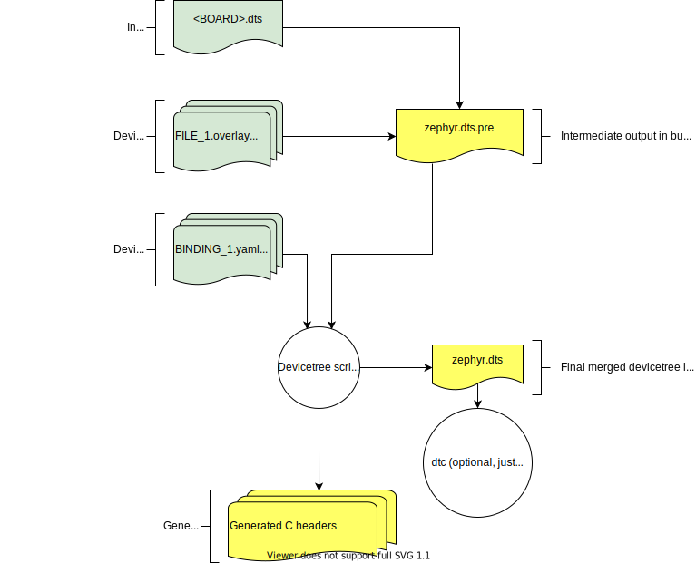

.. _devicetree-in-out-files:

Input and output files
######################

This section describes the input and output files shown in the figure in
:ref:`devicetree-scope-purpose` in more detail.

   Devicetree input (green) and output (yellow) files

.. _dt-input-files:

Input files
***********

There are four types of devicetree input files:

- sources (``.dts``)
- includes (``.dtsi``)
- overlays (``.overlay``)
- bindings (``.yaml``)

The devicetree files inside the :file:`zephyr` directory look like this:

.. code-block:: none

  boards/<ARCH>/<BOARD>/<BOARD>.dts
  dts/common/skeleton.dtsi
  dts/<ARCH>/.../<SOC>.dtsi
  dts/bindings/.../binding.yaml

Generally speaking, every supported board has a :file:`BOARD.dts` file
describing its hardware. For example, the ``reel_board`` has
:zephyr_file:`boards/arm/reel_board/reel_board.dts`.

:file:`BOARD.dts` includes one or more ``.dtsi`` files. These ``.dtsi`` files
describe the CPU or system-on-chip Zephyr runs on, perhaps by including other
``.dtsi`` files. They can also describe other common hardware features shared by
multiple boards. In addition to these includes, :file:`BOARD.dts` also describes
the board's specific hardware.

The :file:`dts/common` directory contains :file:`skeleton.dtsi`, a minimal
include file for defining a complete devicetree. Architecture-specific
subdirectories (:file:`dts/<ARCH>`) contain ``.dtsi`` files for CPUs or SoCs
which extend :file:`skeleton.dtsi`.

The C preprocessor is run on all devicetree files to expand macro references,
and includes are generally done with ``#include <filename>`` directives, even
though DTS has a ``/include/ "<filename>"`` syntax.

:file:`BOARD.dts` can be extended or modified using *overlays*. Overlays are
also DTS files; the :file:`.overlay` extension is just a convention which makes
their purpose clear. Overlays adapt the base devicetree for different purposes:

- Zephyr applications can use overlays to enable a peripheral that is disabled
  by default, select a sensor on the board for an application specific purpose,
  etc. Along with :ref:`kconfig`, this makes it possible to reconfigure the
  kernel and device drivers without modifying source code.

- Overlays are also used when defining :ref:`shields`.

The build system automatically picks up :file:`.overlay` files stored in
certain locations. It is also possible to explicitly list the overlays to
include, via the :makevar:`DTC_OVERLAY_FILE` CMake variable. See
:ref:`set-devicetree-overlays` for details.

The build system combines :file:`BOARD.dts` and any :file:`.overlay` files by
concatenating them, with the overlays put last. This relies on DTS syntax which
allows merging overlapping definitions of nodes in the devicetree. See
:ref:`dt_k6x_example` for an example of how this works (in the context of
``.dtsi`` files, but the principle is the same for overlays). Putting the
contents of the :file:`.overlay` files last allows them to override
:file:`BOARD.dts`.

:ref:`dt-bindings` (which are YAML files) are essentially glue. They describe
the contents of devicetree sources, includes, and overlays in a way that allows
the build system to generate C macros usable by device drivers and
applications. The :file:`dts/bindings` directory contains bindings.

.. _dt-scripts:

Scripts and tools
*****************

The following libraries and scripts, located in :zephyr_file:`scripts/dts/`,
create output files from input files. Their sources have extensive
documentation.

:zephyr_file:`dtlib.py <scripts/dts/python-devicetree/src/devicetree/dtlib.py>`
    A low-level DTS parsing library.

:zephyr_file:`edtlib.py <scripts/dts/python-devicetree/src/devicetree/edtlib.py>`
    A library layered on top of dtlib that uses bindings to interpret
    properties and give a higher-level view of the devicetree. Uses dtlib to do
    the DTS parsing.

:zephyr_file:`gen_defines.py <scripts/dts/python-devicetree/src/devicetree/edtlib.py>`
    A script that uses edtlib to generate C preprocessor macros from the
    devicetree and bindings.

In addition to these, the standard ``dtc`` (devicetree compiler) tool is run on
the final devicetree if it is installed on your system. This is just to catch
errors or warnings. The output is unused. Boards may need to pass ``dtc``
additional flags, e.g. for warning suppression. Board directories can contain a
file named :file:`pre_dt_board.cmake` which configures these extra flags, like
this:

.. code-block:: cmake

   list(APPEND EXTRA_DTC_FLAGS "-Wno-simple_bus_reg")

.. _dt-outputs:

Output files
************

These are created in your application's build directory.

.. warning::

   Don't include the header files directly. :ref:`dt-from-c` explains
   what to do instead.

:file:`<build>/zephyr/zephyr.dts.pre`
   The preprocessed DTS source. This is an intermediate output file, which is
   input to :file:`gen_defines.py` and used to create :file:`zephyr.dts` and
   :file:`devicetree_generated.h`.

:file:`<build>/zephyr/include/generated/devicetree_generated.h`
   The generated macros and additional comments describing the devicetree.
   Included by ``devicetree.h``.

:file:`<build>/zephyr/zephyr.dts`
   The final merged devicetree. This file is output by :file:`gen_defines.py`.
   It is useful for debugging any issues. If the devicetree compiler ``dtc`` is
   installed, it is also run on this file, to catch any additional warnings or
   errors.
