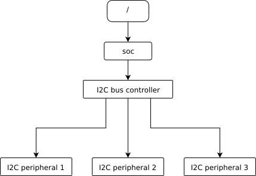
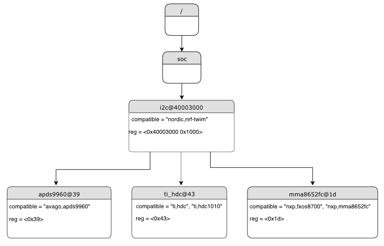

.. _dt-syntax:

Syntax and structure
####################

As the name indicates, a devicetree is a tree. The human-readable text format
for this tree is called DTS (for devicetree source), and is defined in the
`Devicetree specification`_.

.. _Devicetree specification: https://www.devicetree.org/

This page's purpose is to introduce devicetree in a more gradual way than the
specification. However, you may still need to refer to the specification to
understand some detailed cases.

.. contents:: Contents
   :local:

Example
*******

Here is an example DTS file:

.. code-block:: devicetree

   /dts-v1/;

   / {
           a-node {
                   subnode_nodelabel: a-sub-node {
                           foo = <3>;
                   };
           };
   };

The ``/dts-v1/;`` line means the file's contents are in version 1 of the DTS
syntax, which has replaced a now-obsolete "version 0".

Nodes
*****

Like any tree data structure, a devicetree has a hierarchy of *nodes*.
The above tree has three nodes:

#. A root node: ``/``
#. A node named ``a-node``, which is a child of the root node
#. A node named ``a-sub-node``, which is a child of ``a-node``

.. _dt-node-labels:

Nodes can be assigned *node labels*, which are unique shorthands that refer to
the labeled node. Above, ``a-sub-node`` has the node label
``subnode_nodelabel``. A node can have zero, one, or multiple node labels. You
can use node labels to refer to the node elsewhere in the devicetree.

Devicetree nodes have *paths* identifying their locations in the tree. Like
Unix file system paths, devicetree paths are strings separated by slashes
(``/``), and the root node's path is a single slash: ``/``. Otherwise, each
node's path is formed by concatenating the node's ancestors' names with the
node's own name, separated by slashes. For example, the full path to
``a-sub-node`` is ``/a-node/a-sub-node``.

Properties
**********

Devicetree nodes can also have *properties*. Properties are name/value pairs.
Property values can be any sequence of bytes. In some cases, the values are an
array of what are called *cells*. A cell is just a 32-bit unsigned integer.

Node ``a-sub-node`` has a property named ``foo``, whose value is a cell with
value 3. The size and type of ``foo``\ 's value are implied by the enclosing
angle brackets (``<`` and ``>``) in the DTS.

See :ref:`dt-writing-property-values` below for more example property values.

Devicetrees reflect hardware
****************************

In practice, devicetree nodes usually correspond to some hardware, and the node
hierarchy reflects the hardware's physical layout. For example, let's consider
a board with three I2C peripherals connected to an I2C bus controller on an SoC,
like this:

Nodes corresponding to the I2C bus controller and each I2C peripheral would be
present in the devicetree. Reflecting the hardware layout, the
I2C peripheral nodes would be children of the bus controller node.
Similar conventions exist for representing other types of hardware.

The DTS would look something like this:

.. code-block:: devicetree

   /dts-v1/;

   / {
           soc {
                   i2c-bus-controller {
                           i2c-peripheral-1 {
                           };
                           i2c-peripheral-2 {
                           };
                           i2c-peripheral-3 {
                           };
                   };
           };
   };

Properties in practice
**********************

In practice, properties usually describe or configure the hardware the node
represents. For example, an I2C peripheral's node has a property whose value is
the peripheral's address on the bus.

Here's a tree representing the same example, but with real-world node
names and properties you might see when working with I2C devices.

   I2C devicetree example with real-world names and properties.
   Node names are at the top of each node with a gray background.
   Properties are shown as "name=value" lines.

This is the corresponding DTS:

.. code-block:: devicetree

   /dts-v1/;

   / {
           soc {
                   i2c@40003000 {
                           compatible = "nordic,nrf-twim";
                           reg = <0x40003000 0x1000>;

                           apds9960@39 {
                                   compatible = "avago,apds9960";
                                   reg = <0x39>;
                           };
                           ti_hdc@43 {
                                   compatible = "ti,hdc", "ti,hdc1010";
                                   reg = <0x43>;
                           };
                           mma8652fc@1d {
                                   compatible = "nxp,fxos8700", "nxp,mma8652fc";
                                   reg = <0x1d>;
                           };
                   };
           };
   };

.. _dt-unit-address:

Unit addresses
**************

In addition to showing more real-world names and properties, the above example
introduces a new devicetree concept: unit addresses. Unit addresses are the
parts of node names after an "at" sign (``@``), like ``40003000`` in
``i2c@40003000``, or ``39`` in ``apds9960@39``. Unit addresses are optional:
the ``soc`` node does not have one.

In devicetree, unit addresses give a node's address in the
address space of its parent node. Here are some example unit addresses for
different types of hardware.

Memory-mapped peripherals
    The peripheral's register map base address.
    For example, the node named ``i2c@40003000`` represents an I2C controller
    whose register map base address is 0x40003000.

I2C peripherals
    The peripheral's address on the I2C bus.
    For example, the child node ``apds9960@39`` of the I2C controller
    in the previous section has I2C address 0x39.

SPI peripherals
    An index representing the peripheral's chip select line number.
    (If there is no chip select line, 0 is used.)

Memory
    The physical start address.
    For example, a node named ``memory@2000000`` represents RAM starting at
    physical address 0x2000000.

Memory-mapped flash
    Like RAM, the physical start address.
    For example, a node named ``flash@8000000`` represents a flash device
    whose physical start address is 0x8000000.

Fixed flash partitions
    This applies when the devicetree is used to store a flash partition table.
    The unit address is the partition's start offset within the flash memory.
    For example, take this flash device and its partitions:

    .. code-block:: devicetree

        flash@8000000 {
            /* ... */
            partitions {
                    partition@0 { /* ... */ };
                    partition@20000 {  /* ... */ };
                    /* ... */
            };
        };

    The node named ``partition@0`` has offset 0 from the start of its flash
    device, so its base address is 0x8000000. Similarly, the base address of
    the node named ``partition@20000`` is 0x8020000.

.. _dt-important-props:

Important properties
********************

.. Documentation maintainers: If you add a property to this list,
   make sure it gets linked to from gen_devicetree_rest.py too.

The devicetree specification defines several standard properties.
Some of the most important ones are:

compatible
    The name of the hardware device the node represents.

    The recommended format is ``"vendor,device"``, like ``"avago,apds9960"``,
    or a sequence of these, like ``"ti,hdc", "ti,hdc1010"``. The ``vendor``
    part is an abbreviated name of the vendor. The file
    :zephyr_file:`dts/bindings/vendor-prefixes.txt` contains a list of commonly
    accepted ``vendor`` names. The ``device`` part is usually taken from the
    datasheet.

    It is also sometimes a value like ``gpio-keys``, ``mmio-sram``, or
    ``fixed-clock`` when the hardware's behavior is generic.

    The build system uses the compatible property to find the right
    :ref:`bindings <dt-bindings>` for the node. Device drivers use
    ``devicetree.h`` to find nodes with relevant compatibles, in order to
    determine the available hardware to manage.

    The ``compatible`` property can have multiple values. Additional values are
    useful when the device is a specific instance of a more general family, to
    allow the system to match from most- to least-specific device drivers.

    Within Zephyr's bindings syntax, this property has type ``string-array``.

reg
    Information used to address the device. The value is specific to the device
    (i.e. is different depending on the compatible property).

    The ``reg`` property is a sequence of ``(address, length)`` pairs. Each
    pair is called a "register block". Values are conventionally written
    in hex.

    Here are some common patterns:

    - Devices accessed via memory-mapped I/O registers (like ``i2c@40003000``):
      ``address`` is usually the base address of the I/O register space, and
      ``length`` is the number of bytes occupied by the registers.
    - I2C devices (like ``apds9960@39`` and its siblings):
      ``address`` is a slave address on the I2C bus. There is no ``length``
      value.
    - SPI devices: ``address`` is a chip select line number; there is no
      ``length``.

    You may notice some similarities between the ``reg`` property and common
    unit addresses described above. This is not a coincidence. The ``reg``
    property can be seen as a more detailed view of the addressable resources
    within a device than its unit address.

status
    A string which describes whether the node is enabled.

    The devicetree specification allows this property to have values
    ``"okay"``, ``"disabled"``, ``"reserved"``, ``"fail"``, and ``"fail-sss"``.
    Only the values ``"okay"`` and ``"disabled"`` are currently relevant to
    Zephyr; use of other values currently results in undefined behavior.

    A node is considered enabled if its status property is either ``"okay"`` or
    not defined (i.e. does not exist in the devicetree source). Nodes with
    status ``"disabled"`` are explicitly disabled. (For backwards
    compatibility, the value ``"ok"`` is treated the same as ``"okay"``, but
    this usage is deprecated.) Devicetree nodes which correspond to physical
    devices must be enabled for the corresponding ``struct device`` in the
    Zephyr driver model to be allocated and initialized.

interrupts
    Information about interrupts generated by the device, encoded as an array
    of one or more *interrupt specifiers*. Each interrupt specifier has some
    number of cells. See section 2.4, *Interrupts and Interrupt Mapping*, in the
    `Devicetree Specification release v0.3`_ for more details.

    Zephyr's devicetree bindings language lets you give a name to each cell in
    an interrupt specifier.

.. _Devicetree Specification release v0.3:
   https://www.devicetree.org/specifications/

.. highlight:: none

.. note::

   Earlier versions of Zephyr made frequent use of the ``label`` property,
   which is distinct from the standard :ref:`node label <dt-node-labels>`.
   Use of the label *property* in new devicetree bindings, as well as use of
   the :c:macro:`DT_LABEL` macro in new code, are actively discouraged. Label
   properties continue to persist for historical reasons in some existing
   bindings and overlays, but should not be used in new bindings or device
   implementations.

.. _dt-writing-property-values:

Writing property values
***********************

This section describes how to write property values in DTS format. The property
types in the table below are described in detail in :ref:`dt-bindings`.

Some specifics are skipped in the interest of keeping things simple; if you're
curious about details, see the devicetree specification.

.. list-table::
   :header-rows: 1
   :widths: 1 4 4

   * - Property type
     - How to write
     - Example

   * - string
     - Double quoted
     - ``a-string = "hello, world!";``

   * - int
     - between angle brackets (``<`` and ``>``)
     - ``an-int = <1>;``

   * - boolean
     - for ``true``, with no value (for ``false``, use ``/delete-property/``)
     - ``my-true-boolean;``

   * - array
     - between angle brackets (``<`` and ``>``), separated by spaces
     - ``foo = <0xdeadbeef 1234 0>;``

   * - uint8-array
     - in hexadecimal *without* leading ``0x``, between square brackets (``[`` and ``]``).
     - ``a-byte-array = [00 01 ab];``

   * - string-array
     - separated by commas
     - ``a-string-array = "string one", "string two", "string three";``

   * - phandle
     - between angle brackets (``<`` and ``>``)
     - ``a-phandle = <&mynode>;``

   * - phandles
     - between angle brackets (``<`` and ``>``), separated by spaces
     - ``some-phandles = <&mynode0 &mynode1 &mynode2>;``

   * - phandle-array
     - between angle brackets (``<`` and ``>``), separated by spaces
     - ``a-phandle-array = <&mynode0 1 2>, <&mynode1 3 4>;``

Additional notes on the above:

- The values in the ``phandle``, ``phandles``, and ``phandle-array`` types are
  are described further in :ref:`dt-phandles`

- Boolean properties are true if present. They should not have a value.
  A boolean property is only false if it is completely missing in the DTS.

- The ``foo`` property value above has three *cells* with values 0xdeadbeef, 1234,
  and 0, in that order. Note that hexadecimal and decimal numbers are allowed and
  can be intermixed. Since Zephyr transforms DTS to C sources, it is not
  necessary to specify the endianness of an individual cell here.

- 64-bit integers are written as two 32-bit cells in big-endian order. The value
  0xaaaa0000bbbb1111 would be written ``<0xaaaa0000 0xbbbb1111>``.

- The ``a-byte-array`` property value is the three bytes 0x00, 0x01, and 0xab, in
  that order.

- Parentheses, arithmetic operators, and bitwise operators are allowed. The
  ``bar`` property contains a single cell with value 64:

  .. code-block:: devicetree

     bar = <(2 * (1 << 5))>;

  Note that the entire expression must be parenthesized.

- Property values refer to other nodes in the devicetree by their *phandles*.
  You can write a phandle using ``&foo``, where ``foo`` is a :ref:`node label
  <dt-node-labels>`. Here is an example devicetree fragment:

  .. code-block:: devicetree

     foo: device@0 { };
     device@1 {
             sibling = <&foo 1 2>;
     };

  The ``sibling`` property of node ``device@1`` contains three cells, in this order:

  #. The ``device@0`` node's phandle, which is written here as ``&foo`` since
     the ``device@0`` node has a node label ``foo``
  #. The value 1
  #. The value 2

  In the devicetree, a phandle value is a cell -- which again is just a 32-bit
  unsigned int. However, the Zephyr devicetree API generally exposes these
  values as *node identifiers*. Node identifiers are covered in more detail in
  :ref:`dt-from-c`.

- Array and similar type property values can be split into several ``<>``
  blocks, like this:

  .. code-block:: devicetree

     foo = <1 2>, <3 4>;                         // Okay for 'type: array'
     foo = <&label1 &label2>, <&label3 &label4>; // Okay for 'type: phandles'
     foo = <&label1 1 2>, <&label2 3 4>;         // Okay for 'type: phandle-array'

  This is recommended for readability when possible if the value can be
  logically grouped into blocks of sub-values.

.. _dt-alias-chosen:

Aliases and chosen nodes
************************

There are two additional ways beyond :ref:`node labels <dt-node-labels>` to
refer to a particular node without specifying its entire path: by alias, or by
chosen node.

Here is an example devicetree which uses both:

.. code-block:: devicetree

   /dts-v1/;

   / {
   	chosen {
   		zephyr,console = &uart0;
        };

   	aliases {
   		my-uart = &uart0;
   	};

   	soc {
   		uart0: serial@12340000 {
   			...
   		};
   	};
   };

The ``/aliases`` and ``/chosen`` nodes do not refer to an actual hardware
device. Their purpose is to specify other nodes in the devicetree.

Above, ``my-uart`` is an alias for the node with path ``/soc/serial@12340000``.
Using its node label ``uart0``, the same node is set as the value of the chosen
``zephyr,console`` node.

Zephyr sample applications sometimes use aliases to allow overriding the
particular hardware device used by the application in a generic way. For
example, :zephyr:code-sample:`blinky` uses this to abstract the LED to blink via the
``led0`` alias.

The ``/chosen`` node's properties are used to configure system- or
subsystem-wide values. See :ref:`devicetree-chosen-nodes` for more information.
