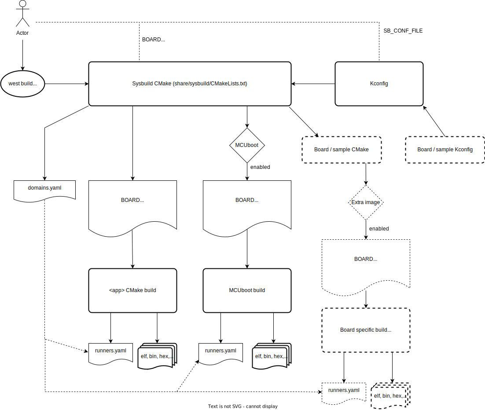

.. _sysbuild:

Sysbuild (System build)
#######################

Sysbuild is a higher-level build system that can be used to combine multiple
other build systems together. It is a higher-level layer that combines one
or more Zephyr build systems and optional additional build systems
into a hierarchical build system.

For example, you can use sysbuild to build a Zephyr application together
with the MCUboot bootloader, flash them both onto your device, and
debug the results.

Sysbuild works by configuring and building at least a Zephyr application and, optionally, as many
additional projects as you want. The additional projects can be either Zephyr applications
or other types of builds you want to run.

Like Zephyr's :ref:`build system <build_overview>`, sysbuild is written in
CMake and uses :ref:`Kconfig <kconfig>`.

Definitions
***********

The following are some key concepts used in this document:

Single-image build
    When sysbuild is used to create and manage just one Zephyr application's
    build system.

Multi-image build
   When sysbuild is used to manage multiple build systems.
   The word "image" is used because your main goal is usually to generate the binaries of the firmware
   application images from each build system.

Domain
   Every Zephyr CMake build system managed by sysbuild.

Multi-domain
   When more than one Zephyr CMake build system (domain) is managed by sysbuild.

Architectural Overview
**********************

This figure is an overview of sysbuild's inputs, outputs, and user interfaces:

The following are some key sysbuild features indicated in this figure:

- You can run sysbuild either with :ref:`west build
  <west-building>` or directly via ``cmake``.

- You can use sysbuild to generate application images from each build system,
  shown above as ELF, BIN, and HEX files.

- You can configure sysbuild or any of the build systems it manages using
  various configuration variables. These variables are namespaced so that
  sysbuild can direct them to the right build system. In some cases, such as
  the ``BOARD`` variable, these are shared among multiple build systems.

- Sysbuild itself is also configured using Kconfig. For example, you can
  instruct sysbuild to build the MCUboot bootloader, as well as to build and
  link your main Zephyr application as an MCUboot-bootable image, using sysbuild's
  Kconfig files.

- Sysbuild integrates with west's :ref:`west-build-flash-debug` commands. It
  does this by managing the :ref:`west-runner`, and specifically the
  :file:`runners.yaml` files that each Zephyr build system will contain. These
  are packaged into a global view of how to flash and debug each build system
  in a :file:`domains.yaml` file generated and managed by sysbuild.

- Build names are prefixed with the target name and an underscore, for example
  the sysbuild target is prefixed with ``sysbuild_`` and if MCUboot is enabled
  as part of sysbuild, it will be prefixed with ``mcuboot_``. This also allows
  for running things like menuconfig with the prefix, for example (if using
  ninja) ``ninja sysbuild_menuconfig`` to configure sysbuild or (if using make)
  ``make mcuboot_menuconfig``.

Building with sysbuild
**********************

As mentioned above, you can run sysbuild via ``west build`` or ``cmake``.

.. tabs::

   .. group-tab:: ``west build``

      Here is an example. For details, see :ref:`west-multi-domain-builds` in
      the ``west build documentation``.

      .. zephyr-app-commands::
         :tool: west
         :zephyr-app: samples/hello_world
         :board: reel_board
         :goals: build
         :west-args: --sysbuild
         :compact:

      .. tip::

         To configure ``west build`` to use ``--sysbuild`` by default from now on,
         run:

         .. code-block:: shell

            west config build.sysbuild True

         Since sysbuild supports both single- and multi-image builds, this lets you
         use sysbuild all the time, without worrying about what type of build you are
         running.

         To turn this off, run this before generating your build system:

         .. code-block:: shell

            west config build.sysbuild False

         To turn this off for just one ``west build`` command, run:

         .. code-block:: shell

            west build --no-sysbuild ...

   .. group-tab:: ``cmake``

      Here is an example using CMake and Ninja.

      .. zephyr-app-commands::
         :tool: cmake
         :app: share/sysbuild
         :board: reel_board
         :goals: build
         :gen-args: -DAPP_DIR=samples/hello_world
         :compact:

      To use sysbuild directly with CMake, you must specify the sysbuild
      project as the source folder, and give ``-DAPP_DIR=<path-to-sample>`` as
      an extra CMake argument. ``APP_DIR`` is the path to the main Zephyr
      application managed by sysbuild.

      .. tip::

         The environment variables, ``CMAKE_BUILD_PARALLEL_LEVEL`` and ``VERBOSE``, can be used to
         control the build process when using sysbuild with CMake and ninja.

         To set number of jobs for ninja for all sysbuild images, set the CMAKE_BUILD_PARALLEL_LEVEL
         environment variable and invoke the build with ``cmake --build``, for example:

         .. code-block:: shell

            CMAKE_BUILD_PARALLEL_LEVEL=<n> cmake --build .

         For verbose output of all images, use:

         .. code-block:: shell

            VERBOSE=1 cmake --build .

Configuration namespacing
*************************

When building a single Zephyr application without sysbuild, all CMake cache
settings and Kconfig build options given on the command line as
``-D<var>=<value>`` or ``-DCONFIG_<var>=<value>`` are handled by the Zephyr
build system.

However, when sysbuild combines multiple Zephyr build systems, there could be
Kconfig settings exclusive to sysbuild (and not used by any of the applications).
To handle this, sysbuild has namespaces for configuration variables. You can use these
namespaces to direct settings either to sysbuild itself or to a specific Zephyr
application managed by sysbuild using the information in these sections.

The following example shows how to build :zephyr:code-sample:`hello_world` with MCUboot enabled,
applying to both images debug optimizations:

.. tabs::

   .. group-tab:: ``west build``

      .. zephyr-app-commands::
         :tool: west
         :zephyr-app: samples/hello_world
         :board: reel_board
         :goals: build
         :west-args: --sysbuild
         :gen-args: -DSB_CONFIG_BOOTLOADER_MCUBOOT=y -DCONFIG_DEBUG_OPTIMIZATIONS=y -Dmcuboot_CONFIG_DEBUG_OPTIMIZATIONS=y
         :compact:

   .. group-tab:: ``cmake``

      .. zephyr-app-commands::
         :tool: cmake
         :app: share/sysbuild
         :board: reel_board
         :goals: build
         :gen-args: -DAPP_DIR=samples/hello_world -DSB_CONFIG_BOOTLOADER_MCUBOOT=y -DCONFIG_DEBUG_OPTIMIZATIONS=y -Dmcuboot_CONFIG_DEBUG_OPTIMIZATIONS=y
         :compact:

See the following subsections for more information.

.. _sysbuild_cmake_namespace:

CMake variable namespacing
==========================

CMake variable settings can be passed to CMake using ``-D<var>=<value>`` on the
command line. You can also set Kconfig options via CMake as
``-DCONFIG_<var>=<value>`` or ``-D<namespace>_CONFIG_<var>=<value>``.

Since sysbuild is the entry point for the build system, and sysbuild is written
in CMake, all CMake variables are first processed by sysbuild.

Sysbuild creates a namespace for each domain. The namespace prefix is the
domain's application name. See :ref:`sysbuild_zephyr_application` for more
information.

To set the variable ``<var>`` in the namespace ``<namespace>``, use this syntax::

  -D<namespace>_<var>=<value>

For example, to set the CMake variable ``FOO`` in the ``my_sample`` application
build system to the value ``BAR``, run the following commands:

.. tabs::

   .. group-tab:: ``west build``

      .. code-block:: shell

         west build --sysbuild ... -- -Dmy_sample_FOO=BAR

   .. group-tab:: ``cmake``

      .. code-block:: shell

         cmake -Dmy_sample_FOO=BAR ...

.. _sysbuild_kconfig_namespacing:

Kconfig namespacing
===================

To set the sysbuild Kconfig option ``<var>`` to the value ``<value>``, use this syntax::

  -DSB_CONFIG_<var>=<value>

In the previous example, ``SB_CONFIG`` is the namespace prefix for sysbuild's Kconfig
options.

To set a Zephyr application's Kconfig option instead, use this syntax::

  -D<namespace>_CONFIG_<var>=<value>

In the previous example, ``<namespace>`` is the application name discussed above in
:ref:`sysbuild_cmake_namespace`.

For example, to set the Kconfig option ``FOO`` in the ``my_sample`` application
build system to the value ``BAR``, run the following commands:

.. tabs::

   .. group-tab:: ``west build``

      .. code-block:: shell

         west build --sysbuild ... -- -Dmy_sample_CONFIG_FOO=BAR

   .. group-tab:: ``cmake``

      .. code-block:: shell

        cmake -Dmy_sample_CONFIG_FOO=BAR ...

.. tip::
   When no ``<namespace>`` is used, the Kconfig setting is passed to the main
   Zephyr application ``my_sample``.

   This means that passing ``-DCONFIG_<var>=<value>`` and
   ``-Dmy_sample_CONFIG_<var>=<value>`` are equivalent.

   This allows you to build the same application with or without sysbuild using
   the same syntax for setting Kconfig values at CMake time.
   For example, the following commands will work in the same way:

   .. code-block:: shell

      west build -b <board> my_sample -- -DCONFIG_FOO=BAR

   .. code-block:: shell

      west build -b <board> --sysbuild my_sample -- -DCONFIG_FOO=BAR

Sysbuild flashing using ``west flash``
**************************************

You can use :ref:`west flash <west-flashing>` to flash applications with
sysbuild.

When invoking ``west flash`` on a build consisting of multiple images, each
image is flashed in sequence. Extra arguments such as ``--runner jlink`` are
passed to each invocation.

For more details, see :ref:`west-multi-domain-flashing`.

Sysbuild debugging using ``west debug``
***************************************

You can use ``west debug``  to debug the main application, whether you are using sysbuild or not.
Just follow the existing :ref:`west debug <west-debugging>` guide to debug the main sample.

To debug a different domain (Zephyr application), such as ``mcuboot``, use
the ``--domain`` argument, as follows::

  west debug --domain mcuboot

For more details, see :ref:`west-multi-domain-debugging`.

Building a sample with MCUboot
******************************

Sysbuild supports MCUboot natively.

To build a sample like ``hello_world`` with MCUboot,
enable MCUboot and build and flash the sample as follows:

.. tabs::

   .. group-tab:: ``west build``

      .. zephyr-app-commands::
         :tool: west
         :zephyr-app: samples/hello_world
         :board: reel_board
         :goals: build
         :west-args: --sysbuild
         :gen-args: -DSB_CONFIG_BOOTLOADER_MCUBOOT=y
         :compact:

   .. group-tab:: ``cmake``

      .. zephyr-app-commands::
         :tool: cmake
         :app: share/sysbuild
         :board: reel_board
         :goals: build
         :gen-args: -DAPP_DIR=samples/hello_world -DSB_CONFIG_BOOTLOADER_MCUBOOT=y
         :compact:

This builds ``hello_world`` and ``mcuboot`` for the ``reel_board``, and then
flashes both the ``mcuboot`` and ``hello_world`` application images to the
board.

More detailed information regarding the use of MCUboot with Zephyr can be found
in the `MCUboot with Zephyr`_ documentation page on the MCUboot website.

.. note::

   The deprecated MCUBoot Kconfig option ``CONFIG_ZEPHYR_TRY_MASS_ERASE`` will
   perform a full chip erase when flashed. If this option is enabled, then
   flashing only MCUBoot, for example using ``west flash --domain mcuboot``, may
   erase the entire flash, including the main application image.

Sysbuild Kconfig file
*********************

You can set sysbuild's Kconfig options for a single application using
configuration files. By default, sysbuild looks for a configuration file named
``sysbuild.conf`` in the application top-level directory.

In the following example, there is a :file:`sysbuild.conf` file that enables building and flashing with
MCUboot whenever sysbuild is used:

.. code-block:: none

   <home>/application
   ├── CMakeLists.txt
   ├── prj.conf
   └── sysbuild.conf

.. code-block:: cfg

   SB_CONFIG_BOOTLOADER_MCUBOOT=y

You can set a configuration file to use with the
``-DSB_CONF_FILE=<sysbuild-conf-file>`` CMake build setting.

For example, you can create ``sysbuild-mcuboot.conf`` and then
specify this file when building with sysbuild, as follows:

.. tabs::

   .. group-tab:: ``west build``

      .. zephyr-app-commands::
         :tool: west
         :zephyr-app: samples/hello_world
         :board: reel_board
         :goals: build
         :west-args: --sysbuild
         :gen-args: -DSB_CONF_FILE=sysbuild-mcuboot.conf
         :compact:

   .. group-tab:: ``cmake``

      .. zephyr-app-commands::
         :tool: cmake
         :app: share/sysbuild
         :board: reel_board
         :goals: build
         :gen-args: -DAPP_DIR=samples/hello_world -DSB_CONF_FILE=sysbuild-mcuboot.conf
         :compact:

Sysbuild targets
****************

Sysbuild creates build targets for each image (including sysbuild itself) for
the following modes:

 * menuconfig
 * hardenconfig
 * guiconfig

For the main application (as is the same without using sysbuild) these can be
ran normally without any prefix. For other images (including sysbuild), these
are ran with a prefix of the image name and an underscore e.g. ``sysbuild_`` or
``mcuboot_``, using ninja or make - for details on how to run image build
targets that do not have mapped build targets in sysbuild, see the
:ref:`sysbuild_dedicated_image_build_targets` section.

.. _sysbuild_dedicated_image_build_targets:

Dedicated image build targets
*****************************

Not all build targets for images are given equivalent prefixed build targets
when sysbuild is used, for example build targets like ``ram_report``,
``rom_report``, ``footprint``, ``puncover`` and ``pahole`` are not exposed.
When using :ref:`Trusted Firmware <tfm_build_system>`, the build targets prefixed
with ``tfm_`` and ``bl2_`` are also not exposed, for example: ``tfm_rom_report``
and ``bl2_ram_report``. To run these build targets, the build directory of the
image can be provided to west/ninja/make along with the name of the build
target to execute and it will run.

.. tabs::

   .. group-tab:: ``west``

      Assuming that a project has been configured and built using ``west``
      using sysbuild with mcuboot enabled in the default ``build`` folder
      location, the ``rom_report`` build target for ``mcuboot`` can be ran
      with:

      .. code-block:: shell

         west build -d build/mcuboot -t rom_report

      For TF-M projects using TF-M targets, the application build directory is
      used like so:

      .. code-block:: shell

         west build -d build/<app_name> -t tfm_rom_report

   .. group-tab:: ``ninja``

      Assuming that a project has been configured using ``cmake`` and built
      using ``ninja`` using sysbuild with mcuboot enabled, the ``rom_report``
      build target for ``mcuboot`` can be ran with:

      .. code-block:: shell

         ninja -C mcuboot rom_report

      For TF-M projects using TF-M targets, the application build directory is
      used like so:

      .. code-block:: shell

         ninja -C <app_name> -t tfm_rom_report

   .. group-tab:: ``make``

      Assuming that a project has been configured using ``cmake`` and built
      using ``make`` using sysbuild with mcuboot enabled, the ``rom_report``
      build target for ``mcuboot`` can be ran with:

      .. code-block:: shell

         make -C mcuboot rom_report

      For TF-M projects using TF-M targets, the application build directory is
      used like so:

      .. code-block:: shell

         make -C <app_name> -t tfm_rom_report

.. _sysbuild_zephyr_application:

Adding Zephyr applications to sysbuild
**************************************

You can use the ``ExternalZephyrProject_Add()`` function to add Zephyr
applications as sysbuild domains. Call this CMake function from your
application's :file:`sysbuild.cmake` file, or any other CMake file you know will
run as part sysbuild CMake invocation.

Targeting the same board
========================

To include ``my_sample`` as another sysbuild domain, targeting the same board
as the main image, use this example:

.. code-block:: cmake

   ExternalZephyrProject_Add(
     APPLICATION my_sample
     SOURCE_DIR <path-to>/my_sample
   )

This could be useful, for example, if your board requires you to build and flash an
SoC-specific bootloader along with your main application.

Targeting a different board
===========================

In sysbuild and Zephyr CMake build system a board may refer to:

* A physical board with a single core SoC.
* A specific core on a physical board with a multi-core SoC, such as
  :zephyr:board:`nrf5340dk`.
* A specific SoC on a physical board with multiple SoCs, such as
  :ref:`nrf9160dk_nrf9160` and :ref:`nrf9160dk_nrf52840`.

If your main application, for example, is built for ``mps2/an521/cpu0``, and your
helper application must target the ``mps2/an521/cpu1`` board target, add
a CMake function call that is structured as follows:

.. code-block:: cmake

   ExternalZephyrProject_Add(
     APPLICATION my_sample
     SOURCE_DIR <path-to>/my_sample
     BOARD mps2/an521/cpu1
   )

This could be useful, for example, if your main application requires another
helper Zephyr application to be built and flashed alongside it, but the helper
runs on another core in your SoC.

Targeting conditionally using Kconfig
=====================================

You can control whether extra applications are included as sysbuild domains
using Kconfig.

If the extra application image is specific to the board or an application,
you can create two additional files: :file:`sysbuild.cmake` and :file:`Kconfig.sysbuild`.

For an application, this would look like this:

.. code-block:: none

   <home>/application
   ├── CMakeLists.txt
   ├── prj.conf
   ├── Kconfig.sysbuild
   └── sysbuild.cmake

In the previous example, :file:`sysbuild.cmake` would be structured as follows:

.. code-block:: cmake

   if(SB_CONFIG_SECOND_SAMPLE)
     ExternalZephyrProject_Add(
       APPLICATION second_sample
       SOURCE_DIR <path-to>/second_sample
     )
   endif()

:file:`Kconfig.sysbuild` would be structured as follows:

.. code-block:: kconfig

   source "sysbuild/Kconfig"

   config SECOND_SAMPLE
           bool "Second sample"
           default y

This will include ``second_sample`` by default, while still allowing you to
disable it using the Kconfig option ``SECOND_SAMPLE``.

For more information on setting sysbuild Kconfig options,
see :ref:`sysbuild_kconfig_namespacing`.

Building without flashing
=========================

You can mark ``my_sample`` as a build-only application in this manner:

.. code-block:: cmake

   ExternalZephyrProject_Add(
     APPLICATION my_sample
     SOURCE_DIR <path-to>/my_sample
     BUILD_ONLY TRUE
   )

As a result, ``my_sample`` will be built as part of the sysbuild build invocation,
but it will be excluded from the default image sequence used by ``west flash``.
Instead, you may use the outputs of this domain for other purposes - for example,
to produce a secondary image for DFU, or to merge multiple images together.

You can also replace ``TRUE`` with another boolean constant in CMake, such as
a Kconfig option, which would make ``my_sample`` conditionally build-only.

.. note::

   Applications marked as build-only can still be flashed manually, using
   ``west flash --domain my_sample``. As such, the ``BUILD_ONLY`` option only
   controls the default behavior of ``west flash``.

.. _sysbuild_application_configuration:

Zephyr application configuration
================================

When adding a Zephyr application to sysbuild, such as MCUboot, then the
configuration files from the application (MCUboot) itself will be used.

When integrating multiple applications with each other, then it is often
necessary to make adjustments to the configuration of extra images.

Sysbuild gives users the ability of creating Kconfig fragments or devicetree
overlays that will be used together with the application's default configuration.
Sysbuild also allows users to change :ref:`application-configuration-directory`
in order to give users full control of an image's configuration.

Zephyr application Kconfig fragment and devicetree overlay
----------------------------------------------------------

In the folder of the main application, create a Kconfig fragment or a devicetree
overlay under a sysbuild folder, where the name of the file is
:file:`<image>.conf` or :file:`<image>.overlay`, for example if your main
application includes ``my_sample`` then create a :file:`sysbuild/my_sample.conf`
file or a devicetree overlay :file:`sysbuild/my_sample.overlay`.

A Kconfig fragment could look as:

.. code-block:: cfg

   # sysbuild/my_sample.conf
   CONFIG_FOO=n

Zephyr application configuration directory
------------------------------------------

In the folder of the main application, create a new folder under
:file:`sysbuild/<image>/`.
This folder will then be used as ``APPLICATION_CONFIG_DIR`` when building
``<image>``.
As an example, if your main application includes ``my_sample`` then create a
:file:`sysbuild/my_sample/` folder and place any configuration files in
there as you would normally do:

.. code-block:: none

   <home>/application
   ├── CMakeLists.txt
   ├── prj.conf
   └── sysbuild
       └── my_sample
           ├── prj.conf
           ├── app.overlay
           └── boards
               ├── <board_A>.conf
               ├── <board_A>.overlay
               ├── <board_B>.conf
               └── <board_B>.overlay

All configuration files under the :file:`sysbuild/my_sample/` folder will now
be used when ``my_sample`` is included in the build, and the default
configuration files for ``my_sample`` will be ignored.

This give you full control on how images are configured when integrating those
with ``application``.

.. _sysbuild_file_suffixes:

Sysbuild file suffix support
----------------------------

File suffix support through the :makevar:`FILE_SUFFIX` is supported in sysbuild
(see :ref:`application-file-suffixes` for details on this feature in applications). For sysbuild,
a globally provided option will be passed down to all images. In addition, the image configuration
file will have this value applied and used (instead of the build type) if the file exists.

Given the example project:

.. code-block:: none

   <home>/application
   ├── CMakeLists.txt
   ├── prj.conf
   ├── sysbuild.conf
   ├── sysbuild_test_key.conf
   └── sysbuild
       ├── mcuboot.conf
       ├── mcuboot_max_log.conf
       └── my_sample.conf

* If ``FILE_SUFFIX`` is not defined and both ``mcuboot`` and ``my_sample`` images are included,
  ``mcuboot`` will use the ``mcuboot.conf`` Kconfig fragment file and ``my_sample`` will use the
  ``my_sample.conf`` Kconfig fragment file. Sysbuild itself will use the ``sysbuild.conf``
  Kconfig fragment file.

* If ``FILE_SUFFIX`` is set to ``max_log`` and both ``mcuboot`` and ``my_sample`` images are
  included, ``mcuboot`` will use the ``mcuboot_max_log.conf`` Kconfig fragment file and
  ``my_sample`` will use the ``my_sample.conf`` Kconfig fragment file (as it will fallback to the
  file without the suffix). Sysbuild itself will use the ``sysbuild.conf`` Kconfig fragment file
  (as it will fallback to the file without the suffix).

* If ``FILE_SUFFIX`` is set to ``test_key`` and both ``mcuboot`` and ``my_sample`` images are
  included, ``mcuboot`` will use the ``mcuboot.conf`` Kconfig fragment file and
  ``my_sample`` will use the ``my_sample.conf`` Kconfig fragment file (as it will fallback to the
  files without the suffix). Sysbuild itself will use the ``sysbuild_test_key.conf`` Kconfig
  fragment file. This can be used to apply a different sysbuild configuration, for example to use
  a different signing key in MCUboot and when signing the main application.

The ``FILE_SUFFIX`` can also be applied only to single images by prefixing the variable with the
image name:

.. tabs::

   .. group-tab:: ``west build``

      .. zephyr-app-commands::
         :tool: west
         :app: file_suffix_example
         :board: reel_board
         :goals: build
         :west-args: --sysbuild
         :gen-args: -DSB_CONFIG_BOOTLOADER_MCUBOOT=y -Dmcuboot_FILE_SUFFIX="max_log"
         :compact:

   .. group-tab:: ``cmake``

      .. zephyr-app-commands::
         :tool: cmake
         :app: share/sysbuild
         :board: reel_board
         :goals: build
         :gen-args: -DAPP_DIR=<app_dir> -DSB_CONFIG_BOOTLOADER_MCUBOOT=y -Dmcuboot_FILE_SUFFIX="max_log"
         :compact:

.. _sysbuild_zephyr_application_dependencies:

Adding dependencies among Zephyr applications
=============================================

Sometimes, in a multi-image build, you may want certain Zephyr applications to
be configured or flashed in a specific order. For example, if you need some
information from one application's build system to be available to another's,
then the first thing to do is to add a configuration dependency between them.
Separately, you can also add flashing dependencies to control the sequence of
images used by ``west flash``; this could be used if a specific flashing order
is required by an SoC, a _runner_, or something else.

By default, sysbuild will configure and flash applications in the order that
they are added, as ``ExternalZephyrProject_Add()`` calls are processed by CMake.
You can use the ``sysbuild_add_dependencies()`` function to make adjustments to
this order, according to your needs. Its usage is similar to the standard
``add_dependencies()`` function in CMake.

Here is an example of adding configuration dependencies for ``my_sample``:

.. code-block:: cmake

   sysbuild_add_dependencies(IMAGE CONFIGURE my_sample sample_a sample_b)

This will ensure that sysbuild will run CMake for ``sample_a`` and ``sample_b``
(in some order) before doing the same for ``my_sample``, when building these
domains in a single invocation.

If you want to add flashing dependencies instead, then do it like this:

.. code-block:: cmake

   sysbuild_add_dependencies(IMAGE FLASH my_sample sample_a sample_b)

As a result, ``my_sample`` will be flashed after ``sample_a`` and ``sample_b``
(in some order), when flashing these domains in a single invocation.

.. note::

   Adding flashing dependencies is not allowed for build-only applications.
   If ``my_sample`` had been created with ``BUILD_ONLY TRUE``, then the above
   call to ``sysbuild_add_dependencies()`` would have produced an error.

Adding non-Zephyr applications to sysbuild
******************************************

You can include non-Zephyr applications in a multi-image build using the
standard CMake module `ExternalProject`_. Please refer to the CMake
documentation for usage details.

When using ``ExternalProject``, the non-Zephyr application will be built as
part of the sysbuild build invocation, but ``west flash`` or ``west debug``
will not be aware of the application. Instead, you must manually flash and
debug the application.

.. _MCUboot with Zephyr: https://docs.mcuboot.com/readme-zephyr
.. _ExternalProject: https://cmake.org/cmake/help/latest/module/ExternalProject.html

.. _sysbuild_var_override:

Configuring sysbuild internal state
***********************************

Because sysbuild is a CMake project in it's own right, it runs and sets up itself similar to a
Zephyr application but using it's own CMake code. This means that some features, for example
specifying variables in an application ``CMakeLists.txt`` (such as ``BOARD_ROOT``) will not work,
instead these must be set by using a :ref:`a module <modules_build_settings>` or by using a custom
sysbuild project file as ``<application>/sysbuild/CMakeLists.txt``, for example:

.. code-block:: cmake

   # Place pre-sysbuild configuration items here

   # For changing configuration that sysbuild itself uses:
   # set(<var> <value>)
   # list(APPEND <list> <value>)

   # For changing configuration of other images:
   # set(<image>_<var> <value> CACHE INTERNAL "<description>")

   # Finds the sysbuild project and includes it with the new configuration
   find_package(Sysbuild REQUIRED HINTS $ENV{ZEPHYR_BASE})

   project(sysbuild LANGUAGES)

An example of adding a ``BOARD_ROOT``:

.. code-block:: cmake

   list(APPEND BOARD_ROOT ${CMAKE_CURRENT_SOURCE_DIR}/../<extra-board-root>)

   find_package(Sysbuild REQUIRED HINTS $ENV{ZEPHYR_BASE})

   project(sysbuild LANGUAGES)

This will pass the board root on to all images as part of a project, it does not need to be
repeated in each image's ``CMakeLists.txt`` file.

Extending sysbuild
******************

Sysbuild can be extended by other modules to give it additional functionality
or include other configuration or images, an example could be to add support
for another bootloader or external signing method.

Modules can be extended by adding custom CMake or Kconfig files as normal
:ref:`modules <module-yml>` do, this will cause the files to be included in
each image that is part of a project. Alternatively, there are
:ref:`sysbuild-specific module extension <sysbuild_module_integration>` files
which can be used to include CMake and Kconfig files for the overall sysbuild
image itself, this is where e.g. a custom image for a particular board or SoC
can be added.

.. toctree::
    :maxdepth: 1

    images.rst
