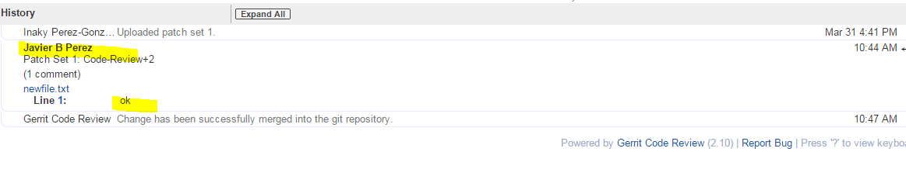

.. _gerrit:

Working with Gerrit
###################

Follow these instructions to collaborate on the Zephyr Project using
the infrastructure within Intel’s Open Source site, ``01.org``. First, let
us answer a couple of common questions regarding the use of Gerrit
within the Zephyr Project.

#. Who has access to the Gerrit infrastructure?

   Intel, WindRiver, and other partners who have agreed to collaborate
   in this project.

#. How long will this infrastructure be used?

   Until the project is transferred to the Linux Foundation.

Make sure to subscribe to the `mailing list`_ by filling out the
`registration form`_.

.. _registration form: https://lists.01.org/mailman/listinfo/foss-rtos-collab

.. _mailing list: foss-rtos-collab@lists.01.org

Follow the steps available at :ref:`code_check_out` for information about how
to access the source code using Git and Gerrit.

Gerrit is a review system, and as such, assigns the following roles to
users:

* **Submitters**: May submit changes for consideration, review other code
  changes, and make recommendations for acceptance or rejection by voting
  +1 or -1, respectively.
* **Maintainers**: May approve or reject changes based upon feedback from
  reviewers voting +2 or -2, respectively.
* **Builders**: May use the build automation infrastructure.

A comprehensive walk-through of Gerrit is beyond the scope of this
document. There are plenty of resources available on the Internet. Good
summaries can be found here:

* `How to use Gerrit <https://wiki.iotivity.org/how_to_use_gerrit_>`_
* `Gerrit User Review <https://gerrit-review.googlesource.com/Documentation/user-review-ui.html_>`_

For more detailed information visit: `Gerrit Documentation <http://gerrit-documentation.googlecode.com/svn/Documentation/2.6/intro-quick.html_>`_

Commit Message Formatting
*************************

When preparing to submit a change, each patch set will contain multiple edits
or modifications to files.  The patch set prefixed by a commit message detailing
all the changes.  The Zephyr Project has a few best practices for creating
commit messages to ease the acceptance of the change.

* Don't reference the patch itself.  For example, no "This patch..."

* The first line shall begin with the component being altered followed by a
  colon.  For example, doc:, i2c:, spi:, microkernel: , etc.  After the
  colon, a short (less than 70 characters) shall be provided after, detailing
  the brief basics of the change.  As an example:

   .. code-block:: console

      doc: Updating gerrit commit details

* When adding a new file to the tree, it is important to detail the source of
  origin on the file, provide attributions, and detail the intended usage.  In
  cases where the file is an original to Zephyr, the commit message shall
  include the following:

   .. code-block:: console

      Origin: Original

   In cases where the file is imported from an external project, the commit
   message shall contain details regarding the original project, the location
   of the project, the SHA-id of the origin commit the file, the intended
   purpose, and if the file will be maintained by the Zephyr project, in other
   words, whether or not the Zephyr project will contain a localized branch or
   if it is a downstream copy.

   For example a copy of a locally maintained import:

   .. code-block:: console

      Origin: Contiki OS
      URL: http://www.contiki-os.org/
      commit: 853207acfdc6549b10eb3e44504b1a75ae1ad63a
      Purpose: Introduction of networking stack.
      Maintained-by: Zephyr

   For example a copy of an externally maintained import:

   .. code-block:: console

      Origin: Tiny Crypt
      URL: https://github.com/01org/tinycrypt
      commit: 08ded7f21529c39e5133688ffb93a9d0c94e5c6e
      Purpose: Introduction of TinyCrypt
      Maintained-by: External

Submitting a Change
*******************

Currently, Gerrit is the only method to submit a change for review.

Before submitting, please ensure each commit conforms with coding
and contribution guidelines. Directions for building the source code
are beyond the scope of this document. Please see the :ref:`getting_started`
for further detail.

When a change is ready for submission, Gerrit requires that the
change be pushed to a special branch. The name of this special branch
contains a reference to the final branch where the code should reside,
once accepted.

For the Zephyr Project, the special branch is called :literal:`refs/for/master` .

1. Push the current local development branch to the gerrit server, type:

   .. code-block:: bash

      $ git push origin HEAD:refs/for/master

   If the command executes correctly, the output should look similar to
   this:

   .. code-block:: bash

      Counting objects: 4, done. Compressing objects: 100% (2/2), done.
      Writing objects: 100% (3/3), 325 bytes | 0 bytes/s, done. Total 3
      (delta 1), reused 0 (delta 0) remote: Resolving deltas: 100% (1/1)
      remote: Processing changes: new: 1, refs: 1, done remote: remote:
      New Changes: remote: https://oic-review.01.org/gerrit/1045 This is
      test #1 remote: To ssh://oic-review.01.org:29418/forto-collab
      * [new branch]      HEAD -> refs/for/master

   The gerrit server generates a
   `link <https://oic-review.01.org/gerrit/1045>`_ where the change can be
   tracked.

2. Add reviewers to your change.

   a. To specify a list of reviewers via the command line, add
   *%r=reviewer@project.org* to your push command. For
   example:

   .. code-block:: bash

      $ git push origin
      HEAD:refs/for/master%r=rev1@email.com,rev2@notemail.com`

   b. Autoconfigure GIT to add a set of reviewers if your commits will
      have the same reviewers all at the time.

      i. In the cloned repo, open the :file:`.git/config` file.

      ii. Add the following line in the
      :literal:`[ branch “master” ]` section:

   .. code-block:: bash

         [branch "master"] #.... push =
         HEAD:refs/for/master%r=rev1@email.com,rev2@notemail.com`

   .. note::
      In the examples, actual email addresses should be used instead of the
      :literal:`@email.com and @notemail.com` addressses.

Reviewing Using Gerrit
**********************

 An example of a gerrit change review page:

.. figure:: figures/gerrit01.png
   :scale: 75 %
   :alt: Gerrit Review Page

   An example of a Gerrit change review page.

   The fields highlighted in yellow are of interest and require a
   little more explanation.

* **Add**: This button allows the change submitter to manually add names of
  people who should review a change; start typing a name and the system
  will auto-complete based on the list of people registered and with
  access to the system. They will be notified by email that you are
  requesting their input.

* **Abandon**: This button is available to the submitter only; it allows a
  committer to abandon a change and remove it from the merge queue.

* **Change-ID**: This ID is generated by Gerrit (or system). It becomes
  useful when the review process determines that your commit(s) have to
  be amended. You may submit a new version; and if the same Change-ID
  header (and value) are present, Gerrit will remember it and present
  it as another version of the same change.

* **Status**: Currently, the example change is in review status, as indicated
  by “Needs Code-Review” in the upper-left corner. The list of
  Reviewers will all emit their opinion, voting +1 if they agree to the
  merge, -1 if they disagree. Gerrit users with a Maintainer role can
  agree to the merge or refuse it by voting +2 or -2 respectively.

Notifications are sent to the email address in your commit message's
Signed-off-by line. Visit
`your gerrit page <https://oic-review.01.org/gerrit/#/dashboard/self>`_,
to check the progress of your requests.

Click on a request and the history tab displays feedback.

   An example of how feedback is displayed on Gerrit.

Viewing Pending Changes
***********************

1. Find all pending changes by clicking on the
   :menuselection:`All --> Changes` link in the upper-left corner, or
   directly at:
   `<https://oic-review.01.org/gerrit/#/q/project:forto-collab>`_

   If you collaborate in multiple projects, you may wish to limit searching to
   the specific branch through the search bar in the upper-right side.

   Add the filter *project:forto-collab* to limit the visible changes to
   only those from the forto-collab project.

2. List all current changes you submitted, or list just those changes in need
   of your input by clicking on :menuselection:`My --> Changes` or going to:
   `Your Dashboard <https://oic-review.01.org/gerrit/#/dashboard/self_>`_

Reviewing a Change
******************

1. Click on a link for incoming or outgoing review, such as
   *“This is test #1”* shown in this figure:

   .. figure:: figures/gerrit03.png
      :scale: 75 %
      :alt: Incoming and Outgoing Reviews

      An example of incoming and outgoing items in review.

2. The details of the change and its current status are loaded:

   .. figure:: figures/gerrit04.png
      :scale: 75 %
      :alt: Detailed View of a Change in Gerrit

      An example of the detailed view of a change in Gerrit.

      The highlighted items require further explanation.

   From left to right:

   * **Status:** Displays the current status of the change. In the
     example below, the status reads: +l Needs Code-Review.

   * **Reply:** Click on this button after reviewing to add a final
     review message and a score, -1, 0 or +1.

   * **Patch Sets:** If multiple revisions of a patch exist, this button
     enables navigation among revisions to see the changes. By default,
     the most recent revision is presented.

   * **Download:** This button brings up another window with multiple
     options to download or checkout the current changeset. The button on
     the right copies the line to your clipboard. You can easily paste it
     into your git interface to work with the patch as you prefer.

3. Underneath the commit information, the files that have been changed by
   this patch are displayed:

   .. figure:: figures/gerrit05.png
      :scale: 75 %
      :alt: Changed Files Example

      Observe the list of the files changed by the patch at the bottom.

4. Click on a filename to review it. Select the code base to differentiate
   against. The default is :diff: Base and it will generally be
   what is needed.

   .. figure:: figures/gerrit06.png
      :scale: 75 %
      :alt: Code Base Location

      Shows where to change the comparison base version on the review page.

5. The review page presents the changes made to the file. At the top of
   the review, the presentation shows some general navigation options.
   Navigate through the patch set using the highlighted arrows on the top
   right corner. It is possible to go to the previous or next file in the
   set or to return to the main change screen. Click on the yellow sticky
   pad to add comments to the whole file.

   .. figure:: figures/gerrit07.png
      :scale: 75 %
      :alt: Review Page Navigation Highlights

      Highlights the navigation options of the review page.

6. The focus of the page is on the comparison window. The changes made
   are presented in pink on the left versus the base version on the right.
   Double click to highlight the text within the actual change to provide
   feedback on a specific section of the code. Press *c* once the code is
   highlighted to add comments to that section.

   .. figure:: figures/gerrit08.png
      :scale: 75 %
      :alt: Commenting on a Code Section

      Shows how to add a comment in the comparison window.

7. After adding the comment, it is saved as a draft.

   .. figure:: figures/gerrit09.png
      :scale: 75 %
      :alt: Saved Comment as Draft

      Shows a comment saved as a draft.

8. After reviewing all files and recommending your changes, click the
   green up arrow at the top right to return to the main change page. Click
   the reply button, write some final comments, and submit your score for
   the patch set. Click post to submit the review of each reviewed file, as
   well as your final comment and score. Gerrit sends an email to the
   change-submitter and all listed reviewers. Finally, it logs the review
   for future reference. All individual comments are saved as Draft until
   the post button is clicked.

   .. figure:: figures/gerrit10.png
      :scale: 75 %
      :alt: Submitting the Final Comment and Review

      Shows the dialog box for submitting the final comment and the review
      score of a change.
