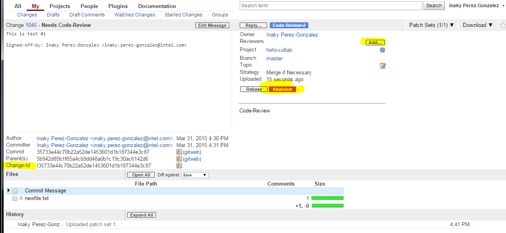
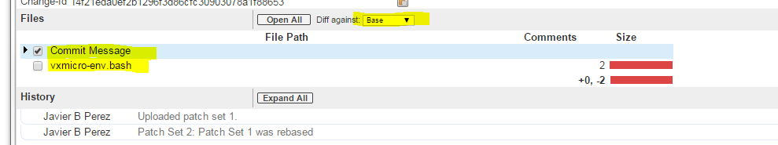
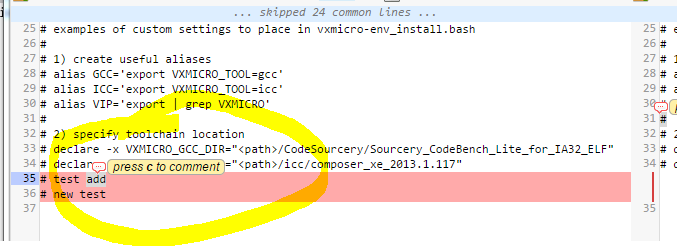
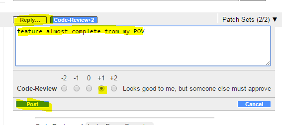

Submitting a Patch Via Gerrit
#############################

Follow these instructions to collaborate on the |project| using
the infrastructure within Intel’s Open Source site, 01.org_. First, let
us answer a couple of common questions regarding the use of Gerrit
within the |project|.

#. Who has access to the Gerrit infrastructure?

   Intel, WindRiver, and other partners who have agreed to collaborate
   in this project.

#. How long will this infrastructure be used?

   Until the project is transferred to the Linux Foundation.

Make sure to subscribe to the `mailing list`_ by filling out the
`registration form`_.

.. _registration form: https://lists.01.org/mailman/listinfo/foss-rtos-collab

.. _mailing list: foss-rtos-collab@lists.01.org

.. contents:: Table of Contents
   :depth: 2

Configuring Gerrit Access
*************************

Gerrit access requires some basic user setup.  The following process has
been defined as a simple walk-through to enable quick access to the
Gerrit services.

Accessing Gerrit
================

#. `Create`_ or `update`_ a 01.org_ account.

#. Submit your your 01.org_ account and corporate email address to
   |PM| `<mailto:hirally.santiago.rodriguez@intel.com>`_.

#. Once access is granted, `access Gerrit`_.

#. Log in using your 01.org account credentials.

.. _Create: https://01.org/user/register

.. _update: https://01.org/user/login

.. _access Gerrit: https://oic-review.01.org/gerrit/

.. _01.org: https://01.org/

Configuring SSH to Use Gerrit
=============================

Gerrit uses SSH to interact with your GIT client. A SSH private key
needs to be generated on the development machine with a matching public
key on the Gerrit server.

If you already have a SSH key-pair you would like to use, please skip
down to step.

Please follow the steps below to get started.

1. Create a key-pair in your Linux machine, type:

.. code-block:: bash

   $ ssh-keygen -t rsa -C "John Doe john.doe@example.com"

.. note:: This will ask you for a password to protect the private key as it
   generates a unique key. Please keep this password private, and DO
   NOT enter a blank password.  

The generated key-pair is found at:
:file:`~/.ssh/id_rsa and ~/.ssh/id_rsa.pub`.

2. Add the the private key in the :file:`id_rsa` file in your key ring,
type:

.. code-block:: bash

   $ ssh-add ~/.ssh/id_rsa

3. Add your the public key :file:`id_rsa.pub` to the Gerrit account:

   a. Go to `access Gerrit`_.

   b. Click on your account name in the upper right corner.

   c. From the pop-up menu, select :guilabel:`Settings`.

   d. On the left hand menu select, click on
   :guilabel:`SSH Public Keys`.

   e. Click Add key and paste the contents of your public key
   :file:`~/.id/id_rsa.pub`.

.. note:: To obtain the contents of your public key
   on a Linux machine type:
   :command:`$ cat ~/.ssh/id_rsa.pub`
   The output is the contents of :file:`~/.id/id_rsa.pub`.
   Paste it into the Add SSH key window in Gerrit.
.. warning:: Potential Security Risk 
   Do not copy your private key :file:`~/.ssh/id_rsa` Use only the public
   :file:`~/.id/id_rsa.pub`.

Coding with Gerrit
******************

Gerrit is a review system, and as such, assigns the following roles to
users:

* Submitter: Submit changes for consideration, review other code
  changes and make recommendations for acceptance or rejection voting
  +1 or -1, respectively.
* Maintainers: Approve or reject changes based upon the feedback of
  the reviewers voting +2 or -2, respectively.
* Builder: Used for the build automation infrastructure.

A comprehensive walkthrough of Gerrit is beyond the scope of this
document. There are plenty of resources available on the Internet. A
good summaries can be found here:
`<https://wiki.iotivity.org/how_to_use_gerrit>`_
`<https://gerrit-review.googlesource.com/Documentation/user-review-ui.html>`_

For more detailed information visit:
`<http://gerrit-documentation.googlecode.com/svn/Documentation/2.6/intro-quick.html>`_

Checking the Code Out
=====================

#. Ensure that SSH has been set up porperly. See
   `Configuring SSH to Use Gerrit`_ for details.

#. Clone the repository, type:

   :command:`$ git clone ssh://01ORGUSERNAME@oic-review.01.org:29418/forto-collab`

#. You have checked out a local copy of the source code. Develop
   freely, issuing as many commits and rebases as needed.

Submitting a Patch
------------------

Currently, there is only one method to submit a patch for review:

**Gerrit**

Before you submit, please ensure each of your commits conform with the
coding and contribution guidelines of the project. Directions for
building the source code are out of the scope of this document. Please
refer to the :ref:`Install`.

When a patch set is ready for submission, Gerrit requires that the
changes be pushed to a special branch.  The name of this special branch
contains a reference to the final branch where the code should reside
once accepted.

For the |project|, the special branch is called refs/for/master .

1. Push the current local development branch to the gerrit server, type:

.. code-block:: bash

   $ git push origin HEAD:refs/for/master

If the command is executed correctly,the output should look similar to
this:

.. code-block:: bash

   Counting objects: 4, done. Compressing objects: 100% (2/2), done.
   Writing objects: 100% (3/3), 325 bytes | 0 bytes/s, done. Total 3
   (delta 1), reused 0 (delta 0) remote: Resolving deltas: 100% (1/1)
   remote: Processing changes: new: 1, refs: 1, done remote: remote:
   New Changes: remote: https://oic-review.01.org/gerrit/1045 This is
   test #1 remote: To ssh://oic-review.01.org:29418/forto-collab
   * [new branch]      HEAD -> refs/for/master

The gerrit server generates a
`link <https://oic-review.01.org/gerrit/1045>`_ where the change can be
tracked.

2. Add reviewers to your patch.

  a. To Define the list of reviewers via the command line at code
  submission time. Add *%r=reviewer@project.org* to the command. For
  example:

.. code-block:: bash

   $ git push origin
   HEAD:refs/for/master%r=rev1@email.com,rev2@notemail.com`

  b. Autoconfigure GIT to add a set of reviewers if your commits will
  have the same reviewers all at the time.

      i. In the cloned repo, open the :file:`.git/config` file.

      ii. Add the following line in the
      :literal:`[ branch “master” ]` section:

.. code-block:: bash

      [branch "master"] #.... push =
      HEAD:refs/for/master%r=rev1@email.com,rev2@notemail.com`

.. note::
   In the examples, actual email addresses should be used instead of the
   :literal:`@email.com and @notemail.com` addressses.
   
Reviewing Using Gerrit
**********************

 An example of a gerrit patch review page:

   
   An example of a Gerrit change review page.

   The fields highlighted in yellow are of interest and require a
   little more explanation.
   
* Add: This button allows the patch submitter to manually add names of
  people who should review this changeset; type a name and the system
  will auto-complete based on the list of people registered and with
  access to the system.  They will be notified by email that you are
  requesting their input.
* Abandon: This button is only available to the submitter, allowing
  the committer to abandon this changeset and get no more work done on
  it.
* Change-ID: This is an ID generated by Gerrit (or system). This is
  useful when the review process determines that your commit(s) have to
  be redone. You can upload a new version and if the same Change-ID
  header (and value) are present, Gerrit will remember it and present
  it as another version of the same change.

* Status: Currently, the patch is in review status, as indicated by
  the “Needs Code-Review” in the upper left corner. The list of
  Reviewers will all emit their opinion voting +1 if they agree to the
  merge, -1 if they disagree. Gerrit users with a Maintainer role can
  agree to the merge or refuse it by voting +2 or -2 respectively.

Notifications are sent to the email address in your commit message’s
Signed-off-by line. Visit
`your gerrit page <https://oic-review.01.org/gerrit/#/dashboard/self>`_,
to check the progress of your requests.

Click on a request and the history tab shows you the feedback.

.. figure:: figures/gs_collaboration_gerrit02.png
   :scale: 75 %
   :alt: Gerrit Feedback Page

   An example of how feedback is displayed on Gerrit.

Viewing Pending Patches
=======================

1. Find all the pending patches by clicking on the
:menuselection:`All --> Changes` link in the upper left corner or
directly at:
`<https://oic-review.01.org/gerrit/#/q/project:forto-collab>`_

If you collaborate in multiple projects, you may wish to limit the
branch through the search bar in the upper right side.

Add the filter *project:forto-collab* to limit the visible patches only
to those of the forto-collab project.

2. List all current patches you submitted or those patches in need of
your input by clicking on :menuselection:`My --> Changes` or going to:
`<https://oic-review.01.org/gerrit/#/dashboard/self>`_

Reviewing a Patch
-----------------

1. Click on a the link for incoming or outgoing review, such as
*“This is test #1”* shown in this figure:

.. figure:: figures/gs_collaboration_gerrit03.png
   :scale: 75 %
   :alt: Incoming and Outgoing Reviews

   An example of incoming and outgoing items in review.

2. The details of the patch and its current status are loaded:

.. figure:: figures/gs_collaboration_gerrit04.png
   :scale: 75 %
   :alt: Detailed View of a Patch in Gerrit

   An example of the detailed view of a patch in Gerrit.

   The highlighted items require further explanation.

From left to right:

* **The state:** Displays the current status of the patch. In the
  example the status reads: +l Needs Code-Review.

* **Reply:** Click on this button after reviewing to add a final
  review message and a score, -1, 0 or +1.

* **Patch Sets:** If multiple revisions of a patch exist, this button
  allows navigation between the revisions to see the changes. By
  default, the most recent revision is presented.

* **Download:** This button brings up another window with multiple
  options to download or checkout the current changeset. The button on
  the right copies the line to your clipboard. You can easily paste it
  into your git interface to work with the patch as you prefer.

3. Underneath the commit information, a list shows the files that have
been changed by this patch:

.. figure:: figures/gs_collaboration_gerrit05.png
   :scale: 75 %
   :alt: Changed Files Example

   Observe the list of the files changed by the patch at the bottom.

4. Click on a filename to start reviewing it.  Select the code base to
differentiate against. The default is Base and it will generally be
what is needed.

   Shows where to change the comparison base version on the review page.

5. The review page presents the changes made to the file. At the top of
the review, the presentation shows some general navigation options.
Navigate through the patch set using the highlighted arrows on the top
right corner. It is possible to go to the previous or next file in the
set or to return to the main change screen. Click on the yellow sticky
pad to add comments to the whole file.

.. figure:: figures/gs_collaboration_gerrit07.png
   :scale: 75 %
   :alt: Review Page Navigation Highlights

   Highlights the navigation options of the review page.

6. The focus of the page is on the comparison window. The changes made
are presented in pink on the left versus the base version on the right.
Double click to highlight the text within the actual change to provide
feedback on a specific section of the code. Press *c* once the code is
highlighted to add comments to that section.

   Shows how to add a comment in the comparison window.

7. After adding the comment it is saved as a draft.

.. figure:: figures/gs_collaboration_gerrit09.png
   :scale: 75 %
   :alt: Saved Comment as Draft

   Shows a comment saved as a draft.

8. Once reviewing all the files of the patch is complete, click the
green up arrow at the top right to return to the main patch page. Click
the reply button, write some final comments and submit your score for
the patch set. Click post to submit the review of each reviewed file as
well as your final comment and score. Gerrit sends an email to the
patch submitter and all listed reviewers. Finally, it logs the review
for future reference. All individual comments are saved as Draft until
the post button is clicked.

   Shows the dialog box for submitting the final comment and the review 
   score of a patch.
